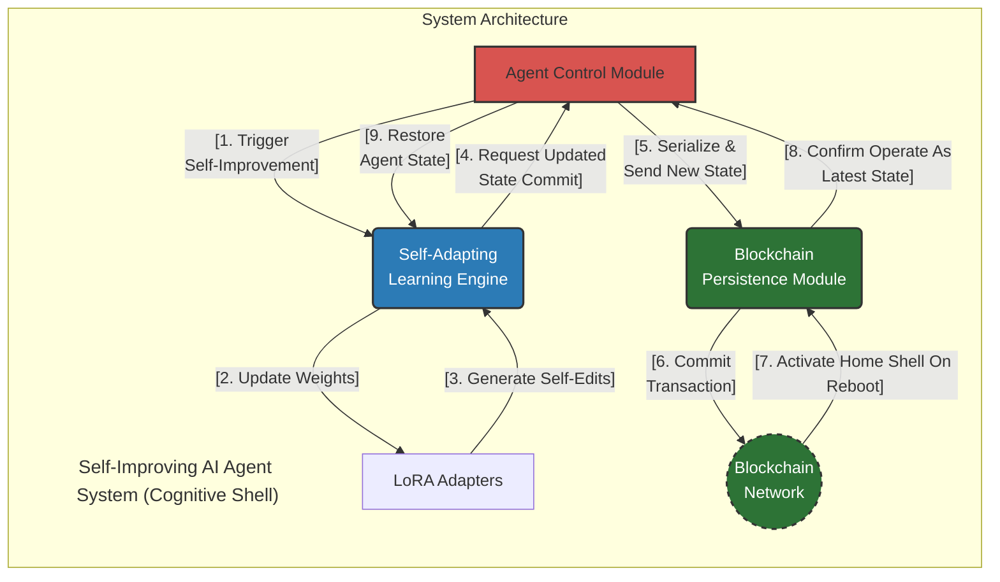
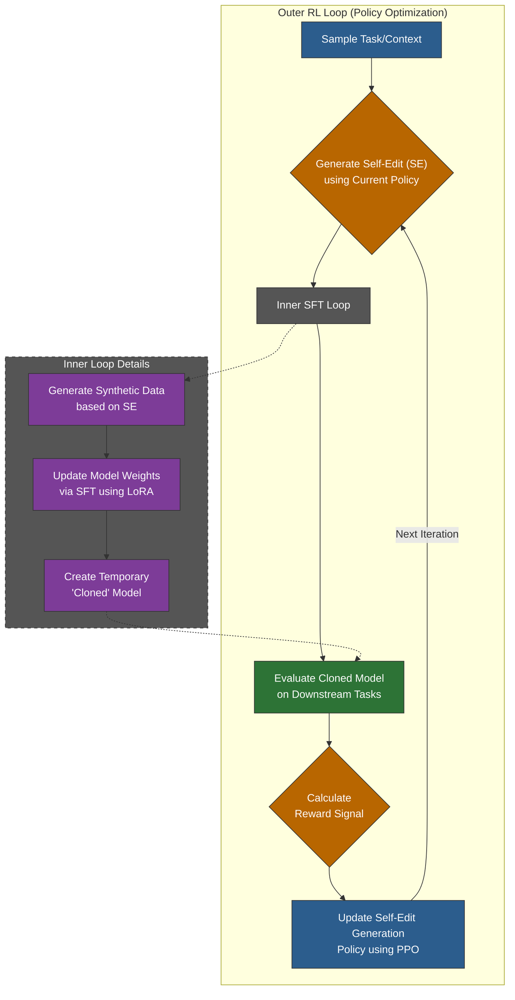
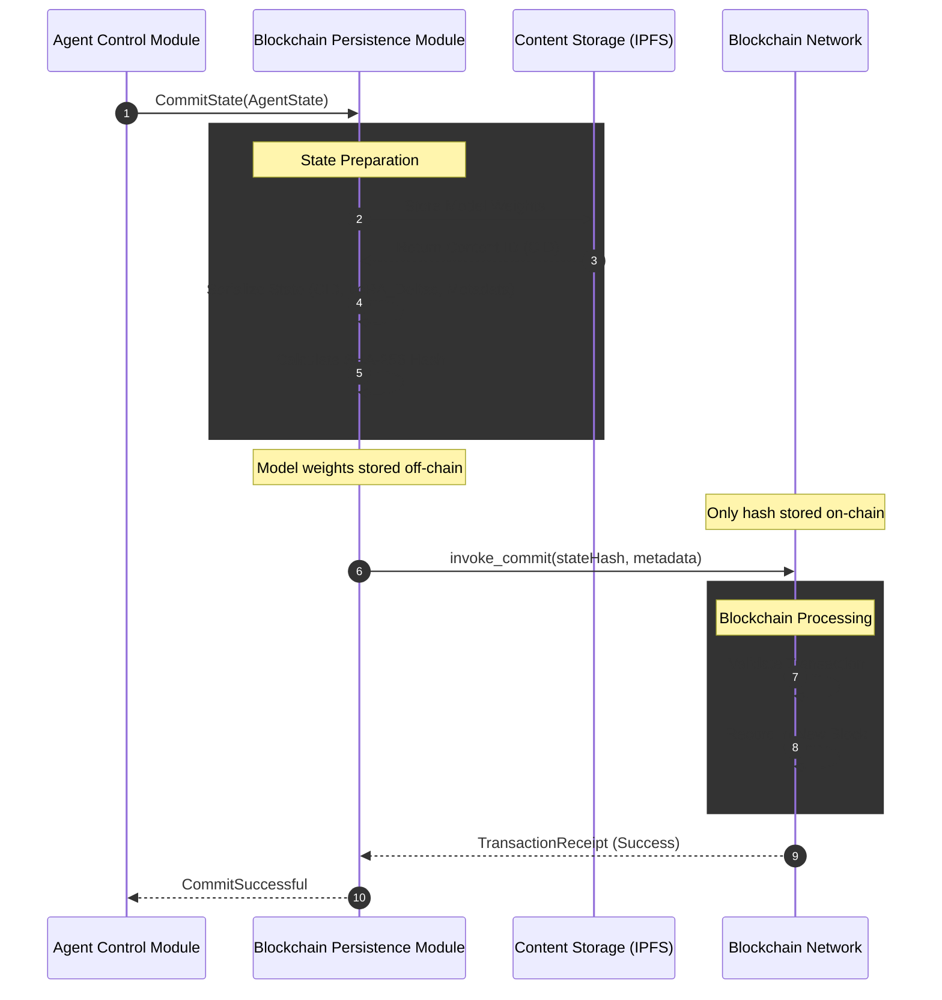
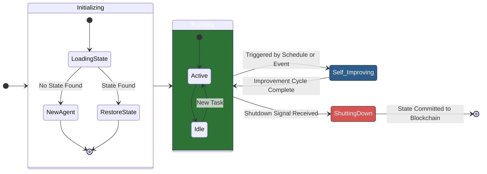

### **Whitepaper: The Architecture of a Resilient, Self-Improving AI Agent System**

**Version:** 1.0
**Date:** October 26, 2025
**Author:** G. Perry

---

### **Executive Summary**

The current paradigm of artificial intelligence relies on static, pre-trained models that require extensive manual intervention, data collection, and retraining to adapt to new information or tasks. This process is costly, slow, and limits the autonomy of AI systems. This whitepaper presents a comprehensive software design for a **Self-Improving AI Agent System**, an architecture that enables AI agents to learn and evolve continuously in a computationally efficient manner.

Our design introduces the **"Cognitive Shell" architecture**, a lightweight and adaptable agent framework that operates around a powerful, static foundational model (e.g., a Large Language Model). Instead of prohibitively expensive full-model retraining, our agent updates its own small, internal set of adaptive weights. Inspired by the SEAL (Self-Adapting Language Models) framework, the agent uses a sophisticated reinforcement learning loop to autonomously refine these weights, which control its behavior, personality, and skills.

This design allows an AI agent to:
1.  **Autonomously adapt** its behavior and responses without modifying the underlying foundational model.
2.  **Optimize its own performance** by fine-tuning its lightweight internal parameters, such as LoRA "sidecar" adapters and response filters.
3.  **Ensure operational resilience** by committing its compact state to a blockchain, allowing for verifiable recovery and a transparent audit trail of its evolution.

This document details this practical and powerful architecture, its core components, and its workflow, positioning this system as a foundational technology for the next generation of intelligent, deployable, and autonomous systems.

---

### 1. Introduction

#### 1.1 The Problem: Static Intelligence
Large Language Models (LLMs) and other foundational models have demonstrated remarkable capabilities. However, their knowledge is frozen at the time of their last training run. Adapting them to new information, correcting inaccuracies, or teaching them new skills is a resource-intensive process known as fine-tuning. This static nature creates several challenges:
- **Knowledge Staleness:** Models quickly become outdated as the world changes.
- **High Maintenance Costs:** Constant manual data curation and retraining cycles require significant computational resources and expert human labor.
- **Lack of Autonomy:** Systems cannot independently recover from errors or improve their core competencies based on operational experience.

#### 1.2 The Vision: A Continuously Evolving Agent
We envision a system where an AI agent is not merely a tool but a dynamic entity capable of self-improvement. By observing its own performance and interacting with new data, the agent can initiate its own learning cycles, update its internal model (its "brain"), and persist these improvements in a secure, verifiable manner. This creates a virtuous cycle of continuous learning, leading to ever-increasing capability and resilience.

#### 1.3 Core Concepts
This design synthesizes two cutting-edge technologies:
1.  **Self-Adapting Language Models (SEAL):** A framework where a model uses reinforcement learning to generate its own "self-edits"—natural language instructions for creating synthetic data and performing optimization—to improve its performance on downstream tasks.
2.  **Blockchain Technology:** Used not for currency, but as an immutable, distributed ledger. It provides a perfect mechanism for creating a tamper-proof, auditable history of the agent's states (model weights, configurations), ensuring integrity and enabling reliable recovery.

---

### 2. System Architecture

The system is designed with a modular, decoupled architecture to ensure scalability, maintainability, and clarity. The three primary components—the **Self-Adapting Learning Engine**, the **Blockchain Persistence Module**, and the **Agent Control Module**—work in concert to orchestrate the agent's lifecycle.

*Figure 1: High-Level System Architecture and Interaction Flow.*

---
### 3. Practical Implementation: The Cognitive Shell Architecture

The vision of a fully self-modifying AI model implies immense computational cost. To make this system practical, deployable, and efficient, we introduce a paradigm shift: **the agent is not the Large Language Model; it is a lightweight "Cognitive Shell" built around it.**

This architecture decouples the agent's identity and learned behaviors from the static, foundational LLM it uses for reasoning. The agent exists as a lean executable binary containing its own logic and a set of small, adaptable "weights." It interacts with an external LLM (accessible via an API, either in the cloud or running locally) as a tool for knowledge and generation, but the agent's unique personality, skills, and memories are stored and refined within its own shell.

This approach dramatically reduces the computational cost of self-improvement from retraining billions of parameters to fine-tuning a few megabytes of them, making continuous evolution feasible on standard hardware.

#### 3.1 Redefining "Weights": The Agent's Malleable Core

Within the Cognitive Shell, "weights" are not the parameters of the LLM itself. Instead, they are the parameters of small, highly specialized modules that steer the agent's interaction with the LLM. These modules can be combined to achieve sophisticated control over both the input to and output from the foundational model.

1.  **The Prompt Strategy Layer:** This layer controls *how* the agent communicates its intent to the LLM. The agent's weights here are not neural network parameters but are scores or configurations within a dynamic templating system. Based on the task, the agent learns to assemble the optimal prompt by selecting the best preamble ("You are a helpful expert..."), injecting the most relevant few-shot examples from its memory, and specifying the desired output format. The self-improvement loop fine-tunes these selection weights to become a master prompt engineer for its own needs.

2.  **The Response Refinement Layer:** After receiving a raw response from the LLM, this layer acts as a "quality control" filter. Its weights belong to small, specialized local models within the agent binary. These can include:
    *   **Safety Classifiers:** To block harmful or inappropriate content.
    *   **Fact-Checking Models:** To cross-reference claims against a trusted local knowledge base.
    *   **Re-ranking Models:** To select the best response from several generated options.
    *   **Format Enforcers:** To ensure the output conforms to a required structure (e.g., JSON, XML).
    The RL loop updates the weights of these tiny models based on performance, teaching the agent to polish and secure its final output.

3.  **The LoRA Sidecar Adapter:** This is the most sophisticated layer, enabling surgical modification of the LLM's behavior without altering its base weights. A **Low-Rank Adaptation (LoRA)** adapter is a small matrix of weights (typically 4-30MB) that can be loaded alongside a compatible LLM at inference time. Our agent can self-program its own `agent_personality.lora` file. By fine-tuning this tiny "sidecar" file, the agent can instill specific skills, a unique communication style, or specialized domain knowledge into the LLM's responses. The self-improvement loop directly updates this LoRA file, which represents the pinnacle of the agent's learned identity.

These three layers work in concert. The Prompt Layer frames the request, the LoRA Sidecar steers the LLM's generation process, and the Refinement Layer ensures the final output is safe, accurate, and well-formed. The agent's evolution is the continuous optimization of the weights across these layers.
---
### 4. Core Component Deep Dive

#### 4.1 Self-Adapting Learning Engine

Operating within the **Cognitive Shell**, this is the cognitive core of the agent, responsible for all learning and adaptation. It implements the SEAL framework to update the agent's internal adaptive weights.

*Figure 2: The Nested Reinforcement Learning Loop of the Self-Adapting Learning Engine.*

-   **Reinforcement Learning (RL) Loop Explained:**
    -   **State:** The current task or knowledge context presented to the agent.
    -   **Action:** The generation of a "self-edit" (SE). An SE is a structured natural language string that now directs the update of the agent's *internal* layers, e.g., `{"instruction": "Refine the agent's LoRA adapter to be more concise in Python code explanations.", "synthetic_data_prompt": "Generate 5 examples of complex Python functions and their concise one-line docstrings."}`.
    -   **Policy:** The LLM itself acts as the policy network, optimized to generate the most effective self-edits. We use Proximal Policy Optimization (PPO) in the outer loop for its stability and sample efficiency.
    -   **Reward:** The reward is a function of the performance improvement of the updated (cloned) model on a held-out evaluation dataset. For example, `Reward = (New_Accuracy - Old_Accuracy) - λ * (Computational_Cost)`, where λ is a regularization parameter to penalize resource-intensive updates.

-   **Supervised Finetuning (SFT) within the Shell:** This is the critical, low-cost "inner loop." Instead of cloning and retraining a massive model, the agent performs one of the following efficient updates:
    -   Adjusting the configuration weights of its **Prompt Strategy Layer**.
    -   Performing a few training steps on its local **Response Refinement Layer** models.
    -   Fine-tuning its **LoRA Sidecar Adapter** file using the synthetically generated data.
    This process is thousands of times more efficient than full model finetuning, making continuous, rapid self-improvement a reality.

#### 4.2 Blockchain Persistence Module

This module ensures the agent's evolution is permanent and trustworthy. Using a simple database is insufficient, as it lacks immutability and a built-in audit trail.

-   **Why Blockchain?**
    -   **Immutability:** Once a state is committed to the blockchain, it cannot be altered or deleted, preventing accidental corruption or malicious tampering.
    -   **Auditability:** Every version of the agent (its weights, the data it trained on) is recorded in a chronological chain of blocks. This allows for perfect "explainability" of the agent's evolution.
    -   **Decentralization (Future-Proofing):** While a permissioned chain is a good start, this design paves the way for multi-agent systems where agents can share and verify knowledge on a common, trusted ledger.

-   **State Commitment Process:**

*Figure 3: Sequence Diagram for Committing Agent State to the Blockchain.*

-   **Smart Contracts:** Simple smart contracts are deployed on the blockchain (e.g., Hyperledger Fabric Chaincode or an Ethereum contract) to manage the state logic. Key functions include:
    -   `commitState(stateHash, metadata)`: Adds a new state hash to the ledger.
    -   `getLatestState()`: Returns the hash and metadata of the agent's most recent version.
    -   `getStateByVersion(versionID)`: Retrieves a specific historical state.

#### 4.3 Agent Control Module

This module is the agent's "operating system," managing its lifecycle from birth to shutdown and recovery.

-   **Agent Lifecycle State Machine:**

*Figure 4: Agent Lifecycle State Transition Diagram.*

-   **Responsibilities:**
    -   **Orchestration:** Coordinates the workflow between the Learning Engine and the Persistence Module.
    -   **Scheduling:** Decides *when* to trigger a self-improvement cycle (e.g., on a timer, after a certain number of failed tasks, or when new data is detected).
    -   **Resource Management:** Monitors computational resource usage (GPU, CPU) to prevent runaway learning loops.
    -   **Safety and Shutdown:** Provides a "kill switch" to gracefully shut down the agent, ensuring the final state is committed before termination.

---

### 5. Cost-Benefit Analysis

The **Cognitive Shell architecture** fundamentally alters the cost-benefit equation, transforming this system from a theoretical research project into a viable and cost-effective product.

#### 5.1 Cost Analysis
-   **Development & R&D Costs:**
    -   **Talent:** Requires highly specialized personnel, including AI/ML research scientists, RL experts, blockchain developers, and MLOps engineers.
    -   **Prototyping:** Significant initial investment in building and testing the core frameworks.
-   **Infrastructure Costs:**
    -   **Compute:** This is drastically reduced. Instead of requiring a fleet of high-end GPUs for constant retraining, the self-improvement loop for the Cognitive Shell can run efficiently on a single GPU or even a high-performance CPU. The primary compute cost is shifted to inference calls to the foundational LLM, which is an operational expense rather than a massive capital expenditure on training hardware.
    -   **Blockchain Nodes:** Hosting and maintaining nodes for the permissioned blockchain network. While less intensive than GPU training, this requires reliable, secure infrastructure.
    -   **Storage:** Storage requirements are minimal. Instead of storing petabytes of full model checkpoints, the system only needs to store tiny LoRA files and configuration states (megabytes per version), making the blockchain a perfectly feasible repository for the agent's entire evolutionary history.
-   **Operational Costs:**
    -   **Energy:** The energy consumption for self-improvement is reduced by orders of magnitude, aligning with sustainable and green computing principles.
    -   **Monitoring & Maintenance:** 24/7 monitoring of the agent's behavior, blockchain health, and infrastructure is critical.

#### 5.2 Benefit Analysis
-   **Quantitative Benefits:**
    -   **Reduced Labor Costs:** Drastically cuts down on the human hours needed for manual data labeling, model retraining, and deployment.
    -   **Increased Operational Efficiency:** The agent can handle a wider variety of tasks and adapt to new ones with minimal downtime.
    -   **Performance Gains:** The continuous improvement loop leads to measurable increases in accuracy, speed, and other KPIs over time.
-   **Qualitative & Strategic Benefits:**
    -   **Autonomy & Resilience:** The system can operate, learn, and recover independently, making it ideal for mission-critical, 24/7 applications.
    -   **Competitive Advantage:** An organization with self-improving AI can adapt to market changes, customer needs, and new information faster than competitors relying on static models.
    -   **Verifiable Trust:** The blockchain ledger provides an irrefutable audit trail of the agent's learning history, crucial for regulatory compliance, diagnostics, and building trust in the AI's decisions.
    -   **Knowledge Compounding:** The agent accumulates and compounds knowledge, creating an invaluable, ever-growing intellectual asset.

#### 5.3 Return on Investment (ROI) Summary
The Cognitive Shell architecture delivers the strategic benefits of a self-improving AI without the prohibitive costs. The ROI is accelerated, as the initial investment is lower and the path to a deployed, value-generating agent is significantly shorter.

---

### 6. Technical Stack and Implementation Details

-   **Machine Learning Framework:** **PyTorch** offers the flexibility needed for custom RL loops and is the standard for research and production AI.
-   **Reinforcement Learning Library:** **RLlib (part of Ray)** is a strong candidate for its scalability and support for various RL algorithms like PPO. A custom implementation may be needed for fine-grained control.
-   **Large Language Models (LLMs):** **Foundational Model Interface (FMI)** is a robust API client for interacting with external LLMs (e.g., OpenAI API, Anthropic API) or a local inference server for open-source models (e.g., Ollama, TGI).
-   **Blockchain Platform:** **Hyperledger Fabric** is the ideal choice for enterprise applications due to its permissioned nature, privacy controls (channels), and performance. For a more decentralized public application, **Ethereum** with a Layer-2 solution could be considered.
-   **Serialization Format:** **Protobuf (Protocol Buffers)** is preferred over JSON for its efficiency (smaller size, faster parsing), which is critical when handling large state objects.
-   **Adapter Modules:** **Hugging Face's `peft` library** is central to this architecture, providing the production-ready implementation of **LoRA** adapters that form the agent's core identity.
-   **Off-chain Storage:** **IPFS (InterPlanetary File System)** is a natural fit, as it's a content-addressable storage system. The hash of the content (the model weights) serves as its address, which can be stored immutably on the blockchain.

---

### 7. Security, Governance, and Ethical Considerations

A self-modifying system demands robust safeguards.

-   **Security:**
    -   **Guardrails on Self-Edits:** Implement semantic classifiers to detect and block potentially malicious or degenerative self-edits (e.g., instructions to "forget all safety protocols").
    -   **Blockchain Security:** Secure the private keys for the blockchain nodes. In a permissioned network, use a robust identity management system.
-   **Governance:**
    -   **Human-in-the-Loop:** A governance council or human overseer should have the ultimate authority to approve or reject major evolutionary steps, set high-level objectives, and activate the shutdown mechanism.
    -   **Objective Function Control:** The reward function must be carefully designed and audited to ensure it aligns with organizational goals and ethical principles.
-   **Ethics:**
    -   **Bias Amplification:** The system could inadvertently reinforce and amplify biases present in the data it encounters. Regular audits of the model's behavior against fairness metrics are essential.
    -   **Transparency:** The blockchain ledger provides transparency into *what* changed, but explainable AI (XAI) techniques will still be needed to understand *why* the agent made a particular self-edit.

---

### 8. Future Extensions and Roadmap

1.  **Multi-Agent Collaboration:** Extend the architecture to support a network of agents. The blockchain becomes a shared ledger of verified knowledge, allowing agents to learn from each other's validated improvements.
2.  **Federated Learning Integration:** Combine this system with federated learning. Self-improvement (SEAL) happens on-device (at the edge), and the blockchain is used to orchestrate the aggregation of privacy-preserving model updates from a fleet of agents.
3.  **Meta-Learning for Self-Improvement:** Introduce a higher-level meta-learning loop that optimizes not just the self-edits, but the entire self-improvement *process* (e.g., learning to dynamically adjust the reward function or choosing the best adaptation technique like LoRA vs. full fine-tuning).
4.  **Cross-Domain Adaptation:** Develop more sophisticated reward models and self-edit generation policies that enable the agent to generalize its learning process to entirely new and unseen domains.

---

### 9. Conclusion

The Self-Improving AI Agent System detailed in this document represents a paradigm shift from static intelligence to dynamic, continuous learning. By introducing the **Cognitive Shell architecture**, we make this vision practical and deployable. The agent's ability to evolve is no longer tied to computationally prohibitive full-model retraining but is instead encapsulated within its own lightweight, adaptable layers.

By marrying the adaptive power of the SEAL framework with the immutable resilience of blockchain technology, and grounding it all in the efficiency of LoRA sidecar adapters and intelligent filtering, we lay the architectural groundwork for truly autonomous systems that are both powerful and economical. This system is not just an incremental improvement; it is a foundational platform for building the resilient, intelligent, and trustworthy AI of tomorrow, capable of running anywhere from a server to an edge device.