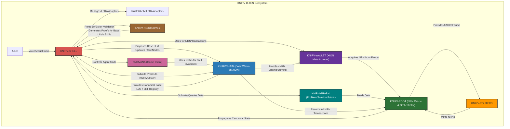

```mermaid
graph TD
    subgraph KNIRV D-TEN Ecosystem
        U[User] -- Voice/Visual Input --> KS[KNIRV-SHELL]
        KS -- Manages LoRA Adapters --> L[Rust WASM LoRA Adapters]
        KS -- Rents DVEs for Validation --> DVE[KNIRV-NEXUS DVEs]
        KS -- Uses for NRN/Transactions --> KW["KNIRV-WALLET (XION Meta Account)"]

        KW -- Acquires NRN from Faucet --> KR["KNIRV-ROOT (NRN Oracle & Orchestrator)"]
        KR -- Provides USDC Faucet --> R[KNIRV-ROUTERS]
        R -- Mints NRNs --> KR

        KS -- Submits/Queries Data --> KG["KNIRV-GRAPH (Problem/Solution Fabric)"]
        KG -- Feeds Data --> KR

        KR -- Propagates Canonical State --> KS
        KS -- "Proposes Base LLM Updates / SkillNodes" --> KXC["KNIRVCHAIN (CosmWasm on XION)"]
        KXC -- "Provides Canonical Base LLM / Skill Registry" --> KS

        KXC -- "Handles NRN Minting/Burning" --> KW
        KXC -- "Records All NRN Transactions" --> KR

        KS -- Controls Agent Units --> KN["KNIRVANA (Game Client)"]
        KN -- Uses NRNs for Skill Invocation --> KXC

        DVE -- "Generates Proofs for Base LLM / Skills" --> KS
        KS -- "Submits Proofs to KNIRVCHAIN" --> KXC

        style KXC fill:#2c7bb6,stroke:#333,stroke-width:2px,color:#fff
        style KS fill:#d85450,stroke:#333,stroke-width:2px
        style KR fill:#2d7336,stroke:#333,stroke-width:2px,color:#fff
        style KW fill:#663399,stroke:#333,stroke-width:2px,color:#fff
        style KG fill:#008080,stroke:#333,stroke-width:2px,color:#fff
        style DVE fill:#996633,stroke:#333,stroke-width:2px,color:#fff
        style R fill:#ff9900,stroke:#333,stroke-width:2px
        style KN fill:#cc6699,stroke:#333,stroke-width:2px
    end
```