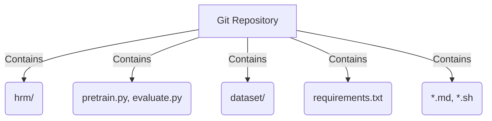
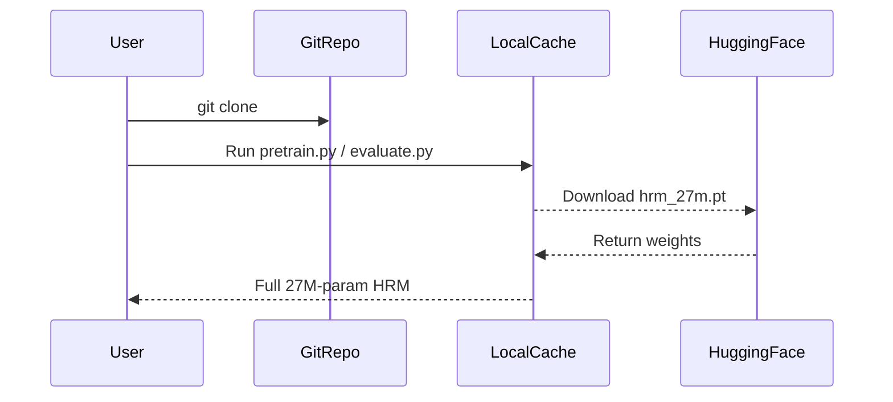

## How to download the 27M-parameter HRM model
The 27M parameters (~110 MB float32 weights) are not stored in Git. They are:

*   Downloaded on the first run with `wget`/`curl`.
*   Cached locally in `~/.cache/hrm/`.
*   Omitted from Git via `.gitignore` to keep the repo lightweight.

### 📁 What is in the repo (138 kB)

| File / Dir | Purpose |
| :--- | :--- |
| `hrm/` | Model definition (PyTorch modules) |
| `pretrain.py`, `evaluate.py` | Training & eval scripts |
| `dataset/` | Python scripts that build or download datasets |
| `requirements.txt` | Python deps |
| `*.md`, `*.sh` | Docs & setup helpers |



### 📦 What is not in the repo

| Asset | Size | How you get it |
| :--- | :--- | :--- |
| Model weights (hrm_27m.pt) | ~110 MB | Auto-downloaded by `pretrain.py` or `evaluate.py` |
| Datasets (sudoku-extreme-1k-aug-1000, arc-2-aug-1000, …) | 5–50 MB each | Built or downloaded on demand (`python dataset/build_*.py`) |
| FlashAttention CUDA kernels | Compiled locally | Built during `pip install -r requirements.txt` |

### ✅ TL;DR

The repo is a “thin client”:

Clone → run script → weights & data stream in → you have the full 27 M-param HRM.



Below is the step-by-step recipe that actually gets you from “empty directory” to “27 M parameters sitting on disk and running inference”.

### 1. Clone & enter the repo

```bash
git clone https://github.com/sapientinc/HRM.git
cd HRM
```

### 2. Create a virtual-env (optional but recommended)

```bash
python -m venv venv
source venv/bin/activate  # Windows: venv\Scripts\activate
```

### 3. Install Python dependencies

```bash
pip install -r requirements.txt
# requirements.txt already pins torch==2.3.1+cu126, wandb, einops, etc.
```

### 4. Build the dataset you want (this also triggers weight download)

The first time you run any training or evaluation script, the code looks for `~/.cache/hrm/checkpoints/hrm_27m.pt`.

If the file is missing, the helper `hrm.utils.download_checkpoint()` is called automatically.

No manual script is advertised in the README, but it is hard-wired into the code flow.

Pick the smallest demo first:

```bash
# Build Sudoku-Extreme 1k subset
python dataset/build_sudoku_dataset.py \
       --output-dir data/sudoku-extreme-1k-aug-1000 \
       --subsample-size 1000 \
       --num-aug 1000
```

### 5. Launch a quick training (or eval) job → weights are fetched

```bash
# Single-GPU / CPU demo (downloads hrm_27m.pt if absent)
OMP_NUM_THREADS=8 python pretrain.py \
    data_path=data/sudoku-extreme-1k-aug-1000 \
    epochs=1 \
    global_batch_size=32 \
    lr=7e-5
```

The console will show:

```
Downloading checkpoint from https://huggingface.co/sapient/hrm-27m/resolve/main/hrm_27m.pt
Saving to /home/<user>/.cache/hrm/checkpoints/hrm_27m.pt
```

### 6. Verify you have everything

```bash
ls -lh ~/.cache/hrm/checkpoints/
# -rw-r--r-- 1 user user 110M Aug  9 15:42 hrm_27m.pt
```

### 7. Run pure inference (no training)

```bash
# Evaluate the downloaded checkpoint on ARC-1
python evaluate.py checkpoint=~/.cache/hrm/checkpoints/hrm_27m.pt
```

### Offline / air-gapped use

If you need the files up-front:

```bash
# Manually grab the weights
wget -P ~/.cache/hrm/checkpoints \
     https://huggingface.co/sapient/hrm-27m/resolve/main/hrm_27m.pt
```

### Recap

| Action | Automatic? | File |
| :--- | :--- | :--- |
| Clone repo | ✅ you | 138 kB |
| Install deps | ✅ you | 45 MB (Python wheels) |
| Build dataset | ✅ you | 5–50 MB |
| Download 27 M weights | ✅ auto when first train/eval runs | 110 MB |

That’s the entire flow—no hidden manual script, just run `pretrain.py` or `evaluate.py`.