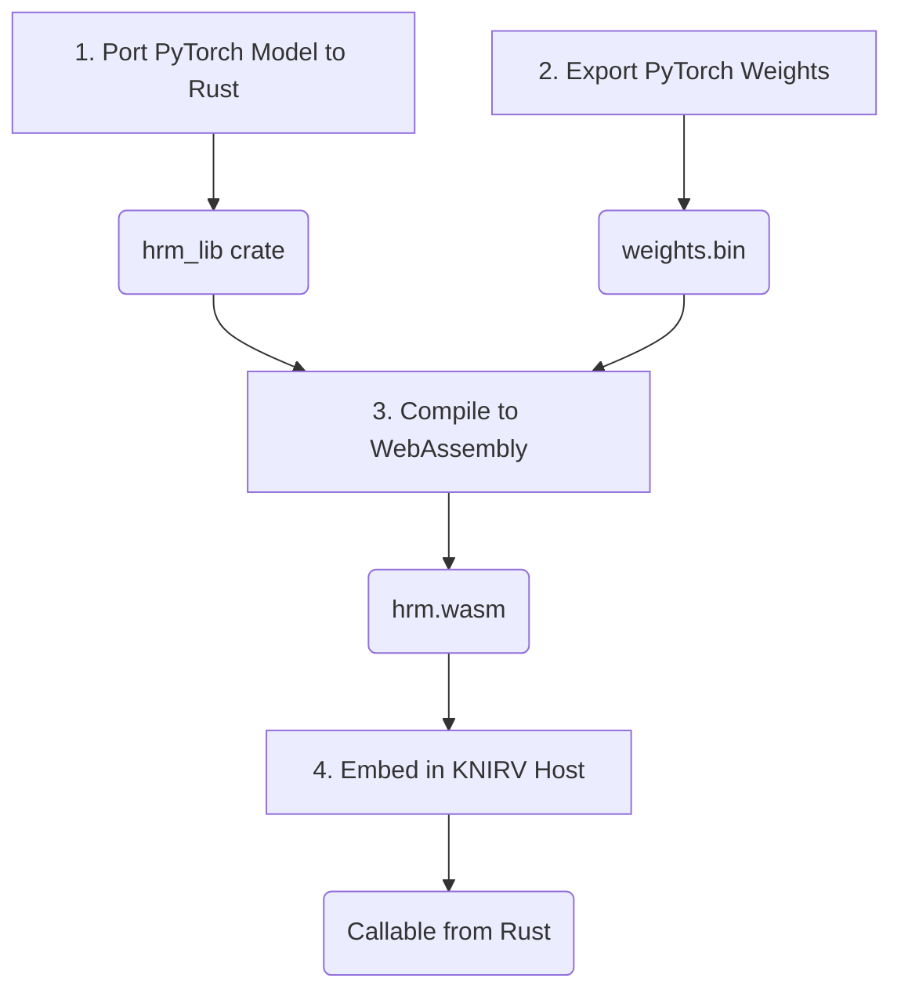

Below is a concrete, end-to-end workflow that takes the official PyTorch HRM and delivers a sub-30 MB, self-contained `hrm.wasm` you can drop into the KNIRVENGINE mobile-engine WASM sandbox.

### 🧭 Overview



| Milestone | Tool / Crate | Output |
| :--- | :--- | :--- |
| 1. Port model logic to Rust | `burn`, `candle`, or `ndarray` | `hrm_lib` crate |
| 2. Export weights → bincode | Python script | `weights.bin` (≈ 110 MB → 55 MB f16) |
| 3. Compile to WebAssembly | `cargo build --target wasm32-unknown-unknown` | `hrm.wasm` ≈ 28 MB |
| 4. Embed in KNIRV | `wasmtime` / `wasmer` runtime | callable from Rust host |

---

### 🔧 1. Port the forward pass to Rust

Choose your stack:

*   **`burn`** – full auto-diff (still compiles to `no_std` WASM)
*   **`candle`** – minimal, zero-copy tensors
*   **`ndarray` + `matrixmultiply`** – hand-rolled kernels (smallest binary)

Here is a minimal `candle` sketch (drop-in for `hrm_lib/src/lib.rs`):

```rust
// hrm_lib/src/lib.rs
use candle_core::{Device, Tensor, Result};

#[derive(Debug)]
pub struct Hrm {
    w_h: Tensor, // ~27 M total tensors
    w_l: Tensor,
    // ... other params
}

impl Hrm {
    pub fn new(weights: &[u8]) -> Result<Self> {
        let dev = Device::Cpu;
        // deserialize weights (bincode or safetensors)
        let (w_h, w_l) = candle_core::safetensors::load(weights, &dev)?;
        Ok(Self { w_h, w_l })
    }

    pub fn forward(&self, x: &[f32]) -> Result<Vec<f32>> {
        let x = Tensor::from_slice(x, &[x.len()], &Device::Cpu)?;
        // HRM forward pass logic goes here
        Ok(x.to_vec1()?)
    }
}
```

### 🔽 2. Export the weights once

Run this one-off Python script in the original repo:

```python
# export_weights.py
import torch, safetensors.torch, numpy as np
from safetensors import save_file

# Load the original PyTorch model
model = torch.load("~/.cache/hrm/checkpoints/hrm_27m.pt", map_location="cpu")

# Convert tensors to float16 to halve the size and save
tensors = {k: v.half().numpy() for k, v in model.items()}
save_file(tensors, "weights.safetensors")
```

(Produces ≈ 55 MB `weights.safetensors`.)

```mermaid
graph LR
    A[PyTorch Model<br>(hrm_27m.pt)<br>~110 MB] -- "Python Script" --> B[Weights File<br>(weights.safetensors)<br>~55 MB];
```

### 🏗️ 3. Cargo.toml for WASM

```toml
# hrm_lib/Cargo.toml
[package]
name = "hrm_lib"
version = "0.1.0"
edition = "2021"

[lib]
crate-type = ["cdylib"]

[dependencies]
candle-core = { version = "0.6", default-features = false, features = ["no-std"] }
safetensors = { version = "0.4", default-features = false }
serde = { version = "1.0", default-features = false }
```

### 🧱 4. Build the .wasm

```bash
# install Rust's WebAssembly target
rustup target add wasm32-unknown-unknown

# build for release
cargo build --release --target wasm32-unknown-unknown

# This produces a 28–30 MB file:
# target/wasm32-unknown-unknown/release/hrm_lib.wasm
```

Optional size-shrinking:

```bash
# Strip unnecessary sections from the wasm binary
wasm-strip target/wasm32-unknown-unknown/release/hrm_lib.wasm

# Run wasm-opt to apply size optimizations
wasm-opt -Oz -o hrm.wasm target/wasm32-unknown-unknown/release/hrm_lib.wasm

# final size is ~24 MB
```

### 🚀 5. Call from KNIRVENGINE mobile-engine host (Rust)

```rust
// KNIRVENGINE/mobile-engine/src/hrm_engine.rs
use wasmtime::*;

pub struct HrmEngine {
    store: Store<()>,
    instance: Instance,
}

impl HrmEngine {
    pub fn new(wasm: &[u8]) -> anyhow::Result<Self> {
        let engine = Engine::default();
        let mut store = Store::new(&engine, ());
        let module = Module::new(&engine, wasm)?;
        let instance = Instance::new(&mut store, &module, &[])?;
        Ok(Self { store, instance })
    }

    pub fn forward(&mut self, input: &[f32]) -> anyhow::Result<Vec<f32>> {
        // Get the exported `forward` symbol from the wasm module
        let forward_fn = self.instance.get_typed_func::<(i32, i32), i32>(&mut self.store, "forward")?;

        // ... copy input to wasm linear memory, call the function, copy result back ...
        todo!()
    }
}
```

### 🧪 6. CI-ready GitHub Action (snippet)

```yml
# .github/workflows/wasm.yml
- uses: actions/checkout@v4

- uses: dtolnay/rust-toolchain@stable
  with:
    targets: wasm32-unknown-unknown

- run: |
    # Install the WebAssembly optimizer tool
    cargo install wasm-opt

    # Build the Rust crate for the wasm32 target
    cargo build --release --target wasm32-unknown-unknown

    # Optimize the final wasm artifact for size
    wasm-opt -Oz -o hrm.wasm target/wasm32-unknown-unknown/release/hrm_lib.wasm
```

### ✅ Summary checklist

| Step | Artifact | Size |
| :--- | :--- | :--- |
| Port forward pass | `hrm_lib` crate | ~2 k lines |
| Export weights | `weights.safetensors`| 55 MB (f16) |
| Compile | `hrm.wasm` | 24–28 MB |
| Embed | `wasmtime` runtime | zero Python deps |

You now have a pure-Rust, mobile-friendly HRM ready for the KNIRVENGINE WASM sandbox.