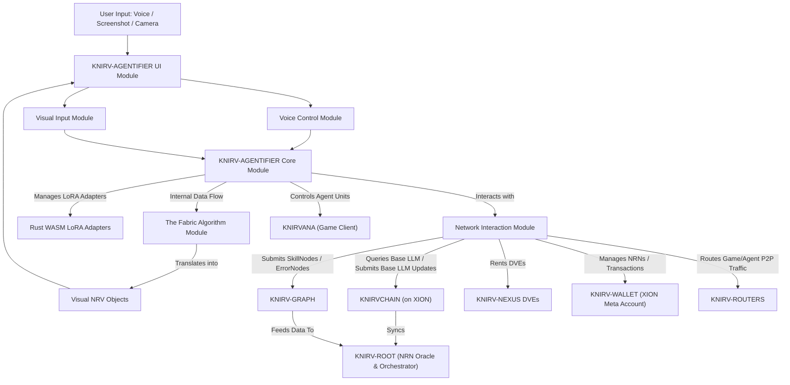

# KNIRV-AGENTIFIER: The Autonomous Gateway

[TOC]

## Overview

The KNIRV-AGENTIFIER is a mobile-native adapter that empowers existing AI assistants with autonomous agentic abilities, acting as the primary user gateway to the knirv.com D-TEN.  It's a Rust WASM-powered AI agent system featuring a SEAL loop and advanced voice integration.  This document details its features, architecture, deployment, and usage.

## Features

### Core Functionality

* CodeT5 Base LLM + personalized LoRA adapters
* Continuous failure detection and solution proposal
* User Delegation Certificate (UDC) orchestration
* Skill invocation and NRN consumption
* Seamless integration with KNIRV-WALLET for asset management and transaction execution
* Secure communication channels between the agentifier and the D-TEN

### Voice Integration & Monitoring

* **Advanced Voice Processing**: Real-time speech recognition with Web Speech API
* **Cognitive Shell**: Intelligent voice command parsing and execution
* **Edge Coloring System**: Visual feedback for voice status (listening, processing, speaking)
* **Wake Word Detection**: "KNIRV" wake word for hands-free activation
* **Multi-Modal Commands**: Support for navigation, skill activation, and system control
* **Real-time Status Monitoring**: Visual indicators for voice activity and cognitive mode
* **Monitoring & Alerts**: Real-time status display, pop-up alerts, transcript display, confidence metrics.

### Visual Feedback System

* **Dynamic Edge Coloring**: Screen borders change color based on voice status:
    * 🟢 Green: Idle state
    * 🔵 Teal: Listening for commands
    * 🔵 Blue: Processing voice input
    * 🟣 Purple: Speaking/responding
    * 🔴 Red: Error state
* **Intensity Modulation**: Edge brightness reflects activity level
* **Smooth Transitions**: 500ms animated color transitions
* **Sliding Panels**: Context-sensitive menus and input panels.

### Voice Commands

#### Navigation Commands

* "Show skills page" / "Navigate to skills"
* "Open wallet" / "Navigate to wallet"
* "Show UDC" / "Open certificate panel"
* "Go home" / "Show agents"

#### System Commands

* "Toggle cognitive mode" / "Enable advanced mode"
* "Check agent status" / "Show agent health"
* "Check NRN balance" / "Show balance"
* "Show network status" / "Check connections"

#### Skill Commands

* "Activate skill [name]" / "Enable skill [name]"
* "Deactivate skill [name]" / "Disable skill [name]"
* "Show available skills"

## Architecture

### Voice Processing Pipeline

1. **Audio Capture**: MediaRecorder API for audio input
2. **Speech Recognition**: Web Speech API with continuous listening
3. **Command Parsing**: Pattern matching for command extraction
4. **Action Execution**: Navigation and system control
5. **Visual Feedback**: Edge coloring and status updates
6. **Speech Synthesis**: Text-to-speech responses

### Component Structure

```
src/
├── shared/
│   └── cognitive-shell/
│       ├── EventEmitter.ts      # Browser-compatible event system
│       └── VoiceProcessor.ts     # Core voice processing logic
├── react-app/
│   ├── components/
│   │   ├── EdgeColoring.tsx     # Visual feedback system
│   │   ├── VoiceControl.tsx     # Voice interface component
│   │   └── Layout.tsx           # Main layout with voice integration
│   └── hooks/
│       └── useVoiceIntegration.ts # Voice state management hook
```

## Mobile Deployment

### Quick Start

```bash
cd KNIRVENGINE/mobile-controller
./deploy-mobile.sh
```

### Deployment Options

1.  **Local Network Development Server:** `./deploy-mobile.sh 1` or `npm run dev`. Access from mobile: `http://YOUR_IP:5173`
2.  **Production Build & Static Server:** `./deploy-mobile.sh 2` or `npm run build; cd dist && python3 -m http.server 8080 --bind 0.0.0.0`. Access: `http://YOUR_IP:8080`
3.  **Native Android App (Capacitor):** `./deploy-mobile.sh 3`  Requires Android Studio, Android SDK, JDK.
4.  **Native iOS App (Capacitor):** `./deploy-mobile.sh 4` Requires macOS, Xcode, iOS Developer Account.
5.  **Progressive Web App (PWA):** `./deploy-mobile.sh 5`
6.  **Cloud Deployment (Netlify/Vercel):** `./deploy-mobile.sh 6` Requires Netlify CLI.

### Configuration

#### Desktop Host Connection

Update `VITE_DESKTOP_HOST_URL` and `VITE_WEBSOCKET_URL` in `.env.local`:

```env
VITE_DESKTOP_HOST_URL=http://YOUR_IP:8082
VITE_WEBSOCKET_URL=ws://YOUR_IP:8082/api/mcp/ws
```

#### HTTPS for Camera/Microphone

Use `localhost` for local development, a local HTTPS proxy (e.g., ngrok), or deploy with HTTPS (Netlify/Vercel).

### Mobile-Specific Features

*   **Camera Access (QR Scanning)**: Automatic back camera use, fallback to front camera.
*   **Voice Processing**: Real-time audio processing, noise cancellation.
*   **Visual Processing**: WebGL acceleration, object detection.
*   **Responsive Design**: Adapts to different screen sizes.


## Getting Started

### Prerequisites

*   Node.js 20+ (for development)
*   Modern browser with Web Speech API support
*   Microphone access for voice features

### Installation

```bash
npm install
npm run dev
```

### Voice Feature Testing

```bash
open test-voice-integration.html
```

### Usage

1.  **Enable Voice**: Click the microphone button.
2.  **Speak Commands**: Use supported voice commands.
3.  **Visual Feedback**: Watch screen edges change color.
4.  **Cognitive Mode**: Toggle advanced voice processing features.

## Configuration

### Voice Processor Settings

```typescript
const config: VoiceConfig = {
  sampleRate: 16000,
  channels: 1,
  language: 'en-US',
  enableWakeWord: true,
  wakeWord: 'knirv',
  noiseReduction: true,
};
```

### Edge Coloring Customization

```typescript
const edgeColors = {
  idle: '#10B981',      // Green
  listening: '#14B8A6', // Teal
  processing: '#3B82F6', // Blue
  speaking: '#8B5CF6',   // Purple
  error: '#EF4444'       // Red
};
```

## Testing

Comprehensive voice integration testing is included: real-time speech recognition, command pattern matching, visual feedback systems, error handling, and cross-browser compatibility.

## Future Enhancements

*   **Multi-language Support**
*   **Custom Wake Words**
*   **Voice Biometrics**
*   **Offline Processing**
*   **Advanced NLP**
*   **Voice Shortcuts**

## Mobile Compatibility

The voice integration is designed for mobile-first usage: touch-friendly voice controls, responsive edge coloring, optimized for mobile browsers, and PWA ready.

## Software Design Document: KNIRV-AGENTIFIER

### 1. Introduction

The KNIRV-AGENTIFIER is the primary, intelligent, and adaptive interface for users to interact with the KNIRV D-TEN.  It abstracts complex operations, empowering users to manage AI agents through voice commands and visual feedback.

### 2. Architectural Overview



### 3. Functional Requirements

*   **Core AI Agent Capabilities:** Base LLM interaction, LoRA management, SEAL loop execution, decision making, DVE utilization.
*   **User Interface & Interaction:** iFrame-like display, voice control, visual feedback, user input panels.
*   **Problem Input & NRV Generation:** Screenshot capture, camera input, TensorFlow interpretation, "The Fabric" algorithm.
*   **Network & Ecosystem Interactions:** KNIRV-GRAPH, KNIRVCHAIN, KNIRV-WALLET, KNIRV-ROUTERS, KNIRVANA integration.

### 4. Non-Functional Requirements

*   Performance, Security, Privacy, Usability, Scalability, Resilience, Cross-Platform Compatibility.

### 5. High-Level Design

Detailed descriptions of the KNIRV-AGENTIFIER Core Module, User Interface Module, Voice Control Module, Visual Input Module, "The Fabric" Algorithm Module, and Network Interaction Module.

### 6. Detailed Design: "The Fabric" Algorithm

1.  Input Ingestion
2.  Perception & Pre-processing
3.  Contextualization
4.  NRV Structuring & Proposal
5.  Visual NRV Object Creation
6.  User Interaction for Mapping & Assignment

### 7. Data Model

Local data store for operational state, mirroring elements from KNIRVCHAIN and KNIRV-GRAPH.

### 8. Security Considerations

Input integrity, privacy of visual/voice data, permissions management, UI sandboxing, LoRA security.

### 9. Future Enhancements

Advanced XR integration, multi-modal AI, predictive problem identification, adaptive UI/UX.

## Troubleshooting

*   **Camera not working**: Check HTTPS and permissions.
*   **Can't connect to desktop**: Verify IP address and firewall.
*   **App won't install**: Check PWA manifest and HTTPS.
*   **Poor performance**: Optimize bundle size and images.
*   **Features not working**: Check browser compatibility.


## Testing Checklist

*   [ ] QR code scanning works on mobile.
*   [ ] Voice processing functions correctly.
*   [ ] Visual processing performs well.
*   [ ] Desktop connection is stable.
*   [ ] UI is responsive on different screen sizes.
*   [ ] App works offline (if PWA).
*   [ ] Performance is acceptable on slower devices.
*   [ ] All features work on both iOS and Android.
*   [ ] HTTPS is properly configured.
*   [ ] Error handling is user-friendly.

