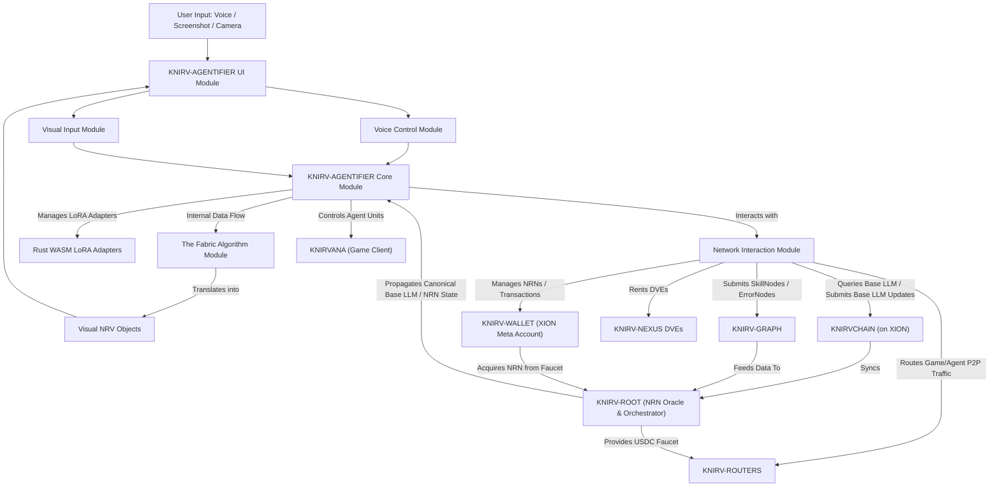

# KNIRV-AGENTIFIER Architecture Diagram

```mermaid
 graph TD
    A[User Input: Voice / Screenshot / Camera] --> B[KNIRV-AGENTIFIER UI Module]
    B --> C[Voice Control Module]
    B --> D[Visual Input Module]
    C --> E[KNIRV-AGENTIFIER Core Module]
    D --> E
    E -- Internal Data Flow --> F["The Fabric" Algorithm Module]
    E -- Manages LoRA Adapters --> G[Rust WASM LoRA Adapters]
    E -- Interacts with --> H[Network Interaction Module]

    F -- Translates into --> I[Visual NRV Objects]
    I --> B

    H -- "Queries Base LLM / Submits Base LLM Updates" --> J["KNIRVCHAIN (on XION)"]
    H -- "Submits SkillNodes / ErrorNodes" --> K[KNIRV-GRAPH]
    H -- Rents DVEs --> L[KNIRV-NEXUS DVEs]
    H -- "Manages NRNs / Transactions" --> M["KNIRV-WALLET (XION Meta Account)"]
    H -- "Routes Game/Agent P2P Traffic" --> N[KNIRV-ROUTERS]
    E -- Controls Agent Units --> O["KNIRVANA (Game Client)"]

    J -- Syncs --> P["KNIRV-ROOT (NRN Oracle & Orchestrator)"]
    K -- Feeds Data To --> P

    %% Added relationships for KNIRV-ROOT's faucet and state propagation
    P -- "Provides USDC Faucet" --> N
    M -- "Acquires NRN from Faucet" --> P
    P -- "Propagates Canonical Base LLM / NRN State" --> E
```

---

© 2025 KNIRV Network

