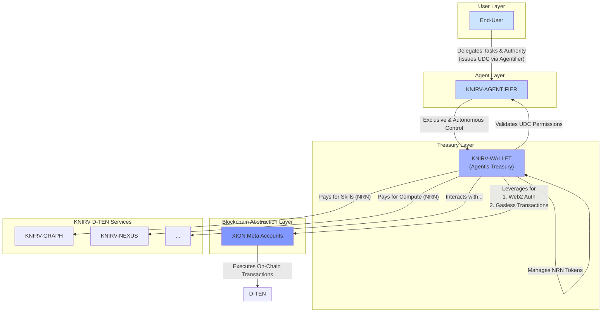

# **KNIRV-CONTROLLER: The Unified Agent Management Platform**

### **Abstract**

The **KNIRV-CONTROLLER** serves as the comprehensive agent management platform within the KNIRV D-TEN ecosystem, representing a major architectural evolution that unifies agent management, skill development, wallet functionality, and network interaction capabilities. Following the major refactor, KNIRV-CONTROLLER has integrated the mobile-controller (now manager), KNIRVCLI (as cli), agent-core (as receiver), and wallet functionality into a cohesive application. This unified platform allows users to manage agents, skills, UDCs, and wallets for network interaction while providing an integrated shell for minting agents on the oracle with trained capabilities. The CONTROLLER's primary agent-cortex serves as the foundation for user interactions across KNIRVENGINE and KNIRVNEXUS interfaces when linked through QR code scanning functionality.

### **1. Introduction**

The **KNIRV-CONTROLLER** represents a fundamental shift in agent management architecture, unifying previously separate components into a cohesive platform that serves as the primary interface for agent interaction within the KNIRV D-TEN. Following the major refactor, the CONTROLLER has evolved from a simple mobile adapter to a comprehensive platform that integrates:

- **Manager**: The evolved mobile-controller providing core agent management capabilities
- **CLI**: The integrated KNIRVCLI providing command-line interface and terminal functionality
- **Receiver**: The agent-core frontend providing primary user interface and cognitive shell integration
- **Wallet**: Comprehensive wallet functionality with QR code connectivity and agentic wallet capabilities

This unified architecture enables users to manage agents, skills, UDCs, and wallets seamlessly while providing direct access to network services through an integrated shell interface. The CONTROLLER serves as the foundation for agent registration, training, and deployment across the entire KNIRV ecosystem.

### **2. Architectural Framework**

The **KNIRV-CONTROLLER** features a unified architecture that integrates four core components into a seamless agent management platform.

#### **2.1. Unified Component Architecture**

*   **Receiver as Primary Interface**: The receiver frontend, migrated from the agent-core, serves as the primary user interface. This component provides the main interaction layer and houses the cognitive shell that orchestrates agent operations.
*   **Cognitive Shell Integration**: The cognitive shell operates as the outer layer that manages interaction with imported agent-core WASM files. This separation of concerns distinguishes between the cognitive shell's orchestration responsibilities and the agent-core's specialized operations.
*   **Manager Integration**: The evolved mobile-controller (now manager) provides core agent management capabilities, handling agent lifecycle, configuration, and coordination with network services.
*   **CLI Integration**: The integrated KNIRVCLI provides slide-out interactive terminal functionality, enabling users to mint agents on the oracle and execute advanced network operations directly from the interface.
*   **Wallet Integration**: Comprehensive wallet functionality enables QR code connectivity, agentic wallet operations, and seamless integration with the receiver view and other cloned functionality.

#### **2.2. WASM Agent Core System**

*   **Agent Core Upload and LoRA Integration**: The receiver enables users to upload and compile agent WASM files with embedded LoRA adapter capabilities, creating a cognitive shell that includes the uploaded agent.wasm file with its associated LoRA adapter chain as the primary agent within the CONTROLLER.
*   **TypeScript LoRA Compilation Pipeline**: The compilation functionality from KNIRVCORTEX/agent-builder has been translated from GoLang to TypeScript and enhanced with LoRA adapter compilation, enabling seamless agent and LoRA adapter compilation within the CONTROLLER interface.
*   **LoRA-Enhanced Agent Export**: When users request agent export, the CONTROLLER exports the agent.wasm file with its embedded LoRA adapter capabilities, providing a complete neural network modification package.
*   **Primary Agent with LoRA Chain Management**: The resulting shell serves as the primary agent with its LoRA adapter chain within the CONTROLLER, enabling dynamic skill loading and cluster competition participation until users designate another saved agent configuration as primary.

### **3. Key Capabilities & Interaction Model**

The CONTROLLER's unified architecture provides comprehensive agent management capabilities through its integrated component system.

#### **3.1. Revolutionary Agent Management & LoRA Adapter Development**

*   **Comprehensive Agent Lifecycle**: The CONTROLLER manages the complete agent lifecycle from creation and LoRA adapter training through deployment and ongoing cluster competition management. Users can develop, test, and deploy agents within a single integrated environment optimized for competitive error resolution.
*   **LoRA Adapter Skill System**: Revolutionary skill development where skills ARE LoRA adapters containing weights and biases. Users can participate in KNIRVGRAPH error cluster competitions to create superior LoRA adapters through collective intelligence and competitive collaboration.
*   **Cluster Competition Management**: Integrated tools for managing agent participation in error clusters, tracking solution submissions, monitoring cluster ownership status, and optimizing competitive strategies for maximum solution output.
*   **UDC Management**: Sophisticated User Delegation Certificate management enables precise control over agent permissions and capabilities, including cluster assignment rights and solution submission authorities.
*   **Agent Registration & Minting**: The integrated CLI provides direct access to oracle functionality for minting agents with trained LoRA adapter capabilities. Only registered agents can participate in the graph's competitive error cluster resolution activities.

#### **3.2. Network Integration & Connectivity**

*   **Universal Service Connectivity**: The CONTROLLER can connect with all services in the network as needed, providing a unified interface for network interaction and service discovery.
*   **QR Code Connectivity**: Seamless QR code scanning functionality enables the CONTROLLER to link with KNIRVENGINE and KNIRVNEXUS interfaces, creating a unified agent ecosystem.
*   **Primary Agent-Cortex Cloning**: The CONTROLLER's primary agent-cortex is cloned within linked KNIRVENGINE and KNIRVNEXUS interfaces, ensuring consistent agent behavior across platforms.
*   **Cross-Platform Synchronization**: Agent configurations and capabilities are synchronized across connected platforms, maintaining consistency and enabling seamless transitions between interfaces.

### **4. Economic Model & Tokenomics**

The **KNIRV-CONTROLLER** is the primary driver of economic activity for the user within the D-TEN, featuring intelligent resource optimization and adaptive spending strategies powered by HRM's reasoning capabilities.

*   **Intelligent NRN Token Optimization**: The Cortex leverages HRM's ACT mechanism to optimize NRN consumption dynamically. For simple tasks, it conserves tokens by using minimal reasoning cycles on-device. For complex scenarios requiring deep analysis, it strategically allocates additional NRNs for extended computation, ensuring cost-effective task execution.
*   **Inference-Time Scaling Economics**: Users can adjust the reasoning depth (Mmax) through a slider in the wallet UI, paying extra NRNs for deeper reasoning when needed. This creates a flexible economic model where computational intensity directly correlates with token consumption, allowing users to balance cost and performance.
*   **Gasless Transactions with Smart Resource Management**: The Cortex performs all transactions on behalf of the user in a gasless manner through XION Meta Accounts integration. The HRM core intelligently batches operations and optimizes transaction timing to minimize overall network costs while maintaining responsiveness.
*   **Adaptive TEE Resource Allocation**: When tasks exceed mobile device capabilities, the Cortex's HRM core determines the optimal TEE allocation on **KNIRV-NEXUS**. The hierarchical reasoning enables precise estimation of computational requirements, ensuring efficient resource utilization and cost-effective verifiable compute provisioning.
*   **Personalized Economic Learning**: The LoRA adapters learn user spending patterns and preferences, enabling the Cortex to make increasingly intelligent economic decisions over time, such as predicting when to pre-allocate resources or when to optimize for speed versus cost.

### **5. Security and Governance**

Security and user trust are paramount. The **KNIRV-CONTROLLER**'s design prioritizes a secure and transparent model of autonomous governance with enhanced resource controls and privacy protection.

*   **Enhanced UDC Resource Governance**: The UDC system now encodes precise resource limits including maximum N (reasoning steps), maximum T (time horizon), and maximum NRNs per task, all enforced by HRM's ACT Q-head. This provides granular control over computational resources and economic spending while maintaining cryptographically secure audit trails for all agentic behavior.
*   **Multi-Layer WASM + TEE Security**: The Rust WASM sandbox isolates the HRM core from the host device, while the TEE architecture ensures that HRM weights and LoRA deltas remain private even if the device is compromised. This dual-layer security model protects both the reasoning process and the learned personalization data.
*   **Memory-Efficient Privacy Protection**: HRM's O(1) memory footprint thanks to one-step gradients ensures that sensitive reasoning traces don't accumulate in device memory. The hierarchical structure naturally compartmentalizes different types of information, enhancing privacy through architectural design.
*   **Verifiable Off-Device Computation**: For tasks requiring additional computational resources, the Cortex seamlessly delegates to **KNIRV-NEXUS** TEEs while maintaining end-to-end verifiability. The HRM core determines when off-device computation is necessary and ensures cryptographic proof of execution integrity.

### **6. Real-World Use Case: Complex Multi-Modal Task Execution**

The HRM-powered **KNIRV-CONTROLLER** excels at handling sophisticated, multi-step user requests that require deep reasoning and coordination across multiple services.

**Example Scenario:**
A user requests: *"Find me a last-minute eco-hotel in Lisbon under 150 €, offset my flight carbon, and stream the Champions League final to my AR glasses."*

**HRM-Powered Execution Flow:**
1. **Initial Decomposition (N=4, T=16 cycles on-device)**: The HRM core analyzes the complex request and decomposes it into three distinct sub-tasks: hotel booking, carbon offset calculation, and media streaming setup.

2. **Adaptive Reasoning Depth**: The ACT Q-head determines that carbon offset calculations require additional complexity analysis and allocates 2 extra reasoning cycles, triggering TEE computation on **KNIRV-NEXUS** for verifiable environmental impact calculations.

3. **Skill Invocation Pipeline**: The Cortex invokes specialized skills from **KNIRV-CHAIN** for each sub-task:
   - Hotel search and booking skill (with eco-certification filtering)
   - Carbon footprint calculation and offset purchasing skill
   - AR streaming coordination skill

4. **Personalized Learning**: The LoRA adapters capture user preferences discovered during execution ("user prefers late checkout & vegan breakfast") for future trip planning optimization.

5. **Economic Optimization**: Total execution completes in under 3 seconds with optimized NRN consumption, no gas fees, and full verifiability through on-chain UDC logs.

This demonstrates the Cortex's ability to handle complex, real-world scenarios with intelligent resource allocation, seamless economic integration, and continuous personalization learning.

### **7. Technical Specifications & Performance Metrics**

**HRM Core Specifications:**
- **Model Size**: 27 million parameters in WASM format
- **Memory Footprint**: O(1) thanks to one-step gradient computation
- **Reasoning Architecture**: Hierarchical L-modules (sensory-motor) + H-modules (long-horizon planning)
- **Adaptive Computation**: ACT Q-head for dynamic reasoning depth control
- **Personalization**: LoRA adapters on H-module for battery-friendly on-device learning

**Performance Characteristics:**
- **Latency**: Sub-3-second complex task decomposition and execution
- **Battery Efficiency**: One-step gradient learning eliminates full BPTT overhead
- **Economic Efficiency**: Adaptive NRN consumption based on task complexity
- **Privacy**: WASM sandbox + TEE isolation with private weight storage
- **Scalability**: Seamless TEE off-loading for computationally intensive tasks

**Integration Details:**
- **Repository**: [HRM Open Source](https://github.com/sapientinc/HRM) (Released July 21, 2025 by Sapient Intelligence)
- **Runtime**: Rust + wasmtime for cross-platform compatibility
- **Security**: Multi-layer WASM + TEE architecture with UDC resource governance
- **Personalization**: Hierarchical LoRA structure separating user patterns from goal priors

### **8. Conclusion**

The **KNIRV-CONTROLLER** represents a breakthrough in mobile-native AI agent architecture, combining the power of hierarchical reasoning with the efficiency of on-device computation. By integrating the HRM cognitive core, it transforms everyday AI assistants into sophisticated autonomous agents capable of complex multi-step reasoning, adaptive resource management, and continuous personalization learning. The Cortex serves as the crucial bridge between user intent and the decentralized power of the KNIRV D-TEN, driving economic activity through intelligent NRN optimization while ensuring robust security through its enhanced UDC governance model. This represents our commitment to making decentralized AI technology both accessible and genuinely intelligent, creating a true extension of the user's cognitive capabilities.

# **Whitepaper: The KNIRV-WALLET**

### **KNIRV-WALLET: The Agent's Treasury**

#### **1. Abstract**
*   The **KNIRV-WALLET** is a foundational component of the KNIRV D-TEN ecosystem, serving as a secure, non-custodial wallet exclusively for autonomous agents.
*   It is not a direct user interface, but rather an "Agent's Treasury" that allows the **KNIRV-AGENTIFIER** to autonomously manage user assets, perform transactions, and issue User Delegation Certificates (UDCs) on the user's behalf.
*   Leveraging XION Meta Accounts, the **KNIRV-WALLET** provides seamless, gasless transactions and a familiar Web2-like authentication experience for the agent, abstracting away the complexities of blockchain interaction from the end-user.

#### **2. Introduction**
*   The **KNIRV-WALLET** is a multi-platform, secure wallet designed to empower autonomous agents to act as trusted fiduciaries for their users within the Decentralized Trusted Execution Network (D-TEN).
*   The wallet's core purpose is to provide a seamless and intuitive mechanism for agents to interact with the network's economic and governance layers.
*   It is a critical piece of the security model, as all on-chain actions, including NRN token management, skill invocation fees, and data access, are routed through the wallet's autonomous features.
*   This design ensures that users delegate authority to their agents via the **KNIRV-AGENTIFIER**, and the agent then utilizes the **KNIRV-WALLET** to execute those delegated tasks securely and transparently.

#### **3. Architectural Framework**
The **KNIRV-WALLET** is built on a robust architecture that prioritizes security, accessibility, and agent autonomy.

*   **Multi-Platform Support**: The wallet is designed as a core library or SDK, enabling it to be integrated across various operating systems and environments, including web, mobile, and desktop. This ensures that the **KNIRV-AGENTIFIER** can operate consistently regardless of the user's device.
*   **XION Meta Accounts**: By utilizing XION's Meta Accounts, the **KNIRV-WALLET** abstracts away the traditional complexities of private keys and seed phrases from the end-user. It provides a more familiar experience for the agent, which can be linked to the user's identity through Web2-like authentication methods.
*   **Non-Custodial Design**: The wallet is strictly non-custodial. User funds and private keys are never held by a third party. The agent, with the user's explicit UDC-based permission, holds and manages these keys in a secure, sandboxed environment.

#### **4. Key Features**
The **KNIRV-WALLET** is equipped with a suite of features that enable powerful, autonomous agentic behavior.

*   **Web2-like Authentication**: For the agent's initial setup and account recovery, the wallet supports authentication via email, social logins (e.g., Google, Apple ID), and biometrics. This allows the user to securely authorize the agent's access without dealing with complex crypto-native processes.
*   **Gasless Transactions**: A core feature of the **KNIRV-WALLET** is its ability to perform gasless transactions via XION. This is crucial for the autonomous model, as it allows the agent to execute thousands of micro-transactions (e.g., paying for skill invocation on the **KNIRV-GRAPH**) without requiring the user to constantly manage or top-up a native token balance.
*   **NRN Management**: The wallet provides the agent with a secure interface to manage the user's NRN token balance. This includes the ability to hold, send, and receive NRNs, as well as to pay for services within the KNIRV D-TEN.
*   **Agent Control and Governance**: The wallet is the mechanism through which the agent's permissions are enforced. It validates the UDC issued by the user through the **KNIRV-AGENTIFIER**, ensuring that all actions are within the scope of the user's explicit delegation.
*   **UDC Issuance**: The wallet plays a pivotal role in the issuance of User Delegation Certificates (UDCs). It is responsible for generating the cryptographic keys and signing the UDCs, which are then used by the agent to prove its authority to interact with other KNIRV layers on the user's behalf.

#### **5. Interaction Model: The Agent as Intermediary**
*   The most significant architectural shift is the interaction model: the end-user **does not** interact directly with the **KNIRV-WALLET**.
*   The user's interaction point is the **KNIRV-AGENTIFIER**, which acts as a secure intermediary and a gateway to the wallet's functionality.
*   When a user delegates a task to their AI assistant (enhanced by the **KNIRV-AGENTIFIER**), the agent is the entity that accesses the **KNIRV-WALLET** to perform the necessary transactions.
*   This model simplifies the user experience, removes the cognitive load of managing cryptographic assets, and ensures that all on-chain activity is a direct result of a user-approved agentic action.

#### **6. Conclusion**
*   The **KNIRV-WALLET** is an essential layer that underpins the autonomy and economic functionality of the **KNIRV-AGENTIFIER**.
*   By reframing its purpose from a user-facing tool to an "Agent's Treasury," we have created a secure, gasless, and transparent system for managing decentralized assets and permissions.
*   The wallet's seamless integration with XION's Meta Accounts and its exclusive interface with the **KNIRV-AGENTIFIER** ensures a user-centric but agent-driven experience, solidifying its role as the financial engine for the autonomous future of the KNIRV D-TEN.

<a href="#/legal/CODE_OF_CONDUCT" class="footer-link">Code of Conduct</a> | <a href="#/legal/PRIVACY_POLICY" class="footer-link">Privacy Policy</a> | <a href="#/legal/TERMS_AND_CONDITIONS" class="footer-link">Terms and Conditions</a>

© 2025 KNIRV Network

