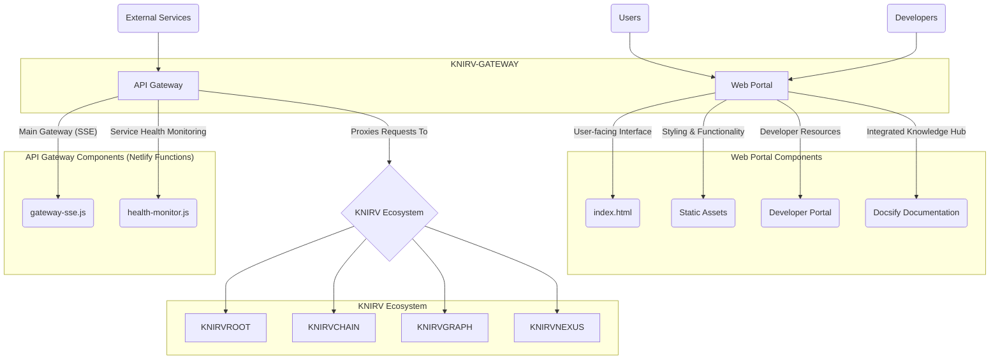

# **KNIRV-GATEWAY: The Unified Portal & API Gateway**

### **Abstract**

The KNIRV-GATEWAY serves as the primary and unified web portal and API gateway for the KNIRV Decentralized Trusted Execution Network (D-TEN). It is designed to be the single entry point for all users, developers, and services within the KNIRV ecosystem. By combining a modern, responsive website with serverless API gateway functionality, the KNIRV-GATEWAY provides a seamless and secure interface for interacting with the various layers of the network.

### **1. Introduction**

The KNIRV-GATEWAY is a critical architectural component that abstracts the complexity of the underlying decentralized network. It provides a modern web portal showcasing the D-TEN's capabilities and a robust serverless API gateway that supports real-time data streaming. The gateway is built on a modular architecture, leveraging Netlify Functions for its serverless backend and a responsive front end for an optimal user experience.

### **2. Architecture**

The KNIRV-GATEWAY's architecture is divided into two primary components: the Web Portal and the API Gateway.

**2.1. Web Portal Components** 

The web portal provides the user-facing interface, organized into a clear directory structure. It includes the main entry point (`index.html`), static assets for styling and functionality, and dedicated sections for a developer portal and documentation. The documentation is powered by Docsify, ensuring an integrated and easily navigable knowledge hub.

**2.2. API Gateway Components** 

The API gateway is implemented using Netlify Functions, enabling a serverless architecture. It is responsible for handling all API requests and features a main gateway with Server-Sent Events (SSE) support (`gateway-sse.js`) and a dedicated function for service health monitoring (`health-monitor.js`).

### **3. Core Features**

The KNIRV-GATEWAY's design incorporates several key features to provide a superior user and developer experience:
*   **Modern Web Portal**: A responsive website that explains the KNIRV D-TEN's value proposition and features.
*   **Serverless API Gateway**: A gateway built with Netlify Functions that includes support for Server-Sent Events (SSE) for live data streaming.
*   **Developer Portal & Documentation Hub**: An integrated portal that offers comprehensive documentation, tools, and tutorials for developers.
*   **Real-time Updates**: The use of SSE allows for live data streaming of gateway events and health updates.
*   **Authentication**: Secure API access and user management are handled through dedicated authentication endpoints.
*   **Health Monitoring**: Real-time service health and performance metrics are available for the gateway and connected services.
*   **User Interface**: The portal features a modern "Glass Morphism" UI design with a balanced blue/purple color scheme.

### **4. API Gateway Endpoints**

The API gateway exposes a series of endpoints to manage the gateway itself, monitor health, handle authentication, and proxy requests to other KNIRV services.
*   **Gateway Management**: Endpoints like `GET /gateway/health` and `GET /gateway/services` provide status and metrics for the gateway.
*   **Health Monitoring**: `GET /health-monitor/status` and `GET /health-monitor/events` provide real-time service health updates via SSE.
*   **Authentication**: `POST /auth/login` and `POST /auth/logout` manage user sessions and token verification.
*   **Service Proxy**: The gateway acts as a proxy for key KNIRV services, including endpoints for `KNIRVROOT` (`/api/*`), economics (`/economics/*`), and the tunnel registry (`/tunnel/*`).

### **5. Integration with the KNIRV Ecosystem**

The KNIRV-GATEWAY is designed to be the central point of contact for the entire D-TEN. It is configured to interact with other sovereign layers through environment variables. Specifically, it establishes connections to `KNIRVROOT`, `KNIRVCHAIN`, `KNIRVGRAPH`, and `KNIRVNEXUS`, acting as a front-facing proxy that streamlines communication and provides a single, secure entry point to the entire network.

### **6. Conclusion**

The KNIRV-GATEWAY is an essential layer of the KNIRV ecosystem, serving as the "Unified Web Portal and API Gateway". Its serverless, modular, and secure design provides developers with a powerful platform to build on and users with a clear window into the capabilities of the D-TEN. It is the crucial bridge that connects our decentralized architecture to the broader digital world, solidifying KNIRV's position as a leader in decentralized AI and trusted execution networks.