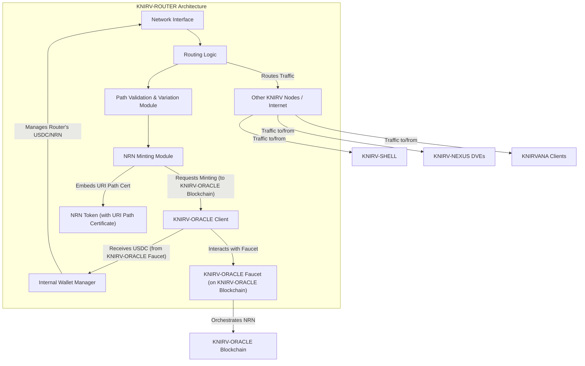

# Whitepaper: KNIRV-ROUTER - The Network Integrity & NRN Production Layer
## Ensuring Physical Network Validation and Fueling the Decentralized Intelligence Economy

**Version:** 2.1 (Revised)
**Status:** DRAFT
**Date:** July 17, 2025

### Abstract
The KNIRV Decentralized Trusted Execution Network (D-TEN) relies on robust, verifiable connectivity to support its self-improving AI agents. This whitepaper introduces the KNIRV-ROUTER, a foundational layer crucial for maintaining the physical integrity of the network and serving as the primary producer of Network Resolution Notice (NRN) tokens. Unlike conventional routers, the KNIRV-ROUTER intrinsically links token minting to "Proof-of-Connectivity", generating NRNs with embedded URI path certificates. These unique certificates enable the secure and verifiable invocation of Skill routines on KNIRVCHAIN by providing a cryptographically attested pathway through the network. This mechanism ensures that every Skill execution is backed by a verified, active route, thereby fueling the NRN economic loop and reinforcing the network's overall trustworthiness and resilience.

---

### 1. Introduction
In a decentralized network designed for trusted execution and continuous AI learning, the reliability and integrity of communication pathways are paramount. Traditional routing mechanisms, while efficient, often lack inherent transparency or economic incentives for verifying the physical health of the network. The KNIRV-ROUTER addresses this critical gap, transforming network routing from a passive function into an active, incentivized component of the D-TEN's core economic and operational loops.

Following the major refactor, the KNIRV-ROUTER is positioned as a vital intermediary, facilitating communication between KNIRV-CONTROLLER agents, KNIRV-NEXUS DVEs, KNIRVANA clients, and the broader internet. Its innovative design ensures that network connectivity is not merely assumed but actively validated and economically rewarded, directly supporting the embedded KNIRVCHAIN inference model's Skill invocation mechanism and the KNIRV-GRAPH's distributed vector graph learning processes.

### 2. Core Responsibilities
The KNIRV-ROUTER fulfills several critical responsibilities within the KNIRV D-TEN:

#### 2.1. NRN Production (Minting)
The KNIRV-ROUTER is the primary mechanism for minting new NRN tokens. It generates these tokens in response to demand, receiving USDC from the KNIRV-ORACLE's Faucet as compensation for its operational costs and the value it provides to the network. This process ensures a controlled and economically viable supply of NRNs.

#### 2.2. Physical Network Integrity Validation ("Proof-of-Connectivity")
A core innovation of the KNIRV-ROUTER is its active role in validating the physical integrity of the network. It achieves this by:
*   **Path Variation Generation:** Systematically exploring and validating diverse network pathways.
*   **Proof-of-Connectivity:** Generating cryptographic proofs of successful path traversals and connectivity, ensuring that the underlying network infrastructure is robust and reliable. This directly links its operational activity to the creation of valuable NRN tokens.

#### 2.3. NRN Token URI Path Certificates: Enabling Skill Invocation
Each NRN token minted by a KNIRV-ROUTER carries an embedded URI path certificate. This certificate is a cryptographically signed data structure that contains:
*   **A unique, verified network pathway:** A sequence of hops or cryptographic route identifiers from the KNIRV-ROUTER to a specific network endpoint (e.g., a KNIRVCHAIN node, a DVE, or a KNIRV-SHELL).
*   **Timestamp and Validity Period:** Ensuring the path's recency and relevance.
*   **Router Signature:** Cryptographic attestation by the KNIRV-ROUTER that validated the path.

**How it Works & Its Value:**
When a KNIRV-SHELL agent needs to invoke a Skill on KNIRVCHAIN, it must present an NRN token. The KNIRVCHAIN then sends a cross-chain message to KNIRV-ORACLE to burn this NRN. The embedded URI path certificate within the NRN serves as:
*   **Proof of Network Reachability:** It attests that a valid, recent pathway through the network existed at the time of the NRN's minting.
*   **Verifiable Execution Context:** It provides a unique, non-reusable "ticket" for Skill invocation, ensuring that each execution is tied to a verified network route.
*   **Security & Anti-Spam:** By requiring a fresh NRN (and thus a recently validated path) for each Skill invocation, the system inherently prevents spamming of Skills and ensures that network resources are used for genuinely routed operations.

**Value Proposition:** The value of the NRN is directly tied to its utility as this single-use, verifiable routing credential. Without an NRN, a Skill cannot be invoked, making the KNIRV-ROUTER's production of these tokens indispensable.

#### 2.4. Traffic Routing and P2P Facilitation
Beyond NRN production, the KNIRV-ROUTER performs traditional routing functions, facilitating secure peer-to-peer (P2P) communication between various KNIRV components:
*   **Agent-to-Agent Communication:** Enabling KNIRV-SHELL instances to communicate directly or via relays.
*   **KNIRVANA Client Connectivity:** Supporting real-time multiplayer gameplay by routing traffic between KNIRVANA clients and their associated KNIRV-SHELL agent units.
*   **DVE Access:** Routing requests from KNIRV-SHELLs to KNIRV-NEXUS DVEs for secure execution and validation.
*   **General Network Access:** Providing robust connectivity for KNIRV-SHELLs to access the KNIRVCHAIN, KNIRV-GRAPH, and other external services.

#### 2.5. Interaction with KNIRV-ORACLE Faucet
The KNIRV-ROUTER interacts directly with the KNIRV-ORACLE's USDC Faucet. It presents proofs of NRN production (derived from its physical network validation activities) to the KNIRV-ORACLE in exchange for USDC, which covers its operational costs and provides an economic incentive for its continued operation.

### 3. Architecture & Technical Implementation
The KNIRV-ROUTER is implemented as a dedicated network node, designed for high performance and reliability. It integrates seamlessly with the KNIRV-ORACLE for economic orchestration and with KNIRV-SHELLs for service provision. It is primarily developed in GoLang, leveraging its strong concurrency primitives and network capabilities for high performance and scalability, building upon its existing robust codebase.

*Figure 2: KNIRV-ROUTER's Internal Architecture and External Interactions.*

**Key Modules & Existing Components:**
*   **Network Interface:** Handles all incoming and outgoing network traffic.
*   **Routing Logic:** Implements standard and custom routing algorithms to direct traffic efficiently. This leverages existing components like the TURN Server (`transaction_turnserver/server.go` and `fallback_turn_server.go`) for connectivity.
*   **Path Validation & Variation Module:** The core component responsible for executing "Proof-of-Connectivity" tests and generating diverse pathways. This is implemented in `connectivity/proof_engine.go` and integrates with the existing DHT and TURN server.
*   **NRN Minting Module:** Encapsulates the logic for creating new NRN tokens and embedding their unique URI path certificates.
*   **KNIRV-ORACLE Client:** Manages secure communication with the KNIRV-ORACLE blockchain for NRN minting requests and USDC acquisition. This leverages the existing `blockchain_adapter.go` for blockchain integration.
*   **Internal Wallet Manager:** Manages the KNIRV-ROUTER's own USDC and NRN balances.

#### 3.1. NRN Minting Process
The NRN minting process within the KNIRV-ROUTER builds upon its existing GoLang components:
1.  **Path Generation & Validation:** The Path Validation & Variation Module (`connectivity/proof_engine.go`) algorithmically generates and validates new network paths. This involves utilizing the enhanced DHT Manager (`p2p/dht.go`, `p2p/p2p_manager.go`) which now includes `MeasurePeerConnectivity()` and `GetConnectivityMetrics()` methods to perform "Proof-of-Connectivity" tests (e.g., latency checks, packet delivery success rates). The existing TURN Server (`transaction_turnserver/server.go`) is leveraged for connectivity validation.
2.  **Certificate Creation:** Upon successful path validation, a unique URI path certificate is generated. This certificate is cryptographically signed by the KNIRV-ROUTER, attesting to the path's validity and recency.
3.  **NRN Token Creation:** The NRN Minting Module creates a new NRN token, embedding the signed URI path certificate within its unique token ID or associated metadata.
4.  **Minting Request to KNIRV-ORACLE:** The KNIRV-ROUTER sends a request to the KNIRV-ORACLE blockchain (via the KNIRV-ORACLE Client, which uses the extended `blockchain_adapter.go`) to officially mint this new NRN token on its native ledger. This request includes the NRN's unique ID and the proof of its creation. The `SubmitMintRequest()` function within the Blockchain Adapter is used for this purpose.
5.  **USDC Acquisition:** Upon successful minting by KNIRV-ORACLE, the KNIRV-ROUTER receives USDC from the KNIRV-ORACLE Faucet, completing the economic transaction.

#### 3.2. Network Discovery and Routing Protocols
The KNIRV-ROUTER utilizes a combination of standard and custom protocols, building on its existing implementations:
*   **Kademlia-based DHT:** The existing DHT implementation (`p2p/dht.go`, `p2p/p2p_manager.go`) is used for decentralized discovery of other KNIRV-ROUTERs, KNIRV-SHELLs, and DVEs within the network, as outlined in the `ROOT_tunnel_relay_implementation_plan.md`. The DHT Manager has been enhanced with connectivity measurement methods.
*   **Custom Routing Algorithms:** Optimized for low-latency, secure, and verifiable path selection, incorporating NRN certificate data.
*   **P2P Connectivity:** Supports direct P2P connections between nodes where possible, and utilizes relay mechanisms (e.g., TURN/STUN-like services) via the existing TURN server (`transaction_turnserver/server.go`) for NAT traversal. Existing port configurations (3478 for TURN, 5349 for TURN TLS) are preserved.

#### 3.3. zkTLS Integration
The KNIRV-ROUTER supports zkTLS (Zero-Knowledge Transport Layer Security) for highly sensitive routing information or metadata. This allows it to prove properties about traffic or network conditions without revealing the underlying sensitive data, enhancing privacy and security during routing.

#### 3.4. Component Integration and Initialization
The KNIRV-ROUTER's architecture is designed for modularity and seamless integration of new functionalities with existing ones. The `starter/starter.go` module is responsible for initializing all components:
*   The Proof-of-Connectivity Engine (`connectivity/proof_engine.go`) is initialized alongside the existing `DHTManager`, `TURNServer`, and `BlockchainAdapter`.
*   The Blockchain Adapter (`transaction_turnserver/blockchain_adapter.go`) has been extended with `EnableNRNMinting()` to activate NRN minting capabilities.
*   New API endpoints (`/api/connectivity/*`) have been added to the existing TURN server (`transaction_turnserver/server.go`) to manage proof submission, while maintaining existing `/turn/*` endpoints and the HTTP server infrastructure.

### 4. Economic Model: NRN Supply & Router Incentives
The KNIRV-ROUTER is a crucial participant in the NRN economic loop, directly influencing the supply of NRN tokens.
*   **Incentivized Supply:** KNIRV-ROUTERs are incentivized to continuously perform "Proof-of-Connectivity" and mint NRNs because they receive USDC from the KNIRV-ORACLE Faucet for each validated NRN. This covers operational costs and provides a profit margin.
*   **Balancing Demand & Supply:** The NRNs produced by KNIRV-ROUTERs directly meet the demand generated by KNIRV-SHELLs burning NRNs for Skill invocation. This creates a self-regulating economic mechanism.
*   **Value Accrual:** The value of NRNs is intrinsically linked to the utility derived from Skill invocation and the underlying validated network integrity provided by KNIRV-ROUTERs. As the network grows and more Skills are available, demand for NRNs increases, incentivizing more router activity.

### 5. Security & Trust Model
The KNIRV-ROUTER is designed with robust security measures to ensure network integrity and prevent malicious routing.
*   **Proof-of-Connectivity:** The core "Proof-of-Connectivity" mechanism provides a verifiable assurance of the network's physical integrity, making it difficult for malicious routers to inject invalid paths.
*   **Cryptographic Certificates:** The embedding of cryptographically signed URI path certificates within NRNs ensures the authenticity and non-tamperability of routing information.
*   **zkTLS for Privacy:** The use of zkTLS for sensitive routing data protects against information leakage during transit.
*   **Reputation System:** Future iterations may incorporate a reputation system for KNIRV-ROUTERs, where routers with consistently high "Proof-of-Connectivity" scores and low latency are favored.
*   **KNIRV-ORACLE Oversight:** KNIRV-ORACLE acts as the ultimate NRN oracle, monitoring NRN minting and burning events on its sovereign blockchain, providing a layer of oversight against anomalous router behavior.

### 6. Future Roadmap
*   **Dynamic Routing Optimization:** Implement advanced algorithms for real-time routing optimization based on network load, latency, and NRN certificate availability.
*   **Quality of Service (QoS):** Develop mechanisms for prioritizing traffic based on NRN attributes or service level agreements.
*   **Decentralized Router Governance:** Transition towards a decentralized governance model where NRN holders can vote on router parameters, NRN minting rates, and network policies.
*   **Edge Computing Integration:** Explore KNIRV-ROUTER deployment on edge devices to reduce latency and enhance localized network integrity validation.
*   **Advanced Network Monitoring:** Integrate sophisticated network monitoring tools to provide real-time insights into network health and router performance.

### 7. Conclusion
The KNIRV-ROUTER is a pivotal layer within the KNIRV D-TEN, transcending traditional routing to become an active participant in the network's economic and intelligence loops. By linking NRN token production to verifiable "Proof-of-Connectivity" and embedding URI path certificates that enable Skill routine invocation, it ensures the physical integrity of the network, fuels the NRN economy, and provides the essential communication backbone for KNIRV-SHELL agents, KNIRVANA clients, and the evolving Base LLM. The KNIRV-ROUTER is fundamental to realizing the vision of a truly resilient, self-sustaining, and intelligent decentralized network.

<a href="#/legal/CODE_OF_CONDUCT.md" class="footer-link">Contributor Covenant Code of Conduct</a> | <a href="#/legal/PRIVACY_POLICY.md" class="footer-link">PRIVACY_POLICY.md</a> | <a href="#/legal/TERMS_AND_CONDITIONS.md" class="footer-link">TERMS AND CONDITIONS</a>

© 2025 KNIRV Network

