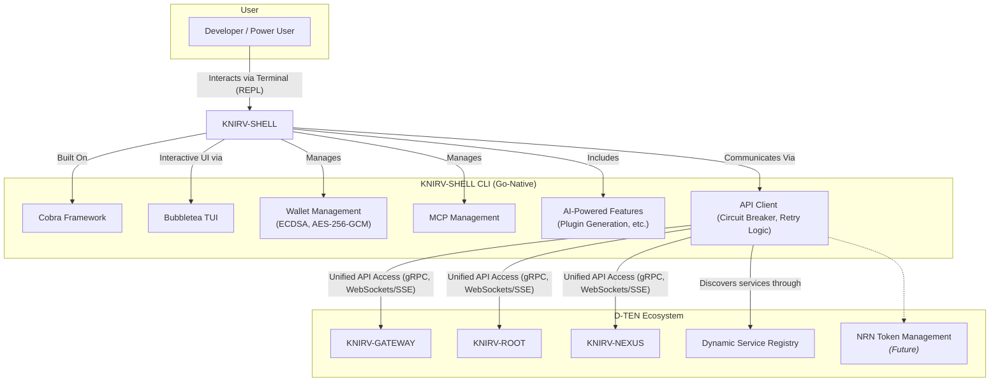

# Whitepaper: KNIRV-SHELL - The Comprehensive Command-Line Interface for the D-TEN
### **KNIRV-SHELL: The Comprehensive Command-Line Interface for the D-TEN**

#### **Abstract**

The **KNIRV-SHELL** is a sophisticated, AI-powered command-line interface (CLI) that serves as the primary developer and power user interface for the KNIRV Decentralized Trusted Execution Network (D-TEN). It is a comprehensive tool that unifies interaction with all sovereign layers of the D-TEN, providing functionalities for wallet management, Model Context Protocol (MCP) management, and AI-powered plugin generation. Built in Go, it features a robust, extensible architecture designed for enhanced service discovery, real-time updates, and seamless integration with the entire KNIRV ecosystem.

#### **1. Introduction**

The **KNIRV-SHELL** transforms the user's interaction with the D-TEN from an abstract concept into a tangible command-line experience. It is designed to overcome the limitations of isolated operations and static configurations, establishing itself as the "unified access" point for all network services. Unlike the user-facing `KNIRV-AGENTIFIER`, the `KNIRV-SHELL` is a technical interface built for precision and control, empowering developers to build, manage, and monitor their applications directly from the terminal.

#### **2. Core Features**

The **KNIRV-SHELL** is a feature-rich tool built to support a wide range of developer needs:
*   **Wallet Management**: Provides full lifecycle management of digital wallets, including the secure generation, import, export, and listing of wallets using ECDSA key generation and AES-256-GCM encryption.
*   **MCP Management**: Allows for the registration and management of AI plugin capabilities, operational procedures (interpolation), and server registrations (extrapolation), which are central to the network's AI functionality.
*   **AI-Powered Features**: Includes advanced functionalities such as AI-powered plugin generation and planned enhancements for intelligent command suggestion, automatic error resolution, and a natural language command interface.
*   **Interactive Terminal UI**: Incorporates an interactive shell (REPL) with command history and tab completion, providing a user-friendly experience within a text-based environment using the Bubbletea framework.
*   **Real-time Connectivity**: The implementation plan outlines the integration of WebSockets and Server-Sent Events (SSE) to enable live updates and event-driven operations, ensuring the user is always synchronized with the network's state.

#### **3. Architectural Design**

The **KNIRV-SHELL**'s architecture is a testament to our commitment to a "High-Fidelity Infrastructure," prioritizing performance and direct control.
*   **Go-Native Implementation**: The entire application is written in Go, utilizing the Cobra framework for a robust and modular CLI structure.
*   **Secure Wallet Integration**: Wallet functionality is implemented with go-native packages, ensuring cryptographic security through ECDSA and AES-256-GCM encryption for key management.
*   **API Client with Resilience**: The underlying API client is designed with a circuit breaker and retry logic, providing fault tolerance and resilience when interacting with distributed network services.
*   **Dynamic Service Discovery**: The implementation strategy addresses the issue of static configuration by proposing a dynamic service registry. This will allow the `KNIRV-SHELL` to automatically discover and resolve network services, ensuring adaptability to the decentralized network's fluid topology.

#### **4. Integration with the D-TEN Ecosystem**

The `KNIRV-SHELL` is engineered to be a unified, single-pane-of-glass interface for the entire KNIRV ecosystem.
*   **Unified API Access**: It acts as a single point of entry to a variety of services, including `KNIRV-ROOT`, `KNIRV-NEXUS`, and `KNIRV-GATEWAY`, addressing the previously identified "isolated operation" gap.
*   **Economic Integration**: The implementation plan includes the future integration of a module for NRN token management, which will provide developers with direct control over the network's economics and facilitate the seamless settlement of transactions.
*   **Enhanced Inter-Module Communication**: The plan outlines the use of gRPC for efficient communication with core services, ensuring low-latency and high-throughput data exchange with other layers of the network.

#### **5. Future Development & Roadmap**

The **KNIRV-SHELL** is envisioned as a continuously evolving tool. Future enhancements include:
*   **AI-Powered Assistance**: Intelligent command suggestion, automatic error resolution, and a natural language command interface to simplify complex tasks.
*   **Advanced Network Integration**: Support for cross-chain bridges, multi-network operations, and federated service discovery to scale with the network's growth.
*   **Developer Tooling**: Enhanced tooling for plugin development, offering a seamless experience from generation to deployment.
*   **Production Readiness**: Robust monitoring, logging, and deployment support to ensure the CLI is ready for enterprise-level use.

#### **6. Conclusion**

The **KNIRV-SHELL** is a testament to the KNIRV Network's commitment to empowering developers. By providing a comprehensive, intelligent, and unified command-line tool, it transforms the complexity of a decentralized network into a powerful and manageable interface. It is the definitive toolkit for building, managing, and interacting with the entire KNIRV D-TEN, serving as a critical layer that drives both innovation and adoption.