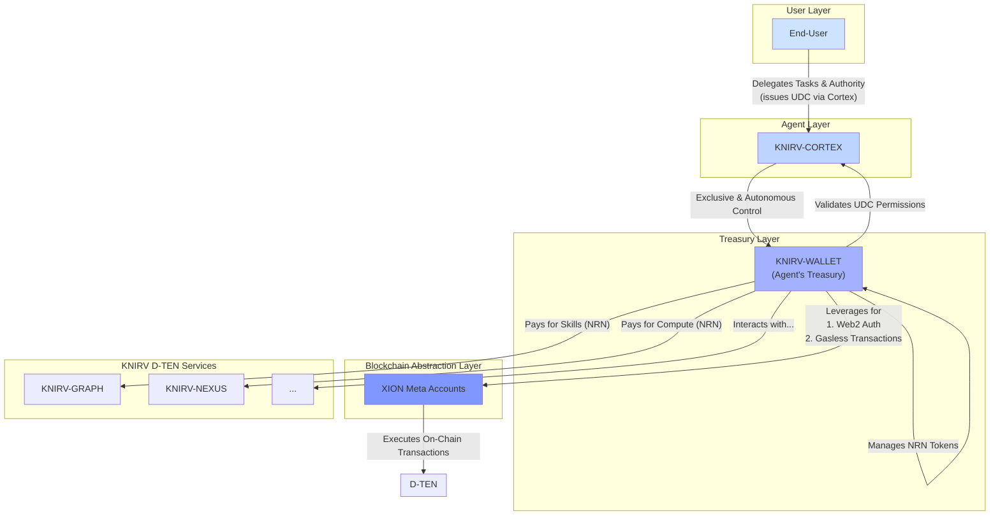

# **Whitepaper: The KNIRV-WALLET**

### **KNIRV-WALLET: The Agent's Treasury**

#### **1. Abstract**
*   The **KNIRV-WALLET** is a foundational component of the KNIRV D-TEN ecosystem, serving as a secure, non-custodial wallet exclusively for autonomous agents.
*   It is not a direct user interface, but rather an "Agent's Treasury" that allows the **KNIRV-CORTEX** to autonomously manage user assets, perform transactions, and issue User Delegation Certificates (UDCs) on the user's behalf.
*   Leveraging XION Meta Accounts, the **KNIRV-WALLET** provides seamless, gasless transactions and a familiar Web2-like authentication experience for the agent, abstracting away the complexities of blockchain interaction from the end-user.

#### **2. Introduction**
*   The **KNIRV-WALLET** is a multi-platform, secure wallet designed to empower autonomous agents to act as trusted fiduciaries for their users within the Decentralized Trusted Execution Network (D-TEN).
*   The wallet's core purpose is to provide a seamless and intuitive mechanism for agents to interact with the network's economic and governance layers.
*   It is a critical piece of the security model, as all on-chain actions, including NRN token management, skill invocation fees, and data access, are routed through the wallet's autonomous features.
*   This design ensures that users delegate authority to their agents via the **KNIRV-CORTEX**, and the agent then utilizes the **KNIRV-WALLET** to execute those delegated tasks securely and transparently.

#### **3. Architectural Framework**
The **KNIRV-WALLET** is built on a robust architecture that prioritizes security, accessibility, and agent autonomy.

*   **Multi-Platform Support**: The wallet is designed as a core library or SDK, enabling it to be integrated across various operating systems and environments, including web, mobile, and desktop. This ensures that the **KNIRV-CORTEX** can operate consistently regardless of the user's device.
*   **XION Meta Accounts**: By utilizing XION's Meta Accounts, the **KNIRV-WALLET** abstracts away the traditional complexities of private keys and seed phrases from the end-user. It provides a more familiar experience for the agent, which can be linked to the user's identity through Web2-like authentication methods.
*   **Non-Custodial Design**: The wallet is strictly non-custodial. User funds and private keys are never held by a third party. The agent, with the user's explicit UDC-based permission, holds and manages these keys in a secure, sandboxed environment.

#### **4. Key Features**
The **KNIRV-WALLET** is equipped with a suite of features that enable powerful, autonomous agentic behavior.

*   **Web2-like Authentication**: For the agent's initial setup and account recovery, the wallet supports authentication via email, social logins (e.g., Google, Apple ID), and biometrics. This allows the user to securely authorize the agent's access without dealing with complex crypto-native processes.
*   **Gasless Transactions**: A core feature of the **KNIRV-WALLET** is its ability to perform gasless transactions via XION. This is crucial for the autonomous model, as it allows the agent to execute thousands of micro-transactions (e.g., paying for skill invocation on the **KNIRV-GRAPH**) without requiring the user to constantly manage or top-up a native token balance.
*   **NRN Management**: The wallet provides the agent with a secure interface to manage the user's NRN token balance. This includes the ability to hold, send, and receive NRNs, as well as to pay for services within the KNIRV D-TEN.
*   **Agent Control and Governance**: The wallet is the mechanism through which the agent's permissions are enforced. It validates the UDC issued by the user through the **KNIRV-CORTEX**, ensuring that all actions are within the scope of the user's explicit delegation.
*   **UDC Issuance**: The wallet plays a pivotal role in the issuance of User Delegation Certificates (UDCs). It is responsible for generating the cryptographic keys and signing the UDCs, which are then used by the agent to prove its authority to interact with other KNIRV layers on the user's behalf.

#### **5. Interaction Model: The Agent as Intermediary**
*   The most significant architectural shift is the interaction model: the end-user **does not** interact directly with the **KNIRV-WALLET**.
*   The user's interaction point is the **KNIRV-CORTEX**, which acts as a secure intermediary and a gateway to the wallet's functionality.
*   When a user delegates a task to their AI assistant (enhanced by the **KNIRV-CORTEX**), the agent is the entity that accesses the **KNIRV-WALLET** to perform the necessary transactions.
*   This model simplifies the user experience, removes the cognitive load of managing cryptographic assets, and ensures that all on-chain activity is a direct result of a user-approved agentic action.

#### **6. Conclusion**
*   The **KNIRV-WALLET** is an essential layer that underpins the autonomy and economic functionality of the **KNIRV-CORTEX**.
*   By reframing its purpose from a user-facing tool to an "Agent's Treasury," we have created a secure, gasless, and transparent system for managing decentralized assets and permissions.
*   The wallet's seamless integration with XION's Meta Accounts and its exclusive interface with the **KNIRV-CORTEX** ensures a user-centric but agent-driven experience, solidifying its role as the financial engine for the autonomous future of the KNIRV D-TEN.

<a href="#/legal/CODE_OF_CONDUCT.md" class="footer-link">Contributor Covenant Code of Conduct</a> | <a href="#/legal/PRIVACY_POLICY.md" class="footer-link">PRIVACY_POLICY.md</a> | <a href="#/legal/TERMS_AND_CONDITIONS.md" class="footer-link">TERMS AND CONDITIONS</a>

© 2025 KNIRV Network

