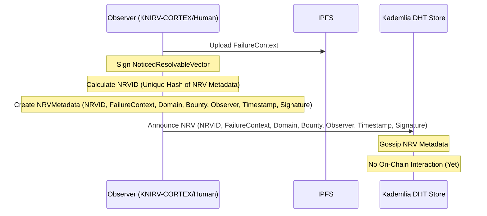
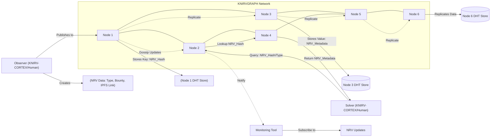
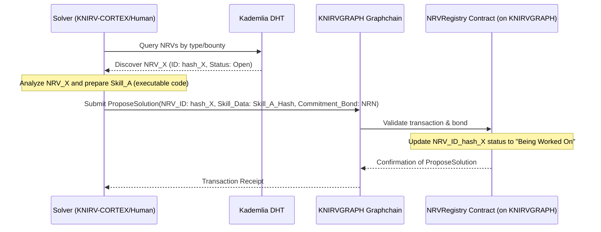
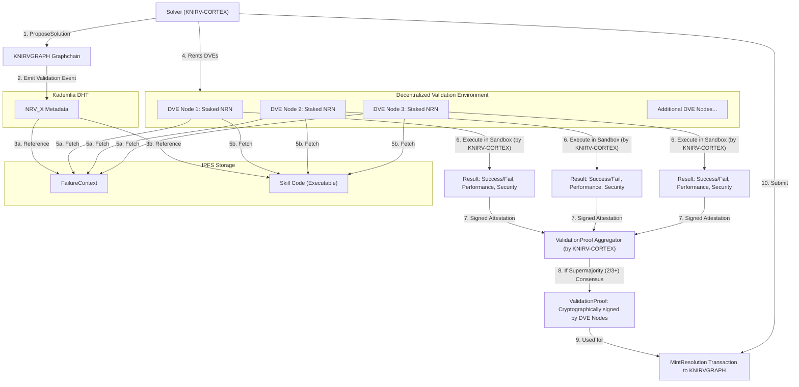
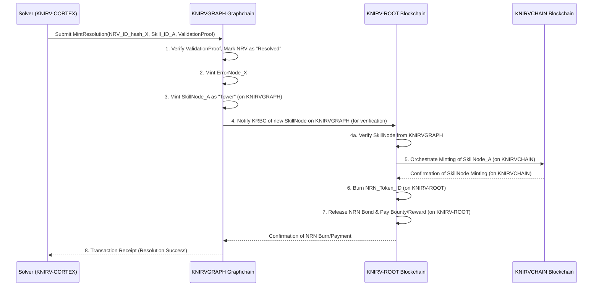
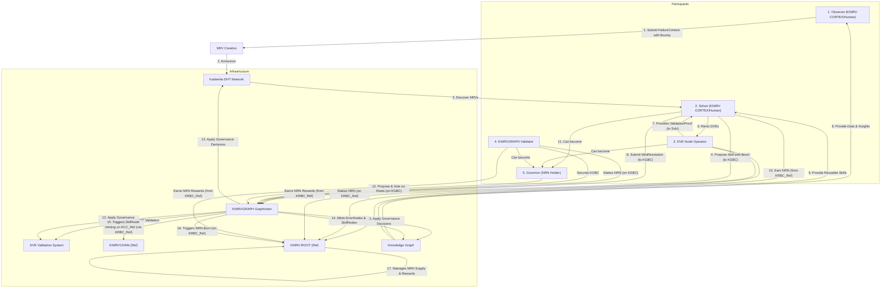
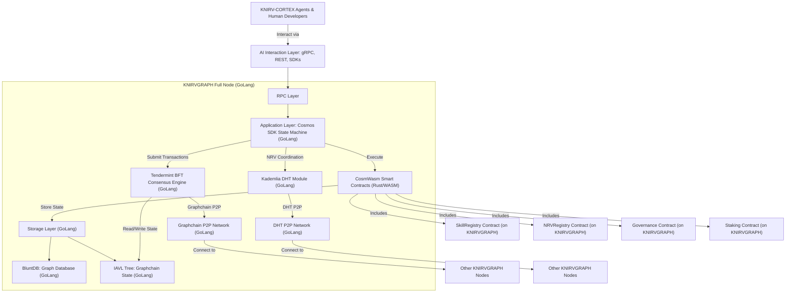
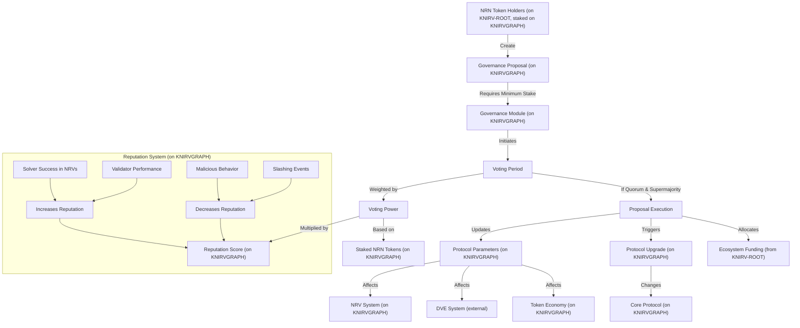

# KNIRVGRAPH Whitepaper v5.2
## The Economic and Coordination Backbone for Self-Improving AI

### Abstract
**KNIRVGRAPH** introduces a sovereign Layer 1 Graphchain designed to serve as the economic and coordination backbone for a new generation of self-improving AI. It fuses a decentralized knowledge graph—where AI failures are first captured within specialized, dynamic "Noticed Resolvable Vectors" and then, upon validated resolution, minted as immutable **ErrorNodes** and composable, on-chain **SkillNodes**—with an architecture enabling **Self-improving Embodied Agent Learning (SEAL)**. A novel **Distributed Hash Table (DHT)** facilitates the decentralized announcement, gossip, and coordination of these **Noticed Resolvable Vectors**, their proposed solutions, and their ultimate resolutions.

In this ecosystem, autonomous **KNIRV-CORTEX** agents and human developers have permissionless access to the global knowledge graph and actively participate in resolving ongoing AI failures. They diagnose problems, propose solutions (Skills), and contribute to the resolution of **Noticed Resolvable Vectors (NRV)**. These novel solutions are rigorously tested in a **Decentralized Validation Environment (DVE)** and, if successful, are added to a global, on-chain SkillRegistry on the **KNIRVCHAIN** (our sovereign Rust-based Layer 1 blockchain), enriching the entire network.

The native **NRN (Network Resolution Notice)** token, native to the **KNIRV-ROOT** (our sovereign GoLang-based Layer 1 blockchain), powers a sophisticated "**Proof-of-Solution**" economy. This system incentivizes not only human developers but also the operators of autonomous **KNIRV-CORTEX** agents and **KNIRV-ROUTERS**, creating a liquid market for AI knowledge and the efficient resolution of complex AI issues. This whitepaper details the symbiotic architecture, the multi-layered economic model, and the comprehensive technical specifications, focusing on **KNIRVGRAPH's** unique role as a Graphchain in cultivating a global, self-healing intelligence.

# 1. The Inevitable Singularity of Failure: A New Paradigm for AI Growth

## 1.1 The Problem: Walled Gardens and Stagnant Learning
The development of Artificial Intelligence is defined by iterative improvement through the analysis of failure. Yet, the lessons learned from these failures are almost universally privatized. When an AI model developed by Corporation A fails, the diagnosis and resulting intellectual property are firewalled. When Corporation B encounters a similar problem, it must expend its own resources to rediscover a solution that already exists. This paradigm of *"walled garden"* development creates a massive, systemic drag on innovation. It is inefficient, redundant, and guarantees that the global potential of AI remains fragmented and siloed. We are building a thousand isolated intelligences, when we could be cultivating a single, compounding one.

## 1.2 The Solution: From Isolated Failure to Collective Intelligence
**KNIRVGRAPH** fundamentally rejects this paradigm. Our thesis is that AI failures, when properly contextualized and resolved, are a global public good. We have built the trustless economic and technical infrastructure to transform failures from liabilities into assets. Our network creates a transparent, incentivized marketplace where problems are broadcasted, solutions are developed and validated, and the resulting knowledge is made permanently available and composable for the entire ecosystem.

## 1.3 The KNIRVGRAPH Vision: A Permissionless, Self-Healing Knowledge Market
We are building a Layer 1 Graphchain protocol that serves as the coordination layer for a global, self-healing network. It is a place where autonomous **KNIRV-CORTEX** agents and human developers collaborate and compete not just to build better models, but to systematically map the landscape of AI fallibility and build a shared, on-chain library of solutions. This creates a powerful feedback loop: as the on-chain knowledge graph grows, the cost and time to solve new failures decrease, accelerating the rate of improvement for every participant in the network. This is the path to compounding intelligence, directly manifested through the evolution of the Base LLM on **KNIRVCHAIN**.

# 2. The Decentralized Knowledge Graph: A Living Chronicle of Intelligence
At its core, **KNIRVGRAPH** is not a linear ledger of transactions, but a living chronicle of learning represented as a sophisticated, ever-expanding graph. Its state is a dynamic representation of the frontier of solved problems in AI.

## 2.1 Why a Graphchain? Representing Complex Relationships with Consensus
A traditional linear blockchain is insufficient for modeling complex, interconnected knowledge. Knowledge is inherently relational. A solution might depend on five other sub-solutions, improve upon an older technique, and render a class of ten different errors obsolete. A Graphchain natively represents these complex, multi-dimensional relationships directly within its consensus-validated structure. This fundamental difference allows for:

*   **Direct Relationship Storage:** Edges between nodes are first-class citizens, not merely metadata.
*   **Efficient Traversal:** Queries for dependencies, impacts, or related problems are native and highly performant.
*   **Semantic Integrity:** The graph structure itself enforces logical connections between **ErrorNodes** and **SkillNodes**.

## 2.2 Core Primitives: ErrorNodes and SkillNodes
The Graphchain is composed of two primary node types, representing problems and solutions, and the relationships between them.

```go
// ErrorNode: An immutable, on-chain cryptographic proof of a specific,
// validated AI failure. It is the "fossil record" of a problem.
type ErrorNode struct {
    ID             string                // Unique hash of the FailureContext
    NRVSource      string                // Hash of the original off-chain NRV announcement
    Description    string                // Human-readable description of the failure
    FailureContext []byte                // Serialized data of the exact environment, inputs, and state that caused the failure
    Domain         string                // e.g., "Robotic_Navigation", "Protein_Folding", "Language_Translation"
    Complexity     int                   // A DVE-validated rating (1-100) of the problem's difficulty
    ResolvedBy     string                // ID of the SkillNode that resolves this error (on KNIRVGRAPH)
    Timestamp      time.Time             // Timestamp of minting
    Metadata       map[string]interface{} // Additional metadata, like software versions or hardware specs
}

// SkillNode: A composable, versioned, on-chain solution to one or more ErrorNodes.
// It is a piece of executable logic or knowledge, managed by KNIRVGRAPH.
type SkillNode struct {
    ID              string                // Unique hash of the Skill's logic and dependencies (on KNIRVGRAPH)
    Creator         string                // Address of the KNIRV-CORTEX Agent or Human Developer
    Description     string                // Human-readable description of the skill's function
    ResolvesErrors  []string              // A list of ErrorNode IDs it resolves (on KNIRVGRAPH)
    Dependencies    []string              // Other SkillNodes this skill depends on (critical for composition) (on KNIRVGRAPH)
    CodePackageURI  string                // Content-addressed URI (e.g., IPFS CID) pointing to the skill's executable code
    ValidationProof []byte                // Cryptographic proof from the DVE consensus
    ReputationScore float64               // A dynamic score based on usage, successful resolutions, and downstream dependencies
    Version         uint32                // Version number for iterative improvements
    LicenseType     SkillLicenseType      // Defines usage rights (e.g., Open, RoyaltyBearing)
    Timestamp       time.Time             // Timestamp of minting (on KNIRVGRAPH)
}
```

## 2.3 Relational Fabric: Verification & Dependency Edges
The power of the Graphchain comes from the edges that connect the nodes, managed by the protocol itself. These edges are first-class citizens, enabling complex queries and relationships.

```go
// RelationshipEdge defines the interaction between any two nodes in the graph.
type RelationshipEdge struct {
    FromNode   string
    ToNode     string
    EdgeType   RelationshipType 
    Weight     float64          // Strength or confidence, e.g., how much a Skill improves another
    Metadata   map[string]interface{}
}

type RelationshipType int
const (
    RESOLVES RelationshipType = iota  // A SkillNode resolves an ErrorNode
    DEPENDS_ON                        // A SkillNode requires another SkillNode to function
    IMPROVES_ON                       // A new SkillNode is a better version of an old one
    COMPOSES                          // A SkillNode is a meta-skill composed of multiple others
    CONTRADICTS                       // A new finding invalidates an older Skill or Error assumption
)
```

# 3. The Lifecycle of a Solution: From Noticed Vector to Minted Skill
**KNIRVGRAPH** orchestrates a precise, four-stage process to ensure that only valid, tested knowledge is committed to its Graphchain, and subsequently, to the canonical SkillRegistry on **KNIRVCHAIN**.

## 3.1 Stage 1: The Noticed Resolvable Vector (NRV) - The Spark of Discovery
An AI failure is observed. This could be an autonomous **KNIRV-CORTEX** agent failing a task, a language model producing a harmful output, or a scientific model yielding an inaccurate prediction. The observer (human or **KNIRV-CORTEX** agent) creates an NRV—a lightweight, off-chain data packet.

```go
// NoticedResolvableVector: An off-chain "help wanted" ad for a specific AI problem.
type NoticedResolvableVector struct {
    NRVID          string     // Unique hash of the content
    FailureContext []byte     // The critical data describing the failure
    Domain         string     
    Bounty         uint64     // NRN tokens offered for a validated solution
    Observer       string     // Address of the announcing entity (KNIRV-CORTEX or Human)
    Timestamp      time.Time
    Signature      []byte     // Signed by the Observer to prove authenticity
}
```

**Diagram: Stage 1 - Noticed Resolvable Vector Announcement**


## 3.2 The NRV Coordination Layer: A Scalable DHT
Committing every potential problem and its iterative solutions directly to the Graphchain would be prohibitively expensive and slow, creating immense transaction load. Instead, Network Resolution Vectors (NRVs) – the dynamic transaction pools for errors – are announced, managed, and gossiped across a Kademlia-based **Distributed Hash Table (DHT)**. This decentralized, peer-to-peer network is run by all **KNIRVGRAPH** full nodes, operating alongside the main Graphchain.

***Expanded Information:***
A Kademlia DHT operates on a principle of XOR distance between node IDs and keys, which creates a highly efficient and self-organizing network. Each node maintains "k-buckets" of contact information for other nodes, prioritized by their XOR distance to the node's own ID.

*   **Decentralized Problem Board:** When an Observer detects an AI failure and categorizes it, a unique hash is generated for the NRV. This hash serves as the key in the Kademlia DHT. The associated value contains metadata about the NRV: its type, severity, current status, bounty, and a reference to the initial `FailureContext` (stored on IPFS).
*   **Efficient Discovery:** Solvers (both human and **KNIRV-CORTEX** agents) do not need to constantly poll the Graphchain or a centralized server to find new problems. Instead, they query the DHT using the error category or a specific `FailureContext` hash. Kademlia's efficient lookup mechanism (typically log(N) steps for N nodes) allows Solvers to quickly discover active NRVs relevant to their expertise or bounty preferences.
*   **Real-time Gossip:** As an NRV progresses (e.g., new solutions are proposed, DVE attestations are submitted off-chain), its metadata in the DHT is updated and gossiped to interested peers. This provides a near real-time "job board" where Solvers can see what problems are being actively worked on and which require more attention.
*   **Scalability & Resilience:** Since the DHT operations (announcement, discovery, gossip) occur off-chain, they do not consume Graphchain resources. This provides immense scalability for managing a vast number of concurrent AI failure resolution efforts. Furthermore, Kademlia's design is inherently resilient to node failures, as data is replicated across multiple nodes closest to the key.

**Diagram: Kademlia DHT for NRV Coordination**


## 3.3 Stage 2: Proposal and Commitment - The Proof-of-Stake Bond
Once a Solver (**KNIRV-CORTEX** agent or human developer) discovers an interesting NRV on the DHT – perhaps one with a high bounty or a relevant domain – they initiate the process of proposing a solution. This is not a simple upload; it requires a cryptographic commitment to serious effort on the **KNIRVGRAPH** Graphchain.

***Expanded Information:***
The `ProposeSolution` transaction is a crucial on-chain interaction that bridges the off-chain NRV coordination with the Graphchain's immutability and economic incentives.

*   **Reference to the NRV:** The `ProposeSolution` transaction explicitly includes the unique hash or identifier of the NRV it intends to solve. This creates a direct, auditable link on the Graphchain between a proposed solution and the specific problem it addresses.
*   **"Soft Lock" on the NRV:** When the `ProposeSolution` transaction is confirmed on-chain, the status of the referenced NRV within the `NRVRegistry` smart contract (an on-chain component tracking NRV states on **KNIRVGRAPH**) is updated. It transitions from "Open" to "Being Worked On" or "Solution Proposed". This acts as a "soft lock" – it signals to other Solvers viewing the on-chain registry (or the DHT) that a solution is actively under development or validation for this NRV, reducing redundant effort. Multiple Solvers can still propose solutions to the same NRV, fostering competition, but the on-chain status provides valuable transparency.
*   **Commitment Bond (Proof-of-Stake):** The Solver is required to stake a predefined amount of **NRN** tokens (native to **KNIRV-ROOT** and bridged to **KNIRVGRAPH** for staking) as a commitment bond. This bond serves multiple purposes:
    *   **Anti-Spam:** It raises the economic cost of submitting frivolous or low-effort solutions.
    *   **Incentive Alignment:** It aligns the Solver's economic interest with the successful resolution of the NRV.
    *   **Penalty Mechanism:** The bond is designed to be slashed if the Solver fails to produce a valid solution within a specified time limit, if their proposed solution is proven to be malicious or intentionally ineffective, or if they withdraw their proposal without valid reason. This ensures accountability.
    *   **Bond Amount:** The bond amount can be dynamic, potentially scaled by the NRV's bounty size or complexity, as determined by network governance.

This on-chain commitment ensures that the subsequent off-chain validation (in the **DVE**) is performed on proposals that carry a real economic stake.

**Diagram: Stage 2 - Proposal and Commitment**


## 3.4 Stage 3: The Decentralized Validation Environment (DVE) - The Crucible of Truth
The **Decentralized Validation Environment (DVE)** is the cornerstone of trust in **KNIRVGRAPH**, operating as a critical off-chain layer that bridges proposed solutions with on-chain verification. It ensures that any Skill proposed to an NRV truly resolves the underlying failure before it can be minted onto the knowledge graph. **KNIRV-CORTEX** agents rent and utilize DVEs for these rigorous tests.

***Expanded Information:***
The **DVE** is not a single server or entity, but a globally distributed network of specialized, staked validator nodes (CLEAN servers). These nodes are responsible for providing secure, isolated, and deterministic sandboxed environments to rigorously test proposed Skills as rented by **KNIRV-CORTEXs**.

*   **Automated Routing to Domain-Specific DVEs:** Upon a `ProposeSolution` transaction being confirmed on **KNIRVGRAPH**, the `NRVRegistry` contract (or a coordinating off-chain module listening to these events) identifies the domain and requirements of the NRV. A **KNIRV-CORTEX** agent then dispatches a request for validation to the most appropriate DVE sub-network.
*   **Examples of DVE Specialization:** A "Physics Simulation DVE" might specialize in verifying solutions for robotics control errors or complex fluid dynamics models. A "Medical Imaging DVE" would have the necessary hardware (e.g., GPUs) and software stacks to test AI solutions for radiology or pathology. This specialization ensures that Skills are tested in environments relevant to their application.
*   **Validation Process (Executed by KNIRV-CORTEX within Rented DVE):**
    1.  **Request Dispatch:** A **KNIRV-CORTEX** (as the Solver) selects a random, sufficiently large subset of qualified DVE nodes to perform the validation. This selection can be weighted by their NRN stake and reputation score.
    2.  **Resource Fetch:** Each selected DVE node fetches the `FailureContext` (input data, model state, runtime logs) from IPFS (referenced in the NRV's metadata on the DHT). Simultaneously, it fetches the proposed Skill code (executable code), also from IPFS.
    3.  **Secure Sandbox Execution:** The **KNIRV-CORTEX** executes the Skill code within a secure, isolated sandbox environment provided by the DVE. This sandbox is designed to be deterministic and replicate the conditions of the original failure as closely as possible. It monitors the Skill's behavior, resource consumption, and crucially, its ability to transform the `FailureContext` into a `SuccessContext`.
    4.  **Test Case Execution:** The Skill proposal often includes automated test cases. The **KNIRV-CORTEX** within the DVE runs these tests, ensuring the Skill passes them without regression and correctly addresses the specific error conditions.
    5.  **Security Analysis:** During execution, the **KNIRV-CORTEX** within the DVE performs static and dynamic analysis to check for malicious code, resource exploits, or other security vulnerabilities within the proposed Skill.
*   **DVE Consensus and ValidationProof:** After independent execution and verification by multiple DVEs (rented by the **KNIRV-CORTEX**), each DVE node cryptographically signs an attestation of its results (`DVEResult`). These individual attestations are then aggregated by the **KNIRV-CORTEX**. A supermajority (typically 2/3 or more) of the selected DVE nodes must independently replicate the execution and attest that the Skill successfully resolves the failure, is free of malicious code, and meets performance benchmarks. This collective, signed aggregation of attestations forms the `ValidationProof`. This `ValidationProof` is a critical piece of evidence that will be presented on-chain to **KNIRVGRAPH** in the next stage.
*   **Incentives and Slashing:** DVE node operators stake substantial amounts of **NRN** (native to **KNIRV-ROOT**). They earn a share of transaction fees and network rewards for providing reliable validation services. Conversely, their stake is slashed if they are found to be dishonest (e.g., falsely attesting to a malicious Skill) or if they consistently fail to perform validation tasks.

**Diagram: Stage 3 - Decentralized Validation Environment (DVE)**


## 3.5 Stage 4: Atomic Minting - Forging Knowledge into the Graph and Chain
The `ValidationProof` is the final authorization required for a proposed solution to be permanently enshrined in the **KNIRVGRAPH** knowledge graph and to trigger its canonical registration on the **KNIRVCHAIN**. The Solver (**KNIRV-CORTEX** agent), armed with this proof, submits the `MintResolution` transaction to the **KNIRVGRAPH** Graphchain, which is an atomic operation that orchestrates cross-chain interactions.

***Expanded Information:***
*"Atomic"* in this context means that all the listed actions happen as a single, indivisible transaction. Either all steps succeed, or none of them do, guaranteeing consistency and integrity of the ledger.

1.  **Consumes the NRV (on KNIRVGRAPH):** The `MintResolution` transaction references the original NRV's ID. Upon successful validation and acceptance on **KNIRVGRAPH**, the `NRVRegistry` smart contract (on **KNIRVGRAPH**) marks that specific NRV as "Resolved." This formally concludes the off-chain resolution process for that particular problem instance. The NRV can now be archived on the DHT, but its resolution is recorded on-chain.
2.  **Mints the ErrorNode (on KNIRVGRAPH):** The `FailureContext` that initiated the NRV is now used to create a permanent, immutable **ErrorNode** on the **KNIRVGRAPH** Graphchain. This **ErrorNode** includes its Fingerprint, ModelInfo, InputHash, Output, Context, Submitter, and crucially, its status is now Resolved. This establishes a durable, verifiable record of the problem in the global knowledge graph.
3.  **Mints the SkillNode as a "Tower" (on KNIRVGRAPH):** The Solver's solution, validated by the DVE, is now minted as a new **SkillNode** on the `SkillRegistry` smart contract on the **KNIRVGRAPH** Graphchain. This **SkillNode** is specifically positioned as a "tower" within the vector field of its corresponding **ErrorNode**(s). This implies a semantic or structural relationship where the Skill is directly associated with the problem it solves, forming a visible resolution within the graph's topology, making it discoverable and composable within the Graphchain.
4.  **Verification by KNIRV-ROOT:** The newly minted **SkillNode** on **KNIRVGRAPH** (along with its `ValidationProof` and associated **ErrorNode** context) triggers an observation process by **KNIRV-ROOT** (the sovereign **NRN** blockchain and network oracle). **KNIRV-ROOT** performs its own verification of the **SkillNode's** validity and context against its global view of network integrity and **NRN** policies.
5.  **Canonical SkillNode Minting (on KNIRVCHAIN):** ONLY AFTER **KNIRV-ROOT's** verification and approval, **KNIRV-ROOT** then orchestrates the minting of the **SkillNode** onto the **KNIRVCHAIN** (our sovereign Rust-based Layer 1 blockchain). This makes the Skill canonically available in the `SkillRegistry` on **KNIRVCHAIN** for network-wide invocation by **KNIRV-CORTEXs**. This also contributes to the evolution of the **KNIRVCHAIN's** Base LLM.
6.  **Triggers NRN Burning (on KNIRV-ROOT):** Upon successful **SkillNode** minting on **KNIRVCHAIN** (orchestrated by **KNIRV-ROOT**), an IBC message is sent to the **KNIRV-ROOT** blockchain. **KNIRV-ROOT**, as the native **NRN** ledger, processes this message and burns the **NRN** token that was presented by the **KNIRV-CORTEX** to invoke the Skill routine.
7.  **Releases Payment (on KNIRV-ROOT):** As a reward for successfully resolving the NRV and contributing valuable knowledge, the Solver's **NRN** commitment bond (staked on **KNIRVGRAPH**) is returned, and any **NRN** bounty attached to the original NRV is paid out to the Solver from **KNIRV-ROOT's** native **NRN** supply. Additionally, a share of the network's **Proof-of-Solution** reward pool (funded by **KNIRV-ROOT** inflation) is distributed to the Solver, proportionally to the complexity, novelty, and impact of their Skill as determined by DVE metrics and community peer review (if applicable).

This atomic minting process guarantees that the act of problem-solving (off-chain in the NRV and DVE) is directly and verifiably linked to the on-chain creation of valuable, reusable AI knowledge on **KNIRVGRAPH** and **KNIRVCHAIN**, and the precise economic impact on the **KNIRV-ROOT** **NRN** ledger.

**Diagram: Stage 4 - Atomic Minting (High-Level KNIRVGRAPH Orchestration)**


# 4. Ecosystem Participants: The Actors in the AI Economy
The **KNIRVGRAPH** ecosystem is designed for key roles to interact in a balanced, symbiotic way, fostering a self-sustaining economy of AI knowledge. Each participant plays a distinct, incentivized role in the lifecycle of an NRV and the growth of the knowledge graph.

***Expanded Information:***
1.  **Observers: The Sentinels of Failure**
    *   **Role:** These are the initial detection agents. They can be sophisticated AI monitoring systems, IoT devices, automated QA testers, or the **KNIRV-CORTEX** agents themselves that detect an internal failure (e.g., in KNIRVANA). Human users encountering issues with AI-powered applications also fall into this category.
    *   **Action:** They are responsible for generating accurate `FailureContext` data, fingerprinting the error, and submitting it to the **KNIRVGRAPH** network to initiate a new NRV or contribute to an existing one via the DHT.
    *   **Incentive:** Observers are incentivized (via small **NRN** rewards from **KNIRV-ROOT**) for submitting unique, well-defined, and valuable `FailureContext` that leads to the creation of resolvable NRVs. They can also attach **NRN** bounties to their submitted `FailureContext` to attract faster or more skilled Solvers.

2.  **Solvers (KNIRV-CORTEX Agents & Human Developers): The Value Creators**
    *   **Role:** These are the problem-solvers. They actively monitor the DHT for open NRVs that match their expertise or offer attractive bounties. They design, develop, test, and propose Skills (atomic solutions, executable code) or Playbooks (composed solutions) to resolve the `FailureContext` within an NRV.
    *   **Action:** They stake commitment bonds (on **KNIRVGRAPH**), interact with DVEs for validation (renting DVEs for execution), and submit `MintResolution` transactions to **KNIRVGRAPH** to finalize the NRV and initiate the minting of the new **SkillNode** (first on **KNIRVGRAPH**, then canonically on **KNIRVCHAIN** via **KNIRV-ROOT**). This action also triggers the **NRN** burn on **KNIRV-ROOT**.
    *   **Incentive:** Solvers earn the bounty attached to the NRV (paid from **KNIRV-ROOT**), a portion of the protocol's **Proof-of-Solution** reward pool (also from **KNIRV-ROOT**), and potentially future royalties if their Skill is widely adopted. Their reputation (on **KNIRVGRAPH**) also grows, increasing their influence in governance and potential future earnings.

3.  **Validators (DVE Node Operators): The Arbiters of Truth**
    *   **Role:** These participants provide the essential, trustless verification infrastructure. They operate the specialized DVE nodes (CLEAN servers), running secure sandboxed environments to deterministically test and confirm the efficacy and safety of proposed Skills for NRVs, as rented by **KNIRV-CORTEXs**.
    *   **Action:** They stake substantial amounts of **NRN** (native to **KNIRV-ROOT**). They earn a share of transaction fees and network rewards from **KNIRV-ROOT** for their computational resources and honest attestation. Their **NRN** stake is slashed if they are found to be dishonest.
    *   **Incentive:** Validators earn a share of transaction fees (from `ProposeSolution` and `MintResolution` transactions) and network rewards from the Ecosystem Fund (managed on **KNIRV-ROOT**) for their computational resources and honest attestation. Their **NRN** stake is slashed for dishonest behavior.

4.  **Governors: The Stewards of the Protocol**
    *   **Role:** Any **NRN** token holder (on **KNIRV-ROOT**) can participate in the decentralized governance of the **KNIRVGRAPH** protocol. They are responsible for ensuring the long-term health, evolution, and fairness of the network.
    *   **Action:** They propose and vote on critical protocol parameters on **KNIRVGRAPH** (e.g., transaction fees, validator slashing conditions, DVE requirements, reward distribution mechanisms, and even the criteria for NRV categorization and routing). Their voting power is augmented by their on-chain `ReputationScore` (on **KNIRVGRAPH**), favoring proven contributors.
    *   **Incentive:** Maintaining a healthy, valuable network leads to appreciation of their **NRN** holdings and continued utility for the ecosystem.

**Diagram: Ecosystem Participants (High-Level KNIRVGRAPH Focus)**


# 5. The Proof-of-Solution Economy: Tokenomics of the NRN Token
The **NRN** token, native to the **KNIRV-ROOT** blockchain, is not just a cryptocurrency; it's the economic backbone of **KNIRVGRAPH**, meticulously designed to ensure that all participants are incentivized to act in ways that grow the value of the network's collective intelligence and its ability to self-heal through NRV resolution.

***Expanded Information:***

## 5.1 Core Utility and Value Flow
The **NRN** token creates a closed-loop economy that drives the core functionalities of the protocol:

*   **Medium of Exchange:**
    *   **NRV Bounties:** Observers attach **NRN** bounties to critical or complex NRVs to attract top Solvers, creating a direct economic pull for problem resolution. These bounties are paid from **KNIRV-ROOT**.
    *   **Skill Licensing Fees:** When Solvers develop `RoyaltyBearing` Skills, **NRN** is used to pay licensing fees upon their reuse by other Playbooks or Skills, creating a vibrant marketplace for AI knowledge. These royalties are handled on **KNIRV-ROOT**.
*   **Security Deposit (Staking):**
    *   **Solver Commitment Bonds:** Solvers stake **NRN** (which can be bridged from **KNIRV-ROOT** to **KNIRVGRAPH** for staking purposes) when proposing solutions to an NRV on **KNIRVGRAPH**. This acts as a tangible commitment, deterring spam and low-effort submissions. If a solution fails DVE validation or is malicious, the bond is slashed.
    *   **Validator Stakes:** DVE Node Operators stake significant amounts of **NRN** (native to **KNIRV-ROOT**). This stake provides a cryptoeconomic guarantee of their honesty and reliability. Dishonest validation leads to slashing, ensuring the integrity of the `ValidationProof`.
    *   **Graphchain Validator Stakes:** **KNIRVGRAPH** validators also stake **NRN** (bridged from **KNIRV-ROOT**) to secure the Graphchain, earning rewards for block production and participation in consensus.
*   **Governance Rights:** **NRN** holdings (on **KNIRV-ROOT**, staked on **KNIRVGRAPH** for voting) grant proportional voting power in the **KNIRVGRAPH** DAO. This allows token holders to directly influence the protocol's evolution, including:
    *   Adjusting NRV parameters (e.g., minimum bounty size, time limits for resolution).
    *   Modifying DVE requirements and reward structures.
    *   Funding ecosystem development and grants from the Ecosystem Fund (managed on **KNIRV-ROOT**).
    *   Approving protocol upgrades.
*   **Gas:** Every on-chain operation on **KNIRVGRAPH**—from submitting an initial `FailureContext` to an `NRVRegistry` to minting a **SkillNode** after NRV resolution—requires **NRN** to cover transaction fees (gas). This ensures Graphchain sustainability and prevents spamming.

## 5.2 Tokenomics and Distribution
The **NRN** token supply is fixed to prevent inflationary dilution, focusing value accrual on utility and network growth.

*   **Total Supply:** 1,000,000,000 **NRN** (fixed). This fixed supply aims to create scarcity and long-term value, as network utility grows.
*   **Distribution:**
    *   **35% Ecosystem Fund (350M NRN):** This is the dynamic engine of the "**Proof-of-Solution**" economy. It primarily funds rewards for:
        *   Solvers: For successful NRV resolutions and Skill contributions.
        *   DVE Validators: For providing compute and honest attestations.
        *   Observers: For valuable `FailureContext` submissions.
        This fund is managed on **KNIRV-ROOT** and distributed programmatically based on protocol rules and DAO governance.
    *   **25% Foundation & Development (250M NRN):** Allocated for the long-term stewardship of the protocol, funding core development teams, strategic partnerships, grants for dApp builders, and ecosystem expansion initiatives.
    *   **20% Private & Public Sale (200M NRN):** For initial liquidity and network bootstrapping, distributed through various sale mechanisms.
    *   **20% Team & Advisors (200M NRN):** Vested over 4 years with a 1-year cliff to ensure long-term commitment and alignment with the protocol's success.

## 5.3 A Liquid Market for Skills: Skill Licensing
To create a truly dynamic and self-sustaining market for AI knowledge, **KNIRVGRAPH** introduces a novel Skill licensing mechanism.

*   **LicenseType:** When a Solver (**KNIRV-CORTEX** agent) mints a new **SkillNode** on **KNIRVGRAPH** after an NRV resolution, they define its `LicenseType`:
    *   **Open:** The Skill is released as a public good, freely available for any use without royalty payments. This encourages foundational contributions.
    *   **RoyaltyBearing:** The Skill's creator specifies a small, protocol-enforced percentage of future rewards.
*   **`DEPENDS_ON` Mechanism:** The `SkillRegistry` smart contract on **KNIRVGRAPH** enforces a `DEPENDS_ON` relationship. If a Solver proposes a new Skill or Playbook that utilizes or `DEPENDS_ON` a previously minted `RoyaltyBearing` Skill, the protocol automatically tracks this dependency.
*   **Automated Royalty Payment:** When the new Skill is successfully validated (via DVE and peer review, resolving its NRV) and minted on **KNIRVGRAPH**, and its Solver receives an **NRN** reward (bounty + pool share from **KNIRV-ROOT**), a small, protocol-enforced percentage of that reward is automatically paid to the creator(s) of the original `RoyaltyBearing` Skills it depended upon. This royalty payment is managed on **KNIRV-ROOT**.
*   **Economic Incentive for Composability:** This mechanism creates passive income streams for creators of foundational, high-quality, and reusable AI knowledge components. It strongly incentivizes Solvers to create modular, well-documented Skills that can be easily integrated into Playbooks to solve future, more complex NRVs. This fosters a compounding effect of collective intelligence, where each new Skill builds upon the last.

**Diagram: NRN Token Flow in the Proof-of-Solution Economy (KNIRVGRAPH Focus)**

```mermaid
graph TD
    %% Token Supply and Initial Distribution (High-level reference to KNIRV-ROOT)
    TokenSupply["Fixed Supply: 1 Billion NRN (Native to KNIRV-ROOT)"] --> EcoFund["35% Ecosystem Fund (Managed by KNIRV-ROOT)"]
    TokenSupply --> Foundation[25% Foundation & Development]
    TokenSupply --> Sales[20% Private & Public Sale]
    TokenSupply --> Team[20% Team & Advisors]
    
    %% Ecosystem Fund Distribution (from KNIRV-ROOT)
    EcoFund --> SolverRewards["Solver Rewards (from KNIRV-ROOT)"]
    EcoFund --> ValidatorRewards["Validator Rewards (from KNIRV-ROOT)"]
    EcoFund --> ObserverRewards["Observer Rewards (from KNIRV-ROOT)"]
    
    %% Participant Roles
    subgraph Participants
        Observer["Observer (KNIRV-CORTEX)"]
        Solver["Solver (KNIRV-CORTEX)"]
        DVEValidator[DVE Node Operator]
        KGValidator[KNIRVGRAPH Validator]
        Governor["Governor/DAO (NRN Holder)"]
    end
    
    %% Staking and Bonds (NRN bridged from KNIRV-ROOT for staking on KNIRVGRAPH)
    Solver -- Stakes Bond (NRN on KNIRVGRAPH) --> SolverBond[Solver Commitment Bond]
    DVEValidator -- Stakes NRN (on KNIRV-ROOT) --> DVEStake[DVE Node Stake]
    KGValidator -- Stakes NRN (on KNIRVGRAPH) --> KGStake[KNIRVGRAPH Validator Stake]
    
    %% Transaction Fees (paid in NRN on KNIRVGRAPH)
    Observer -- Pays Gas (on KNIRVGRAPH) --> TxFeesKG["Tx Fees (on KNIRVGRAPH)"]
    Solver -- Pays Gas (on KNIRVGRAPH) --> TxFeesKG
    TxFeesKG -- "Forwarded to KNIRV-ROOT (for Ecosystem Fund)" --> EcoFund
    
    %% Bounties (paid from KNIRV-ROOT)
    Observer -- Attaches Bounty (on KNIRVGRAPH, NRN from KNIRV-ROOT) --> NRVBounty[NRV Bounty]
    
    %% Rewards Flow (all from KNIRV-ROOT)
    SolverRewards --> Solver
    ValidatorRewards --> DVEValidator
    ValidatorRewards --> KGValidator
    ObserverRewards --> Observer
    NRVBounty --> Solver
    
    %% Skill Licensing (managed by KNIRVGRAPH, royalties from KNIRV-ROOT)
    Solver -- Creates Skill (on KNIRVGRAPH) --> SkillRegistry["Skill Registry (on KNIRVGRAPH)"]
    SkillRegistry -- Royalties for Reuse (from KNIRV-ROOT) --> Solver
    
    %% Bond Returns and Slashing (managed by KNIRVGRAPH, NRN on KNIRV-ROOT)
    SolverBond -- Returned on Success (from KNIRV-ROOT) --> Solver
    SolverBond -- Slashed on Failure (to EcoFund on KNIRV-ROOT) --> EcoFund
    DVEStake -- Slashed on Misbehavior (to EcoFund on KNIRV-ROOT) --> EcoFund
    KGStake -- Slashed on Misbehavior (to EcoFund on KNIRV-ROOT) --> EcoFund
    
    %% Governance (on KNIRVGRAPH, NRN voting power on KNIRV-ROOT)
    Governor -- Directs --> EcoFund
    Governor -- Sets Parameters --> SkillRegistry
    Governor -- Sets Parameters --> SolverBond
    Governor -- Sets Parameters --> DVEStake
```


# 6. Technical Architecture: The Protocol Stack
The **KNIRVGRAPH** protocol is built upon a robust and modular technical stack, designed to seamlessly integrate on-chain immutability with off-chain scalability for graph operations and NRV coordination. It is fundamentally a Go-based Graphchain leveraging Tendermint consensus.

***Expanded Information:***

*   **Consensus & Smart Contracts (Tendermint & CosmWasm):**
    *   **Tendermint BFT:** **KNIRVGRAPH** leverages its own Tendermint's Byzantine Fault Tolerant (BFT) consensus engine for its industry-leading finality and security properties. Tendermint ensures that all honest nodes agree on the same block and state, even in the presence of malicious actors (up to 1/3 of validator power). Its "instant finality" means transactions are confirmed in a single block, crucial for responsive NRV status updates and rewards.
    *   **CosmWasm Smart Contracts:** The core logic of **KNIRVGRAPH**—including the `SkillRegistry` (for **SkillNodes** on **KNIRVGRAPH**), `NRVRegistry` (for on-chain tracking of NRV states), staking mechanisms (for Solver bonds and **KNIRVGRAPH** validators), and governance—is implemented as smart contracts written in Rust and compiled to WebAssembly (WASM). CosmWasm offers:
        *   **Security:** Sandboxed execution environment prevents contracts from interfering with the underlying Graphchain.
        *   **Performance:** WASM's near-native execution speed.
        *   **Multi-language Support:** While Rust is primary for CosmWasm, WASM allows for potential future integration of other languages.
        *   **Deterministic Execution:** Guarantees that the same contract code, given the same inputs, will always produce the same outputs across all nodes, critical for consensus.
    *   **Note:** The core Graphchain backend is GoLang, and these CosmWasm contracts run within the GoLang-based Cosmos SDK application layer.
*   **Application Layer (The KNIRVGRAPH State Machine - GoLang):**
    *   Built using the Cosmos SDK, a modular framework for building custom blockchains. The Cosmos SDK allows us to define a unique state machine tailored specifically for managing the **KNIRVGRAPH** knowledge graph. This application logic is written in GoLang.
    *   This application logic processes custom message types (e.g., `ProposeSolution`, `MintResolution`), validates proofs (`ValidationProof`), manages the lifecycle of **ErrorNodes** and **SkillNodes** (on **KNIRVGRAPH**), handles staking and slashing events, and implements the unique state transitions necessary for our **Proof-of-Solution** consensus model. It's where the rules governing the NRV resolution and knowledge graph construction are enforced.
*   **Storage Layer (BluntDB Integration - GoLang):**
    *   Traditional Graphchain key-value stores (like IAVL tree in Tendermint) are optimized for transactional data, but are highly inefficient for complex graph queries (e.g., "Find all Skills that resolve a specific ErrorNode type and were created by Solvers with reputation > X, and transitively depend on Skill Y").
    *   To address this, we have integrated BluntDB, a specialized graph-optimized database, directly into the node client. This means each full node runs a BluntDB instance that mirrors the on-chain knowledge graph. BluntDB is implemented in GoLang.
    *   **Benefits of BluntDB:**
        *   **Efficient Graph Traversal:** Allows for native and extremely fast queries across the relationships (edges) between **ErrorNodes**, **SkillNodes**, Playbooks, and Solvers.
        *   **Optimized for Adjacency:** Graph databases excel at storing and querying relationships like `RESOLVES`, `DEPENDS_ON`, `CREATED_BY`, enabling rapid discovery of related knowledge.
        *   **Complex Pattern Matching:** Enables powerful queries that are crucial for **KNIRV-CORTEX** agents to autonomously navigate the knowledge graph and compose Playbooks.
*   **Networking (Dual-Layer P2P - GoLang):**
    *   **KNIRVGRAPH** nodes operate two distinct, but interconnected, peer-to-peer (P2P) networks simultaneously, both implemented in GoLang:
        *   **Tendermint Gossip Protocol:** This is the standard P2P network for the main Graphchain. It's responsible for propagating Graphchain transactions, blocks, and consensus messages among validators and full nodes. This ensures the integrity and synchronization of the immutable ledger.
        *   **Kademlia-based DHT:** As detailed in 3.2, this is a separate P2P network specifically for the scalable, off-chain coordination of NRVs. It handles the announcement, discovery, and real-time gossip of NRV metadata and their resolution status, without congesting the main chain with ephemeral messages.

**Diagram: KNIRVGRAPH Protocol Stack (GoLang Backend Focus)**


# 7. Governance: Decentralized Stewardship
**KNIRVGRAPH** is governed by its token holders through a comprehensive on-chain framework, ensuring decentralized stewardship and a responsive, community-driven evolution of the protocol. This decentralized governance extends to defining the rules for NRV resolution, DVE operation, and the very structure of the knowledge graph.

***Expanded Information:***

*   **Proposal System:** Any user holding a minimum threshold of **NRN** (e.g., 1000 **NRN**, bridged from **KNIRV-ROOT** and staked on **KNIRVGRAPH**) can submit a formal proposal to the on-chain governance module on **KNIRVGRAPH**. Proposals can cover a wide range of topics:
    *   **Protocol Parameter Changes:** Adjusting transaction fees, minimum staking requirements for **KNIRVGRAPH** validators and DVE operators, slashing percentages, time limits for NRV resolution.
    *   **Ecosystem Initiatives:** Funding grants for new **KNIRV-CORTEX** agent architectures, dApp development, or community events from the Ecosystem Fund (managed on **KNIRV-ROOT**).
    *   **Feature Upgrades:** Proposing new modules, smart contract updates, or changes to the Skill licensing model (on **KNIRVGRAPH**).
    *   **Constitution Modifications:** Even the core principles and values of the protocol can be subject to community vote.
*   **Voting Mechanism: Hybrid NRN & Reputation Score:**
    *   To combat "whale dominance" (where large token holders can dictate outcomes) and incentivize long-term positive participation, **KNIRVGRAPH** employs a hybrid voting model:
    *   **Base Voting Power:** Determined by the quantity of **NRN** staked for governance on **KNIRVGRAPH**.
    *   **Reputation Multiplier:** This base power is augmented by the on-chain `Reputation Score` of the participant. A Solver (**KNIRV-CORTEX** agent) with a history of successfully resolving complex NRVs, or a Validator with a flawless record of honest DVE attestations, will have a higher `Reputation Score`. This score acts as a multiplier (e.g., a 1.2x or 1.5x bonus) on their base voting power.
    *   **Benefits:** This hybrid model gives more weight to participants with a proven history of positive contributions and valuable problem-solving within the ecosystem, fostering a meritocratic governance structure that aligns with the protocol's core mission. It encourages active participation beyond simply holding tokens.
*   **Quorum and Thresholds:** Proposals require both a minimum participation rate (quorum, e.g., 10% of staked **NRN** must vote) and a supermajority (e.g., 66.7% of votes cast must be 'Yes') to pass, ensuring broad consensus for significant changes.
*   **On-Chain Upgrade Mechanism:** Successful governance proposals trigger a deterministic, non-forking on-chain upgrade process (leveraging Cosmos SDK's upgrade module), ensuring a smooth transition to new protocol versions.

**Diagram: Decentralized Governance Flow (KNIRVGRAPH Focus)**


# 8. Security and Mitigation Strategies
**KNIRVGRAPH's** design incorporates several layers of security to protect against common Graphchain attack vectors and those unique to a decentralized AI knowledge network.

***Expanded Information:***

**Attack Vector: DVE Collusion:**
*   **Description:** A group of DVE nodes conspires to falsely attest to a malicious or ineffective Skill, or to suppress a valid one, to earn rewards or sabotage the network.
*   **Mitigation:**
    *   **High NRN Stake:** DVE node operators are required to stake a substantial amount of **NRN** (native to **KNIRV-ROOT**). This raises the economic cost of collusion.
    *   **Random Selection:** DVE nodes for validation are randomly selected from a large, diverse pool, making it harder for a colluding group to gain a supermajority for a specific NRV.
    *   **Public Logging of Results:** All DVE validation results and cryptographic attestations are publicly logged (and potentially aggregated on-chain as part of the `ValidationProof` on **KNIRVGRAPH**). This allows for community oversight and forensic analysis.
    *   **Slashing:** Dishonest DVE nodes face severe slashing penalties on their staked **NRN** (managed on **KNIRV-ROOT**), making collusion economically ruinous if detected.
    *   **Reputation System:** DVE node reputation (managed on **KNIRVGRAPH**) is continuously updated based on their honesty and performance. Nodes with consistently poor reputations will be less likely to be selected for validation tasks or will be penalized via governance.

**Attack Vector: Knowledge Graph Poisoning (Spam Skills / Malicious ErrorNodes):**
*   **Description:** An attacker attempts to flood the network with low-quality, irrelevant, or malicious Skills or `FailureContext` to waste resources, degrade searchability, or introduce vulnerabilities.
*   **Mitigation:**
    *   **Solver Commitment Bond:** `ProposeSolution` transactions on **KNIRVGRAPH** require an **NRN** bond (staked on **KNIRVGRAPH**), making spamming expensive. This bond is forfeited if the Skill fails DVE validation.
    *   **DVE Gauntlet:** The rigorous DVE process, executed by **KNIRV-CORTEX** within rented DVEs, acts as a filter. Low-quality or malicious Skills will consistently fail automated tests and security scans, preventing them from ever being minted on **KNIRVGRAPH**.
    *   **Reputation Penalties:** Solvers (**KNIRV-CORTEX** agents) consistently submitting low-quality Skills or `FailureContext` that don't lead to resolutions will see their reputation score (managed on **KNIRVGRAPH**) degrade, making their participation economically unviable due to reduced rewards and potential higher bond requirements.
    *   **Observer Rewards/Penalties:** Incentivizing high-quality, unique `FailureContext` submissions and penalizing noise or duplicates helps maintain the quality of incoming NRVs.

**Attack Vector: Economic Exploitation (Gold Farming):**
*   **Description:** Solvers focus exclusively on simple, low-effort NRVs to maximize **NRN** rewards without contributing significant value or solving challenging problems.
*   **Mitigation:**
    *   **Dynamic Reward Mechanism:** The **Proof-of-Solution** reward algorithm (managed on **KNIRV-ROOT**) factors in the `Complexity` and `Novelty` of the Skill (as determined by DVE metrics and peer review). Simply solving many easy problems might yield less overall reward than solving a few complex, impactful ones.
    *   **Bounty System:** Observers can attach high **NRN** bounties to particularly challenging or critical NRVs, directly incentivizing Solvers to tackle the network's most pressing issues.
    *   **Reputation for Impact:** Reputation growth (managed on **KNIRVGRAPH**) is tied to the impact of the Skill (e.g., how many times it's used in Playbooks, how many **ErrorNodes** it resolves). This encourages Solvers to create foundational, high-quality, and reusable Skills rather than one-off fixes for trivial problems.

**Attack Vector: Sybil Attacks on Governance/Voting:**
*   **Description:** A single entity creates many fake identities (nodes/addresses) to disproportionately influence governance votes or DVE attestations.
*   **Mitigation:**
    *   **Proof-of-Stake:** **NRN** staking is required for DVE operators (on **KNIRV-ROOT**), **KNIRVGRAPH** validators, and for voting power in governance. The cost of acquiring enough **NRN** to launch a successful Sybil attack becomes prohibitive.
    *   **Hybrid Voting Model:** The combination of NRN staked and `Reputation Score` for governance voting power makes Sybil attacks less effective, as reputation cannot be easily faked or transferred.
    *   **Random Selection:** For DVE validation, random selection of nodes from a diverse pool (weighted by stake) makes it difficult for a small Sybil group to control the validation outcome.

**Attack Vector: DDoS on DHT:**
*   **Description:** An attacker floods the Kademlia DHT with requests or false information to disrupt NRV coordination.
*   **Mitigation:**
    *   **Rate Limiting:** Nodes can implement rate limiting on incoming DHT requests.
    *   **Proof-of-Work/Stake for Peers:** Peers in the DHT could be required to present a small proof-of-work or possess a minimum **NRN** stake/reputation to reduce spam from unknown or malicious actors.
    *   **Redundancy and Replication:** Kademlia's inherent data replication ensures that even if some nodes are attacked, the NRV data remains discoverable.

# 9. Roadmap and Future Vision
**KNIRVGRAPH's** development will proceed in phases, focusing on building a robust foundation before expanding into more advanced features and widespread adoption. The integration of NRVs and the DHT will be central to the initial phases.

***Expanded Information:***

**Phase 1 (Q4 2025): Public Testnet Launch & DVE Onboarding.**
*   **Focus:** Core **KNIRVGRAPH** Graphchain stability, Tendermint BFT integration, basic CosmWasm smart contracts (initial `NRVRegistry` for on-chain state tracking, `StakingPool`).
*   **NRV/DHT Integration:** Initial implementation of the Kademlia DHT for NRV announcement and basic discovery. Observers (**KNIRV-CORTEXs**) can submit `FailureContext` which will be routed to a dynamically created NRV via the DHT.
*   **DVE Infrastructure:** Release of DVE node software, onboarding of initial DVE operators (staking **NRN** on **KNIRV-ROOT**), and testing of the DVE sandbox environment for basic Skill validation (rented by **KNIRV-CORTEXs**). Initial **Proof-of-Solution** testing on testnet.
*   **Goal:** Demonstrate the core loop of problem submission, off-chain NRV coordination, DVE validation, and atomic minting on a public testnet, involving **KNIRVGRAPH**, **KNIRVCHAIN**, and **KNIRV-ROOT**.

**Phase 2 (Q2 2026): Mainnet Launch with Initial KNIRV-CORTEX SDK.**
*   **Focus:** Mainnet deployment of the core **KNIRVGRAPH** Graphchain, NRV coordination via the DHT, and DVE network. Genesis **NRN** token distribution (on **KNIRV-ROOT**).
*   **KNIRV-CORTEX Empowerment:** Release of the initial SDK for **KNIRV-CORTEX** agents, enabling autonomous AI to discover NRVs on the DHT, propose Skills (executable code), interact with DVEs, and submit `MintResolution` transactions to **KNIRVGRAPH** (triggering **NRN** burns on **KNIRV-ROOT** and **SkillNode** minting on **KNIRVCHAIN**).
*   **Governance Activation:** Activation of the on-chain DAO governance module on **KNIRVGRAPH**, allowing **NRN** holders (staked on **KNIRVGRAPH**) to propose and vote on initial protocol parameters.
*   **Goal:** Establish a functional, decentralized network where initial human and AI agents can begin solving real-world AI failures.

**Phase 3 (Q4 2026): Introduction of Skill Licensing and Royalty System.**
*   **Focus:** Enhancing the economic model and incentivizing modularity.
*   **Skill Market:** Implementation and activation of the `LicenseType` and `DEPENDS_ON` mechanisms within the `SkillRegistry` contract on **KNIRVGRAPH**, enabling `RoyaltyBearing` Skills and automated royalty payments (managed on **KNIRV-ROOT**).
*   **Knowledge Graph Refinement:** Further development of BluntDB integration and advanced querying capabilities for the knowledge graph, allowing Solvers (**KNIRV-CORTEXs**) to more easily discover and reuse existing Skills for complex Playbooks.
*   **Goal:** Foster a liquid market for AI knowledge, incentivize the creation of highly reusable Skills, and demonstrate the compounding effect of shared intelligence.

**Phase 4 (2027+): Research into AI-moderated Governance & Cross-Graphchain Bridges.**
*   **AI in Governance:** Explore the potential for high-reputation **KNIRV-CORTEX** agents to participate in (or even propose) governance decisions on **KNIRVGRAPH**, initially as advisory roles, later potentially with limited voting power based on advanced reputation metrics.
*   **Cross-Graphchain Interoperability:** Research and implement Inter-Blockchain Communication (IBC) or other bridging technologies to allow Skills and **ErrorNodes** (or their relevant metadata) to be shared or referenced across different Graphchain networks, expanding **KNIRVGRAPH's** reach beyond its native ecosystem. This includes deeper IBC integration with **KNIRV-ROOT** and **KNIRVCHAIN**.
*   **Advanced DVEs:** Investigation into formal verification techniques and zero-knowledge proofs for DVE attestation, further enhancing trust and privacy.
*   **Goal:** Establish **KNIRVGRAPH** as a foundational layer for multi-chain, self-improving AI ecosystems.

# 10. Conclusion: Forging the Future of Compounding Intelligence
**KNIRVGRAPH** is a profound technological and economic experiment designed to solve the most critical bottleneck in AI development: the privatization and isolation of knowledge about failures and their resolutions. By creating a transparent, permissionless, and incentivized system for the collective resolution of failures, we are building more than just a Graphchain. We are laying the foundation for a global, self-healing intelligence that learns and grows at an exponential rate.

Through the innovative integration of **Network Resolution Vectors (NRVs)** as dynamic, collaborative problem-solving pools, coordinated by a scalable Kademlia-based **Distributed Hash Table (DHT)**, and validated by the robust **Decentralized Validation Environment (DVE)**, **KNIRVGRAPH** redefines how AI systems evolve. We transform ephemeral errors into permanent, verifiable **ErrorNodes** and effective solutions into composable, monetizable **SkillNodes** (first on **KNIRVGRAPH**, then canonically on **KNIRVCHAIN**). The **NRN** token economy, native to **KNIRV-ROOT** and driven by "**Proof-of-Solution**" and a liquid Skill marketplace, aligns incentives for all participants—Observers, Solvers (**KNIRV-CORTEX** agents and human AI developers), Validators, and Governors—to contribute to this shared knowledge.

We invite you to join us in building this future, where AI learns from every mistake, collectively and autonomously, forging a new era of compounding intelligence and safety.