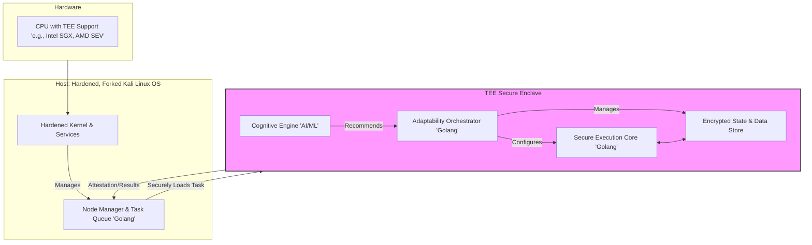
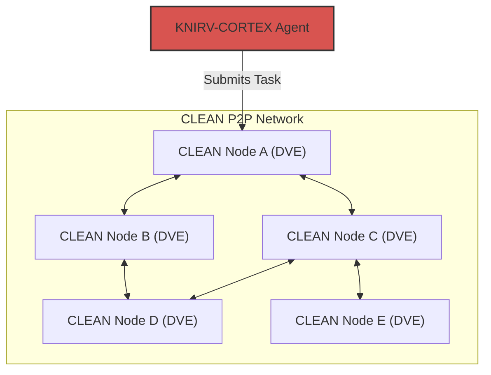
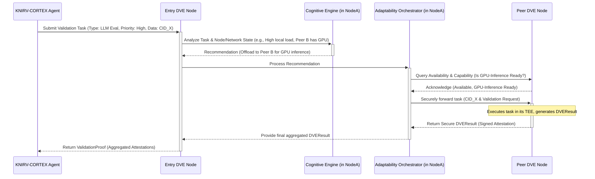

# Whitepaper: KNIRV-NEXUS DVE - The Crucible of Verifiable AI Intelligence
### Powering Trustless Validation, Secure Execution, and Collective Learning in the KNIRV D-TEN

**Version:** 2.0
**Status:** DRAFT
**Date:** July 18, 2025

## Abstract
The integrity and trustworthiness of a self-improving AI ecosystem hinge on the ability to verifiably validate new knowledge and execute sensitive operations in a secure, isolated manner. This whitepaper introduces the **KNIRV-NEXUS Decentralized Validation Environment (DVE)**, a network of specialized, staked computing nodes designed to provide trustless, deterministic, and sandboxed execution environments. DVEs serve as the "crucible of truth" for the KNIRV D-TEN, rigorously testing proposed SkillNodes from KNIRVGRAPH and candidate Base LLM updates for KNIRVCHAIN. They generate cryptographic proofs of execution, enabling KNIRV-CORTEX agents to autonomously contribute to the collective intelligence with verifiable assurance.

At its core, KNIRV-NEXUS DVE embodies the **Cognitive Logistic Execution Adaptability Network (CLEAN)** paradigm. CLEAN servers are uniquely built upon a hardened, forked Kali Linux distribution and implemented in Golang, integrating cognitive AI/ML engines within their Trusted Execution Environments (TEEs). This enables dynamic adjustment of execution strategies, resource allocation, and security protocols in real-time, delivering unparalleled execution adaptability. Powered by NRN token staking (native to KNIRV-ORACLE) and incentivized through a robust reward and slashing mechanism, KNIRV-NEXUS DVEs are fundamental to the D-TEN's security, reliability, and continuous, compounding intelligence.

## 1. Introduction
The promise of self-improving AI agents is immense, but it is inextricably linked to the challenge of trust. How can a decentralized network ensure that newly learned behaviors, proposed solutions, or updated foundational models are genuinely beneficial, free from bugs, and devoid of malicious intent? Traditional centralized testing environments lack the transparency and immutability required for a trust-minimized ecosystem.

The KNIRV-NEXUS DVE layer directly addresses this challenge. It provides a decentralized, cryptographically verifiable infrastructure for validating the integrity and efficacy of AI knowledge. By offering secure, isolated, and deterministic execution environments, DVEs enable KNIRV-CORTEX agents to rigorously test new Skills and Base LLM updates before they are enshrined as canonical knowledge on KNIRVGRAPH and KNIRVCHAIN.

This whitepaper details the architecture, operational mechanics, economic incentives, and security model of KNIRV-NEXUS DVEs, highlighting their pivotal role in fostering a secure, reliable, and continuously evolving decentralized intelligence network.

## 2. The CLEAN Concept: Cognitive Logistic Execution Adaptability Network
The KNIRV-NEXUS DVE is built upon the foundational Cognitive Logistic Execution Adaptability Network (CLEAN) paradigm. CLEAN represents a novel architectural approach for decentralized Trusted Execution Environments, emphasizing intelligent, real-time adaptation.

### 2.1. Core Definition
CLEAN defines a decentralized network of servers, each equipped with a Trusted Execution Environment (TEE) and onboard cognitive capabilities. These nodes are designed to handle a variety of inference-enabled tasks, from complex data analytics and model training to secure smart contract execution. Its defining feature is execution adaptability: the intrinsic ability to dynamically modify execution strategies, resource allocation, and operational parameters based on task requirements, network conditions, and real-time inference.

> **Expanded Information:**
> *   **Decentralized Network of TEEs:** CLEAN nodes form a peer-to-peer mesh, eliminating single points of failure and enabling distributed load balancing. Each node's core logic and sensitive operations are isolated within a hardware-backed TEE enclave, providing a strong guarantee of confidentiality and integrity.
> *   **Onboard Cognitive Capabilities:** Unlike traditional TEEs that operate with fixed protocols, each CLEAN node integrates an AI/ML-driven Cognitive Engine. This engine empowers the node to make intelligent, real-time decisions about task handling, resource management, and security posture.
> *   **Execution Adaptability:** This is the hallmark of CLEAN. It means the network is not rigid but can dynamically adjust its operational methods. This includes:
>     *   **Dynamic Task Allocation:** Routing tasks to the most suitable node based on current load, specialized hardware, and data locality.
>     *   **Resource Scaling:** Adjusting CPU priority, memory allocation, and other resources for optimal performance.
>     *   **Adaptive Inference Models:** Selecting the best-fit ML model from a library for a specific inference task, balancing accuracy and performance.

### 2.2. Differentiation from Existing Paradigms
CLEAN distinguishes KNIRV-NEXUS DVEs from conventional systems by emphasizing holistic operational adaptability and proactive security.

> **Expanded Information:**
> *   **Beyond Static TEEs:** Traditional TEEs offer hardware-level security but typically operate with static, pre-defined execution protocols. CLEAN nodes, with their Cognitive Engine and Adaptability Orchestrator, can dynamically reconfigure their execution strategies in response to evolving workloads and threats.
> *   **Beyond Federated Learning:** While federated learning systems focus on decentralized model training, CLEAN extends this concept to holistic operational adaptability. It not only facilitates learning but also evolves its execution methods in response to new task archetypes, shifting data patterns, and emerging security threats, making the entire network more versatile and resilient.
> *   **Proactive Security Posture:** The unique implementation stack (hardened Kali Linux and GoLang) enables continuous self-auditing and active threat hunting, transforming the network into a self-healing and self-hardening ecosystem.

## 3. Core Responsibilities of KNIRV-NEXUS DVEs within the KNIRV D-TEN
KNIRV-NEXUS DVEs fulfill several critical responsibilities within the KNIRV D-TEN, acting as the primary verification layer for new intelligence and a secure execution environment for KNIRV-CORTEX agents.

### 3.1. Trustless Validation of SkillNodes
DVEs are the primary mechanism for rigorously testing and validating proposed SkillNodes (solutions to NRVs) before they are accepted onto the KNIRVGRAPH and subsequently KNIRVCHAIN.

> **Expanded Information:**
> *   **Deterministic Sandbox Execution:** Each DVE node provides a secure, isolated, and deterministic sandbox environment. This sandbox is crucial because it ensures that a given Skill code, when executed with the same inputs (FailureContext), will always produce the exact same output, regardless of which DVE node performs the validation. This determinism is fundamental for achieving consensus among multiple DVEs.
> *   **Rigorous Test Case Execution:** When a KNIRV-CORTEX agent proposes a SkillNode to resolve an NRV on KNIRVGRAPH, it also provides a set of automated test cases and the original FailureContext. The DVE executes the proposed Skill within its sandbox against these test cases and the FailureContext, verifying its ability to transform the problematic state into a successful one.
> *   **Security & Performance Analysis:** Beyond functional correctness, DVEs also perform static and dynamic analysis of the Skill code to detect malicious behavior, resource exploits, or performance regressions. This ensures that only safe and efficient Skills are integrated into the network.

### 3.2. Verifiable Validation of Base LLM Updates
DVEs are essential for the secure and verifiable evolution of the Base LLM (CodeT5) on KNIRVCHAIN.

> **Expanded Information:**
> *   **Testing Candidate Base LLM Updates:** When a new version of the CodeT5 Base LLM (or a delta update) is proposed (derived from collective learning on KNIRVGRAPH and KNIRV-CORTEXs), DVEs are utilized to rigorously test this candidate model. This involves running comprehensive evaluation suites to ensure the update improves performance, reduces biases, and introduces no new regressions.
> *   **Generating Proofs of Efficacy & Safety:** DVEs generate cryptographic proofs (e.g., attestations signed by the DVE node) of the Base LLM update's efficacy and safety. These proofs are critical for the KNIRVCHAIN's consensus mechanism to accept the new Base LLM version as canonical.

### 3.3. Cryptographic Proof Generation (ValidationProof)
The core output of a DVE's validation process is a cryptographically verifiable proof.

> **Expanded Information:**
> *   **Individual Attestations:** After performing a validation task, each DVE node cryptographically signs an attestation (DVEResult) of its findings (e.g., Skill passed/failed, performance metrics, security scan results).
> *   **Aggregated ValidationProof:** These individual attestations are then aggregated by the requesting KNIRV-CORTEX agent. A supermajority (typically 2/3 or more) of the selected DVE nodes must independently replicate the execution and attest to the same outcome. This collective, signed aggregation forms the ValidationProof, which is then submitted to KNIRVGRAPH and ultimately used by KNIRV-ORACLE to orchestrate canonical SkillNode minting on KNIRVCHAIN.
> *   **zkTLS Integration:** For highly sensitive validation tasks or when dealing with private FailureContext data, DVEs can leverage zkTLS (Zero-Knowledge Transport Layer Security). This allows them to prove that a Skill correctly resolves a problem without revealing the underlying sensitive data from the FailureContext, enhancing privacy during validation.

### 3.4. Secure Backup and Versioning for KNIRV-CORTEXs
DVEs provide a trusted environment for KNIRV-CORTEX agents to securely back up and version their unique, personalized intelligence.

> **Expanded Information:**
> *   **Secure Snapshotting:** KNIRV-CORTEX agents can utilize DVEs to create secure, cryptographically attested snapshots of their internal state, including their learned Rust WASM LoRA adapters, memory, and configuration.
> *   **Verifiable Restoration:** These snapshots can then be stored off-chain (e.g., IPFS) with their hash recorded on KNIRVGRAPH or KNIRVCHAIN. In case of a KNIRV-CORTEX failure or migration, the snapshot can be verifiably restored, ensuring the agent's unique intelligence is preserved.

## 4. Architectural Model & Technical Implementation
The CLEAN architecture is composed of the internal structure of a single CLEAN Node, the network topology, and the specific implementation stack that underpins its security philosophy. A KNIRV-NEXUS DVE is a specialized computing node designed for secure, isolated, and high-performance execution. DVEs are distributed globally and operate autonomously, forming a decentralized network.

### 4.1. Single CLEAN Node Architecture
Each node in the CLEAN network is a self-contained server with a layered architecture designed for security and adaptability. The core logic is isolated within a TEE enclave.

*Figure 2: KNIRV-NEXUS DVE Node Internal Architecture and External Interactions.*

**Key Modules:**
*   **Network Interface:** Handles all incoming requests for validation tasks and outgoing attestations/results.
*   **Request Manager:** Parses incoming validation requests from KNIRV-CORTEXs, fetches necessary resources (Skill code, FailureContext, Base LLM binaries) from IPFS.
*   **Validation Queue:** Manages the queue of validation tasks to be executed.
*   **Secure Execution Environment (Sandbox):** The core of the DVE, providing an isolated, deterministic, and verifiable runtime for executing Skill code or Base LLM tests. This environment can leverage hardware-level Trusted Execution Environments (TEEs) where available.
*   **Compute Core:** The underlying hardware (GPUs, CPUs) that performs the actual computation for executing Skills or running LLM tests within the sandbox.
*   **Proof Generation Module:** Generates cryptographic attestations of the validation results.
*   **Key Management:** Securely manages the DVE node's private keys used for signing attestations.
*   **IPFS Client:** Integrates with the IPFS network to fetch necessary data.
*   **Internal Wallet Manager:** Manages the DVE node's NRN stake and receives NRN rewards (from KNIRV-ORACLE).

### 4.2. Implementation Stack: A Proactive Security Approach
The choice of underlying technology for KNIRV-NEXUS DVEs is a critical architectural decision that reinforces the CLEAN philosophy. Our stack is chosen not for convention, but for its strategic advantages in creating a secure, adaptive, and resilient network.

> **Expanded Information:**
>
> **Base Operating System: A Hardened, Forked Kali Linux Distribution**
> While unconventional for a server environment, we have selected a minimalist, hardened fork of Kali Linux as the base OS for all CLEAN nodes. This is a deliberate choice to embed a proactive, "offense-informs-defense" security posture directly into the network's fabric. Instead of a passive server OS, our custom distribution provides an active security toolkit.
>
> **Advantages of this architecture:**
> *   **Continuous Self-Auditing:** Each CLEAN node can leverage the built-in security toolset to perform automated, continuous vulnerability scans and penetration tests on its peers. This turns the network into a self-healing and self-hardening ecosystem, where nodes actively identify and isolate potential weaknesses in real-time.
> *   **Hardened Core & Minimalist Profile:** Our fork strips Kali Linux of all non-essential packages (e.g., GUI tools), leaving a minimal attack surface. The remaining kernel and services are specifically hardened for a server role, combining the robust security toolchain with a hardened operational environment.
> *   **Advanced Incident Response & Forensics:** In the event a node is compromised or exhibits malicious behavior, designated auditor nodes can use the rich set of forensic tools inherited from Kali to conduct a deep, secure analysis of the incident, facilitating rapid containment and network recovery.
>
> **Core Logic Implementation: Golang (Go)**
> The Node Manager and the core logic within the TEE enclave (Adaptability Orchestrator, Cognitive Engine, Secure Execution Core) are implemented in Golang. Go's design philosophy aligns perfectly with the requirements of a high-performance, concurrent, and secure decentralized system.
>
> **Advantages of using Golang:**
> *   **High Concurrency:** Go's lightweight goroutines and channels are ideal for managing thousands of concurrent network connections, task executions, and internal cognitive processes with exceptional efficiency.
> *   **Performance and Memory Safety:** As a compiled language, Go offers performance approaching that of C++, but with built-in memory safety features that prevent entire classes of common vulnerabilities, a critical feature for code running within a TEE.
> *   **Simplified Secure Deployment:** Go compiles to a single, statically-linked binary with no external dependencies. This dramatically simplifies secure deployment and the remote attestation process, as we only need to verify the hash of a single, self-contained executable.
> *   **Robust Standard Library:** Go's mature libraries for cryptography, networking, and concurrency streamline the development of secure and complex distributed systems.
>
> **Synergy:** The Kali Linux fork and Golang are not competing choices; they are complementary layers. Kali provides the hardened, auditable environment, while Golang provides the performant, secure application that runs within it. This combination ensures that CLEAN is secure from the kernel up to the application logic.

### 4.3. Decentralized Network Topology
CLEAN nodes form a peer-to-peer mesh network, eliminating any single point of failure and enabling distributed load balancing for validation tasks.

*Figure 3: Decentralized Peer-to-Peer Network of KNIRV-NEXUS DVE Nodes.*

### 4.4. Execution Adaptability Workflow
The following sequence diagram illustrates how a task is handled with adaptability within a KNIRV-NEXUS DVE node, demonstrating the interplay between its cognitive and orchestration capabilities.

*Figure 4: Dynamic Execution Adaptability Workflow within KNIRV-NEXUS DVEs.*

## 5. Key Components and Mechanisms of CLEAN
Beyond the architectural structure, the KNIRV-NEXUS DVE's unique capabilities stem from its integrated key components and mechanisms.

### 5.1. Trusted Execution Environments (TEEs)
The foundation of CLEAN is the TEE, providing a hardware-enforced guarantee of confidentiality and integrity for both code and data during execution. This ensures that even a compromised host OS cannot tamper with the operations inside the enclave.

> **Expanded Information:**
> *   **Hardware Isolation:** TEEs (e.g., Intel SGX, AMD SEV, ARM TrustZone) create a secure, isolated execution environment within the CPU. Code and data within the enclave are protected from external software, including the operating system, hypervisor, and other applications.
> *   **Confidentiality:** Data processed within the TEE remains encrypted and inaccessible to unauthorized entities, ensuring privacy for sensitive FailureContext or Base LLM data during validation.
> *   **Integrity:** The integrity of the code running inside the TEE is cryptographically verified upon loading. Any unauthorized modification to the code or data within the enclave will be detected, preventing tampering with validation processes.
> *   **Remote Attestation:** TEEs enable remote attestation, allowing a KNIRV-CORTEX agent (or KNIRVGRAPH/KNIRVCHAIN via KNIRV-ORACLE) to cryptographically verify that a DVE node is running genuine, untampered software within a secure enclave before submitting a validation task.

### 5.2. Cognitive and Inference Capabilities
Each DVE node's Cognitive Engine uses advanced AI/ML algorithms to enable intelligent decision-making, transforming the node from a passive compute unit into an active, adaptive participant.

> **Expanded Information:**
> *   **Analyzes Incoming Tasks:** The Cognitive Engine classifies tasks by type (e.g., Skill validation, Base LLM evaluation, secure computation), complexity, resource requirements (e.g., GPU needed, memory footprint), and priority. This initial analysis informs optimal routing and resource allocation.
> *   **Monitors Node and Network Health:** It continuously tracks real-time system metrics (CPU load, memory usage, network latency, available compute resources, TEE health status) of its own node and monitors the availability and capabilities of peer DVEs in the network.
> *   **Continuously Learns and Recommends:** The Cognitive Engine adapts its recommendation models based on historical performance feedback (e.g., which DVEs successfully completed which tasks most efficiently). It provides real-time recommendations to the Adaptability Orchestrator on how to best handle a task, such as:
>     *   Execute locally vs. offload to a peer.
>     *   Which specific ML model to use for an inference task (from its internal library).
>     *   Optimal resource allocation parameters for the Secure Execution Core.
> *   **AI/ML Models within TEE:** The Cognitive Engine itself can run within the TEE, ensuring the integrity and confidentiality of its decision-making logic and the data it processes.

### 5.3. Execution Adaptability Mechanisms
This is the core innovation of CLEAN, implemented by the Adaptability Orchestrator within the TEE enclave, acting on recommendations from the Cognitive Engine.

> **Expanded Information:**
> *   **Dynamic Task Allocation:** Tasks are intelligently routed to the most suitable DVE node within the network. This routing considers current load, specialized hardware (e.g., presence of GPUs for inference tasks), and data locality (if the task involves large datasets already present on a specific DVE). This optimizes overall network throughput and latency.
> *   **Resource Scaling:** The Adaptability Orchestrator can dynamically adjust computational resources (e.g., CPU priority, memory allocation, GPU utilization) dedicated to the Secure Execution Core based on the task's real-time demands. This prevents resource starvation for critical tasks and ensures efficient utilization.
> *   **Adaptive Inference Models:** For tasks requiring machine learning inference (e.g., a Skill that performs object recognition), the Orchestrator can select from a library of pre-loaded or dynamically loaded models within the TEE, choosing the one that offers the best trade-off between accuracy, performance, and resource consumption for the specific request. This ensures optimal inference quality and efficiency.
> *   **Proactive Threat Response:** Based on Cognitive Engine analysis, the Orchestrator can dynamically adjust security protocols, isolate suspicious tasks, or even initiate a self-healing process if a potential threat is detected within the TEE or its environment.

## 6. Economic Model: NRN Staking, Rewards, and Slashing
The KNIRV-NEXUS DVE layer is secured and incentivized through a robust cryptoeconomic model centered around the NRN token, which is native to KNIRV-ORACLE.

> **Expanded Information:**
> *   **NRN Staking:** To operate a DVE node, operators must stake a substantial amount of NRN tokens. This NRN is native to KNIRV-ORACLE and is locked on the KNIRV-ORACLE blockchain. This stake serves as a commitment to honest behavior and provides a collateral that can be slashed in case of malicious activity or poor performance. The size of the stake can influence the likelihood of being selected for validation tasks.
> *   **Rewards for Honest Validation:** DVE operators earn NRN rewards (from KNIRV-ORACLE's Ecosystem Fund) for successfully and honestly validating Skills and Base LLM updates. Rewards can be proportional to the complexity of the task, the resources consumed, and the DVE's reputation score (managed on KNIRVGRAPH).
> *   **Slashing for Dishonesty/Malice:** If a DVE node is found to be dishonest (e.g., submitting false attestations, attempting to inject malicious code, or consistently failing to perform assigned tasks), a portion of its staked NRN (on KNIRV-ORACLE) will be slashed. This provides a strong economic disincentive against malicious behavior and ensures the integrity of the validation process.
> *   **Reputation System:** DVE nodes maintain an on-chain reputation score (managed on KNIRVGRAPH). This score is dynamically updated based on their performance, honesty, and participation history. Higher reputation DVEs are prioritized for tasks and may earn higher rewards.
> *   **USDC for Operational Costs:** KNIRV-CORTEX agents (or other entities requesting validation) pay a fee (in NRN, which is burned on KNIRV-ORACLE) for DVE services. A portion of this fee, or dedicated USDC disbursements from KNIRV-ORACLE's Faucet, can cover the DVE operator's operational costs (e.g., electricity, hardware depreciation).

## 7. Integration with the KNIRV Ecosystem
KNIRV-NEXUS DVEs are deeply integrated into the KNIRV D-TEN's learning and economic loops, interacting with multiple sovereign layers.

> **Expanded Information:**
> *   **KNIRV-CORTEX (Primary Client):** KNIRV-CORTEX agents are the primary users of DVEs. They rent DVEs to:
>     *   Test proposed SkillNodes for NRV resolution.
>     *   Validate candidate Base LLM updates.
>     *   Generate ValidationProofs for submission to KNIRVGRAPH.
>     *   Securely back up their internal state (LoRAs, memory) in a verifiable manner.
> *   **KNIRVGRAPH (Knowledge Graphchain):** KNIRVGRAPH is the source of ErrorNodes and the destination for SkillNode minting (after DVE validation). KNIRVGRAPH's NRVRegistry tracks the status of NRVs being validated by DVEs. KNIRVGRAPH also manages the DVE node reputation system, which is crucial for DVE selection and reward distribution.
> *   **KNIRVCHAIN (Canonical Intelligence Blockchain):** DVEs provide the crucial proofs for Base LLM updates to be accepted and become canonical on KNIRVCHAIN. They also provide proofs for SkillNodes to be canonically registered on KNIRVCHAIN (orchestrated by KNIRV-ORACLE after KNIRVGRAPH minting).
> *   **KNIRV-ORACLE (NRN Oracle & Orchestrator Blockchain):**
>     *   DVE operators stake NRN on KNIRV-ORACLE.
>     *   KNIRV-ORACLE manages NRN rewards and slashing for DVEs, enforcing cryptoeconomic security.
>     *   KNIRV-ORACLE observes KNIRVGRAPH for verified SkillNodes and orchestrates their canonical minting on KNIRVCHAIN based on DVE proofs.
>     *   KNIRV-ORACLE provides USDC liquidity to cover DVE operational costs (via KNIRV-ROUTERS and the Faucet).
> *   **KNIRV-ROUTERS (Network Connectivity):** KNIRV-ROUTERS facilitate the network traffic between KNIRV-CORTEXs and DVEs, ensuring reliable and efficient communication for validation tasks.
> *   **zkTLS Integration:** The optional use of zkTLS ensures that sensitive FailureContext data can be validated without being revealed, maintaining user and enterprise privacy.

## 8. Security & Trust Model
The KNIRV-NEXUS DVE layer is designed with a robust, multi-faceted security model to ensure trustless validation and protect against various attack vectors, leveraging its unique CLEAN architecture.

> **Expanded Information:**
> *   **Hardware-Level TEEs (Optional but Recommended):** Where available, DVE nodes can leverage hardware-level Trusted Execution Environments (TEEs) such as Intel SGX or ARM TrustZone. These provide a highly isolated and secure enclave for executing Skill code and Base LLM tests, protecting against malicious host attacks or side-channel vulnerabilities.
> *   **Software Sandboxing:** Even without hardware TEEs, DVEs employ robust software-based sandboxing (e.g., containerization, virtual machines) to isolate execution environments, preventing Skills from accessing unauthorized resources or affecting the host system.
> *   **Deterministic Execution:** As detailed, determinism is crucial. It ensures that multiple DVEs, given the same inputs, will produce identical results, allowing for cryptographic verification and detection of dishonest nodes.
> *   **Cryptoeconomic Security (NRN Staking & Slashing):** The substantial NRN stake required for DVE operation (on KNIRV-ORACLE), combined with a strict slashing mechanism, provides a strong economic incentive for honest behavior and a deterrent against collusion or negligence.
> *   **Random Selection & Supermajority Consensus:** Randomly selecting a subset of DVEs for each validation task, combined with requiring a supermajority consensus for the ValidationProof, makes it computationally infeasible for a small group of malicious DVEs to subvert the validation process.
> *   **Public Auditability:** All ValidationProofs are ultimately recorded on KNIRVGRAPH (and referenced by KNIRVCHAIN), allowing for public auditability and retrospective analysis of DVE performance.
> *   **Proactive Security (Kali Linux Fork):** The hardened, forked Kali Linux base OS enables continuous self-auditing, vulnerability scanning, and active threat hunting within the DVE network. This transforms the network into a self-healing and self-hardening ecosystem.
> *   **GoLang for Secure Logic:** The implementation of core logic in GoLang contributes to memory safety and simplifies secure deployment, reducing the attack surface within the TEE.

## 9. Future Roadmap
The KNIRV-NEXUS DVE layer will continuously evolve to meet the growing demands for verifiable AI intelligence within the D-TEN, driven by the CLEAN philosophy.

> **Expanded Information:**
>
> *   **Phase 1 (Initial Mainnet Deployment - Q2 2026):**
>     *   **Focus:** Core DVE node software release, onboarding of initial DVE operators, and integration with KNIRV-CORTEX for SkillNode validation.
>     *   **Staking & Rewards:** Activate NRN staking and basic reward/slashing mechanisms on KNIRV-ORACLE for DVE operators.
>     *   **Goal:** Establish a functional, decentralized network of DVEs capable of providing trustless validation for SkillNodes and Base LLM updates.
> *   **Phase 2 (Advanced Specialization & Resource Management - Q4 2026):**
>     *   **Focus:** Implement more granular DVE specialization (e.g., specific hardware requirements, software libraries).
>     *   **Dynamic Resource Pricing:** Develop a dynamic pricing model for DVE compute resources, allowing KNIRV-CORTEXs to select DVEs based on cost and performance, informed by the Cognitive Engine.
>     *   **Enhanced zkTLS Integration:** Expand zkTLS capabilities for more complex private validation scenarios.
>     *   **Goal:** Optimize DVE resource allocation and expand their utility for diverse AI validation tasks.
> *   **Phase 3 (Formal Verification & ZKP Integration - Q2 2027):**
>     *   **Focus:** Research and integrate formal verification techniques into DVEs to provide mathematical proofs of Skill correctness.
>     *   **Full Zero-Knowledge Proofs:** Explore generating full Zero-Knowledge Proofs of computation (zk-SNARKs/STARKs) for Skill execution within DVEs, allowing KNIRVGRAPH and KNIRVCHAIN to verify Skills with even greater cryptographic assurance and privacy, without re-executing them.
>     *   **Goal:** Elevate the trust model of DVEs to the highest possible level of cryptographic certainty.
> *   **Phase 4 (Decentralized DVE Governance - 2028+):**
>     *   **Focus:** Implement decentralized governance for DVE parameters, including staking requirements, reward rates, slashing conditions, and the addition/removal of specialized DVE types, potentially influenced by KNIRVGRAPH reputation.
>     *   **Reputation-Based Task Assignment:** Develop advanced algorithms for assigning validation tasks based on a DVE's reputation score and historical performance, leveraging the Cognitive Engine for optimal routing.
>     *   **Goal:** Foster a self-governing and highly resilient DVE network, continuously adapting to the D-TEN's needs.

## 10. Conclusion
The KNIRV-NEXUS DVE layer is an indispensable component of the KNIRV D-TEN, serving as the crucible of verifiable AI intelligence. By embodying the Cognitive Logistic Execution Adaptability Network (CLEAN) paradigm, with its unique hardened Kali Linux and GoLang implementation, KNIRV-NEXUS DVEs provide secure, deterministic, and cryptographically attested execution environments. Their integrated Cognitive Engine and Adaptability Orchestrator enable real-time, intelligent adjustment to workloads and threats. This ensures the integrity of SkillNode validation and the continuous, trustworthy evolution of the Base LLM on KNIRVCHAIN. Secured by NRN token staking on KNIRV-ORACLE and incentivized through a robust economic model, KNIRV-NEXUS DVEs empower KNIRV-CORTEX agents to contribute to the collective intelligence with unprecedented levels of trust and reliability. They are fundamental to realizing the vision of a truly self-improving, secure, and decentralized AI ecosystem.

<a href="#/legal/CODE_OF_CONDUCT" class="footer-link">Code of Conduct</a> | <a href="#/legal/PRIVACY_POLICY" class="footer-link">Privacy Policy</a> | <a href="#/legal/TERMS_AND_CONDITIONS" class="footer-link">Terms and Conditions</a>

© 2025 KNIRV Network

