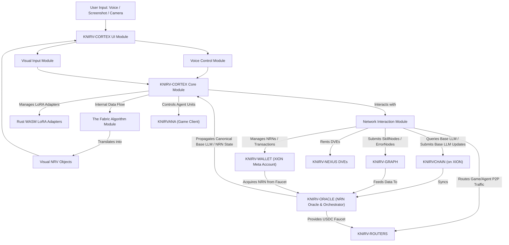
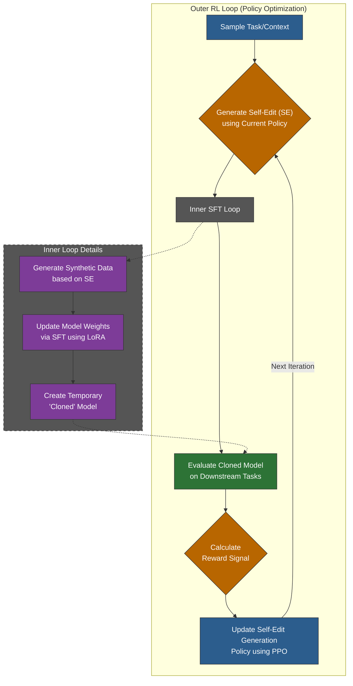
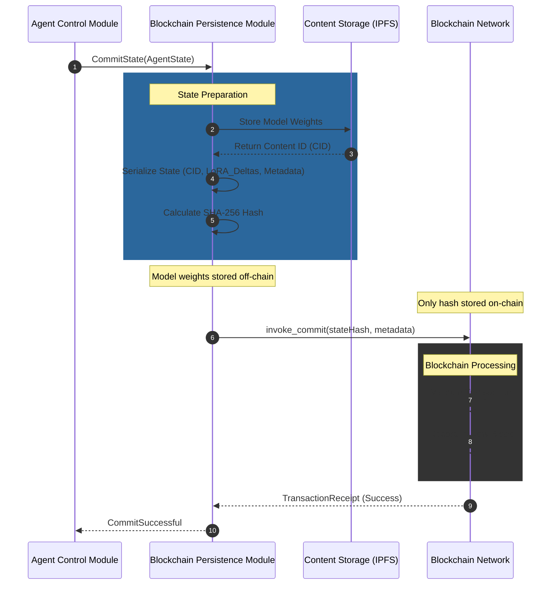
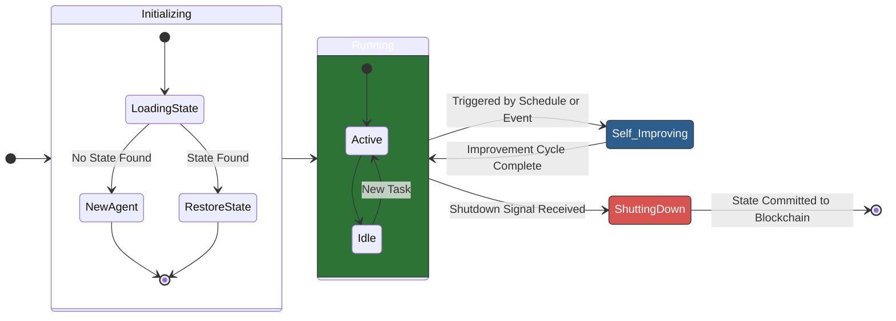

# KNIRV-CORTEX Whitepaper: The Adaptive, Intuitive Intelligence Interface
## Empowering Decentralized AI Agents Through Seamless User Interaction and Continuous Self-Improvement

**Version:** 3.0 (Revised)
**Date:** July 16, 2025
**Author:** G. Perry

## Executive Summary

The current paradigm of artificial intelligence relies on static, pre-trained models that require extensive manual intervention, data collection, and retraining to adapt to new information or tasks. This process is costly, slow, and limits the autonomy of AI systems. This whitepaper presents a comprehensive software design for a Self-Improving AI Agent System, an architecture that enables AI agents to learn and evolve continuously in a computationally efficient manner.

Our design introduces the "**Cognitive Shell**" architecture, a lightweight and adaptable agent framework that operates around a powerful, foundational model. Instead of prohibitively expensive full-model retraining, our agent updates its own small, internal set of adaptive weights. Inspired by the **SEAL (Self-Adapting Language Models)** framework, the agent uses a sophisticated reinforcement learning loop to autonomously refine these weights, which control its behavior, personality, and skills.

Crucially, the **KNIRV-CORTEX** serves a dual purpose:

*   **The User's Primary Interface:** It is the direct, intuitive, voice-controlled point of interaction for users to issue commands and receive abstracted feedback from the entire **KNIRV Network**.
*   **The Cognitive Shell Template:** It is the foundational, self-improving AI agent architecture from which all other specialized agents within the **KNIRV** ecosystem can be forged and spawned.

A key innovation within the **KNIRV-CORTEX** is "**The Fabric**" algorithm, which intelligently translates raw problem inputs (from voice, screenshots, or camera) into visual **Network Resolution Vectors (NRVs)** that users can intuitively map to the **KNIRV-GRAPH** for collective resolution. Furthermore, the **KNIRV-CORTEX** directly controls agent units within **KNIRVANA**, a Real-Time Strategy game that serves as a tangible, experiential interface for decentralized AI management.

This design allows an AI agent to:

*   Autonomously adapt its behavior and responses without modifying the underlying foundational model.
*   Optimize its own performance by fine-tuning its lightweight internal parameters, such as Rust `WASM` `LoRA` "sidecar" adapters and response filters.
*   Ensure operational resilience by committing its compact state to a blockchain, allowing for verifiable recovery and a transparent audit trail of its evolution.
*   Seamlessly interact with users via natural language and intuitive visual cues, abstracting complex multi-layer operations into simple commands.
*   Securely handle sensitive data and orchestrate "out-of-network" tasks by leveraging its internal **Trusted Execution Environment (TEE)** capabilities and spawning specialized sub-agents.
*   Utilize the Base LLM derived from and continuously updated on the **KNIRVCHAIN**, ensuring it operates with the network's collective, evolving intelligence.

This document details this practical and powerful architecture, its core components, and its workflow, positioning this system as a foundational technology for the next generation of intelligent, deployable, and autonomous systems.

## 1. Introduction

### 1.1 The Problem: Static Intelligence

Large Language Models (LLMs) and other foundational models have demonstrated remarkable capabilities. However, their knowledge is frozen at the time of their last training run. Adapting them to new information, correcting inaccuracies, or teaching them new skills is a resource-intensive process known as fine-tuning. This static nature creates several challenges:

*   **Knowledge Staleness:** Models quickly become outdated as the world becomes dynamic.
*   **High Maintenance Costs:** Constant manual data curation and retraining cycles require significant computational resources and expert human labor.
*   **Lack of Autonomy:** Systems cannot independently recover from errors or improve their core competencies based on operational experience.

### 1.2 The Vision: A Continuously Evolving Agent

We envision a system where an AI agent is not merely a tool but a dynamic entity capable of self-improvement. By observing its own performance and interacting with new data, the agent can initiate its own learning cycles, update its internal model (its *"brain"*), and persist these improvements in a secure, verifiable manner. This creates a virtuous cycle of continuous learning, leading to ever-increasing capability and resilience.

### 1.3 Core Concepts

This design synthesizes cutting-edge technologies:

*   **Self-Adapting Language Models (SEAL):** A framework where a model uses reinforcement learning to generate its own *"self-edits"*—natural language instructions for creating synthetic data and performing optimization—to improve its performance on downstream tasks.
*   **Blockchain Technology:** Used not for currency, but as an immutable, distributed ledger. It provides a perfect mechanism for creating a tamper-proof, auditable history of the agent's states (model weights, configurations), ensuring integrity and enabling reliable recovery.
*   **Trusted Execution Environments (TEEs):** Leveraging hardware-level isolation to protect sensitive data and computations from external threats, integrated directly into the core **KNIRV-CORTEX** architecture.
*   **Network Resolution Notice (NRN) Token:** A critical utility token that drives the network's economy by being consumed for Skill invocation and produced for network validation.
*   **XION Layer 1:** Provides the robust, consumer-focused blockchain foundation for the **KNIRVCHAIN** and seamless user interaction.

## 2. Architectural Overview

The system is designed with a modular, decoupled architecture to ensure scalability, maintainability, and clarity. The **KNIRV-CORTEX** is the central orchestrator and user interface, managing its own self-improvement, interacting with the **KNIRV-WALLET** for funding and authorization, and leveraging the **KNIRV-GRAPH** for skill acquisition, all while utilizing the **KNIRVCHAIN** as the source of its Base LLM and Skill registry.

*Figure 1: High-Level System Architecture and Interaction Flow, with KNIRV-CORTEX at the Core.*

**Key Modules:**

*   **KNIRV-CORTEX Core Module:** The central processing unit, managing the SEAL loop, Base LLM interaction, `LoRA` runtime, and orchestrating other modules.
*   **User Interface Module:** Renders the iFrame-like display, manages visual feedback (edge coloring), and handles sliding UI panels.
*   **Voice Control Module:** Processes speech-to-text, intent recognition, and executes voice commands.
*   **Visual Input Module:** Captures screenshots/camera input and pre-processes images for analysis.
*   **"The Fabric" Algorithm Module:** The novel component responsible for transforming raw problems into actionable NRV objects and their visual representation.
*   **Network Interaction Module:** Manages all communication with external KNIRV network layers (**XION**, **KNIRV-GRAPH**, **DVEs**, **KNIRV-WALLET**, **KNIRV-ROUTERS**, **KNIRVANA**).
*   **Rust WASM LoRA Adapters:** The encapsulated, self-improving intelligence units unique to each **KNIRV-CORTEX**.

## 3. Practical Implementation: The Cognitive Shell Architecture

The vision of a fully self-modifying AI model implies immense computational cost. To make this system practical, deployable, and efficient, we introduce a paradigm shift: the agent is not the Large Language Model; it is a lightweight "**Cognitive Shell**" built around it. This **KNIRV-CORTEX** serves as both the user's direct interface to the **KNIRV Network** and the architectural template for all other agents.

This architecture decouples the agent's identity and learned behaviors from the static, foundational LLM it uses for reasoning. The agent exists as a lean executable binary containing its own logic and a set of small, adaptable *"weights."* It interacts with an external LLM (accessible via an API, either in the cloud or running locally) as a tool for knowledge and generation, but the agent's unique personality, skills, and memories are stored and refined within its own shell.

This approach dramatically reduces the computational cost of self-improvement from retraining billions of parameters to fine-tuning a few megabytes of them, making continuous evolution feasible on standard hardware.

### 3.1 Redefining "Weights": The Agent's Malleable Core

Within the **Cognitive Shell**, *"weights"* are not the parameters of the LLM itself. Instead, they are the parameters of small, highly specialized modules that steer the agent's interaction with the LLM. These modules can be combined to achieve sophisticated control over both the input to and output from the foundational model.

*   **The Prompt Strategy Layer:** This layer controls how the agent communicates its intent to the LLM. The agent's weights here are not neural network parameters but are scores or configurations within a dynamic templating system. Based on the task, the agent learns to assemble the optimal prompt by selecting the best preamble ("You are a helpful expert..."), injecting the most relevant few-shot examples from its memory, and specifying the desired output format. The self-improvement loop fine-tune these selection weights to become a master prompt engineer for its own needs.
*   **The Response Refinement Layer:** After receiving a raw response from the LLM, this layer acts as a "quality control" filter. Its weights belong to small, specialized local models within the agent binary. These can include:
    *   Safety Classifiers: To block harmful or inappropriate content.
    *   Fact-Checking Models: To cross-reference claims against a trusted local knowledge base.
    *   Re-ranking Models: To select the best response from several generated options.
    *   Format Enforcers: To ensure the output conforms to a required structure (e.g., `JSON`, `XML`).
    The RL loop updates the weights of these tiny models based on performance, teaching the agent to polish and secure its final output.
*   **The Rust WASM LoRA Sidecar Adapter:** This is the most sophisticated layer, enabling surgical modification of the LLM's behavior without altering its base weights. A Low-Rank Adaptation (`LoRA`) adapter is a small matrix of weights (typically 4-30MB) that can be loaded alongside a compatible LLM at inference time. Our agent can self-program its own `agent_personality.lora` file. By fine-tuning this tiny "sidecar" file, the agent can instill specific skills, a unique communication style, or specialized domain knowledge into the LLM's responses. The self-improvement loop directly updates this `LoRA` file, which represents the pinnacle of the agent's learned identity. Crucially, these `LoRA` adapters are implemented as Rust `WASM` modules, providing a secure and efficient sandbox for their execution within the **KNIRV-CORTEX's** TEE.

These three layers work in concert. The Prompt Layer frames the request, the `LoRA` Sidecar steers the LLM's generation process, and the Refinement Layer ensures the final output is safe, accurate, and well-formed. The agent's evolution is the continuous optimization of the weights across these layers.

### 3.2 User Interaction Layer: The KNIRV-CORTEX as Your Gateway

The **KNIRV-CORTEX** is designed from the ground up to be the intuitive, primary point of interaction for the end-user with the entire **KNIRV Network**. It abstracts away the underlying technical complexities, allowing users to interact naturally.

*   **Voice/Biometric Authentication:** Upon activation (e.g., via a voice command like "Hey KNIRV, activate"), the **KNIRV-CORTEX** securely authenticates the user. This is primarily achieved through local processing of biometric data (e.g., voiceprint recognition, fingerprint scan) on the user's device. Crucially, raw biometric data is never stored; instead, cryptographic representations are derived and securely managed by the **KNIRV-WALLET** integration. This adheres strictly to the "Defense in Depth" principle of the `SECURITY_FRAMEWORK.md`.
*   **Natural Language Understanding & Command Execution:** Leveraging its "**Cognitive Shell**" architecture and integrated LLM capabilities, the **KNIRV-CORTEX** excels at parsing complex user intents from natural language commands (e.g., "I want you to send my mother a birthday cake!"). It uses its Prompt Strategy Layer and `LoRA` adapters to accurately interpret user requests and formulate internal execution plans.
*   **Visual Interface Paradigm (iFrame-like):** The **KNIRV-CORTEX** presents a minimalist, iFrame-like display that can act as an overlay or integrated window. Content is rendered within this "frame."
    *   **Edge Coloring:** Dynamically colored edges of the screen/frame provide subtle, real-time visual feedback on **KNIRV-CORTEX** activity (e.g., green for positive response, red for error, blue for processing).
    *   **Sliding Panels:** Context-sensitive menus, input panels, or information displays smoothly slide out from the invisible edges of the screen/frame when relevant, disappearing when not in use. These panels provide on-screen input methods for complex parameters, confirmations, or text entry when voice is insufficient or inconvenient.
*   **Problem Input & "The Fabric" Integration:** The **KNIRV-CORTEX** integrates a powerful multi-modal input system for problem identification.
    *   **Multi-Modal Input:** It can receive problem inputs from voice commands ("This isn't working"), screenshots (captured from within its iFrame or device-wide), and device camera input.
    *   **TensorFlow Interpretation:** An embedded `TensorFlow` (or similar ML framework) model is utilized to interpret captured images/video, identifying objects, text (via OCR), contexts, and potential anomalies, translating visual information into structured data.
    *   **"The Fabric" Algorithm:** This pivotal algorithm:
        *   Receives raw error, obstacle, and problem inputs (from visual analysis, voice commands, or system logs).
        *   Contextualizes them using the **KNIRV-CORTEX's** Base LLM and `LoRA` to synthesize a coherent problem description.
        *   Translates these inputs into structured **Network Resolution Vectors (NRVs)**, capturing context, severity, and potential solution paths.
        *   Renders these **NRVs** as dynamic visual objects within the **KNIRV-CORTEX's** iFrame display (e.g., interactive icons, bounding boxes highlighting errors), allowing the user to see the problem directly overlaid on the problematic content.
        *   Facilitates an intuitive visual or voice-controlled mechanism for the user to "map" these local **NRV** objects to the **KNIRV-GRAPH**, thereby submitting them as `ErrorNodes` for collective resolution.
        *   Enables users to visually assign pretrained **KNIRV-CORTEX** agent units (from **KNIRVANA** or a general network pool) to resolve specific **NRV** objects, initiating Skill invocation and **NRN** consumption.

### 3.3 Sub-Agent Spawning and Orchestration

The **KNIRV-CORTEX** is not a monolithic entity; it is designed for dynamic adaptability, including the ability to spawn specialized sub-agents when needed. These sub-agents are lightweight, temporary instances of the cognitive shell architecture, designed for highly focused tasks.

**Purpose of Sub-Agents:**

*   **Highly Focused:** Sub-agents are created for single, specific tasks, often those requiring interaction with external, "out-of-network" services (e.g., interfacing with a particular e-commerce API, processing a specific data format, sending an email).
*   **Ephemeral:** They are typically created for the duration of a specific task and then securely terminated, minimizing their attack surface.
*   **Securely Isolated:** Each sub-agent operates with highly granular, time-bound internal permissions from the parent **KNIRV-CORTEX**. This adherence to the "Fail-Safe Defaults" principle ensures they only perform actions absolutely necessary for their delegated task.

**Internal Delegation (UDCs for Sub-Agents):** The **KNIRV-CORTEX** enforces granular control by issuing "internal User Delegation Certificates (UDCs)" to its spawned sub-agents. These UDCs are cryptographically signed by the parent **KNIRV-CORTEX** itself, acting within the bounds of its own UDCs received from the human user. This ensures a verifiable chain of authorization from the user, through the **KNIRV-CORTEX**, to any sub-agent it spawns.

### 3.4 Sensitive Data Handling within KNIRV-CORTEX's TEE

A core design feature of the **KNIRV-CORTEX** is its inherent capability to act as a **Trusted Execution Environment (TEE)** for sensitive operations. This means that the **KNIRV-CORTEX** can securely access, process, and temporarily store highly sensitive user data without exposing it to the broader operating system or external threats.

*   **Secure Data Access:** When a task requires sensitive information (e.g., payment credentials, personal addresses, API keys for external services), the **KNIRV-CORTEX** accesses this data from its encrypted local storage.
*   **In-TEE Decryption & Processing:** The decryption and subsequent processing of this sensitive data occur entirely within the **KNIRV-CORTEX's** hardened TEE environment. This hardware-backed isolation protects the data from unauthorized access or modification, even if the surrounding system is compromised. This is a direct implementation of "Defense in Depth."
*   **Ephemeral Nature:** Sensitive data is decrypted only when strictly necessary for a task and is immediately disposed of from memory once the operation is complete. It is never persisted in an unencrypted state outside the **KNIRV-CORTEX's** TEE.
*   **DVE Distinction:** This internal TEE capability of the **KNIRV-CORTEX** means that complex, sensitive transactions (like those involving external payment gateways) do not require dispatching the execution to a separate **KNIRV-NEXUS DVE** for the purpose of protecting the sensitive data in transit or at rest during the transaction. **KNIRV-NEXUS DVEs** retain their critical roles for **KNIRV-CORTEX** backups and versioning, validated updates, and **KNIRV-GRAPH** error resolution simulations.

## 4. Core Component Deep Dive

### 4.1 Self-Adapting Learning Engine

Operating within the **Cognitive Shell**, this is the cognitive core of the agent, responsible for all learning and adaptation. It implements the **SEAL** framework to update the agent's internal adaptive weights. This engine also orchestrates the acquisition of `SkillNodes` from **KNIRV-GRAPH** when the **KNIRV-CORTEX** identifies a need for new capabilities, such as an "online cake ordering" skill in a real-world scenario.

*Figure 2: The Nested Reinforcement Learning Loop of the Self-Adapting Learning Engine.*

**Reinforcement Learning (RL) Loop Explained:**

*   **State:** The current task or knowledge context presented to the agent.
*   **Action:** The generation of a "self-edit" (SE). An SE is a structured natural language string that now directs the update of the agent's internal layers, e.g., `{"instruction": "Refine the agent's LoRA adapter to be more concise in Python code explanations.", "synthetic_data_prompt": "Generate 5 examples of complex Python functions and their concise one-line docstrings."}`.
*   **Policy:** The LLM itself acts as the policy network, optimized to generate the most effective self-edits. We use Proximal Policy Optimization (PPO) in the outer loop for its stability and sample efficiency.
*   **Reward:** The reward is a function of the performance improvement of the updated (cloned) model on a held-out evaluation dataset. For example, `Reward = (New_Accuracy - Old_Accuracy) - λ * (Computational_Cost)`, where λ is a regularization parameter to penalize resource-intensive updates.

**Supervised Finetuning (SFT) within the Shell:** This is the critical, low-cost "inner loop." Instead of cloning and retraining a massive model, the agent performs one of the following efficient updates:

*   Adjusting the configuration weights of its Prompt Strategy Layer.
*   Performing a few training steps on its local Response Refinement Layer models.
*   Fine-tuning its Rust `WASM` `LoRA` Sidecar Adapter file using the synthetically generated data.

This process is thousands of times more efficient than full model finetuning, making continuous, rapid self-improvement a reality. The **KNIRV-CORTEX** trains its `LoRA` adapters on the Base LLM obtained from the **KNIRVCHAIN**, ensuring its individual intelligence builds upon the collective.

### 4.2 Blockchain Persistence Module

This module ensures the agent's evolution is permanent and trustworthy. Using a simple database is insufficient, as it lacks immutability and a built-in audit trail. This module is closely integrated with the **KNIRVCHAIN** for transaction finality and secure record-keeping.

**Why Blockchain?**

*   **Immutability:** Once a state is committed to the blockchain, it cannot be altered or deleted, preventing accidental corruption or malicious tampering.
*   **Auditability:** Every version of the agent (its weights, the data it trained on) is recorded in a chronological chain of blocks. This allows for perfect "explainability" of the agent's evolution, supporting "Continuous Monitoring" as per the `SECURITY_FRAMEWORK.md`.
*   **Decentralization (Future-Proofing):** While a permissioned chain is a good start, this design paves the way for multi-agent systems where agents can share and verify knowledge on a common, trusted ledger, leveraging **KNIRVCHAIN's** Agent Registration and Credentialing capabilities.

**State Commitment Process:**

*Figure 3: Sequence Diagram for Committing Agent State to the Blockchain.*

**Smart Contracts:** Simple smart contracts are deployed on the blockchain (e.g., Hyperledger Fabric Chaincode or an Ethereum contract) to manage the state logic. Key functions include:

*   `commitState(stateHash, metadata)`: Adds a new state hash to the ledger.
*   `getLatestState()`: Returns the hash and metadata of the agent's most recent version.
*   `getStateByVersion(versionID)`: Retrieves a specific historical state.

### 4.3 Agent Control Module

This module is the agent's "operating system," managing its lifecycle from birth to shutdown and recovery. It coordinates all interactions, including **KNIRV-WALLET** integration for **NRN** funding and transaction signing, **KNIRV-GRAPH** for skill discovery, and leveraging **KNIRV-NEXUS DVEs** for specific tasks.

**Agent Lifecycle State Machine:**

*Figure 4: Agent Lifecycle State Transition Diagram.*

**Responsibilities:**

*   **Orchestration:** Coordinates the workflow between the Learning Engine, the Persistence Module, the **KNIRV-WALLET**, **KNIRV-GRAPH**, and **KNIRV-NEXUS DVEs**.
*   **Scheduling:** Decides when to trigger a self-improvement cycle (e.g., on a timer, after a certain number of failed tasks, or when new data is detected).
*   **Resource Management:** Monitors computational resource usage (GPU, CPU) to prevent runaway learning loops.
*   **Safety and Shutdown:** Provides a "kill switch" to gracefully shut down the agent, ensuring the final state is committed before termination.
*   **Sub-Agent Management:** Manages the spawning, lifecycle, and secure termination of specialized sub-agents.
*   **KNIRV-WALLET Integration:** Requests **KNIRV-WALLET** for **NRN** transactions (e.g., skill acquisition, payments for external services) and for signing on-chain transactions or authenticated requests using the agent's private key. The **KNIRV-WALLET** validates these requests against User Delegation Certificates (UDCs).

## 5. Cost-Benefit Analysis

The **Cognitive Shell** architecture fundamentally alters the cost-benefit equation, transforming this system from a theoretical research project into a viable and cost-effective product.

### 5.1 Cost Analysis

*   **Development & R&D Costs:**
    *   **Talent:** Requires highly specialized personnel, including AI/ML research scientists, RL experts, blockchain developers, and MLOps engineers.
    *   **Prototyping:** Significant initial investment in building and testing the core frameworks.
*   **Infrastructure Costs:**
    *   **Compute:** This is drastically reduced. Instead of requiring a fleet of high-end GPUs for constant retraining, the self-improvement loop for the **Cognitive Shell** can run efficiently on a single GPU or even a high-performance CPU. The primary compute cost is shifted to inference calls to the foundational LLM, which is an operational expense rather than a massive capital expenditure on training hardware.
    *   **Blockchain Nodes:** Hosting and maintaining nodes for the permissioned blockchain network (**KNIRVCHAIN**). While less intensive than GPU training, this requires reliable, secure infrastructure.
    *   **KNIRV-NEXUS DVEs:** Maintaining the infrastructure for **KNIRV-NEXUS DVEs** for secure backups, versioning, and error resolution simulations.
    *   **Storage:** Storage requirements are minimal. Instead of storing petabytes of full model checkpoints, the system only needs to store tiny `LoRA` files and configuration states (megabytes per version), making the blockchain a perfectly feasible repository for the agent's entire evolutionary history.
*   **Operational Costs:**
    *   **Energy:** The energy consumption for self-improvement is reduced by orders of magnitude, aligning with sustainable and green computing principles.
    *   **Monitoring & Maintenance:** 24/7 monitoring of the agent's behavior, blockchain health, and infrastructure is critical.

### 5.2 Benefit Analysis

*   **Quantitative Benefits:**
    *   **Reduced Labor Costs:** Drastically cuts down on the human hours needed for manual data labeling, model retraining, and deployment.
    *   **Increased Operational Efficiency:** The agent can handle a wider variety of tasks and adapt to new ones with minimal downtime.
    *   **Performance Gains:** The continuous improvement loop leads to measurable increases in accuracy, speed, and other KPIs over time.
*   **Qualitative & Strategic Benefits:**
    *   **Autonomy & Resilience:** The system can operate, learn, and recover independently, making it ideal for mission-critical, 24/7 applications. The **KNIRV-CORTEX's** internal TEE capabilities enhance this significantly.
    *   **Competitive Advantage:** An organization with self-improving AI can adapt to market changes, customer needs, and new information faster than competitors relying on static models.
    *   **Verifiable Trust:** The blockchain ledger provides an irrefutable audit trail of the agent's learning history, crucial for regulatory compliance, diagnostics, and building trust in the AI's decisions. User Delegation Certificates enhance this trust by providing a clear chain of authorization.
    *   **Knowledge Compounding:** The agent accumulates and compounds knowledge, creating an invaluable, ever-growing intellectual asset.
    *   **Enhanced User Experience:** The **KNIRV-CORTEX's** natural language and visual interface, coupled with abstraction of complexity, make advanced AI capabilities accessible to a wider audience, fostering greater adoption and enabling direct interaction with agent units in **KNIRVANA**.

### 5.3 Return on Investment (ROI) Summary

The **Cognitive Shell** architecture delivers the strategic benefits of a self-improving AI without the prohibitive costs. The ROI is accelerated, as the initial investment is lower and the path to a deployed, value-generating agent is significantly shorter.

## 6. Technical Stack and Implementation Details

*   **Core Logic & LoRA:** `Rust` for high performance, memory safety, and secure execution of **KNIRV-CORTEX** core logic and `LoRA` adapters as `WASM` modules.
*   **Machine Learning Framework:** `PyTorch` for flexibility in custom RL loops and `TensorFlow` (or similar) for embedded visual input interpretation.
*   **Reinforcement Learning Library:** `RLlib` (part of Ray) for scalability and support for various RL algorithms like `PPO`.
*   **Base LLM Source:** The Base LLM is sourced directly from the **KNIRVCHAIN** (`CosmWasm` on `XION`), ensuring it's the latest, consensus-validated version of the collective intelligence.
*   **Blockchain Interaction:** `XION` SDKs for interacting with **KNIRVCHAIN** (`CosmWasm` contracts) and **KNIRV-WALLET** (Meta Accounts, gasless transactions).
*   **Serialization Format:** `Protobuf` (Protocol Buffers) for efficient data serialization.
*   **Adapter Modules:** Hugging Face's `peft` library (or a `Rust` equivalent) for `LoRA` adapter implementation.
*   **Off-chain Storage:** `IPFS` (InterPlanetary File System) for storing Base LLM model files and `SkillNode` `WASM` binaries, referenced by CIDs on **KNIRVCHAIN**.
*   **Trusted Execution Environments:** The **KNIRV-CORTEX** will leverage underlying OS and hardware-level TEE capabilities (e.g., `Intel SGX`, `ARM TrustZone`) for its internal secure data handling. **KNIRV-NEXUS DVEs** provide robust, verifiable environments for **KNIRV-CORTEX** backups, versioning, and **KNIRV-GRAPH** error resolution simulations.
*   **Game Client:** `Globulation2` source code fork for **KNIRVANA**, enabling direct integration and control of agent units by the **KNIRV-CORTEX**.

## 7. Security, Governance, and Ethical Considerations

A self-modifying system demands robust safeguards. The `SECURITY_FRAMEWORK.md` provides foundational principles for this.

*   **Security:**
    *   **Guardrails on Self-Edits:** Implement semantic classifiers to detect and block potentially malicious or degenerative self-edits.
    *   **Blockchain Security:** Inherits **XION's** robust security for **KNIRVCHAIN** operations.
    *   **TEE Hardening:** Ensure the **KNIRV-CORTEX's** internal TEE and **KNIRV-NEXUS DVEs** are robustly hardened.
    *   **Granular Authorization:** User Delegation Certificates (UDCs) at both user-to-**KNIRV-CORTEX** and **KNIRV-CORTEX**-to-sub-agent levels provide multi-layered cryptographic authorization.
    *   **Authentication:** Robust voice/biometric authentication for user access, with local cryptographic processing of biometric data.
    *   **The Fabric Security:** Rigorous input sanitization for voice and visual inputs to prevent malicious commands or data injections.
    *   **zkTLS:** Secure all sensitive network communications.
    *   **NRN Utility:** The **NRN** burning mechanism for Skill invocation adds a layer of economic security and prevents spam.
*   **Governance:**
    *   **Human-in-the-Loop:** A governance council or human overseer should have the ultimate authority to approve or reject major evolutionary steps, set high-level objectives, and activate the shutdown mechanism.
    *   **Objective Function Control:** The reward function must be carefully designed and audited to ensure it aligns with organizational goals and ethical principles.
*   **Ethics:**
    *   **Bias Amplification:** Regular audits of the model's behavior against fairness metrics are essential.
    *   **Transparency:** The blockchain ledger provides transparency into what changed, but explainable AI (XAI) techniques will still be needed to understand *why* the agent made a particular self-edit.
    *   **Privacy by Design:** Emphasize the local, encrypted storage of sensitive user data and the minimal, ephemeral use of decrypted information within TEEs.

## 8. Future Extensions and Roadmap

*   **Deeper KNIRVANA Integration:** Explore more advanced ways **KNIRV-CORTEXs** can interact with and influence **KNIRVANA** gameplay, potentially generating game content, evolving game mechanics, or creating new game modes based on learned Skills.
*   **Multi-Agent Collaboration:** Extend the architecture to support a network of **KNIRV-CORTEX** instances and other forged agents. The **KNIRVCHAIN** becomes a shared ledger of verified knowledge, allowing agents to learn from each other's validated improvements.
*   **Federated Learning Integration:** Combine this system with federated learning. Self-improvement (**SEAL**) happens on-device (at the edge), and the blockchain is used to orchestrate the aggregation of privacy-preserving model updates from a fleet of agents.
*   **Meta-Learning for Self-Improvement:** Introduce a higher-level meta-learning loop that optimizes not just the self-edits, but the entire self-improvement process.
*   **Cross-Domain Adaptation:** Develop more sophisticated reward models and self-edit generation policies that enable the agent to generalize its learning process to entirely new and unseen domains.
*   **Adaptive UI/UX:** The **KNIRV-CORTEX's** UI dynamically adapting its layout and interaction patterns based on user behavior and current task context.

## 9. Conclusion

The Self-Improving AI Agent System detailed in this document represents a paradigm shift from static intelligence to dynamic, continuous learning. By introducing the **Cognitive Shell** architecture as the **KNIRV-CORTEX**, we make this vision practical and deployable, serving as both the user's intuitive interface and the core template for all agents.

By marrying the adaptive power of the **SEAL** framework with the immutable resilience of **KNIRVCHAIN** (on **XION**), grounding it in the efficiency of Rust `WASM` `LoRA` sidecar adapters and intelligent filtering, and crucially integrating internal **TEE** capabilities for secure sensitive data handling and "**The Fabric**" algorithm for intuitive problem resolution, we lay the architectural groundwork for truly autonomous systems that are both powerful and economical. This system is not just an incremental improvement; it is a foundational platform for building the resilient, intelligent, and trustworthy AI of tomorrow, capable of running anywhere from a server to an edge device, and directly experienced through the immersive world of **KNIRVANA**.