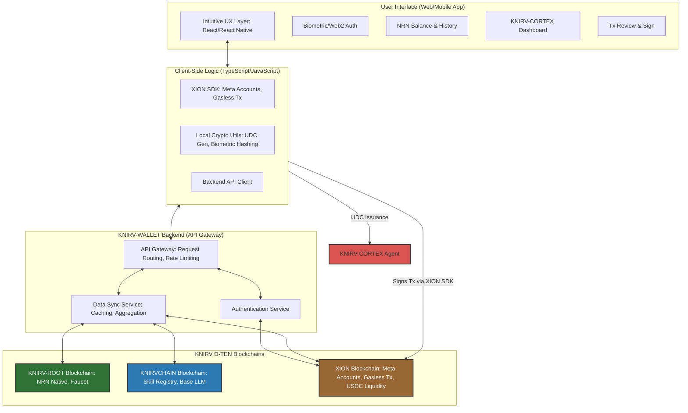

# Whitepaper: KNIRV-WALLET - The Seamless Gateway to Decentralized AI
### Empowering User Interaction with the KNIRV D-TEN through Abstraction and Intuitive Design

**Version:** 1.0
**Status:** DRAFT
**Date:** July 19, 2025

## Abstract
The widespread adoption of decentralized AI ecosystems is often hindered by complex blockchain interactions, intimidating security protocols, and fragmented user experiences. This whitepaper introduces the **KNIRV-WALLET**, a revolutionary digital wallet designed to be the intuitive and secure gateway to the entire KNIRV Decentralized Trusted Execution Network (D-TEN). Leveraging XION's Meta Accounts and native gasless transactions, the **KNIRV-WALLET** abstracts away blockchain complexities, providing a seamless, Web2-like experience for managing NRN tokens (native to KNIRV-ROOT), interacting with KNIRV-CORTEX agents, and participating in the KNIRVANA game. It prioritizes user-centric design, robust security through User Delegation Certificates (UDCs) and biometric authentication, and real-time insights into the NRN economy, making decentralized AI accessible to everyone.

## 1. Introduction
The vision of a self-improving, decentralized AI network like the KNIRV D-TEN is ambitious, but its success ultimately depends on user accessibility. Traditional cryptocurrency wallets, while powerful, often present significant barriers to entry for mainstream users due to seed phrases, complex transaction fees, and a steep learning curve. This friction impedes adoption and limits the potential reach of decentralized applications.

The **KNIRV-WALLET** is engineered to dismantle these barriers. It is not merely a token holder; it is the user's personal control center for their KNIRV-CORTEX agents, their NRN tokens, and their engagement with the entire D-TEN. By prioritizing a seamless user experience, robust security, and intelligent abstraction, the **KNIRV-WALLET** transforms complex blockchain interactions into intuitive actions, making decentralized AI a tangible reality for a broad audience.

This whitepaper details the **KNIRV-WALLET's** architecture, its core features, its deep integration with XION's generalized abstraction layer, its role in the NRN economy, and its pivotal position as the user's trusted interface to the world of KNIRV.

## 2. Core Responsibilities
The **KNIRV-WALLET** serves as the user's primary interface and secure custodian within the KNIRV D-TEN, fulfilling several critical responsibilities.

### 2.1. Seamless User Authentication & Account Management
The **KNIRV-WALLET** prioritizes a frictionless and secure onboarding and authentication experience, leveraging modern web authentication standards.

**Expanded Information:**
*   **XION Meta Accounts:** The **KNIRV-WALLET** is built upon XION's innovative Meta Accounts, which abstract away the complexities of traditional blockchain accounts. Users can create and manage their **KNIRV-WALLET** using familiar Web2 authentication methods (e.g., email, social logins, biometric data) without needing to manage seed phrases or private keys directly. This dramatically lowers the barrier to entry for non-crypto native users.
*   **Biometric Authentication:** The **KNIRV-WALLET** integrates local biometric authentication (e.g., fingerprint, facial recognition, voiceprint via KNIRV-CORTEX). Crucially, raw biometric data is processed locally on the user's device, and only cryptographic hashes or secure enclaves are used for verification. This ensures privacy while providing a highly convenient and secure login method.
*   **Account Recovery:** Meta Accounts offer flexible and secure account recovery options, mitigating the risk of lost funds due to forgotten seed phrases, a common pain point in traditional crypto.

### 2.2. NRN Token Management & Transaction Abstraction
The **KNIRV-WALLET** provides intuitive management of NRN tokens and abstracts away the complexities of blockchain transactions.

**Expanded Information:**
*   **NRN Balance & History:** Users can view their NRN token balance (native to KNIRV-ROOT, with wrapped versions on XION for UX) and a clear transaction history, including NRN acquisitions, transfers, and burns (for Skill invocation).
*   **Gasless Transactions (via XION):** Leveraging XION's native gasless transaction capabilities, users can perform NRN transfers and interact with KNIRVCHAIN (via KNIRV-ROOT orchestration) without needing to acquire and manage separate gas tokens. This eliminates a major source of friction and confusion for users.
*   **Simplified NRN Acquisition:** The **KNIRV-WALLET** provides a direct, intuitive interface to acquire NRN tokens from the KNIRV-ROOT Faucet using USDC (primarily facilitated via XION). This streamlines the process of onboarding new users into the NRN economy.
*   **NRN Burning Visibility:** While NRN burning for Skill invocation occurs on KNIRV-ROOT (triggered by KNIRVCHAIN), the **KNIRV-WALLET** provides clear, real-time feedback to the user, showing when their NRNs are consumed and for what purpose, making the economic utility transparent.

### 2.3. KNIRV-CORTEX Agent Orchestration & Control
The **KNIRV-WALLET** serves as the secure control center for a user's KNIRV-CORTEX agents.

**Expanded Information:**
*   **Agent Pairing & Management:** Users can securely pair their **KNIRV-WALLET** with their KNIRV-CORTEX instances. This allows for centralized management of multiple KNIRV-CORTEX agents from a single interface.
*   **User Delegation Certificates (UDCs):** The **KNIRV-WALLET** is the source of truth for User Delegation Certificates (UDCs). When a user issues a command to their KNIRV-CORTEX (e.g., "Send my mother a birthday cake!"), the **KNIRV-WALLET** generates a cryptographically signed UDC. This UDC grants the KNIRV-CORTEX specific, time-bound permissions to execute actions on the user's behalf (e.g., make payments, access specific data). This adheres to the principle of least privilege and provides a verifiable audit trail of agent actions.
*   **Agent Status & Activity:** The **KNIRV-WALLET** provides a dashboard for users to monitor the status and activity of their KNIRV-CORTEX agents, including ongoing tasks, NRN consumption, and Skill invocations.

### 2.4. Secure Transaction Signing & Authorization
All critical actions requiring cryptographic authorization are securely managed by the **KNIRV-WALLET**.

**Expanded Information:**
*   **Abstracted Signing:** Users sign transactions (e.g., NRN transfers, UDC issuance) through intuitive prompts within the **KNIRV-WALLET** interface, without directly handling complex cryptographic keys. This abstraction is made possible by XION's Meta Accounts.
*   **Multi-Factor Authentication (MFA):** The **KNIRV-WALLET** supports various MFA methods (e.g., biometric, hardware keys, email/SMS codes) for high-value transactions or sensitive operations, enhancing security.
*   **Transaction Review:** Before signing, the **KNIRV-WALLET** presents a clear, human-readable summary of the transaction details, allowing users to review and confirm their intent.

## 3. Architectural Model & Technical Implementation
The **KNIRV-WALLET** is designed as a secure, responsive, and cross-platform application, leveraging modern web technologies and XION's underlying infrastructure.

### 3.1. Layered Architecture
The **KNIRV-WALLET** follows a client-server architecture, with a strong emphasis on client-side security and abstraction.

*Figure 2: KNIRV-WALLET's Layered Architecture and Integration with the KNIRV D-TEN.*

**Key Components:**
*   **User Interface (UI):** Built with modern frontend frameworks (e.g., React for web, React Native for mobile) for a responsive, intuitive, and visually appealing experience.
*   **Client-Side Logic:** Contains the core application logic, including the XION SDK integration for Meta Accounts and gasless transactions, and local cryptographic utilities for UDC generation and biometric hashing.
*   **KNIRV-WALLET Backend (API Gateway):** A lightweight backend service that acts as an API gateway, routing requests, handling authentication, and aggregating data from various KNIRV D-TEN blockchains for efficient display in the UI. This backend is primarily for data aggregation and routing, not for sensitive key management.
*   **KNIRV D-TEN Blockchains:** The core decentralized infrastructure that the wallet interacts with: KNIRV-ROOT (for native NRN), KNIRVCHAIN (for SkillRegistry), and XION (for Meta Accounts, gasless transactions, and USDC liquidity).

### 3.2. XION's Generalized Abstraction Layer
The **KNIRV-WALLET** deeply integrates with XION's protocol-level abstractions, which are key to its user-friendliness.

**Expanded Information:**
*   **Meta Accounts:** XION's Meta Accounts allow users to interact with blockchain applications using familiar authentication methods (email, social logins, biometrics) without the complexities of traditional private keys or seed phrases. The **KNIRV-WALLET** leverages this to provide a truly seamless onboarding experience.
*   **Gasless Transactions:** XION's native gasless transaction feature enables users to perform operations (like sending NRNs or invoking Skills via KNIRVCHAIN) without needing to pay gas fees directly. This significantly reduces friction and makes the D-TEN more accessible to a broader audience. The gas fees are typically sponsored by the protocol or dApp.
*   **Account Abstraction:** XION's account abstraction allows for flexible account logic, enabling features like multi-sig wallets, spending limits, and custom recovery mechanisms, all managed through the **KNIRV-WALLET's** intuitive interface.

### 3.3. Secure UDC Generation and Management
User Delegation Certificates (UDCs) are central to the **KNIRV-WALLET's** security model for agent control.

**Expanded Information:**
*   **Purpose:** UDCs are cryptographically signed tokens issued by the **KNIRV-WALLET** that grant a KNIRV-CORTEX agent specific, time-bound permissions to act on the user's behalf. This ensures that KNIRV-CORTEX agents operate within strict, auditable boundaries defined by the user.
*   **Granular Permissions:** UDCs can specify highly granular permissions, such as "allow KNIRV-CORTEX X to spend up to 50 NRN for Skill invocations related to 'travel booking' for the next 24 hours."
*   **On-Demand Issuance:** UDCs are typically generated on-demand by the **KNIRV-WALLET** when a user issues a command to their KNIRV-CORTEX that requires external interaction (e.g., NRN transfer, Skill invocation).
*   **Cryptographic Signature:** Each UDC is cryptographically signed by the user's **KNIRV-WALLET** (via their XION Meta Account), providing an undeniable proof of authorization. This signature is verifiable on-chain (e.g., by KNIRV-ROOT or KNIRVCHAIN smart contracts) when the KNIRV-CORTEX attempts to execute an action.
*   **Revocation:** Users can revoke UDCs at any time through their **KNIRV-WALLET**, immediately canceling the agent's permissions.

## 4. Integration with the KNIRV Ecosystem
The **KNIRV-WALLET** is the central user touchpoint, deeply integrated with all major layers of the KNIRV D-TEN.

**Expanded Information:**
*   **KNIRV-CORTEX:** The **KNIRV-WALLET** is the control panel for KNIRV-CORTEX agents. It issues UDCs, monitors agent activity, and provides the interface for KNIRV-CORTEXs to acquire NRNs for Skill invocation.
*   **KNIRV-ROOT Blockchain:** The **KNIRV-WALLET** directly interacts with KNIRV-ROOT for canonical NRN balance inquiries, NRN acquisition from the Faucet, and to observe NRN burning events triggered by Skill invocations.
*   **KNIRVCHAIN Blockchain:** The **KNIRV-WALLET** allows users to view the SkillRegistry and the Base LLM versions on KNIRVCHAIN. When a KNIRV-CORTEX invokes a Skill on KNIRVCHAIN, the **KNIRV-WALLET** facilitates the NRN payment (which is then burned on KNIRV-ROOT).
*   **XION Blockchain:** XION is the foundational layer for **KNIRV-WALLET's** user experience. It provides Meta Accounts for simplified authentication and account management, and enables gasless transactions for seamless NRN operations. USDC liquidity for the KNIRV-ROOT Faucet also flows through XION.
*   **KNIRVANA (Game Client):** The **KNIRV-WALLET** is integrated directly into KNIRVANA, allowing players to manage their NRNs for in-game Skill invocations by their agent units. It provides a real-time view of NRN consumption during gameplay and simplifies the acquisition of NRNs for continued play.
*   **KNIRV-ROUTERS & KNIRV-NEXUS DVEs:** While not directly interacting, the **KNIRV-WALLET** indirectly benefits from these layers by providing the NRNs that fund their operations and ensure network integrity and verifiable computation.

## 5. Security & Trust Model
The **KNIRV-WALLET** employs a multi-layered security approach, combining cutting-edge blockchain features with robust application-level safeguards.

**Expanded Information:**
*   **XION's Protocol-Level Security:** Inherits the security of XION's underlying blockchain for Meta Accounts and transaction processing.
*   **Decentralized Key Management (Abstracted):** While users don't directly handle private keys, the underlying cryptographic security is maintained through XION's secure key management infrastructure, which can support multi-party computation (MPC) or secure enclaves.
*   **Biometric & Multi-Factor Authentication:** Local biometric processing and support for various MFA methods significantly enhance login and transaction security, protecting against unauthorized access.
*   **User Delegation Certificates (UDCs):** UDCs enforce granular, time-bound permissions for KNIRV-CORTEX agents, limiting potential damage from compromised agents and providing a clear audit trail of authorized actions.
*   **Transaction Review & Confirmation:** Clear, human-readable transaction summaries before signing prevent phishing and accidental approvals.
*   **Regular Security Audits:** The **KNIRV-WALLET** application code will undergo continuous security audits to identify and mitigate vulnerabilities.
*   **No Central Custody:** The **KNIRV-WALLET** is non-custodial; users retain ultimate control over their funds through their XION Meta Account, even if the wallet application itself is compromised.

## 6. Future Roadmap
The **KNIRV-WALLET** will continuously evolve to provide an even more seamless, intelligent, and integrated user experience within the KNIRV D-TEN.

**Expanded Information:**
*   **Phase 1 (Initial Mainnet Deployment - Q2 2026):**
    *   **Focus:** Core NRN management, XION Meta Account integration, basic KNIRV-CORTEX pairing and UDC issuance.
    *   **Goal:** Provide a stable, secure, and user-friendly gateway for initial D-TEN participants.
*   **Phase 2 (Enhanced Agent Control & Analytics - Q4 2026):**
    *   **Focus:** Implement advanced KNIRV-CORTEX dashboards within the wallet, offering deeper insights into agent learning, Skill usage, and NRN consumption patterns.
    *   **Automated UDC Renewal:** Introduce options for automated, policy-based UDC renewal for trusted KNIRV-CORTEX agents, reducing manual intervention.
    *   **Goal:** Empower users with more sophisticated control and transparency over their AI agents.
*   **Phase 3 (Integrated Skill Marketplace & Discovery - Q2 2027):**
    *   **Focus:** Integrate a seamless Skill marketplace directly into the **KNIRV-WALLET**, allowing users to browse, discover, and potentially acquire Skills from the KNIRVCHAIN's SkillRegistry for their KNIRV-CORTEX agents.
    *   **Personalized NRN Insights:** Provide AI-driven insights into NRN spending, potential savings, and optimal Skill usage based on user behavior.
    *   **Goal:** Transform the wallet into a comprehensive hub for AI agent management and knowledge acquisition.
*   **Phase 4 (Cross-Chain NRN & Interoperability - 2028+):**
    *   **Focus:** Explore deeper cross-chain NRN functionality, allowing seamless transfers and utility across a broader range of IBC-enabled blockchains beyond XION.
    *   **Decentralized Identity Integration:** Integrate with emerging decentralized identity (DID) standards to enhance user privacy and verifiable credentials.
    *   **Goal:** Position the **KNIRV-WALLET** as a universal interface for the decentralized AI economy.

## 7. Conclusion
The **KNIRV-WALLET** is more than just a digital wallet; it is the essential bridge connecting users to the complex, powerful world of the KNIRV Decentralized Trusted Execution Network. By leveraging XION's Meta Accounts and gasless transactions, and implementing robust security through User Delegation Certificates and biometric authentication, the **KNIRV-WALLET** abstracts away blockchain complexities, delivering an intuitive, Web2-like experience. It empowers users to seamlessly manage their NRN tokens, orchestrate their KNIRV-CORTEX agents, and engage with the self-improving collective intelligence. The **KNIRV-WALLET** is fundamental to achieving widespread adoption of decentralized AI, making the future of compounding intelligence accessible, secure, and user-friendly for everyone.
