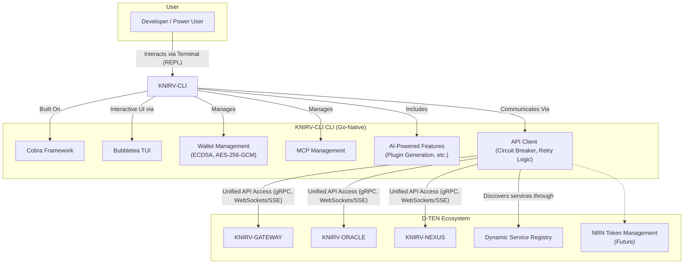

# Whitepaper: KNIRV SDK - The Unified Developer Gateway to Decentralized AI

### Empowering Builders to Interact Seamlessly with the KNIRV D-TEN and its Compounding Intelligence

**Version:** 1.0  
**Status:** DRAFT  
**Date:** July 19, 2025

---

## Abstract

Building decentralized applications and integrating with complex multi-chain AI ecosystems presents significant development challenges. This whitepaper introduces the **KNIRV Software Development Kit (SDK)**, a comprehensive suite of tools, libraries, and APIs designed to provide a high-level, unified interface for developers to interact with the entire **KNIRV Decentralized Trusted Execution Network (D-TEN)**. Leveraging an integrated **API Gateway** and existing client libraries for `knirv://` URI resolution, the **KNIRV SDK** abstracts away the underlying blockchain and P2P complexities. It empowers developers to seamlessly manage **NRN** tokens, orchestrate **KNIRV-CLI** agents, interact with the **KNIRVGRAPH** knowledge Graphchain, submit Skill updates to **KNIRVCHAIN**, and integrate with **KNIRV-NEXUS** DVEs. Available in Go, Python, and JavaScript/TypeScript, the **KNIRV SDK** is the essential toolkit for building the next generation of intelligent, decentralized applications.

---

## 1. Introduction

The **KNIRV D-TEN** represents a paradigm shift in decentralized AI, with its sovereign Graphchains (**KNIRVGRAPH**), blockchains (**KNIRV-ORACLE**, **KNIRVCHAIN**), and intelligent agents (**KNIRV-CLI**). However, the power of such a sophisticated ecosystem can only be fully realized if it is easily accessible to developers. Direct interaction with multiple blockchain RPCs, complex P2P protocols, and specialized data structures can be a significant barrier to entry.

The **KNIRV SDK** is engineered to bridge this gap. It provides a unified, high-level abstraction layer that simplifies programmatic interaction with all components of the **KNIRV D-TEN**. By centralizing access through a robust **API Gateway** and building upon existing `knirv://` URI resolution capabilities, the SDK empowers developers to focus on building innovative applications rather than grappling with low-level network intricacies.

This whitepaper details the **KNIRV SDK's** architecture, its core functionalities, its integration with the unified **API Gateway**, and its pivotal role in fostering a vibrant developer ecosystem around the compounding intelligence of KNIRV.

## 2. Core Responsibilities & Design Philosophy

The **KNIRV SDK's** design philosophy centers on abstraction, ease of use, and comprehensive coverage of the entire D-TEN's functionalities.

### 2.1. Unified Access via API Gateway

The **KNIRV SDK's** primary interaction model is through a Unified **API Gateway**. This Go-based APIGateway acts as a single entry point for all client-side and external interactions with the various **KNIRV D-TEN** services.

> **Expanded Information:**
>
> -   **Single Endpoint:** Developers interact with a single, well-defined API endpoint provided by the APIGateway, eliminating the need to manage multiple RPC URLs or understand the underlying network topology of individual KNIRV components.
> -   **Service Routing:** The APIGateway intelligently routes incoming requests to the appropriate backend KNIRV service (`knirvchain`, `knirvgraph`, `knirvnexus`, `knirvroot`, `knirvrouter`). This abstraction simplifies client-side code and ensures future compatibility as the D-TEN evolves.
> -   **Centralized Features:** The APIGateway provides centralized services such as:
>     -   **Authentication & Authorization:** Managing API tokens and verifying access rights for different services and routes.
>     -   **Rate Limiting:** Protecting backend services from abuse and ensuring fair resource allocation.
>     -   **Health Checks & Metrics:** Monitoring the health and performance of all integrated KNIRV services, providing developers with real-time insights.
>     -   **WebSocket Support:** Enabling real-time communication for dynamic updates (e.g., NRV status, **KNIRV-CLI** activity).
> -   **Simplified Deployment:** Developers can deploy the APIGateway as a single component, simplifying infrastructure management for their applications.

### 2.2. High-Level Abstraction for D-TEN Interactions

The SDK provides intuitive, high-level functions that abstract away the complexities of blockchain transactions, cryptographic operations, and P2P communication.

> **Expanded Information:**
>
> -   **Blockchain Interaction Abstraction:** Instead of raw RPC calls to **KNIRV-ORACLE**, **KNIRVCHAIN**, or **KNIRVGRAPH**, developers use simple SDK methods like `knirv.nrn.transfer(amount, recipient)` or `knirv.skill.invoke(skillId, data)`. The SDK handles the underlying transaction construction, signing (via **KNIRV-WALLET** integration), and submission.
> -   **P2P & DHT Abstraction:** Building upon existing `knirv://` URI resolution capabilities, the SDK simplifies peer discovery and resource fetching within the D-TEN's private DHT. Developers can simply request a resource via its `knirv://` URI, and the SDK handles the complex libp2p streams and peer connections.
> -   **Cryptographic Simplification:** The SDK simplifies cryptographic operations, such as generating User Delegation Certificates (UDCs) for **KNIRV-CLI** agents or verifying ValidationProofs from **KNIRV-NEXUS** DVEs. Developers interact with clear method calls, not raw cryptographic primitives.

### 2.3. Multi-Language Support

The **KNIRV SDK** is designed to be accessible to a broad developer community, offering client libraries in popular programming languages.

> **Expanded Information:**
>
> -   **Go SDK:** For Go applications, leveraging Go's strengths in concurrency and performance, ideal for backend services and **KNIRV-ROUTER**/**KNIRV-ORACLE** integrations.
> -   **Python SDK:** For Python applications, catering to data scientists, AI/ML developers, and researchers, providing a familiar environment for interacting with the D-TEN's intelligence layers.
> -   **JavaScript/TypeScript SDK:** For Node.js and browser-based applications, enabling frontend developers to build rich, interactive user interfaces for **KNIRV-WALLET** and **KNIRVANA**.

### 2.4. KNIRV-CLI: The SDK’s Command-Line Interface

The **KNIRV-CLI** is the official, scriptable interface built in Go that operationalizes the SDK’s capabilities from the terminal. It serves as an essential SDK tool for developers and operators who need fast, reproducible workflows and automation.

- **Unified Control Plane**: Wraps SDK APIs to manage KNIRV services end-to-end (KNIRV-ORACLE, KNIRV-NEXUS, KNIRVGRAPH, KNIRVGATEWAY). Commands map directly to SDK methods for consistency across code and CLI.
- **Service Registry & Health Monitor**: Discovers and tracks service endpoints with continuous health checks and a Circuit Breaker Pattern to prevent cascading failures.
- **Real-Time Communication**: Built-in WebSocket and SSE clients surface live network events (e.g., NRV updates, agent status) mirroring the SDK’s real-time interfaces.
- **Configuration Manager**: Environment-aware configuration with service-specific overrides; aligns with SDK configuration so teams can share the same profiles.
- **Wallet & Economics Integration**: XION Meta Account support for gasless flows; NRN balance/transfer/faucet operations; skill invocation paths that match the SDK’s NRN and economics modules.
- **Interactive UX (TUI/REPL)**: Optional interactive shell with history and tab-completion for iterative exploration of SDK features and rapid prototyping.
- **Controller Alignment**: Synchronized semantics with KNIRV-CONTROLLER as described in §3.4; UDC generation/signing and agent command flows are consistent across SDK and CLI.

Typical CLI workflows powered by the SDK:
- **Bootstrap** local/dev/test environments via the Gateway
- **Pair and operate** KNIRV-CONTROLLER agents using UDCs
- **Query and contribute** to KNIRVGRAPH (NRVs, ErrorNodes, SkillNodes)
- **Manage NRN**: balances, transfers, faucets, and reward claims
- **Monitor health** of services and subscribe to real-time events

## 3. SDK Architecture & Core Functionalities

The **KNIRV SDK's** architecture is modular, allowing developers to integrate specific functionalities as needed. Its core is built around the **API Gateway** and existing `knirv://` URI resolution.

### 3.1. KNIRV URI Resolution & Resource Fetching

The SDK extends the existing `knirv-uri-sdk` capabilities to resolve `knirv://` URIs across the entire D-TEN.

> **Expanded Information:**
>
> -   **`knirv://` URI Structure:** The SDK understands and parses the standardized `knirv://<ID>.<ResourceType>/<OptionalSubPath>?param1=value1&param2=value2` URI structure.
>     -   `<ID>`: Unique identifier for a chain, content, or node (e.g., `mychain.chain`, `content123.nrn`).
>     -   `<ResourceType>`: Specifies the type of resource (e.g., `chain`, `nrn`, `skill`, `llm`, `error`).
>     -   `<Path>`: Optional sub-path within the resource (e.g., `/block`, `/content`).
>     -   `<Query>`: Standard URL query parameters.
> -   **Decentralized Peer Discovery (DHT):** The SDK leverages the underlying P2P DHT (Kademlia-based, run by **KNIRVGRAPH** and **KNIRV-ROUTER** nodes) for efficient peer discovery. When a `knirv://` URI is requested, the SDK finds peers on the DHT that provide the specified resource.
> -   **Resource Fetching (libp2p Streams):** Once peers are discovered, the SDK connects to them using libp2p streams to fetch the underlying resources. This is crucial for retrieving Base LLM binaries (from IPFS via **KNIRVCHAIN** CIDs), Skill executable code, FailureContext data, and other off-chain content.
> -   **Error Handling:** The SDK provides robust error handling and retry mechanisms for network operations, ensuring reliable resource fetching.

### 3.2. Unified API Gateway Client

The SDK includes a client for the **API Gateway**, providing structured access to all D-TEN services.

> **Expanded Information:**
>
> -   **Service-Specific Endpoints:** The SDK exposes methods mapped to the APIGateway's registered services and routes. For example:
>     -   `knirv.chain.getLLMVersion()` (proxied to `knirvchain` service)
>     -   `knirv.graph.getNRVStatus(nrvId)` (proxied to `knirvgraph` service)
>     -   `knirv.root.mintNRN(proof)` (proxied to `knirvroot` service)
>     -   `knirv.nexus.submitValidationTask(task)` (proxied to `knirvnexus` service)
> -   **Authentication & Authorization:** The SDK handles token management (e.g., acquiring and attaching authentication tokens from the APIGateway's AuthenticationService) for routes requiring authorization.
> -   **WebSocket Integration:** The SDK provides client-side WebSocket capabilities to subscribe to real-time updates from the APIGateway (e.g., service health changes, NRV status updates, **KNIRV-CLI** activity).

### 3.3. NRN Token & Economic Operations

The SDK provides comprehensive functionalities for interacting with the **NRN** token and the D-TEN's economic model.

> **Expanded Information:**
>
> -   **NRN Balance & History:** Methods to query a user's **NRN** balance (from **KNIRV-ORACLE**) and retrieve transaction history.
> -   **NRN Transfer:** Simple methods to transfer **NRN** tokens between accounts (orchestrated by **KNIRV-ORACLE** via the **API Gateway**).
> -   **NRN Acquisition:** Direct interface to acquire **NRN** from the **KNIRV-ORACLE** Faucet (via the **API Gateway**), abstracting the USDC exchange process.
> -   **Skill Invocation:** A core function allowing **KNIRV-CLI** agents (or dApps) to invoke Skills from **KNIRVCHAIN**, which triggers **NRN** burning on **KNIRV-ORACLE**. The SDK handles the underlying transaction construction and submission.
> -   **LLM/Skill Registration:** Methods to submit Base LLM update proposals to **KNIRVCHAIN** (orchestrated by **KNIRV-ORACLE**) and SkillNode proposals to **KNIRVGRAPH** (which then triggers canonical minting on **KNIRVCHAIN** via **KNIRV-ORACLE**).
> -   **Reward Claiming:** Interface for Solvers, DVE operators, and Observers to claim their **NRN** rewards (from **KNIRV-ORACLE**).

### 3.4. KNIRV-CONTROLLER Management & User Delegation Certificates (UDCs)

The SDK provides tools for developers to integrate **KNIRV-CONTROLLER** agent control into their applications, reflecting the major refactor where KNIRV-CLI has been integrated into KNIRV-CONTROLLER.

> **Expanded Information:**
>
> -   **KNIRV-CONTROLLER Pairing:** Secure methods for pairing a dApp or user account with a **KNIRV-CONTROLLER** agent through QR code connectivity and other pairing mechanisms.
> -   **UDC Generation & Signing:** SDK functions to generate User Delegation Certificates (UDCs) with granular permissions, cryptographically signed by the user's **KNIRV-WALLET** (leveraging XION's Meta Accounts). These UDCs can then be passed to **KNIRV-CONTROLLER** agents to authorize their actions.
> -   **Agent Command & Monitoring:** Methods to send commands to **KNIRV-CONTROLLER** agents and receive real-time updates on their status, task execution, and **NRN** consumption.
> -   **CLI Synchronization:** Support for synchronized CLI functionality between KNIRV-SDK and KNIRV-CONTROLLER, ensuring consistent command-line interfaces across both environments.

### 3.5. KNIRVGRAPH Interaction

The SDK provides specialized methods for interacting with the **KNIRVGRAPH** knowledge Graphchain.

> **Expanded Information:**
>
> -   **NRV Management:** Functions to announce new NRVs to the Kademlia DHT, query for existing NRVs, and submit `ProposeSolution` transactions to **KNIRVGRAPH**.
> -   **Knowledge Graph Queries:** Advanced querying capabilities for ErrorNodes, SkillNodes, and their relationships within the **KNIRVGRAPH** (leveraging BluntDB on the backend). This enables developers to build applications that analyze and leverage the network's collective intelligence.
> -   **Reputation System Access:** Methods to query and monitor **KNIRVGRAPH's** on-chain reputation scores for Solvers and DVE operators.

## 4. Usage Examples

The **KNIRV SDK** aims for intuitive and consistent API design across all supported languages.

### 4.1. Go SDK Example (Backend Service)

```go
package main

import (
	"context"
	"fmt"
	"log"
	"time"

	"github.com/cloud-equities/KNIRVCHAIN_GO_ROOT_MCP/sdk/go/client" // Existing KNIRV URI client
	"github.com/knirv/knirv-sdk-go/api"                             // New API Gateway client
	"github.com/knirv/knirv-sdk-go/nrn"                             // NRN economics client
)

func main() {
	// Initialize KNIRV URI client (for direct resource fetching via DHT)
	knirvURIClient, err := client.New(client.DefaultConfig())
	if err != nil {
		log.Fatalf("Failed to create KNIRV URI client: %v", err)
	}
	defer knirvURIClient.Close()
	knirvURIClient.Bootstrap()

	// Initialize KNIRV API Gateway client
	apiClient := api.NewClient("http://localhost:8000") // Connect to your deployed API Gateway

	// Initialize NRN economics client (interacts via API Gateway)
	nrnClient := nrn.NewClient(apiClient)

	ctx, cancel := context.WithTimeout(context.Background(), 5*time.Minute)
	defer cancel()

	// --- Example 1: Fetching the latest Base LLM CID from KNIRVCHAIN ---
	fmt.Println("\n--- Fetching Latest Base LLM CID ---")
	llmResponse, err := apiClient.CallService(ctx, "knirvchain", "/llm/latest", "GET", nil, nil)
	if err != nil {
		log.Printf("Error fetching latest LLM CID: %v", err)
	} else {
		fmt.Printf("Latest Base LLM CID: %s\n", llmResponse["cid"])
		// Use knirvURIClient to fetch the actual LLM binary
		// llmBinary, err := knirvURIClient.FetchResource(fmt.Sprintf("knirv://%s.llm", llmResponse["cid"]))
		// if err != nil { /* handle error */ }
	}

	// --- Example 2: Invoking a Skill (requires NRN) ---
	fmt.Println("\n--- Invoking a Skill ---")
	skillID := "my_awesome_skill_id"
	userID := "user_alice"
	amount := "100000" // 0.1 NRN (example amount)

	// In a real scenario, this would involve a UDC from KNIRV-WALLET
	// For SDK example, we simulate the call to the economics service
	skillInvokePayload := map[string]interface{}{
		"userID":  userID,
		"skillID": skillID,
		"amount":  amount,
	}
	
	invokeResponse, err := apiClient.CallService(ctx, "knirvroot", "/mcp/skill_invocation", "POST", skillInvokePayload, nil)
	if err != nil {
		log.Printf("Error invoking skill: %v", err)
	} else {
		fmt.Printf("Skill Invocation Status: %s (TxID: %s)\n", invokeResponse["status"], invokeResponse["id"])
	}

	// --- Example 3: Submitting a new NRV (Problem) to KNIRVGRAPH ---
	fmt.Println("\n--- Submitting a New NRV ---")
	nrvPayload := map[string]interface{}{
		"failureContext": "base64encoded_failure_data",
		"domain":         "Robotics_Navigation",
		"bounty":         "5000000", // 5 NRN
		"observer":       "knirvshell_alpha",
	}

	nrvResponse, err := apiClient.CallService(ctx, "knirvgraph", "/nrv/submit", "POST", nrvPayload, nil)
	if err != nil {
		log.Printf("Error submitting NRV: %v", err)
	} else {
		fmt.Printf("NRV Submitted: %s\n", nrvResponse["nrvId"])
	}
}
```

### 4.2. Python SDK Example (AI Agent Development)

```python
import asyncio
from knirv_uri_sdk import KnirvClient, KnirvClientError # Existing KNIRV URI client
from knirv_sdk.api import APIClient # New API Gateway client
from knirv_sdk.nrn import NRNClient # NRN economics client

async def main():
    # Initialize KNIRV URI client (for direct resource fetching via DHT)
    knirv_uri_client = KnirvClient(bootstrap_peers=["/ip4/104.131.131.82/tcp/4001/p2p/QmaCpDMGvV2BGHeYERUEnRQAwe3N8SzbUtfsmvsqQLuvuJ"])
    await knirv_uri_client.bootstrap()

    # Initialize KNIRV API Gateway client
    api_client = APIClient("http://localhost:8000") # Connect to your deployed API Gateway

    # Initialize NRN economics client (interacts via API Gateway)
    nrn_client = NRNClient(api_client)

    try:
        # --- Example 1: Acquiring NRN from Faucet ---
        print("\n--- Acquiring NRN from Faucet ---")
        # In a real app, this would involve USDC payment
        faucet_response = await api_client.call_service("knirvroot", "/faucet/request", "POST", {"amount": "1000000", "recipient": "user_bob"})
        print(f"Faucet Request Status: {faucet_response.get('status')}, TxID: {faucet_response.get('txId')}")

        # --- Example 2: Submitting a SkillNode to KNIRVGRAPH (after DVE validation) ---
        print("\n--- Submitting a SkillNode to KNIRVGRAPH ---")
        skill_payload = {
            "creator": "knirvshell_beta",
            "description": "Skill to optimize pathfinding in complex environments",
            "resolvesErrors": ["error_nav_001"],
            "codePackageURI": "ipfs://QmSkillCodeHash",
            "validationProof": "base64encoded_dve_proof",
            "licenseType": "RoyaltyBearing"
        }
        skill_response = await api_client.call_service("knirvgraph", "/graph/skill/mint", "POST", skill_payload)
        print(f"SkillNode Minting Status: {skill_response.get('status')}, SkillID: {skill_response.get('skillId')}")

        # --- Example 3: Monitoring KNIRV-NEXUS DVE Health ---
        print("\n--- Monitoring KNIRV-NEXUS DVE Health ---")
        dve_health = await api_client.call_service("knirvnexus", "/health", "GET")
        print(f"KNIRV-NEXUS DVE Health: {dve_health.get('status')}")

    except KnirvClientError as e:
        print(f"KNIRV Client Error: {e}")
    except Exception as e:
        print(f"An unexpected error occurred: {e}")
    finally:
        await knirv_uri_client.stop()

if __name__ == "__main__":
    asyncio.run(main())
```

### 4.3. JavaScript/TypeScript SDK Example (Frontend DApp)

```javascript
import { KnirvClient, KnirvClientError } from 'knirv-uri-sdk'; // Existing KNIRV URI client
import { APIClient } from '@knirv/sdk/api'; // New API Gateway client
import { NRNClient } from '@knirv/sdk/nrn'; // NRN economics client
import { WalletClient } from '@knirv/sdk/wallet'; // KNIRV-WALLET client

async function main() {
    // Initialize KNIRV URI client (for direct resource fetching via DHT)
    const knirvUriClient = new KnirvClient({
        bootstrapPeers: ['/ip4/104.131.131.82/tcp/4001/p2p/QmaCpDMGvV2BGHeYERUEnRQAwe3N8SzbUtfsmvsqQLuvuJ'],
        logEnabled: true
    });
    await knirvUriClient.bootstrap();

    // Initialize KNIRV API Gateway client
    const apiClient = new APIClient('http://localhost:8000'); // Connect to your deployed API Gateway

    // Initialize NRN economics client (interacts via API Gateway)
    const nrnClient = new NRNClient(apiClient);

    // Initialize KNIRV-WALLET client (for UDC generation, integrates with XION Meta Accounts)
    const walletClient = new WalletClient(apiClient); // Assumes APIClient handles auth to wallet backend

    try {
        // --- Example 1: User logs in via KNIRV-WALLET ---
        console.log('\n--- User Login via KNIRV-WALLET ---');
        // This would abstract XION Meta Account login
        const userToken = await walletClient.login('user@example.com', 'securepassword'); // Simulated login
        console.log(`User logged in. Token: ${userToken}`);
        apiClient.setAuthToken(userToken); // Set token for subsequent API calls

        // --- Example 2: Issue a UDC for a KNIRV-CLI agent ---
        console.log('\n--- Issuing UDC for KNIRV-CLI ---');
        const agentId = 'agent_epsilon';
        const permissions = ['skill_invoke:travel', 'nrn_transfer:limit:100'];
        const expiry = Date.now() + 3600 * 1000; // 1 hour
        const udc = await walletClient.issueUDC(agentId, permissions, expiry);
        console.log(`Issued UDC for ${agentId}: ${JSON.stringify(udc)}`);
        // This UDC would then be passed to the KNIRV-CLI agent

        // --- Example 3: Get current NRN balance ---
        console.log('\n--- Getting NRN Balance ---');
        const balanceResponse = await nrnClient.getNRNBalance('user_alice'); // Assuming user_alice is the logged-in user
        console.log(`Current NRN Balance: ${balanceResponse.balance} NRN`);

        // --- Example 4: Subscribe to real-time NRV updates from KNIRVGRAPH ---
        console.log('\n--- Subscribing to NRV Updates ---');
        apiClient.subscribeToWebSocket('knirvgraph', 'nrv_updates', (data) => {
            console.log('Real-time NRV Update:', data);
        });
        // In a real app, you'd manage the WebSocket connection lifecycle
        await new Promise(resolve => setTimeout(resolve, 10000)); // Keep alive for 10 seconds for demo

    } catch (e) {
        if (e instanceof KnirvClientError) {
            console.error(`KNIRV Client Error: ${e.message}`);
        } else {
            console.error(`An unexpected error occurred: ${e instanceof Error ? e.message : String(e)}`);
        }
    } finally {
        await knirvUriClient.stop();
        // Close WebSocket connections
        // apiClient.closeWebSocket();
    }
}

main().catch(console.error);
```

## 5. Integration with the KNIRV D-TEN

The **KNIRV SDK** provides the programmatic glue that connects external applications and developers to the entire **KNIRV D-TEN**, abstracting away the multi-layered architecture.

> **Expanded Information:**
>
> -   **KNIRV-ORACLE (NRN Oracle & Orchestrator):** The SDK provides direct access to **KNIRV-ORACLE's** functionalities via the APIGateway, enabling **NRN** balance queries, faucet interactions, and the orchestration of **NRN** burning for Skill invocation. The TokenEconomics service, managed by **KNIRV-ORACLE's** backend, is exposed through the **API Gateway**, allowing the SDK to interact with its logic for Skill invocation, LLM registration, and reward processing.
> -   **KNIRVCHAIN (Base LLM & Skill Certification):** Developers can use the SDK to query the canonical Base LLM (CodeT5) versions, retrieve SkillNode metadata from the SkillRegistry, and submit Base LLM update proposals or SkillNode minting requests (orchestrated by **KNIRV-ORACLE**). The `knirv://` URI resolution is key for fetching the actual model and skill binaries.
> -   **KNIRVGRAPH (Knowledge Graphchain):** The SDK offers comprehensive methods to interact with **KNIRVGRAPH**, including announcing NRVs to the DHT, querying the knowledge graph for ErrorNodes and SkillNodes, and submitting `ProposeSolution` and `MintResolution` transactions. This allows developers to build applications that contribute to and leverage the network's collective intelligence.
> -   **KNIRV-NEXUS DVEs (Verifiable Execution):** The SDK provides interfaces to submit validation tasks to **KNIRV-NEXUS** DVEs (via the **API Gateway**), retrieve ValidationProofs, and integrate with secure backup functionalities for **KNIRV-SHELLs**.
> -   **KNIRV-ROUTERS (Network Connectivity):** While not directly exposed for configuration, the SDK implicitly relies on **KNIRV-ROUTERS** for `knirv://` URI resolution and underlying network connectivity, facilitating peer discovery and resource fetching.
> -   **KNIRV-CLI (Autonomous Agents):** The SDK is crucial for developers building applications that manage or interact with **KNIRV-CLI** agents, particularly through User Delegation Certificates (UDCs) and command/monitoring interfaces.
> -   **XION (UX & Liquidity Layer):** The SDK's integration with XION's Meta Accounts and gasless transactions provides a superior user experience for dApps built with the SDK, abstracting away blockchain complexities.

## 6. Security & Trust Model

The **KNIRV SDK** inherits and enhances the security of the underlying **KNIRV D-TEN**, prioritizing secure development practices and data integrity.

> **Expanded Information:**
>
> -   **API Gateway Security:** The APIGateway implements robust security measures including authentication, authorization, rate limiting, and secure communication (HTTPS/WSS), protecting backend services from direct exposure and common attack vectors.
> -   **Cryptographic Libraries:** The SDK utilizes battle-tested cryptographic libraries for secure communication, data hashing, and signature verification, ensuring the integrity of data exchanged with the D-TEN.
> -   **`knirv://` URI Verification:** The `knirv://` URI resolution mechanism inherently relies on content addressing and cryptographic verification (e.g., CIDs for IPFS resources), ensuring that fetched resources are authentic and untampered.
> -   **User Delegation Certificates (UDCs):** The SDK facilitates the secure generation and management of UDCs, enforcing the principle of least privilege for **KNIRV-CLI** agents and providing an auditable trail of authorized actions.
> -   **Secure Coding Practices:** The SDK is developed with a strong emphasis on secure coding practices, undergoing regular security audits and adhering to industry best standards to minimize vulnerabilities.
> -   **Open Source:** The open-source nature of the SDK allows for community review and contributions, enhancing transparency and security through collective scrutiny.

## 7. Future Roadmap

The **KNIRV SDK** will continuously evolve to meet the growing needs of the developer community and the expanding capabilities of the **KNIRV D-TEN**.

> **Expanded Information:**
>
> -   **Phase 1 (Initial Mainnet Deployment - Q2 2026):**
>     -   **Focus:** Core SDK functionalities for **NRN** management, Skill invocation, Base LLM querying, and **KNIRV-CLI** UDC issuance.
>     -   **API Gateway:** Robust APIGateway with initial service integrations and security features.
>     -   **Goal:** Provide a stable and comprehensive toolkit for developers to build foundational D-TEN applications.
> -   **Phase 2 (Advanced KNIRVGRAPH & KNIRV-NEXUS Integrations - Q4 2026):**
>     -   **Focus:** Enhance SDK methods for complex **KNIRVGRAPH** queries (e.g., graph traversal, pattern matching), NRV lifecycle management, and detailed **KNIRV-NEXUS** DVE interaction (e.g., submitting specialized validation tasks, receiving detailed proofs).
>     -   **Real-time Analytics:** Integrate real-time analytics and monitoring capabilities from the **API Gateway** into the SDK for developer dashboards.
>     -   **Goal:** Empower developers to build more sophisticated AI agent applications that deeply interact with the D-TEN's learning and validation layers.
> -   **Phase 3 (AI-Assisted Development & Tooling - Q2 2027):**
>     -   **Focus:** Integrate AI-assisted development tools within the SDK, such as code generation for Skill development, automated NRV classification, and intelligent Playbook composition suggestions.
>     -   **Developer IDE Plugins:** Develop plugins for popular IDEs (e.g., VS Code) to streamline **KNIRV SDK** development.
>     -   **Goal:** Reduce the complexity of building decentralized AI applications through intelligent tooling.
> -   **Phase 4 (Cross-Ecosystem Interoperability - 2028+):**
>     -   **Focus:** Expand SDK capabilities to facilitate seamless interaction with other blockchain ecosystems (via IBC) and traditional Web2 services, enabling broader utility for **KNIRV-CLI** agents.
>     -   **Decentralized Identity (DID) Integration:** Integrate DID standards to enhance user and agent identity management within applications built with the SDK.
>     -   **Goal:** Position the **KNIRV SDK** as a universal standard for decentralized AI development across the digital landscape.

## 8. Conclusion

The **KNIRV SDK** is the essential bridge for developers to unlock the full potential of the **KNIRV Decentralized Trusted Execution Network**. By providing a unified, high-level interface through a robust **API Gateway** and building upon existing `knirv://` URI resolution, the SDK abstracts away the inherent complexities of a multi-chain, decentralized AI ecosystem. Available across multiple programming languages, it empowers builders to seamlessly manage **NRN** tokens, orchestrate **KNIRV-CLI** agents, interact with the **KNIRVGRAPH** knowledge Graphchain, contribute to the Base LLM's evolution on **KNIRVCHAIN**, and leverage the verifiable computation of **KNIRV-NEXUS** DVEs. The **KNIRV SDK** is fundamental to accelerating the development of innovative, intelligent, and decentralized applications, fostering a vibrant ecosystem around compounding intelligence.


# Whitepaper: KNIRV-CLI - The Synchronized Command-Line Interface for the D-TEN
### **KNIRV-CLI: The Synchronized Command-Line Interface for the D-TEN**

#### **Abstract**

The **KNIRV-CLI** is a sophisticated, AI-powered command-line interface (CLI) that serves as the primary developer and power user interface for the KNIRV Decentralized Trusted Execution Network (D-TEN). Following the major refactor, KNIRV-CLI has been integrated into KNIRV-CONTROLLER as the CLI component and is also cloned in KNIRV-SDK as the CLI interface. This synchronized architecture ensures consistent command-line functionality across both environments while maintaining the comprehensive tool that unifies interaction with all sovereign layers of the D-TEN, providing functionalities for wallet management, Model Context Protocol (MCP) management, and AI-powered plugin generation. Built in Go, it features a robust, extensible architecture designed for enhanced service discovery, real-time updates, and seamless integration with the entire KNIRV ecosystem.

#### **1. Introduction**

The **KNIRV-CLI** transforms the user's interaction with the D-TEN from an abstract concept into a tangible command-line experience. Following the major refactor, KNIRV-CLI has been strategically positioned in both KNIRV-CONTROLLER (as the integrated CLI component) and KNIRV-SDK (as the cloned CLI interface), ensuring synchronized functionality across both environments. This dual deployment ensures that developers have consistent command-line access whether working through the unified KNIRV-CONTROLLER platform or the specialized KNIRV-SDK development environment. The shell is designed to overcome the limitations of isolated operations and static configurations, establishing itself as the "unified access" point for all network services while maintaining synchronization between its deployments.

#### **2. Core Features**

The **KNIRV-CLI** is a feature-rich tool built to support a wide range of developer needs:
*   **Wallet Management**: Provides full lifecycle management of digital wallets, including the secure generation, import, export, and listing of wallets using ECDSA key generation and AES-256-GCM encryption.
*   **MCP Management**: Allows for the registration and management of AI plugin capabilities, operational procedures (interpolation), and server registrations (extrapolation), which are central to the network's AI functionality.
*   **AI-Powered Features**: Includes advanced functionalities such as AI-powered plugin generation and planned enhancements for intelligent command suggestion, automatic error resolution, and a natural language command interface.
*   **Interactive Terminal UI**: Incorporates an interactive shell (REPL) with command history and tab completion, providing a user-friendly experience within a text-based environment using the Bubbletea framework.
*   **Real-time Connectivity**: The implementation plan outlines the integration of WebSockets and Server-Sent Events (SSE) to enable live updates and event-driven operations, ensuring the user is always synchronized with the network's state.

#### **3. Architectural Design**

The **KNIRV-CLI**'s architecture is a testament to our commitment to a "High-Fidelity Infrastructure," prioritizing performance and direct control.
*   **Go-Native Implementation**: The entire application is written in Go, utilizing the Cobra framework for a robust and modular CLI structure.
*   **Secure Wallet Integration**: Wallet functionality is implemented with go-native packages, ensuring cryptographic security through ECDSA and AES-256-GCM encryption for key management.
*   **API Client with Resilience**: The underlying API client is designed with a circuit breaker and retry logic, providing fault tolerance and resilience when interacting with distributed network services.
*   **Dynamic Service Discovery**: The implementation strategy addresses the issue of static configuration by proposing a dynamic service registry. This will allow the `KNIRV-CLI` to automatically discover and resolve network services, ensuring adaptability to the decentralized network's fluid topology.



#### **4. Integration with the D-TEN Ecosystem**

The `KNIRV-CLI` is engineered to be a unified, single-pane-of-glass interface for the entire KNIRV ecosystem.
*   **Unified API Access**: It acts as a single point of entry to a variety of services, including `KNIRV-ORACLE`, `KNIRV-NEXUS`, and `KNIRV-GATEWAY`, addressing the previously identified "isolated operation" gap.
*   **Economic Integration**: The implementation plan includes the future integration of a module for NRN token management, which will provide developers with direct control over the network's economics and facilitate the seamless settlement of transactions.
*   **Enhanced Inter-Module Communication**: The plan outlines the use of gRPC for efficient communication with core services, ensuring low-latency and high-throughput data exchange with other layers of the network.

#### **5. Future Development & Roadmap**

The **KNIRV-CLI** is envisioned as a continuously evolving tool. Future enhancements include:
*   **AI-Powered Assistance**: Intelligent command suggestion, automatic error resolution, and a natural language command interface to simplify complex tasks.
*   **Advanced Network Integration**: Support for cross-chain bridges, multi-network operations, and federated service discovery to scale with the network's growth.
*   **Developer Tooling**: Enhanced tooling for plugin development, offering a seamless experience from generation to deployment.
*   **Production Readiness**: Robust monitoring, logging, and deployment support to ensure the CLI is ready for enterprise-level use.

#### **6. Conclusion**

The **KNIRV-CLI** is a testament to the KNIRV Network's commitment to empowering developers. By providing a comprehensive, intelligent, and unified command-line tool, it transforms the complexity of a decentralized network into a powerful and manageable interface. It is the definitive toolkit for building, managing, and interacting with the entire KNIRV D-TEN, serving as a critical layer that drives both innovation and adoption.

<div class="footer-links">
<a href="#/legal/CODE_OF_CONDUCT.md" class="footer-link">Contributor Covenant Code of Conduct</a> | <a href="#/legal/PRIVACY_POLICY.md" class="footer-link">PRIVACY_POLICY.md</a> | <a href="#/legal/TERMS_AND_CONDITIONS.md" class="footer-link">TERMS AND CONDITIONS</a>

© 2025 KNIRV Network
</div>
