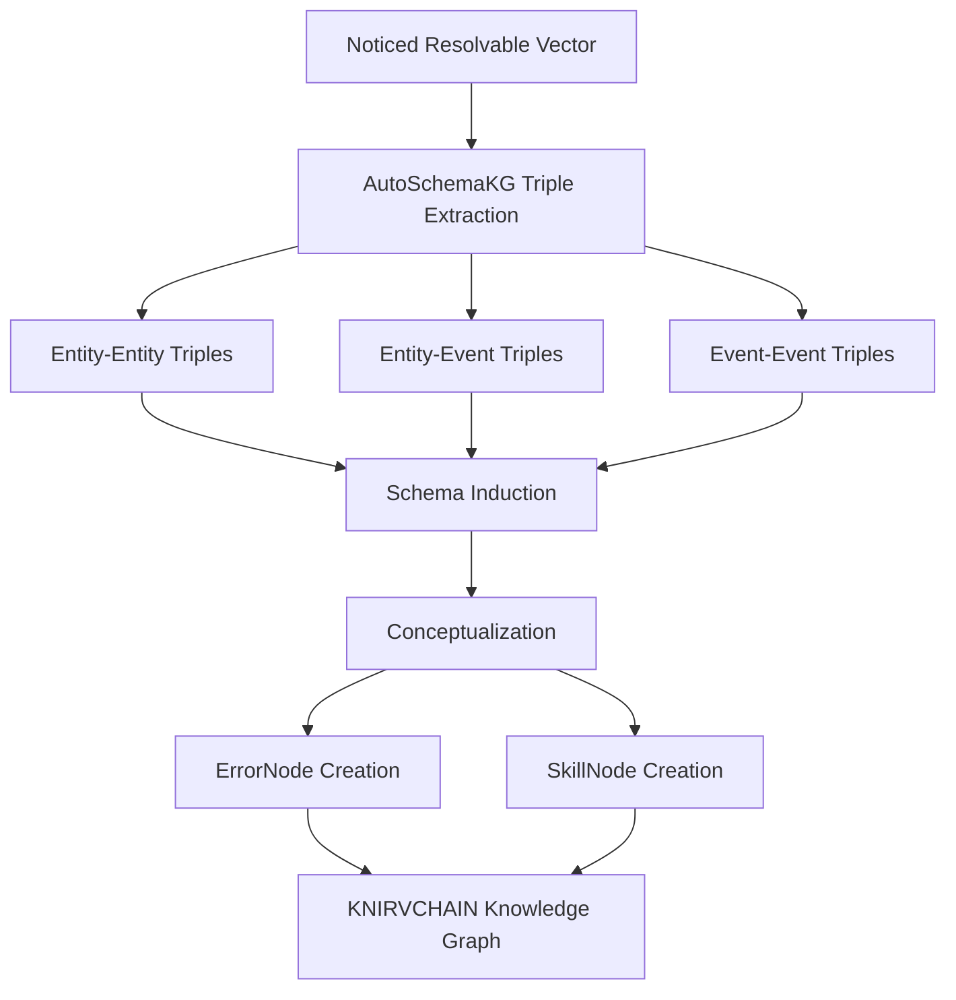

# AutoSchemaKG Integration Guide

## Overview

This document outlines how to integrate [AutoSchemaKG](https://github.com/hkust-knowcomp/autoschemakg) into the KNIRVCHAIN ecosystem. AutoSchemaKG is a novel framework for automatic knowledge graph construction that combines schema generation via conceptualization with knowledge graph completion.

## What is AutoSchemaKG?

AutoSchemaKG is a framework that enables fully autonomous knowledge graph construction without predefined schemas. It introduces a two-stage approach:

1. **Knowledge Graph Triple Extraction**: Extract triples comprising entities and events from text using Large Language Models (LLMs)
2. **Schema Induction**: Automatically generate schema for the knowledge graph through conceptualization, creating semantic bridges between seemingly disparate information to enable zero-shot inferencing across domains

The framework has been used to create the ATLAS (Automated Triple Linking And Schema induction) family of knowledge graphs, which consists of 900+ million nodes connected by 5.9 billion edges.

## Relevance to KNIRVCHAIN

AutoSchemaKG aligns perfectly with KNIRVCHAIN's vision of creating a decentralized knowledge graph where AI failures are captured, resolved, and minted as immutable ErrorNodes and composable Skills. The integration will enhance our ability to:

1. Automatically generate schemas for our knowledge graph without manual intervention
2. Extract high-quality triples from unstructured text with high precision (>95%)
3. Create conceptual abstractions that bridge seemingly disparate information
4. Enable more effective multi-hop reasoning across our knowledge graph

## Integration Architecture

### 1. Core Components to Integrate

```
KNIRVCHAIN                      AutoSchemaKG
+------------------+            +------------------+
| ErrorNode        | <--------> | Triple Extraction|
| SkillNode        | <--------> | Schema Induction |
| RelationshipEdge | <--------> | Conceptualization|
+------------------+            +------------------+
```

### 2. Data Flow



## Implementation Steps

### 1. Dependencies Installation

```bash
# Install atlas-rag package
pip install atlas-rag

# For NV-embed-v2 support
pip install "atlas-rag[nvembed]"
```

### 2. Triple Extraction Implementation

Integrate the following code into our NRV processing pipeline:

```python
from atlas_rag import TripleGenerator, KnowledgeGraphExtractor, ProcessingConfig
from openai import OpenAI

# Initialize LLM client (can be replaced with our preferred model)
client = OpenAI(api_key='<your_api_key>')
model_name = "gpt-4" # Or use "meta-llama/Llama-3.1-8B-Instruct" with HuggingFace

# Configure for NRV processing
def process_nrv(nrv_id, failure_context):
    output_directory = f'import/{nrv_id}'
    
    # Initialize triple generator
    triple_generator = TripleGenerator(client, model_name=model_name)
    
    # Configure extraction process
    kg_extraction_config = ProcessingConfig(
        model_path=model_name,
        data_directory="nrv_data",
        filename_pattern=nrv_id,
        batch_size=2,
        output_directory=output_directory,
    )
    
    # Initialize extractor
    kg_extractor = KnowledgeGraphExtractor(model=triple_generator, config=kg_extraction_config)
    
    # Extract entity & event graph
    kg_extractor.run_extraction()
    
    # Convert triples JSON to CSV
    kg_extractor.convert_json_to_csv()
    
    # Generate concepts
    kg_extractor.generate_concept_csv(batch_size=64)
    
    # Create concept CSV
    kg_extractor.create_concept_csv()
    
    # Convert to graphml for networkx
    kg_extractor.convert_to_graphml()
    
    return output_directory
```

### 3. Mapping AutoSchemaKG to KNIRVCHAIN Primitives

Create adapter functions to map AutoSchemaKG outputs to KNIRVCHAIN primitives:

```python
def map_to_error_node(nrv_id, kg_data_path):
    """
    Convert AutoSchemaKG entity nodes to ErrorNodes
    """
    # Implementation details
    pass

def map_to_skill_node(nrv_id, kg_data_path):
    """
    Convert AutoSchemaKG event nodes to SkillNodes
    """
    # Implementation details
    pass

def create_relationship_edges(nrv_id, kg_data_path):
    """
    Convert AutoSchemaKG relationships to KNIRVCHAIN RelationshipEdges
    """
    # Implementation details
    pass
```

### 4. Integration with DVE (Decentralized Validation Environment)

Extend the DVE to validate the automatically generated schema:

```python
def validate_schema(nrv_id, kg_data_path):
    """
    Validate the automatically generated schema in the DVE
    """
    # Implementation details
    pass
```

## Core Data Structures

### AutoSchemaKG Triple Types

1. **Entity-Entity**: Relationships between two entities
2. **Entity-Event**: Relationships between entities and events
3. **Event-Event**: Relationships between two events

### Conceptualization

The conceptualization process in AutoSchemaKG creates abstract categories for entities, events, and relations. This aligns with KNIRVCHAIN's vision of creating a hierarchical knowledge graph.

## Performance Considerations

Based on the AutoSchemaKG paper:

1. **Computational Requirements**: Building billion-scale knowledge graphs requires substantial computational resources (78,400+ GPU hours for the ATLAS family)
2. **Storage Requirements**: For a knowledge graph with 1 billion nodes using 4096-dimensional embeddings, approximately 16TB of storage would be required
3. **Precision and Recall**: AutoSchemaKG achieves >95% precision and >90% recall in triple extraction

## Integration with Existing KNIRVCHAIN Components

### 1. NRV Processing Pipeline

Extend the NRV processing pipeline to include AutoSchemaKG triple extraction and schema induction:

```python
# Pseudocode for integration
def process_nrv(nrv):
    # Existing NRV processing
    
    # Add AutoSchemaKG processing
    kg_data_path = process_nrv_with_autoschemakg(nrv.id, nrv.failure_context)
    
    # Map to KNIRVCHAIN primitives
    error_node = map_to_error_node(nrv.id, kg_data_path)
    skill_node = map_to_skill_node(nrv.id, kg_data_path)
    relationship_edges = create_relationship_edges(nrv.id, kg_data_path)
    
    # Validate in DVE
    validation_result = validate_schema(nrv.id, kg_data_path)
    
    # Continue with existing pipeline
```

### 2. Knowledge Graph Query Interface

Extend the knowledge graph query interface to leverage the conceptual schema:

```python
def query_knowledge_graph(query, use_concepts=True):
    """
    Query the knowledge graph with optional conceptual expansion
    """
    if use_concepts:
        # Expand query using conceptual schema
        expanded_query = expand_query_with_concepts(query)
        return execute_query(expanded_query)
    else:
        return execute_query(query)
```

## Testing and Validation

1. **Triple Extraction Accuracy**: Test the accuracy of triple extraction on a sample of NRVs
2. **Schema Induction Quality**: Evaluate the quality of automatically induced schemas
3. **Integration Tests**: Ensure proper integration with existing KNIRVCHAIN components
4. **Performance Benchmarks**: Measure the performance impact of AutoSchemaKG integration

## Future Enhancements

1. **Distributed Processing**: Implement distributed processing for large-scale knowledge graph construction
2. **Incremental Updates**: Support incremental updates to the knowledge graph as new NRVs are processed
3. **Cross-Domain Reasoning**: Enhance cross-domain reasoning capabilities using the conceptual schema
4. **Multi-Modal Integration**: Extend AutoSchemaKG to support multi-modal data (images, audio, etc.)

## Conclusion

Integrating AutoSchemaKG into KNIRVCHAIN will significantly enhance our ability to automatically construct and maintain a high-quality knowledge graph without manual schema definition. This aligns perfectly with our vision of creating a self-improving AI ecosystem where knowledge is captured, resolved, and made available for future use.

## References

1. [AutoSchemaKG GitHub Repository](https://github.com/hkust-knowcomp/autoschemakg)
2. [AutoSchemaKG Research Paper](https://arxiv.org/abs/2505.23628)
3. [ATLAS Knowledge Graphs](https://huggingface.co/datasets/AlexFanWei/AutoSchemaKG)