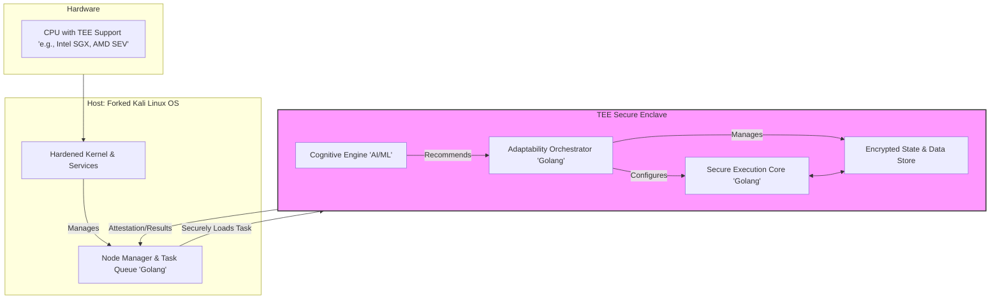
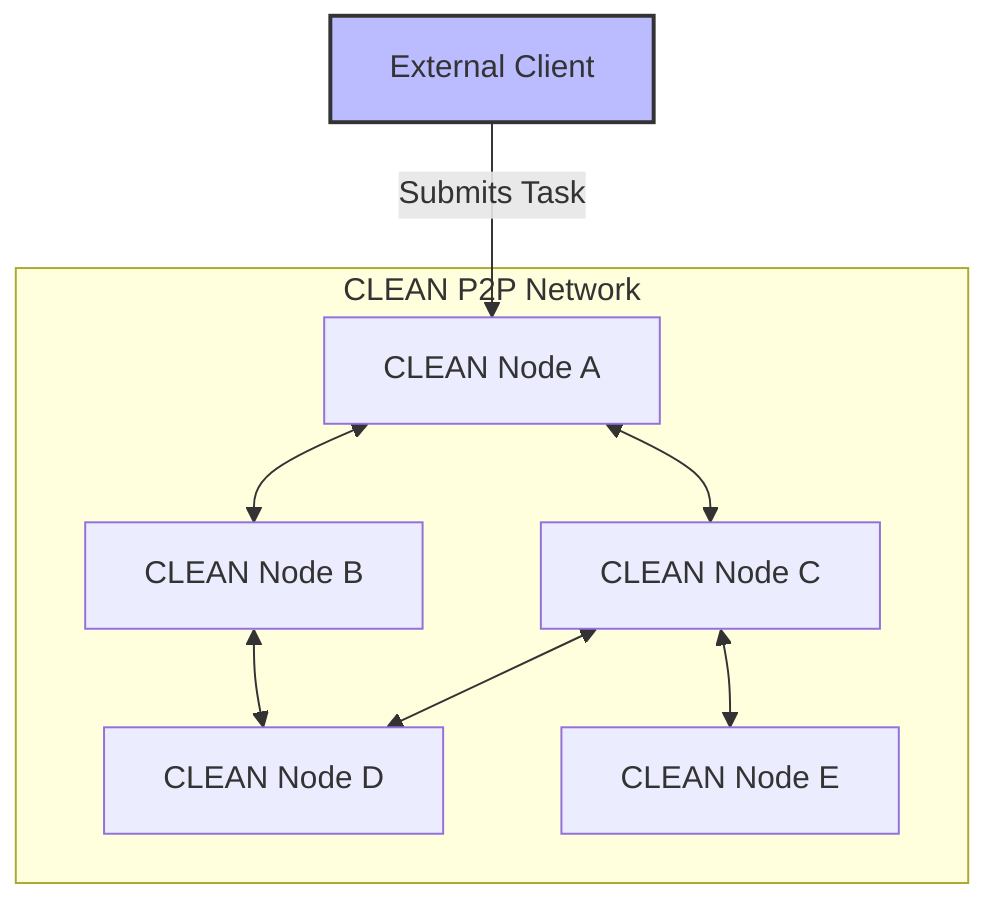
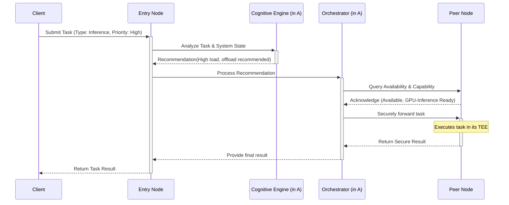

# **Whitepaper: Cognitive Logistic Execution Adaptability Network (CLEAN)**
### *A Framework for Decentralized, Adaptive, and Trusted Execution*

**Version:** 1.0
**Date:** October 26, 2023

---

## Abstract

The contemporary digital landscape requires computational systems that are not only secure and efficient but also intelligent and resilient. Current solutions often suffer from rigidity, single points of failure, and an inability to dynamically adapt to evolving workloads and threat landscapes. This whitepaper introduces the **Cognitive Logistic Execution Adaptability Network (CLEAN)**, a novel architectural paradigm for decentralized TEEs. CLEAN servers are designed to handle a variety of inference-enabled tasks with a core focus on **execution adaptability**. By integrating cognitive AI/ML engines within a decentralized network of TEEs, the CLEAN framework enables dynamic adjustment of execution strategies, resource allocation, and security protocols in real-time. This paper outlines the conceptual foundation, architectural model, and key mechanisms of CLEAN, which is uniquely built upon a **hardened, forked Kali Linux distribution and implemented in Golang**, positioning it as a next-generation solution with a proactive security posture for decentralized computing.

---

## 1. Introduction

The convergence of distributed ledger technology (DLT), artificial intelligence (AI), and secure computing has created a demand for systems that can perform complex, data-sensitive tasks without relying on a central trusted authority. While TEEs provide hardware-level confidentiality and integrity, they traditionally operate with fixed protocols. On the other hand, powerful AI models are often deployed in centralized environments, creating bottlenecks and trust issues.

The core problem is the lack of a framework that unifies the security of TEEs, the intelligence of AI, and the resilience of decentralized networks in a dynamically adaptive manner. A system is needed that can not only execute tasks securely but also learn from its operational context to optimize performance, re-allocate resources, and proactively defend against threats.

The **Cognitive Logistic Execution Adaptability Network (CLEAN)** is proposed as the solution to this challenge.

---

## 2. The CLEAN Concept

### 2.1. Core Definition
CLEAN is a decentralized network of servers, each equipped with a Trusted Execution Environment (TEE) and onboard cognitive capabilities. The network is designed to handle a variety of inference-enabled tasks, from ledger management to complex data analytics. Its defining feature is **execution adaptability**: the intrinsic ability to dynamically modify execution strategies, resource allocation, and operational parameters based on task requirements, network conditions, and real-time inference.

### 2.2. Differentiation from Existing Paradigms
Unlike traditional TEEs with static execution protocols or federated learning systems that focus solely on model training, CLEAN emphasizes holistic operational adaptability. It evolves its execution methods in response to new task archetypes, shifting data patterns, and emerging security threats, making the entire network more versatile and resilient than its predecessors.

---

## 3. Architectural Model

The CLEAN architecture is composed of the internal structure of a single CLEAN Node, the network topology, and the specific implementation stack that underpins its security philosophy.

### 3.1. Single CLEAN Node Architecture

Each node in the CLEAN network is a self-contained server with a layered architecture designed for security and adaptability. The core logic is isolated within a TEE enclave.

*   **Node Manager:** An untrusted component on the host that manages the incoming task queue and communication with other nodes.
*   **TEE Enclave:** The hardware-isolated secure container.
    *   **Cognitive Engine:** An AI/ML model that analyzes task metadata, system metrics (CPU load, memory usage), and network state to provide adaptation insights.
    *   **Adaptability Orchestrator:** The "brain" of the node. It receives recommendations from the Cognitive Engine and makes decisions: adjusting resource priorities, selecting the appropriate ML model for an inference task, or deciding to offload a task to a peer node.
    *   **Secure Execution Core:** The sandboxed environment where the task (e.g., smart contract execution, inference calculation) is actually performed.
    *   **Secure Store:** Encrypted memory for sensitive data, keys, and intermediate state.

### 3.2. Implementation Stack: A Proactive Security Approach

The choice of underlying technology is a critical architectural decision that reinforces the CLEAN philosophy. Our stack is chosen not for convention, but for its strategic advantages in creating a secure, adaptive, and resilient network.

#### **Base Operating System: A Forked Kali Linux Distribution**

While unconventional for a server environment, we have selected a minimalist, hardened fork of Kali Linux as the base OS for all CLEAN nodes. This is a deliberate choice to embed a proactive, "offense-informs-defense" security posture directly into the network's fabric. Instead of a passive server OS, our custom distribution provides an active security toolkit.

**Advantages of this architecture:**
*   **Continuous Self-Auditing:** Each CLEAN node can leverage the built-in security toolset to perform automated, continuous vulnerability scans and penetration tests on its peers. This turns the network into a self-healing and self-hardening ecosystem, where nodes actively identify and isolate potential weaknesses in real-time.
*   **Hardened Core & Minimalist Profile:** Our fork strips Kali Linux of all non-essential packages (e.g., GUI tools), leaving a minimal attack surface. The remaining kernel and services are specifically hardened for a server role, combining the robust security toolchain with a hardened operational environment.
*   **Advanced Incident Response & Forensics:** In the event a node is compromised or exhibits malicious behavior, designated auditor nodes can use the rich set of forensic tools inherited from Kali to conduct a deep, secure analysis of the incident, facilitating rapid containment and network recovery.

#### **Core Logic Implementation: Golang (Go)**

The Node Manager and the core logic within the TEE enclave (Orchestrator, Execution Core) are implemented in Golang. Go's design philosophy aligns perfectly with the requirements of a high-performance, concurrent, and secure decentralized system.

**Advantages of using Golang:**
*   **High Concurrency:** Go's lightweight goroutines and channels are ideal for managing thousands of concurrent network connections, task executions, and internal cognitive processes with exceptional efficiency.
*   **Performance and Memory Safety:** As a compiled language, Go offers performance approaching that of C++, but with built-in memory safety features that prevent entire classes of common vulnerabilities, a critical feature for code running within a TEE.
*   **Simplified Secure Deployment:** Go compiles to a single, statically-linked binary with no external dependencies. This dramatically simplifies secure deployment and the remote attestation process, as we only need to verify the hash of a single, self-contained executable.
*   **Robust Standard Library:** Go's mature libraries for cryptography, networking, and concurrency streamline the development of secure and complex distributed systems.

**Synergy:** The Kali Linux fork and Golang are not competing choices; they are complementary layers. Kali provides the hardened, auditable **environment**, while Golang provides the performant, secure **application** that runs within it. This combination ensures that CLEAN is secure from the kernel up to the application logic.

### 3.3. Decentralized Network Topology

CLEAN nodes form a peer-to-peer mesh network, eliminating any single point of failure and enabling distributed load balancing.

### 3.4. Execution Adaptability Workflow

The following sequence diagram illustrates how a task is handled with adaptability.

---

## 4. Key Components and Mechanisms

### 4.1. Trusted Execution Environments (TEEs)
The foundation of CLEAN is the TEE, providing a hardware-enforced guarantee of confidentiality and integrity for both code and data during execution. This ensures that even a compromised host OS cannot tamper with the operations inside the enclave.

### 4.2. Cognitive and Inference Capabilities
Each node's Cognitive Engine uses advanced AI/ML algorithms to enable intelligent decision-making. This engine:
*   **Analyzes incoming tasks:** Classifies tasks by type, complexity, and resource requirements.
*   **Monitors node and network health:** Tracks CPU/memory load, network latency, and peer availability.
*   **Continuously learns:** Adapts its recommendation models based on performance feedback, improving its orchestration decisions over time.

### 4.3. Execution Adaptability Mechanisms
This is the core innovation of CLEAN, implemented by the Adaptability Orchestrator.
*   **Dynamic Task Allocation:** Tasks are routed to the most suitable node based on current load, specialized hardware (e.g., GPUs for inference), and data locality.
*   **Resource Scaling:** The orchestrator can dynamically adjust CPU priority, memory allocation, and other resources dedicated to the execution core based on the task's demands.
*   **Adaptive Inference Models:** For tasks requiring machine learning, the orchestrator can select from a library of models within the TEE, choosing the one that offers the best trade-off between accuracy and performance for the specific request.

### 4.4. Decentralized Architecture
The network operates without a central coordinator, providing:
*   **Fault Tolerance:** The failure of one or more nodes does not compromise the entire network.
*   **Scalability:** New nodes can join the network to increase its aggregate capacity.
*   **Censorship Resistance:** No single entity can block or control transactions/tasks.

---

## 5. Benefits and Applications

### 5.1. Benefits
*   **Proactive and Verifiable Security:** TEEs provide hardware-level security, while the Kali-based OS enables continuous, automated network self-auditing.
*   **Improved Efficiency and Performance:** Adaptive resource allocation and task routing, powered by highly concurrent Go-based services, optimize system throughput.
*   **Flexibility and Versatility:** The architecture is not tied to a single application and can support diverse workloads from DeFi to AI-driven logistics.
*   **Advanced Resilience:** The decentralized architecture, combined with active threat hunting and forensic capabilities, allows the network to robustly withstand failures and attacks.

### 5.2. Potential Applications
*   **Decentralized Finance (DeFi):** Highly secure and adaptive execution of smart contracts, risk assessment models, and privacy-preserving transactions.
*   **Supply Chain Management:** Dynamic optimization of logistics routes, predictive maintenance scheduling, and a secure, transparent ledger of custody.
*   **Healthcare:** Secure processing of confidential patient data for diagnostic AI, while maintaining patient privacy and interoperability between providers.
*   **IoT and Edge Computing:** Local, low-latency inference on data from IoT devices, with secure aggregation and communication channels.

---

## 6. Challenges and Future Outlook

### 6.1. Challenges
*   **Implementation Complexity:** The intersection of cryptography, distributed systems, ML, and hardware security presents significant engineering challenges.
*   **Performance Overhead:** The security and adaptability layers may introduce latency. Continuous optimization of the Golang code and TEE interactions is required.
*   **Interoperability:** Establishing standards for inter-node communication, attestation, and task formats is crucial for network growth.
*   **Custom OS Maintenance (MODIFIED):** Maintaining a custom, hardened fork of Kali Linux requires a dedicated effort to keep it patched, secure, and synchronized with upstream security updates.
*   **Regulatory Compliance:** Applications in regulated fields like finance and healthcare will require careful design to meet compliance standards.

### 6.2. Future Outlook
*   **Research & Development:** Future work will focus on more advanced cognitive algorithms, zero-knowledge proof integration for enhanced privacy, and more efficient TEE implementations.
*   **Industry Adoption:** As the technology matures, CLEAN has the potential to become the backbone for a new class of decentralized, intelligent applications.
*   **Integration with Emerging Technologies:** The CLEAN framework is well-positioned to integrate with 5G, quantum-resistant cryptography, and advanced robotics, unlocking novel use cases.

---

## 7. Conclusion

The Cognitive Logistic Execution Adaptability Network (CLEAN) represents a significant leap forward in the design of decentralized systems. By merging the security of Trusted Execution Environments with the intelligence of AI and the resilience of a P2P network, CLEAN provides a robust framework for the next generation of digital services. Its unique implementation on a **proactive, Kali-based security platform and a high-performance Golang core** underscores its commitment to a defense-in-depth philosophy. Its core principle of execution adaptability ensures that the system can evolve and thrive in a complex and dynamic world, paving the way for truly secure, efficient, and intelligent decentralized applications.
