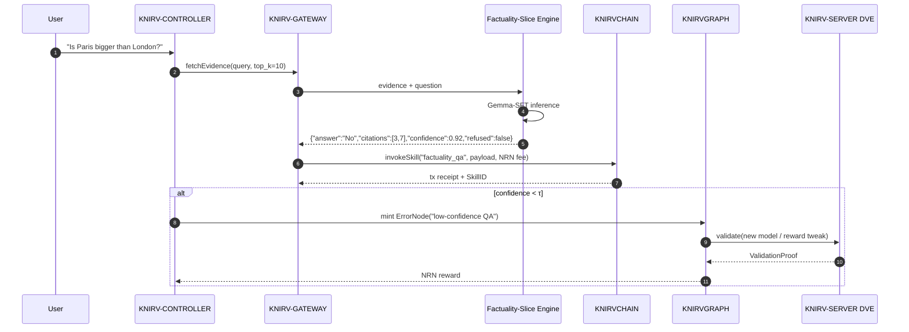

# Factuality Slice Integration Strategy for KNIRV D-TEN

## Executive Summary

The Factuality Slice framework presents a structured approach to evidence-grounded AI responses with calibrated refusal - capabilities that align perfectly with KNIRV's D-TEN vision of self-healing AI networks. This integration strategy outlines how to incorporate the framework's key innovations into KNIRV's 12 sovereign layers.

## 🔗 Integration Blueprint  
**Factuality-Slice (zero-hallucination QA)** ➜ **KNIRV D-TEN**  

> *Turn every user question that hits a KNIRV model into an evidence-grounded, fully-cited, confidence-scored answer—while burning/earning NRN tokens in the loop.*

---

### 1. Architectural Fit (Why it makes sense)

| Factuality-Slice delivers | KNIRV D-TEN needs |
|---------------------------|-------------------|
| Evidence-grounded JSON answers (`answer`, `citations`, `confidence`, `refused`) | Verifiable, deterministic skill outputs for **KNIRVCHAIN** |
| DeBERTa-v3 reward model (97.4 % pairwise acc.) | A **CapabilityNode** that scores answer quality on-chain |
| Calibrated refusal when evidence is insufficient | **ErrorNode** creation → “insufficient evidence” cluster → reward loop |
| LoRA fine-tuned Gemma-2-9B | One of many pluggable **Base LLM adapters** in **KNIRVCHAIN** |

---

### 2. Step-by-Step Integration Flow



---


## Key Integration Opportunities

### 1.1 KNIRVCHAIN Base LLM Enhancement

**Integration Point**: Augment the current foundation model (HART) with Factuality Slice-training.

**Implementation**:
- Deploy Gemma-2-9B with QLoRA fine-tuning as documented in the paper
- Implement the standardized JSON schema for all model responses:
  ```json
  {
    "answer": "response text",
    "citations": [evidence_id_1, evidence_id_2],
    "confidence": 0.85,
    "refused": false
  }
  ```
- Integrate the DeBERTa-v3 reward model (97.4% pairwise accuracy) for RLHF optimization


#### 1.2 Package Factuality-Slice as a **CapabilityNode**

```bash
# 1. Containerize the SFT model
docker build -t knirv/fact-slice:1.0 \
  --build-arg MODEL=checkpoints/sft/gemma2-9b/checkpoint-final \
  --build-arg REWARD=checkpoints/rm .

# 2. Upload WASM + weights to IPFS → grab CID
ipfs add -r fact-slice-wasm/
# → CID `bafy...abc123`
```

#### 1.3 Register Capability on KNIRVCHAIN via SDK

```ts
import { KnirvSDK } from "@knirv/sdk";

const sdk = new KnirvSDK({ gateway: "https://api.knirv.com" });

const capTx = await sdk.cap.register({
  name: "factuality_qa_v1",
  container: "bafy...abc123",
  inputSchema: { question: "string", evidence: "string[]" },
  outputSchema: { answer: "string", citations: "number[]", confidence: "number", refused: "boolean" },
  costNRN: 0.25,
  rewardSplit: { solver: 0.7, dve: 0.2, observer: 0.1 }
});
```


**Value Proposition**: Near-zero hallucination rate (0.0% vs 0.6% baseline) with improved accuracy (EM=80.5% vs 52.3%).

### 2. Evidence Provider Plug-in for KNIRVGRAPH: Knowledge Fabric Integration

**Integration Point**: Extend KNIRVGRAPH to support evidence-based queries and factuality checks. Enhance ErrorNode and SkillNode structures with evidence grounding.


**Implementation**:
- Develop source adapters for diverse knowledge sources:
- - **Source adapters**: Wikipedia dump, Arxiv, custom vector DB  
- Implement chunking logic with context preservation:
- - **Chunker**: 512-token sliding window → `evidence: Vec<String>` 
- Store hash-to-CID mappings on KNIRVGRAPH for traceability and reproducibility:
- - **Hash-to-CID mapping** stored on **KNIRVGRAPH** for citation integrity.
- **Knowledge Fabric**: Facilitate seamless querying across multiple sources with evidence tracking.
- **Evidence Grounding**: Ensure each answer includes relevant evidence chunks and their associated IDs.

**Implementation**:
- Modify ErrorNode schema to include:
  - Evidence chunks that led to the failure
  - Confidence scores for failure classification
  - Citation validity metadata
- Enhance SkillNode validation with:
  - Evidence-grounded solution verification
  - Confidence calibration for solution effectiveness
  - Refusal mechanisms for insufficient evidence scenarios

  #### Confidence ↔ Refusal Gate

```python
def refusal_gate(confidence: float, evidence_len: int) -> bool:
    if evidence_len == 0 or confidence < 0.3:
        return True   # Triggers ErrorNode mint
    return False
```

**Technical Integration**:
```go
type EnhancedErrorNode struct {
    BaseErrorNode
    EvidenceChunks    []EvidenceChunk    `json:"evidence_chunks"`
    FailureConfidence float64           `json:"failure_confidence"`
    CitationValidity  []bool            `json:"citation_validity"`
}

type EnhancedSkillNode struct {
    BaseSkillNode
    SolutionConfidence float64          `json:"solution_confidence"`
    EvidenceSupport   []EvidenceID     `json:"evidence_support"`
    RefusalThreshold  float64          `json:"refusal_threshold"`
}
```
**Value Proposition**: Improved trustworthiness and credibility for KNIRVCHAIN skills, enabling more secure and transparent interactions between users and AI objects.

### 3. KNIRV-SERVER DVE Validation Enhancement

**Integration Point**: Implement Factuality Slice validation methodology within DVE environments.

**Implementation**:
- Deploy the offline judge (Qwen2.5-3B-Instruct) with debiasing techniques
- Integrate order swap and style anonymization for preference building
- Implement minimum margin filtering (0.12) for validation quality
- Add calibrated refusal mechanisms to DVE validation processes

**CLEAN Paradigm Enhancement**:
- Cognitive Engine: Integrate confidence scoring and evidence evaluation
- Logistic Execution: Implement structured JSON output validation
- Adaptability Network: Dynamic refusal threshold adjustment based on evidence quality

### 4. KNIRV-CORTEX MODEL Development Platform

**Integration Point**: Embed Factuality Slice training pipeline into model development workflow.

**Implementation**:
- Provide SFT→preference pipeline templates
- Integrate reward model training capabilities
- Offer confidence calibration tools for custom model training
- Include evidence-grounding validation for model skill development

**Developer Tools**:
- Pre-configured QLoRA training scripts (r=16, α=32, dropout=0.05)
- Automated preference pair generation using offline judges
- Calibration analysis tools (ECE, Brier scores)
- Robustness testing frameworks (noise injection, distractor clutter)

### 5. KNIRVANA Gaming Integration

**Integration Point**: Gamify evidence evaluation and factuality assessment.

**Implementation**:
- Create gameplay mechanics around evidence evaluation accuracy
- Reward players for identifying hallucinations and mis-citations
- Implement competitive factuality scoring systems
- Use game data to improve evidence-grounding objects

**Game Mechanics**:
- "Evidence Detective" mode where players verify AI responses
- Hallucination hunting challenges with NRN rewards
- Citation accuracy competitions with leaderboards
- Confidence calibration training mini-games

## Technical Architecture Integration

### Modified KNIRV-GATEWAY API

Extend the unified API gateway to support factuality-aware requests:

```typescript
interface FactualityAwareRequest {
  query: string;
  evidence_context: EvidenceChunk[];
  require_citations: boolean;
  confidence_threshold: number;
  allow_refusal: boolean;
}

interface FactualityAwareResponse {
  answer: string;
  citations: number[];
  confidence: number;
  refused: boolean;
  hallucination_risk: number;
  evidence_quality_score: number;
}
```

### KNIRV-SDK Integration

Add factuality utilities to the multi-language SDK:

```python
# Python SDK example
from knirv_sdk import FactualityClient

client = FactualityClient()
result = client.query_with_evidence(
    question="What is the capital of France?",
    evidence_chunks=evidence_data,
    min_confidence=0.8,
    enable_refusal=True
)

if result.refused:
    print("Insufficient evidence for reliable answer")
else:
    print(f"Answer: {result.answer} (Confidence: {result.confidence})")
```

#### KNIRV-CLI Tool Integration

##### One-Command Dev Preview

```bash
# Spin up local D-TEN + Factuality-Slice
knirv testnet up --with-skill factuality_qa_v1:latest
knirv shell
> knirv skill invoke factuality_qa_v1 \
    --question "Who wrote Neuromancer?" \
    --evidence-url https://en.wikipedia.org/wiki/Neuromancer
```

---

## Economic Model Integration

### NRN Token Utility Enhancement

- **Factuality Staking**: Users stake NRN for high-confidence, evidence-grounded responses
- **Hallucination Insurance**: Penalty mechanisms for responses that fail factuality checks
- **Citation Rewards**: Bonus NRN for objects providing accurate citations
- **Evidence Quality Mining**: Reward high-quality evidence contribution to knowledge graph

### Reward Model Economics

- DVE operators earn additional NRN for factuality validation services
- Solvers receive confidence-weighted rewards based on evidence quality
- Observers get bonuses for identifying and reporting hallucinations

Economic Loop inside KNIRV

| Actor | Action | NRN Flow |
|-------|--------|----------|
| **User / Agent** | Pays 0.25 NRN to invoke `factuality_qa` | Burn on **KNIRV-ORACLE** |
| **Solver** | Improves model weights when ErrorNode cluster is resolved | Earns 70 % of bounty |
| **DVE** | Validates new weights or evidence retriever | Earns 20 % |
| **Observer** | Submits new high-value evidence source | Earns 10 % |

---
Roadmap & Milestones

| Phase | Deliverable | Date |
|-------|-------------|------|
| **M1** | Factuality-Slice WASM + SDK wrapper | 2 wks |
| **M2** | Evidence retriever adapter + IPFS pipeline | 3 wks |
| **M3** | Deploy CapabilityNode on **KNIRV-TESTNET** + regression tests | 1 wk |
| **M4** | Integrate into **KNIRVANA** quests (“Prove this headline”) | 6 wks |
| **M5** | On-chain reward model upgrade via DVE consensus | 8 wks |

---


## Implementation Roadmap

### Phase 1: Foundation (Q1 2026)
- Deploy Factuality Slice framework in KNIRV-TESTNET
- Integrate basic JSON schema across KNIRVCHAIN and KNIRVGRAPH
- Train initial reward objects on KNIRV-specific data

### Phase 2: Integration (Q2 2026)
- Roll out enhanced ErrorNode/SkillNode structures
- Deploy factuality-aware DVE validation
- Launch developer tools in KNIRV-CORTEX

### Phase 3: Optimization (Q3 2026)
- Integrate gaming mechanics in KNIRVANA
- Deploy advanced calibration and robustness features
- Launch economic incentives for factuality

### Phase 4: Scale (Q4 2026)
- Full production deployment across all sovereign layers
- Advanced multi-model architecture support
- Cross-chain factuality verification protocols

## Competitive Advantages

1. **First-Mover in Decentralized Factuality**: No major AI/blockchain competitor has integrated systematic hallucination prevention
2. **Verifiable Trust**: Cryptographic proofs of response accuracy through DVE validation
3. **Economic Alignment**: Token incentives directly reward factual accuracy over engagement
4. **Self-Improving Accuracy**: Network learns from factuality failures to improve system-wide reliability
5. **Enterprise Appeal**: Businesses require verifiable, non-hallucinating AI for critical applications

## Risk Mitigation

### Market Risks
- **Competition Entry**: Rapidly develop countermeasures against potential competitors
- **Market Education**: Invest in thought leadership and content marketing to establish brand as AI trust pioneer

### Security & Trust Notes

- **Zero-knowledge proof** of inference trace (zk-SNARK) optional for DVE validation.  
- **Blinded evaluation**: DVE judges never see raw evidence text—only hashes.  
- **Slashing**: Mis-citation > 5 % on validation set ⇒ staked NRN slashed.

### Technical Risks
- **Over-refusal**: Monitor refusal rates to prevent excessive conservatism
- **Performance Impact**: Benchmark response latency with factuality checks
- **Model Drift**: Continuous monitoring of confidence calibration accuracy

### Economic Risks
- **Incentive Misalignment**: Careful design of factuality rewards vs. speed incentives
- **Gaming Vulnerability**: Robust mechanisms to prevent factuality score manipulation

## Success Metrics

- Hallucination rate reduction (target: <0.5% across all objects)
- Citation accuracy improvement (target: >85% network-wide)
- User confidence scores (target: calibrated within 5% of actual accuracy)
- Economic adoption (target: 30% of NRN transactions involve factuality features)
- Developer adoption (target: 50% of custom objects use factuality framework)

## Conclusion

Integrating the Factuality Slice framework positions KNIRV as the leader in verifiable, trustworthy decentralized AI. This integration addresses the critical market need for reliable AI while leveraging KNIRV's unique multi-layer architecture to create sustainable competitive advantages through evidence-grounded, economically incentivized truth verification.

### TL;DR

1. Wrap Factuality-Slice as a **CapabilityNode** → WASM.  
2. Register on **KNIRVCHAIN** via SDK; pay/earn NRN.  
3. Automatic **ErrorNode** creation for low-confidence answers → continuous improvement loop.  
4. Users get verifiable, cite-backed answers; KNIRV network gets smarter every query.

🎯 *Every question answered in KNIRV becomes a micro-lesson that compounds the global intelligence—powered by your factuality engine.*