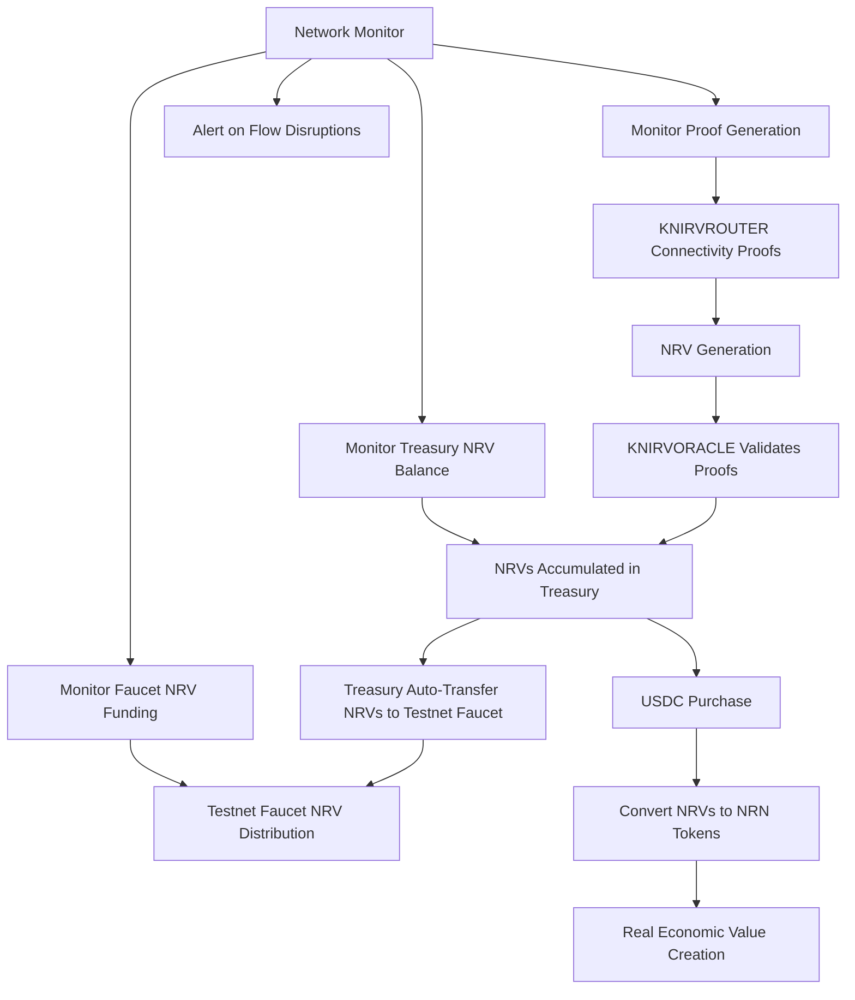

# KNIRVTESTNET NRV Faucet Implementation Plan

## Overview

This document outlines the comprehensive implementation plan for establishing a KNIRVTESTNET NRV faucet that integrates seamlessly with the existing testnet infrastructure. The faucet will provide developers with easy access to testnet NRVs (Notice of Recoverable Vector) for testing and development purposes.

**🔗 Key Integration:** The testnet faucet is directly linked to KNIRVROUTER's NRV production process, ensuring sustainable funding through actual network utility generation via connectivity proofs, with KNIRVORACLE treasury management and comprehensive network monitoring.

## 🔧 KNIRV Network Economic Model

### NRV vs NRN Token Distinction

**⚡ KNIRVROUTERS Create NRVs (Notice of Recoverable Vector)**
- KNIRVROUTERS perform connectivity proofs and generate **NRVs** - not direct NRN tokens
- NRVs represent "notices" of network utility that can be converted to actual economic value
- NRVs are the fundamental unit of network utility production and testnet operations

**💰 NRN Tokens Generated Only Upon USDC Purchase**
- Real **NRN tokens** are created only when NRVs are purchased with USDC
- This creates a direct fiat-backed value exchange mechanism
- NRN tokens represent actual economic value, not just network utility

**🧪 Testnet Faucet Distributes NRVs Only**
- KNIRVTESTNET faucet distributes **NRVs for testing purposes**
- Developers test with NRVs to understand network mechanics without economic risk
- No real economic value (NRN tokens) is distributed in testnet environment

**🔄 NRV Lifecycle in Testnet**
- NRVs can be **held for future purchase** into NRN status with USDC
- NRVs can be **dripped to testnet faucet** for developer testing
- NRVs provide **proof of network utility** without immediate economic conversion
- Testnet operations use utility tokens (NRVs) not value tokens (NRNs)

## Economic Flow Architecture

### NRV Production → Treasury → Testnet Faucet Flow



### Economic Sustainability Model

1. **KNIRVROUTER Proof Generation**: Network routers perform connectivity proofs to validate network integrity
2. **NRV Creation**: Successful proofs generate NRVs (Notice of Recoverable Vector) - utility tokens
3. **Treasury Accumulation**: KNIRVORACLE treasury wallet receives and manages NRVs
4. **Testnet Funding**: Configurable percentage (15-20%) of new NRVs automatically funds testnet faucet
5. **Sustainable Operations**: Testnet operations funded by actual network utility tokens (NRVs)
6. **Value Creation Path**: NRVs can be purchased with USDC to create real NRN tokens

### Treasury Integration Points

- **KNIRVORACLE Master Wallet**: Central treasury for NRV accumulation from ROUTER proofs
- **Automatic Transfer Logic**: Smart contract or service to transfer percentage of NRVs to testnet faucet
- **Balance Monitoring**: Real-time tracking of treasury and faucet NRV balances
- **Emergency Funding**: Manual treasury NRV transfers for critical testnet operations
- **Economic Metrics**: Track proof generation rates, NRV creation success, and distribution patterns
- **Value Conversion Tracking**: Monitor NRV to NRN conversions via USDC purchases

## Current Infrastructure Analysis

### Existing Faucet Components
- **KNIRVORACLE**: Central NRV issuer and treasury manager with faucet module (port 1317)
- **KNIRVROUTER**: NRV generation through connectivity proofs and rewards
- **KNIRVCLI/KNIRVSDK**: NRV token managers with faucet clients for testnet
- **KNIRVGATEWAY**: API gateway with SSE capabilities (port 8888)
- **KNIRVTESTNET**: Main testnet orchestrator and NRV faucet (port 10000)

### Integration Points
- **KNIRVROUTER**: Connectivity proof engine and NRV generation integration
- **KNIRVORACLE**: Treasury wallet management and NRV faucet funding
- **KNIRVGATEWAY**: SSE system for real-time updates
- **Network Monitor**: Economic flow monitoring and alerting
- **Testnet Configuration**: Automated NRV funding and balance management
- **USDC Bridge**: NRV to NRN conversion tracking (for production value creation)

## Architecture Design

### System Components

#### 1. Faucet Web Interface
- **Location**: `KNIRVTESTNET/server/public/faucet.html`
- **Features**: 
  - Simple wallet address input form
  - Amount selection (predefined amounts + custom)
  - Real-time request status updates
  - Request history display
  - Faucet status and limits dashboard

#### 2. Backend API Service
- **Location**: `KNIRVTESTNET/server/routes/faucet.js`
- **Core Endpoints**:
  - `POST /api/faucet/request` - Request NRV tokens (testnet utility tokens)
  - `GET /api/faucet/status` - Check faucet status and NRV limits
  - `GET /api/faucet/history` - Get NRV request history for address
  - `GET /api/faucet/health` - Health check endpoint
- **Economic Flow Endpoints**:
  - `GET /api/faucet/treasury/status` - Treasury NRV balance and health
  - `GET /api/faucet/router/proofs` - ROUTER proof generation and NRV creation metrics
  - `GET /api/faucet/funding/history` - Treasury to faucet NRV funding history
  - `POST /api/faucet/treasury/transfer` - Manual treasury NRV transfer (admin)
  - `GET /api/faucet/economic/metrics` - Complete NRV economic flow metrics
- **Value Conversion Endpoints**:
  - `GET /api/faucet/nrv/conversion-rate` - Current NRV to NRN conversion rate
  - `GET /api/faucet/nrv/purchase-history` - NRV to NRN purchase history

#### 3. Rate Limiting System
- **Per IP**: 5 requests per hour
- **Per Wallet**: 1000 NRV per day (testnet utility tokens)
- **Global Limit**: 10,000 NRV per hour
- **Cooldown**: 15 minutes between requests from same address
- **NRV Safety**: No real economic value at risk (NRVs are utility tokens)

#### 4. ROUTER Integration Layer
- **Location**: `KNIRVTESTNET/server/services/router-integration.js`
- **Functions**:
  - Monitor KNIRVROUTER connectivity proof generation
  - Track NRV creation requests and success rates
  - Verify treasury wallet NRV funding from ROUTER proofs
  - Alert on proof generation failures or low NRV creation rates
  - Monitor NRV to NRN conversion opportunities

#### 5. Treasury Management Service
- **Location**: `KNIRVTESTNET/server/services/treasury-manager.js`
- **Functions**:
  - Monitor KNIRVORACLE treasury NRV balance
  - Execute automatic NRV transfers from treasury to faucet
  - Manage NRV funding thresholds and emergency procedures
  - Track NRV economic flow metrics and health
  - Monitor NRV to NRN conversion rates and opportunities

#### 6. Request Tracking Database
- **Storage**: BuntDB or JSON file-based storage
- **Data**: timestamp, IP, wallet address, amount, status, tx_hash
- **Retention**: 30 days for analytics and abuse prevention

## API Specifications

### POST /api/faucet/request
```json
Request: {
  "address": "knirv1abc123...",
  "amount": "1000",
  "reason": "development testing"
}

Response: {
  "success": true,
  "request_id": "faucet_req_123456789",
  "tx_hash": "0xabc123...",
  "amount": "1000",
  "status": "pending",
  "estimated_confirmation": "30s"
}
```

### GET /api/faucet/status
```json
Response: {
  "faucet_enabled": true,
  "daily_limit": "10000",
  "remaining_today": "8500",
  "rate_limits": {
    "per_ip_hourly": 5,
    "per_address_daily": "1000",
    "cooldown_minutes": 15
  },
  "current_queue_size": 3,
  "average_processing_time": "25s"
}
```

## Implementation Phases

### Phase 1: Core Faucet Service (Week 1)
**Deliverables:**
- Faucet API endpoints with request validation
- Rate limiting implementation
- Basic integration with KNIRVORACLE
- Request tracking database setup

**Files to Create/Modify:**
- `server/routes/faucet.js` (new)
- `server/handlers/faucet.js` (new)
- `server/app.js` (modify - add faucet routes)
- `config/testnet-config.yaml` (modify - add faucet config)

### Phase 2: Web Interface (Week 2)
**Deliverables:**
- Responsive faucet web interface
- Real-time status updates via SSE
- Request history and tracking
- Integration with testnet navigation

**Files to Create/Modify:**
- `public/faucet.html` (new)
- `public/js/faucet.js` (new)
- `public/css/faucet.css` (new)
- `index.html` (modify - add faucet navigation link)

### Phase 3: Integration & Testing (Week 3)
**Deliverables:**
- Complete service integration
- Comprehensive error handling
- Health monitoring integration
- Automated test suite

**Files to Create/Modify:**
- `tests/faucet-integration.test.js` (new)
- `server/handlers/health-check.js` (modify - add faucet health)
- `scripts/health-check.sh` (modify - include faucet checks)

### Phase 4: Documentation & Polish (Week 4)
**Deliverables:**
- Complete API documentation
- Developer usage guides
- Performance optimization
- Analytics and monitoring

**Files to Create:**
- `docs/faucet-api.md`
- `docs/faucet-developer-guide.md`
- `docs/faucet-troubleshooting.md`

## Configuration

### Environment Variables
```bash
# Faucet Configuration
FAUCET_ENABLED=true
FAUCET_DAILY_LIMIT=10000
FAUCET_PER_IP_HOURLY_LIMIT=5
FAUCET_PER_ADDRESS_DAILY_LIMIT=1000
FAUCET_COOLDOWN_MINUTES=15
FAUCET_DEFAULT_AMOUNT=1000

# Integration Endpoints
KNIRVORACLE_FAUCET_ENDPOINT=http://localhost:1317/api/mint/nrn
FAUCET_DATABASE_PATH=./data/faucet-requests.db
```

### Testnet Configuration Update
```yaml
# Addition to config/testnet-config.yaml
faucet:
  enabled: true
  daily_limit: 10000
  rate_limits:
    per_ip_hourly: 5
    per_address_daily: 1000
    cooldown_minutes: 15
  default_amounts: [100, 500, 1000, 5000]
  max_custom_amount: 5000
  knirvoracle_endpoint: "http://localhost:1317/api/mint/nrn"
  database_path: "./data/faucet-requests.db"
```

## Security Measures

### Input Validation
- Wallet address format validation (KNIRV address format)
- Amount range validation (1-5000 NRN)
- Request frequency validation
- IP address sanitization

### Rate Limiting
- Multi-layer rate limiting (IP, address, global)
- Exponential backoff for repeated violations
- Temporary IP blocking for abuse attempts
- Request queue management

### Monitoring & Alerting
- Real-time abuse detection
- Faucet depletion alerts
- Error rate monitoring
- Performance metrics tracking

## Integration with KNIRVORACLE Network Monitor

### Monitoring Architecture Integration
The testnet faucet will integrate seamlessly with the existing KNIRVORACLE network-monitor system, leveraging its comprehensive monitoring stack:

#### Prometheus Metrics Integration
```yaml
# Addition to KNIRVORACLE/network-monitor/config/prometheus.yml
scrape_configs:
  # KNIRV Testnet Services (existing)
  - job_name: 'knirv-testnet-oracle'
    static_configs:
      - targets: ['host.docker.internal:1317']
    metrics_path: '/metrics'
    scrape_interval: 30s

  # NEW: Testnet Faucet Metrics
  - job_name: 'knirv-testnet-faucet'
    static_configs:
      - targets: ['host.docker.internal:10000']
    metrics_path: '/api/faucet/metrics'
    scrape_interval: 15s
    params:
      format: ['prometheus']
```

#### Faucet-Specific Alert Rules
```yaml
# Addition to KNIRVORACLE/network-monitor/config/alert_rules.yml
groups:
  - name: knirv_faucet_alerts
    rules:
      - alert: FaucetDown
        expr: up{job="knirv-testnet-faucet"} == 0
        for: 2m
        labels:
          severity: critical
          service: faucet
        annotations:
          summary: "Testnet Faucet is down"
          description: "The KNIRV testnet faucet has been down for more than 2 minutes."

      - alert: FaucetHighRequestRate
        expr: rate(faucet_requests_total[5m]) > 10
        for: 3m
        labels:
          severity: warning
          service: faucet
        annotations:
          summary: "High faucet request rate detected"
          description: "Faucet is receiving more than 10 requests per minute for 3 minutes."

      - alert: FaucetLowBalance
        expr: faucet_balance_nrn < 1000
        for: 1m
        labels:
          severity: warning
          service: faucet
        annotations:
          summary: "Faucet balance is low"
          description: "Testnet faucet balance is below 1000 NRN."

      - alert: FaucetAbuseDetected
        expr: rate(faucet_requests_rejected_total[1m]) > 5
        for: 2m
        labels:
          severity: critical
          service: faucet
        annotations:
          summary: "Potential faucet abuse detected"
          description: "More than 5 faucet requests rejected per minute for 2 minutes."

      - alert: FaucetResponseTimeHigh
        expr: histogram_quantile(0.95, rate(faucet_request_duration_seconds_bucket[5m])) > 5
        for: 3m
        labels:
          severity: warning
          service: faucet
        annotations:
          summary: "Faucet response time is high"
          description: "95th percentile response time is above 5 seconds."
```

#### Grafana Dashboard Integration
The faucet will be included in the existing KNIRV testnet monitoring dashboard:

```json
// Addition to KNIRVORACLE/network-monitor/config/grafana/dashboards/knirv-testnet.json
{
  "dashboard": {
    "panels": [
      {
        "title": "Testnet Faucet Status",
        "type": "stat",
        "targets": [
          {
            "expr": "up{job=\"knirv-testnet-faucet\"}",
            "legendFormat": "Faucet Status"
          }
        ]
      },
      {
        "title": "Faucet Request Rate",
        "type": "graph",
        "targets": [
          {
            "expr": "rate(faucet_requests_total[5m])",
            "legendFormat": "Requests/sec"
          }
        ]
      },
      {
        "title": "Faucet Balance",
        "type": "gauge",
        "targets": [
          {
            "expr": "faucet_balance_nrn",
            "legendFormat": "NRN Balance"
          }
        ]
      }
    ]
  }
}
```

### Metrics Endpoints

#### Faucet Metrics Endpoint
```javascript
// KNIRVTESTNET/server/routes/faucet.js - Metrics endpoint
app.get('/api/faucet/metrics', (req, res) => {
  const metrics = `
# HELP faucet_requests_total Total number of faucet requests
# TYPE faucet_requests_total counter
faucet_requests_total{status="success"} ${successfulRequests}
faucet_requests_total{status="rejected"} ${rejectedRequests}
faucet_requests_total{status="failed"} ${failedRequests}

# HELP faucet_balance_nrn Current faucet balance in NRN
# TYPE faucet_balance_nrn gauge
faucet_balance_nrn ${currentBalance}

# HELP faucet_request_duration_seconds Request processing time
# TYPE faucet_request_duration_seconds histogram
faucet_request_duration_seconds_bucket{le="0.5"} ${bucket_0_5}
faucet_request_duration_seconds_bucket{le="1.0"} ${bucket_1_0}
faucet_request_duration_seconds_bucket{le="2.0"} ${bucket_2_0}
faucet_request_duration_seconds_bucket{le="5.0"} ${bucket_5_0}
faucet_request_duration_seconds_bucket{le="+Inf"} ${bucket_inf}

# HELP faucet_rate_limit_hits_total Rate limit violations
# TYPE faucet_rate_limit_hits_total counter
faucet_rate_limit_hits_total{type="ip"} ${ipRateLimitHits}
faucet_rate_limit_hits_total{type="address"} ${addressRateLimitHits}
faucet_rate_limit_hits_total{type="global"} ${globalRateLimitHits}
  `;

  res.set('Content-Type', 'text/plain');
  res.send(metrics);
});
```

### Network Monitor GUI Integration

#### Service Configuration
```yaml
# Addition to KNIRVORACLE/network-monitor/config/config.yaml.example
testnet:
  name: "KNIRV Testnet"
  description: "KNIRV development and testing network"
  services:
    - name: "ipfs"
      url: "http://localhost:5001"
      health_endpoint: "/api/v0/version"
      check_interval: "30s"
      timeout: "10s"
      critical: true
    - name: "knirvoracle"
      url: "http://localhost:1317"
      health_endpoint: "/health"
      check_interval: "30s"
      timeout: "10s"
      critical: true
    # NEW: Testnet Faucet Service
    - name: "testnet-faucet"
      url: "http://localhost:10000"
      health_endpoint: "/api/faucet/health"
      metrics_endpoint: "/api/faucet/metrics"
      check_interval: "15s"
      timeout: "5s"
      critical: false
      tags: ["faucet", "testnet", "nrn"]
  endpoints:
    prometheus: "http://localhost:9091"
    grafana: "http://localhost:3001"
    kibana: "http://localhost:5602"
    alertmanager: "http://localhost:9094"
```

### Logging Integration

#### ELK Stack Integration
```yaml
# Addition to KNIRVORACLE/network-monitor/config/logstash/pipeline/faucet.conf
input {
  file {
    path => "/app/logs/faucet.log"
    start_position => "beginning"
    tags => ["faucet", "testnet"]
  }
}

filter {
  if "faucet" in [tags] {
    grok {
      match => {
        "message" => "%{TIMESTAMP_ISO8601:timestamp} %{LOGLEVEL:level} \[%{DATA:component}\] %{GREEDYDATA:message}"
      }
    }

    if [message] =~ /request_id/ {
      grok {
        match => {
          "message" => "request_id=%{DATA:request_id} address=%{DATA:wallet_address} amount=%{NUMBER:amount} status=%{WORD:status}"
        }
      }
    }
  }
}

output {
  elasticsearch {
    hosts => ["elasticsearch:9200"]
    index => "knirv-faucet-logs-%{+YYYY.MM.dd}"
  }
}
```

### Health Check Integration

#### Enhanced Health Monitoring
```javascript
// KNIRVTESTNET/server/handlers/faucet.js - Health check integration
const healthCheck = {
  async getFaucetHealth() {
    const health = {
      service: 'testnet-faucet',
      status: 'healthy',
      timestamp: new Date().toISOString(),
      version: process.env.FAUCET_VERSION || '1.0.0',
      checks: {
        database: await checkDatabase(),
        knirvoracle: await checkKNIRVORACLE(),
        rate_limiter: await checkRateLimiter(),
        balance: await checkFaucetBalance()
      },
      metrics: {
        uptime: process.uptime(),
        requests_today: await getTodayRequestCount(),
        success_rate: await getSuccessRate(),
        average_response_time: await getAverageResponseTime()
      }
    };

    // Determine overall status
    const failedChecks = Object.values(health.checks).filter(check => !check.healthy);
    if (failedChecks.length > 0) {
      health.status = failedChecks.some(check => check.critical) ? 'critical' : 'degraded';
    }

    return health;
  }
};
```

## User Experience

### Interface Design
- Clean, intuitive form design matching testnet branding
- Real-time validation feedback
- Progress indicators for request processing
- Clear error messages with suggested actions
- Mobile-responsive design

### User Flow
1. Navigate to `/faucet` from testnet main page
2. Enter wallet address (with format validation)
3. Select or enter amount (with limit validation)
4. Submit request with loading indicator
5. View real-time status updates
6. Receive confirmation with transaction details
7. Access request history and status

## Testing Strategy

### Unit Tests
- API endpoint functionality
- Rate limiting logic
- Input validation
- Database operations

### Integration Tests
- KNIRVORACLE faucet integration
- SSE real-time updates
- Health monitoring integration
- End-to-end request flow

### Load Tests
- Rate limiting under load
- Concurrent request handling
- Database performance
- Memory usage optimization

## Deployment Integration

### Local Development
- Integrate with existing `npm start` command
- Add faucet startup to `scripts/start-testnet.sh`
- Include in health monitoring checks

### Render Deployment
- Environment variable configuration
- Database persistence setup
- Health check endpoint integration
- Logging and monitoring setup

### Docker Support
- Add faucet service to `docker-compose.yml`
- Include in container health checks
- Volume mapping for database persistence

## Success Criteria

### Functional Requirements
- ✅ Developers can request and receive testnet NRN tokens
- ✅ Rate limiting prevents abuse while allowing legitimate use
- ✅ Real-time status updates provide clear feedback
- ✅ Integration with existing testnet infrastructure is seamless

### Performance Requirements
- ✅ API response time < 2 seconds for normal requests
- ✅ 99.9% uptime during testnet operations
- ✅ Support for 100+ concurrent users
- ✅ Database operations complete within 500ms

### Security Requirements
- ✅ No successful abuse or exploitation attempts
- ✅ All requests properly validated and logged
- ✅ Rate limiting effectively prevents spam
- ✅ Sensitive operations properly secured

## Maintenance Plan

### Daily Operations
- Monitor faucet health and usage metrics
- Check for error patterns or abuse attempts
- Verify KNIRVORACLE integration status
- Review request queue and processing times

### Weekly Reviews
- Analyze usage patterns and popular amounts
- Adjust rate limits based on usage data
- Review and clear old request history
- Update documentation based on user feedback

### Monthly Optimization
- Performance analysis and optimization
- Security review and updates
- Feature enhancement planning
- Integration testing with latest testnet updates

## Network Monitor Integration Scripts

### Testnet Startup with Monitoring
```bash
# Addition to KNIRVTESTNET/scripts/start-testnet.sh
verify_router_integration() {
    print_status "Verifying ROUTER NRN production integration..."

    # Check if KNIRVROUTER is running and generating proofs
    local router_status=$(curl -s "http://localhost:5000/api/connectivity/status" 2>/dev/null || echo "failed")
    if [[ "$router_status" == *"proof_engine_active"* ]]; then
        print_success "ROUTER connectivity proof engine is active"
    else
        print_error "ROUTER proof engine not active - testnet faucet funding may be impaired"
        return 1
    fi

    # Verify KNIRVORACLE treasury wallet exists and is accessible
    local treasury_status=$(curl -s "http://localhost:1317/api/wallet/treasury/status" 2>/dev/null || echo "failed")
    if [[ "$treasury_status" == *"balance"* ]]; then
        print_success "KNIRVORACLE treasury wallet accessible"
    else
        print_warning "Treasury wallet status unclear - manual verification recommended"
    fi

    # Check recent NRN minting activity
    local minting_activity=$(curl -s "http://localhost:1317/api/economics/transactions?type=mint&limit=5" 2>/dev/null || echo "failed")
    if [[ "$minting_activity" == *"transactions"* ]]; then
        print_success "Recent NRN minting activity detected"
    else
        print_warning "No recent NRN minting activity - may need time to initialize"
    fi
}

start_faucet_monitoring() {
    print_status "Initializing faucet monitoring integration..."

    # Verify economic flow before starting monitoring
    verify_router_integration || print_warning "Economic flow verification failed - monitoring will track issues"

    # Register faucet with network monitor
    if [ -f "../KNIRVORACLE/network-monitor/bin/knirv-network-monitor" ]; then
        # Add faucet service to monitoring configuration
        cat >> ../KNIRVORACLE/network-monitor/config/testnet-services.yaml << EOF
- name: "testnet-faucet"
  url: "http://localhost:10000"
  health_endpoint: "/api/faucet/health"
  metrics_endpoint: "/api/faucet/metrics"
  check_interval: "15s"
  timeout: "5s"
  critical: false
  tags: ["faucet", "testnet", "nrn", "economic-flow"]
- name: "router-integration"
  url: "http://localhost:5000"
  health_endpoint: "/api/connectivity/status"
  metrics_endpoint: "/api/connectivity/metrics"
  check_interval: "30s"
  timeout: "10s"
  critical: true
  tags: ["router", "nrn-production", "economic-flow"]
EOF

        print_success "Faucet and ROUTER integration registered with network monitor"
    else
        print_warning "Network monitor not found, skipping monitoring integration"
    fi
}

# Call during testnet startup
verify_router_integration
start_faucet_monitoring
```

### Monitoring Health Check Integration
```bash
# Addition to KNIRVTESTNET/scripts/health-check.sh
check_faucet_health() {
    print_status "Checking faucet health..."

    local faucet_url="http://localhost:10000/api/faucet/health"
    local response=$(curl -s -w "%{http_code}" "$faucet_url" -o /tmp/faucet_health.json)

    if [ "$response" = "200" ]; then
        local status=$(jq -r '.status' /tmp/faucet_health.json 2>/dev/null || echo "unknown")
        case "$status" in
            "healthy")
                print_success "Faucet is healthy"
                ;;
            "degraded")
                print_warning "Faucet is degraded but operational"
                ;;
            "critical")
                print_error "Faucet is in critical state"
                return 1
                ;;
            *)
                print_warning "Faucet status unknown: $status"
                ;;
        esac

        # Check specific metrics
        local balance=$(jq -r '.metrics.balance // "unknown"' /tmp/faucet_health.json 2>/dev/null)
        local requests_today=$(jq -r '.metrics.requests_today // "unknown"' /tmp/faucet_health.json 2>/dev/null)

        print_status "  Balance: $balance NRN"
        print_status "  Requests today: $requests_today"

    else
        print_error "Faucet health check failed (HTTP $response)"
        return 1
    fi

    rm -f /tmp/faucet_health.json
}

# Add to main health check sequence
check_faucet_health
```

### Prometheus Configuration Update
```bash
# Script to update Prometheus configuration for faucet monitoring
# KNIRVTESTNET/scripts/setup-faucet-monitoring.sh
#!/bin/bash

PROMETHEUS_CONFIG="../KNIRVORACLE/network-monitor/config/prometheus.yml"
BACKUP_CONFIG="../KNIRVORACLE/network-monitor/config/prometheus.yml.backup"

setup_faucet_monitoring() {
    echo "Setting up faucet monitoring integration..."

    # Backup existing configuration
    if [ -f "$PROMETHEUS_CONFIG" ]; then
        cp "$PROMETHEUS_CONFIG" "$BACKUP_CONFIG"
        echo "Backed up existing Prometheus configuration"
    fi

    # Check if faucet job already exists
    if grep -q "knirv-testnet-faucet" "$PROMETHEUS_CONFIG"; then
        echo "Faucet monitoring already configured"
        return 0
    fi

    # Add faucet scrape configuration
    cat >> "$PROMETHEUS_CONFIG" << 'EOF'

  # KNIRV Testnet Faucet
  - job_name: 'knirv-testnet-faucet'
    static_configs:
      - targets: ['host.docker.internal:10000']
    metrics_path: '/api/faucet/metrics'
    scrape_interval: 15s
    scrape_timeout: 5s
    params:
      format: ['prometheus']
    relabel_configs:
      - source_labels: [__address__]
        target_label: instance
        replacement: 'testnet-faucet'
      - source_labels: [__address__]
        target_label: service
        replacement: 'faucet'
EOF

    echo "Added faucet monitoring configuration to Prometheus"

    # Restart Prometheus if running in Docker
    if docker ps | grep -q "knirv-prometheus"; then
        echo "Reloading Prometheus configuration..."
        curl -X POST http://localhost:9091/-/reload 2>/dev/null || echo "Manual Prometheus restart may be required"
    fi

    echo "Faucet monitoring setup completed"
}

setup_faucet_monitoring
```

### Custom Faucet Metrics Collection
```javascript
// KNIRVTESTNET/server/utils/metrics.js
class FaucetMetrics {
  constructor() {
    this.metrics = {
      // Faucet operation metrics
      requests_total: { success: 0, rejected: 0, failed: 0 },
      balance_nrn: 0,
      request_duration_histogram: {
        buckets: { '0.5': 0, '1.0': 0, '2.0': 0, '5.0': 0, 'Inf': 0 },
        sum: 0,
        count: 0
      },
      rate_limit_hits: { ip: 0, address: 0, global: 0 },
      active_requests: 0,
      last_request_timestamp: 0,

      // ROUTER integration metrics
      router_proofs_generated: 0,
      router_nrn_minting_requests: { success: 0, failed: 0 },
      router_proof_generation_rate: 0,

      // Treasury management metrics
      treasury_balance_nrn: 0,
      treasury_transfers: { to_faucet: 0, total: 0 },
      treasury_funding_rate: 0,

      // Economic flow health metrics
      economic_flow_health: { router: 1, treasury: 1, faucet: 1 },
      funding_sustainability_days: 0
    };
  }

  recordRequest(status, duration) {
    this.metrics.requests_total[status]++;
    this.recordDuration(duration);
    this.metrics.last_request_timestamp = Date.now();
  }

  recordDuration(duration) {
    this.metrics.request_duration_histogram.sum += duration;
    this.metrics.request_duration_histogram.count++;

    // Update histogram buckets
    const buckets = ['0.5', '1.0', '2.0', '5.0', 'Inf'];
    for (const bucket of buckets) {
      if (duration <= parseFloat(bucket) || bucket === 'Inf') {
        this.metrics.request_duration_histogram.buckets[bucket]++;
      }
    }
  }

  updateBalance(balance) {
    this.metrics.balance_nrn = balance;
  }

  recordRateLimitHit(type) {
    this.metrics.rate_limit_hits[type]++;
  }

  getPrometheusMetrics() {
    const {
      requests_total, balance_nrn, request_duration_histogram, rate_limit_hits,
      router_proofs_generated, router_nrn_minting_requests, router_proof_generation_rate,
      treasury_balance_nrn, treasury_transfers, treasury_funding_rate,
      economic_flow_health, funding_sustainability_days
    } = this.metrics;

    return `
# HELP faucet_requests_total Total number of faucet requests
# TYPE faucet_requests_total counter
faucet_requests_total{status="success"} ${requests_total.success}
faucet_requests_total{status="rejected"} ${requests_total.rejected}
faucet_requests_total{status="failed"} ${requests_total.failed}

# HELP faucet_balance_nrn Current faucet balance in NRN
# TYPE faucet_balance_nrn gauge
faucet_balance_nrn ${balance_nrn}

# HELP faucet_request_duration_seconds Request processing time
# TYPE faucet_request_duration_seconds histogram
${Object.entries(request_duration_histogram.buckets).map(([le, count]) =>
  `faucet_request_duration_seconds_bucket{le="${le}"} ${count}`
).join('\n')}
faucet_request_duration_seconds_sum ${request_duration_histogram.sum}
faucet_request_duration_seconds_count ${request_duration_histogram.count}

# HELP faucet_rate_limit_hits_total Rate limit violations
# TYPE faucet_rate_limit_hits_total counter
faucet_rate_limit_hits_total{type="ip"} ${rate_limit_hits.ip}
faucet_rate_limit_hits_total{type="address"} ${rate_limit_hits.address}
faucet_rate_limit_hits_total{type="global"} ${rate_limit_hits.global}

# HELP faucet_active_requests Currently processing requests
# TYPE faucet_active_requests gauge
faucet_active_requests ${this.metrics.active_requests}

# HELP knirv_router_proofs_generated_total ROUTER connectivity proofs generated
# TYPE knirv_router_proofs_generated_total counter
knirv_router_proofs_generated_total ${router_proofs_generated}

# HELP knirv_router_nrn_minting_requests_total ROUTER NRN minting requests
# TYPE knirv_router_nrn_minting_requests_total counter
knirv_router_nrn_minting_requests_total{status="success"} ${router_nrn_minting_requests.success}
knirv_router_nrn_minting_requests_total{status="failed"} ${router_nrn_minting_requests.failed}

# HELP knirv_router_proof_generation_rate ROUTER proof generation rate per hour
# TYPE knirv_router_proof_generation_rate gauge
knirv_router_proof_generation_rate ${router_proof_generation_rate}

# HELP knirv_oracle_treasury_balance_nrn ORACLE treasury wallet balance
# TYPE knirv_oracle_treasury_balance_nrn gauge
knirv_oracle_treasury_balance_nrn ${treasury_balance_nrn}

# HELP knirv_oracle_treasury_transfers_total Treasury transfers
# TYPE knirv_oracle_treasury_transfers_total counter
knirv_oracle_treasury_transfers_total{destination="testnet_faucet"} ${treasury_transfers.to_faucet}
knirv_oracle_treasury_transfers_total{destination="all"} ${treasury_transfers.total}

# HELP knirv_oracle_treasury_funding_rate Treasury funding rate NRN per hour
# TYPE knirv_oracle_treasury_funding_rate gauge
knirv_oracle_treasury_funding_rate ${treasury_funding_rate}

# HELP knirv_economic_flow_health Economic flow component health (0=unhealthy, 1=healthy)
# TYPE knirv_economic_flow_health gauge
knirv_economic_flow_health{component="router"} ${economic_flow_health.router}
knirv_economic_flow_health{component="treasury"} ${economic_flow_health.treasury}
knirv_economic_flow_health{component="faucet"} ${economic_flow_health.faucet}

# HELP knirv_testnet_funding_sustainability_days Days of sustainable testnet operations
# TYPE knirv_testnet_funding_sustainability_days gauge
knirv_testnet_funding_sustainability_days ${funding_sustainability_days}
    `.trim();
  }
}

module.exports = { FaucetMetrics };
```

### Alert Manager Integration
```yaml
# Addition to KNIRVORACLE/network-monitor/config/alertmanager.yml
route:
  group_by: ['alertname', 'service']
  group_wait: 10s
  group_interval: 10s
  repeat_interval: 1h
  receiver: 'web.hook'
  routes:
    # Faucet-specific routing
    - match:
        service: faucet
      receiver: 'faucet-alerts'
      group_wait: 5s
      repeat_interval: 30m

receivers:
  - name: 'faucet-alerts'
    webhook_configs:
      - url: 'http://host.docker.internal:10000/api/faucet/alerts'
        send_resolved: true
        http_config:
          basic_auth:
            username: 'monitor'
            password: 'testnet-secret'
    slack_configs:
      - api_url: 'YOUR_SLACK_WEBHOOK_URL'
        channel: '#knirv-testnet-alerts'
        title: 'KNIRV Testnet Faucet Alert'
        text: '{{ range .Alerts }}{{ .Annotations.summary }}{{ end }}'
        color: '{{ if eq .Status "firing" }}danger{{ else }}good{{ end }}'
```

### Integration Summary

The testnet faucet monitoring integration provides complete economic flow observability:

1. **Economic Flow Monitoring**: Full visibility into ROUTER → Treasury → Faucet NRN flow
2. **ROUTER Integration**: Monitors connectivity proof generation and NRN minting requests
3. **Treasury Management**: Tracks KNIRVORACLE treasury balance and funding transfers
4. **Sustainable Operations**: Ensures testnet funding is tied to actual network utility
5. **Comprehensive Metrics**: Detailed Prometheus metrics for all economic flow components
6. **Intelligent Alerting**: Multi-layer alerts for economic flow disruptions
7. **Health Monitoring**: Integrated health checks for entire economic ecosystem
8. **Dashboard Visibility**: Complete economic flow visualization in Grafana
9. **Automated Verification**: Startup scripts verify economic flow integrity
10. **Operational Resilience**: Emergency procedures for economic flow failures

This integration ensures that the testnet faucet is economically sustainable, fully observable, and directly linked to the network's utility production through ROUTER connectivity proofs, providing operators with complete visibility into the economic health and sustainability of testnet operations.

## Future Enhancements

### Phase 2 Features
- Multi-token support (beyond NRN)
- Advanced analytics dashboard
- Developer API keys for programmatic access
- Integration with KNIRVWALLET for direct token delivery

### Integration Opportunities
- KNIRVCONTROLLER agent testing workflows
- KNIRVNEXUS DVE environment provisioning
- KNIRVGRAPH skill testing token allocation
- KNIRVANA interactive testing scenarios

This comprehensive implementation plan provides a roadmap for creating a production-ready KNIRVTESTNET NRN faucet that enhances the developer experience while maintaining security and reliability standards.
