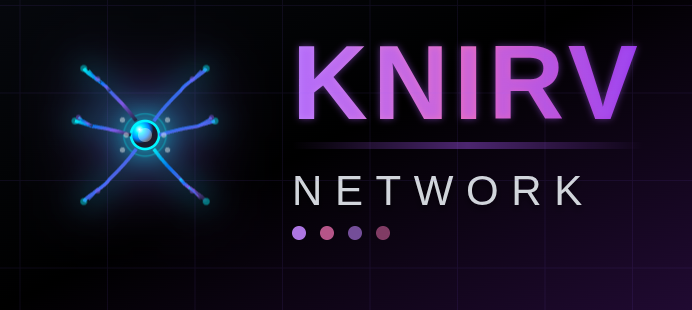

# KNIRVWALLET


​

## Introduction

**KNIRVWALLET** is a powerful, open-source, non-custodial wallet designed as the seamless gateway to the KNIRV Decentralized Trusted Execution Network (D-TEN). KNIRVWALLET enables users to manage NRN tokens, control KNIRV-AGENTIFIER agents, and interact with the entire KNIRV ecosystem through an intuitive, Web2-like experience powered by XION's Meta Accounts.
​

For users, KNIRVWALLET makes managing decentralized AI and crypto as simple as using traditional applications, with gasless transactions and biometric authentication.

​
For developers, KNIRVWALLET provides comprehensive APIs for integrating with the KNIRV ecosystem and KNIRV-AGENTIFIER agents!

​
KNIRVWALLET supports multiple platforms including browser extension, mobile app, and progressive web app, all unified under a single, powerful interface.
​

## Features

✅ **KNIRV Ecosystem Integration** <br>
✅ **NRN Token Management** - Native support for KNIRV-ROOT's NRN tokens <br>
✅ **KNIRV-AGENTIFIER Agent Control** - Manage and control your AI agents <br>
✅ **XION Meta Accounts** - Gasless transactions and Web2-like authentication <br>
✅ **Multi-Chain Support** - BTC, ETH, Solana, and more <br>
✅ **Biometric Authentication** - Secure, convenient access <br>
✅ **User Delegation Certificates (UDCs)** - Secure agent authorization <br>
✅ **Create & Restore Wallet** <br>
✅ **View Account Balances** <br>
✅ **Deposit & Send Tokens** <br>
✅ **Transaction History** <br>
✅ **Multi-Accounts** <br>
✅ **Multi-Network** <br>
✅ **Multi-Mnemonic** <br>
✅ **Ledger Support** <br>
✅ **Web3 Login Support** <br>
✅ **Manage Custom Tokens** <br>
✅ **Airgap Account Support** <br>
⬜ **KNIRVANA Game Integration** <br>
⬜ **Advanced Agent Analytics** <br>
⬜ **Cross-Chain NRN Bridging**
​

## Project Environment

| Tool       | Version |
| ---------- | ------- |
| Node.js    | 18.14.2 |
| TypeScript | 4.9.5   |
| Babel Core | 7.23.9  |
| Webpack    | 5.90.3  |
| React      | 18.2.0  |

## Building Locally

To set up a local environment, clone this repository and run the following commands:

```
 nvm use

 yarn install
​
 yarn build
```

​
This will store the extension's build output in `packages/knirvwallet-extension/dist`.
​

## Documentation

Check out the KNIRVWALLET documentation for comprehensive guides and developer resources.

- [KNIRVWALLET Whitepaper](../docs/whitepapers/KNIRVWALLET_Whitepaper.md)
- [XION Integration Guide](../agentic-wallet/XION_INTEGRATION.md)
- [Developer API Documentation](../docs/)
  ​
  ​

## KNIRV Ecosystem

**KNIRVWALLET** is part of the broader KNIRV ecosystem:

- [KNIRV-ROOT](../KNIRVROOT/) - The foundational blockchain for NRN tokens
- [KNIRVCHAIN](../KNIRVCHAIN/) - Smart contract platform for Skills and Base LLMs
- [KNIRV-AGENTIFIER](../KNIRVAGENTIFIER/) - AI agent framework
- [KNIRV-NEXUS](../KNIRVNEXUS/) - Distributed verification engine
  ​
  ​

## Contribution & Support

We welcome contributions from the community and are always eager to hear your ideas and feedback! If you have suggestions for improvement, want to contribute to KNIRVWALLET, or need support, please consider the following options:

- Read our contributing guidelines: Our [CONTRIBUTING.md](CONTRIBUTING.md) file provides information on how to contribute to the project, including submitting pull requests, reporting issues, and suggesting improvements.
- Open an issue: If you encounter a bug, have a feature request, or want to suggest improvements, feel free to open an issue on our GitHub repository.
- Join the KNIRV community: Connect with other developers and users building on the KNIRV ecosystem!
