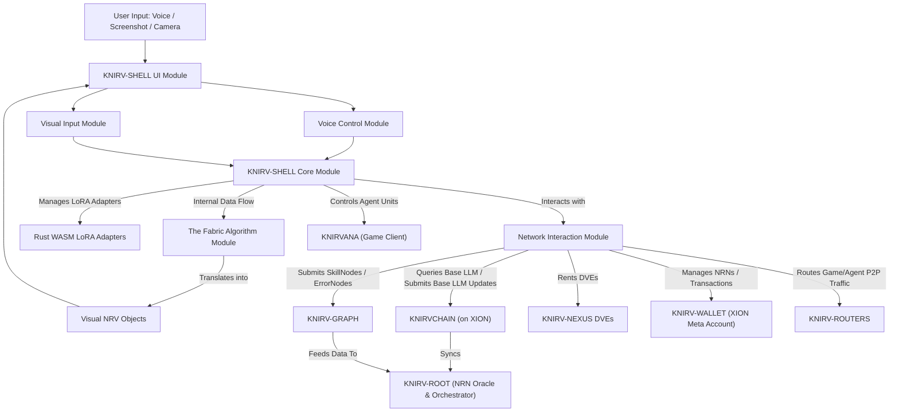

---

**Source**: KNIRVSHELL/SDD.md

# **Software Design Document: KNIRV-SHELL - The Adaptive, Intuitive Intelligence Interface**

**Version:** 1.0
**Date:** July 13, 2025

-----

## 1\. Introduction

The `KNIRV-SHELL` is the cornerstone of the KNIRV Decentralized Trusted Execution Network (D-TEN), serving as the **primary, intelligent, and adaptive interface** for users to interact with the entire ecosystem. Unlike traditional applications, the `KNIRV-SHELL` abstracts complex blockchain and AI operations, empowering users to manage and evolve AI agents through natural voice commands and intuitive visual feedback. It embodies the user's personal gateway to the collective intelligence of the KNIRV network and `KNIRVANA`.

### 1.1 Purpose

This document outlines the software design for the `KNIRV-SHELL`, detailing its architecture, functional components, user experience, and key algorithms, including the pivotal **"The Fabric" algorithm**. It will serve as a blueprint for development, ensuring a cohesive, secure, and user-friendly interface that integrates seamlessly with the underlying KNIRV layers.

### 1.2 Scope

This SDD covers the design of the `KNIRV-SHELL`'s core functionalities, including:

  * Its user interface paradigm (iFrame-like, voice-controlled).
  * Integration of voice input for command and control.
  * Mechanism for visual problem input (screenshots, camera, TensorFlow interpretation).
  * The design of "The Fabric" algorithm for `NRV` visualization and mapping to the `KNIRV-GRAPH`.
  * Interactions with `KNIRV-CHAIN`, `KNIRV-GRAPH`, `KNIRV-WALLET`, `DVE`s, and `KNIRVANA`.
  * Security and privacy considerations for interface operations.

-----

## 2\. Architectural Overview

The `KNIRV-SHELL` is a sophisticated application designed for deployment on various user devices (desktop, mobile, potentially embedded systems). It comprises several tightly integrated modules built predominantly in Rust (for core logic and WASM LoRAs) and potentially Web technologies (for the iFrame interface and UI elements).

**Key Modules:**

  * **KNIRV-SHELL Core Module:** The central processing unit, managing the SEAL loop, `Base LLM` interaction, `LoRA` runtime, and orchestrating other modules.
  * **User Interface Module:** Renders the iFrame-like display, manages visual feedback (edge coloring), and handles sliding UI panels.
  * **Voice Control Module:** Processes speech-to-text, intent recognition, and executes voice commands.
  * **Visual Input Module:** Captures screenshots/camera input and pre-processes images for analysis.
  * **"The Fabric" Algorithm Module:** The novel component responsible for transforming raw problems into actionable `NRV` objects and their visual representation.
  * **Network Interaction Module:** Manages all communication with external KNIRV network layers (XION, `KNIRV-GRAPH`, `DVE`s, `KNIRV-WALLET`, `KNIRV-ROUTERS`, `KNIRVANA`).
  * **Rust WASM LoRA Adapters:** The encapsulated, self-improving intelligence units unique to each `KNIRV-SHELL`.

-----

## 3\. Functional Requirements

The `KNIRV-SHELL` must fulfill the following core functions:

### 3.1 Core AI Agent Capabilities (Existing)

  * **Base LLM Interaction:** Load and utilize the latest `Base LLM` version from the `KNIRVCHAIN` (via `KNIRV-ROOT` or directly from XION).
  * **LoRA Management:** Dynamically load, unload, and update its own **Rust WASM LoRA adapters** based on its SEAL loop.
  * **SEAL Loop Execution:** Continuously engage in the Self-Adapting Language Models (SEAL) process: observe, reflect, edit, act, and learn from its experiences and feedback from the `KNIRV-GRAPH`.
  * **Decision Making & Execution:** Utilize its combined `Base LLM` and `LoRA` intelligence to interpret inputs, formulate responses, and execute tasks.
  * **DVE Utilization:** Securely rent and leverage `KNIRV-NEXUS DVEs` for computationally intensive tasks like `Base LLM` update proposal generation or complex `SkillNode` validation.

### 3.2 User Interface & Interaction (New)

  * **iFrame-like Display:** Present a full-screen, minimalist interface that acts as an overlay or integrated window, with content rendered within a "frame."
  * **Voice Control:**
      * **Always-on Listening:** Continuously monitor for wake words or explicit voice commands.
      * **Speech-to-Text:** Accurately transcribe user speech into text commands and queries.
      * **Intent Recognition:** Interpret natural language commands to understand user intent (e.g., "Assign agents to fix this," "Show me the network map," "What's my NRN balance?").
      * **Voice Feedback:** Provide audible responses or confirmations.
  * **Visual Feedback:**
      * **Edge Coloring:** Dynamically color the edges of the screen/frame to indicate `KNIRV-SHELL` activity (e.g., green for positive response, red for error, blue for processing).
      * **Sliding Panels:** Context-sensitive menus, input panels, or information displays should smoothly slide out from the invisible edges of the screen/frame when relevant, disappearing when not in use.
  * **User Input Panels:** Provide on-screen input methods for complex parameters, confirmations, or text entry when voice is insufficient or inconvenient.

### 3.3 Problem Input & NRV Generation (New - "The Fabric")

  * **Screenshot Capture:**
      * **Within Frame:** Allow the `KNIRV-SHELL` to capture screenshots of content displayed *within* its iFrame.
      * **Device-Wide:** Integrate with OS-level APIs to capture screenshots of the entire device screen.
      * **Camera Input:** Capture images/video streams from the device camera.
  * **TensorFlow Interpretation:**
      * Utilize an embedded TensorFlow (or similar ML framework) model to interpret the captured images/video. This model will identify objects, text, contexts, and potential anomalies, translating visual information into structured data.
      * **Problem Identification:** Automatically identify and categorize `errors, obstacles, and general problems` from the visual input.
  * **"The Fabric" Algorithm: NRV Transformation & Visualization:**
      * **Input Translation:** Receive raw error, obstacle, and problem inputs (from visual analysis, voice commands, or system logs).
      * **NRV Creation:** Translate these inputs into structured **`Network Resolution Vectors (NRVs)`**, capturing context, severity, and potential solution paths.
      * **Visual Representation:** Render these `NRVs` as dynamic **visual objects** that appear within the `KNIRV-SHELL`'s iFrame display, representing the identified problem areas.
      * **Mapping to GRAPH:** Provide an intuitive visual mechanism for the user to "map" these local `NRV` objects to the `KNIRV-GRAPH`, thereby submitting them as `ErrorNodes` for collective resolution.
      * **Agent Assignment:** Allow the user to visually **assign pretrained `KNIRV-SHELL` agent units** (from `KNIRVANA` or general network pool) to resolve specific `NRV` objects, initiating `Skill` invocation and NRN consumption.

### 3.4 Network & Ecosystem Interactions

  * **`KNIRV-GRAPH` Integration:**
      * Submit `ErrorNodes` (NRVs) for problems identified via "The Fabric."
      * Submit `SkillNodes` for solutions validated by the `KNIRV-SHELL`.
      * Query the `KNIRV-GRAPH` for existing `SkillNodes` to resolve identified `NRVs`.
  * **`KNIRVCHAIN` Integration:**
      * Query the `KNIRVCHAIN` for the latest `Base LLM` version.
      * Submit proposals for `Base LLM` updates.
      * Trigger `Skill` invocations by presenting NRNs to the `KNIRVCHAIN`.
  * **`KNIRV-WALLET` Integration:**
      * Manage NRN balances and initiate NRN transactions (for `Skill` invocation or `ROUTER` acquisition).
      * Interface with XION Meta Accounts for seamless user authentication and transaction signing.
  * **`KNIRV-ROUTERS` Interaction:**
      * Utilize `KNIRV-ROUTERS` for general network connectivity.
      * Initiate NRN acquisition from `KNIRV-ROOT`'s faucet via a `KNIRV-ROUTER` connection.
  * **`KNIRVANA` Integration:**
      * Act as the primary control interface for agent units within the `KNIRVANA` game.
      * Send task assignments to `KNIRV-SHELL` agents operating within `KNIRVANA`.
      * Receive feedback (successes/failures) from `KNIRVANA` agents to feed back into "The Fabric" for `NRV`/`SkillNode` generation.

-----

## 4\. Non-Functional Requirements

  * **Performance:** Low latency for voice command processing and visual feedback. Efficient processing of visual inputs (TensorFlow) to avoid lag. Responsive UI.
  * **Security:**
      * **zkTLS:** Secure all sensitive network communications.
      * **TEE Utilization:** Leverage hardware TEEs on supported devices for protecting `KNIRV-SHELL` core logic, `LoRA` parameters, and cryptographic keys.
      * **Input Sanitization:** Robust validation and sanitization of all user inputs (voice, text, visual metadata) to prevent injection attacks or exploits.
      * **Access Control:** Granular permissions for device resources (camera, microphone, screen capture).
  * **Privacy:** Minimize data collection. Process sensitive visual/voice data locally where possible. User consent for data sharing.
  * **Usability:** Highly intuitive and seamless user experience, minimizing friction and cognitive load. The goal is "invisible technology."
  * **Scalability:** Efficient management of multiple agent units in `KNIRVANA`. Ability to scale inference operations.
  * **Resilience:** Graceful handling of network disconnections, API failures, and resource constraints.
  * **Cross-Platform Compatibility:** Target common operating systems (Windows, macOS, Linux, Android, iOS) for wide accessibility, possibly using frameworks like Electron or Flutter for the initial UI shell, with Rust for core logic.

-----

## 5\. High-Level Design

### 5.1 KNIRV-SHELL Core Module

  * **Responsibility:** Orchestrates all other modules, manages the `Base LLM` instance, `LoRA` runtime, and the SEAL learning loop.
  * **Components:**
      * `Base LLM` Manager: Handles loading/unloading `Base LLM` versions from `KNIRVCHAIN` data.
      * `LoRA` Runtime: Executes Rust WASM `LoRA` modules.
      * SEAL Loop Executor: Drives the continuous learning and adaptation process.
      * Task Dispatcher: Assigns processed inputs to `LoRA`s for inference and action generation.

### 5.2 User Interface Module

  * **Responsibility:** Provides the visual and interactive layer.
  * **Components:**
      * `iFrame` Renderer: Displays application content within a flexible, embeddable frame.
      * Visual Feedback Engine: Manages dynamic edge coloring and other subtle UI cues.
      * Panel Manager: Controls the sliding in/out of context-sensitive menus and input fields.
      * Event Listener: Captures user interactions (voice activation, panel taps, gestures).

### 5.3 Voice Control Module

  * **Responsibility:** Processes natural language input.
  * **Components:**
      * Speech-to-Text (STT) Engine: Converts audio input to text (local or cloud-based, prioritized local).
      * Natural Language Understanding (NLU) Engine: Interprets text to extract intent, entities, and context.
      * Speech Synthesizer (TTS): Converts `KNIRV-SHELL` responses into audible speech.
      * Wake Word Detector: Low-power listener for activation phrases.

### 5.4 Visual Input Module

  * **Responsibility:** Captures and pre-processes visual data for "The Fabric."
  * **Components:**
      * Screenshot/Camera Capture API: OS-level integration for acquiring image data.
      * Image Pre-processor: Resizing, normalization, noise reduction for ML input.
      * **TensorFlow Runtime (Embedded):** Loads and runs pre-trained TensorFlow models for object detection, OCR (Optical Character Recognition), and scene understanding.

### 5.5 "The Fabric" Algorithm Module

  * **Responsibility:** Translates raw problems into actionable `NRVs` and their visual representations.
  * **Components:**
      * **Input Ingestor:** Receives data from Voice Control (e.g., "This isn't working"), Visual Input (TensorFlow output), and internal `KNIRV-SHELL` monitoring.
      * **Problem Contextualizer:** Uses `KNIRV-SHELL`'s `Base LLM` and `LoRA` to enrich the raw input with contextual understanding (e.g., "What was the `SHELL` trying to do when this error occurred?").
      * **NRV Formatter:** Structures the identified problem and context into the official `NRV` schema.
      * **Visualizer Engine:** Dynamically generates visual elements (icons, overlays, outlines) to represent the `NRV` within the `KNIRV-SHELL`'s `iFrame` UI. This allows the user to see the problem directly overlaid on the problematic content.
      * **Mapping Interface:** Facilitates the user's gesture/voice command to "drag and drop" or "map" the visual `NRV` object to the `KNIRV-GRAPH`.
      * **Agent Assignment Logic:** Interfaces with the `KNIRV-GRAPH` (to find suitable `SkillNodes`) and `KNIRV-WALLET` (to manage NRNs) to assign `KNIRV-SHELL` units to resolve the `NRV`.

### 5.6 Network Interaction Module

  * **Responsibility:** Secure communication with all external KNIRV services.
  * **Components:**
      * **zkTLS Client:** Manages encrypted and zero-knowledge-proof-enhanced connections.
      * API Clients: Specific clients for `KNIRV-GRAPH` RPCs, `KNIRVCHAIN` queries/transactions, `KNIRV-WALLET` signing requests, `DVE` rental requests, and `KNIRV-ROUTER` interaction.
      * `KNIRVANA` Interface: Dedicated API for sending game commands and receiving game state updates to control agent units.

-----

## 6\. Detailed Design: "The Fabric" Algorithm

"The Fabric" is the intelligent layer that weaves together disparate problem inputs into actionable `NRVs` and provides a direct visual bridge to the `KNIRV-GRAPH`.

### 6.1 Fabric Pipeline

1.  **Input Ingestion:**
      * **Source:** Voice (e.g., "My character is stuck"), Screenshot/Camera (image data), Internal Monitoring (system logs, agent failures).
      * **Format:** Raw, unstructured data.
2.  **Perception & Pre-processing:**
      * **Visual:** If image/video, `Visual Input Module`'s TensorFlow identifies objects, UI elements, text, and potentially error messages or unusual states.
      * **Voice:** If voice, `Voice Control Module`'s NLU identifies keywords and intent (e.g., "problem," "error," "not working").
      * **Internal:** Log parsing for structured error codes, stack traces, etc.
3.  **Contextualization (Leveraging `KNIRV-SHELL`'s AI):**
      * The `KNIRV-SHELL Core Module`'s `Base LLM` and `LoRA` are engaged.
      * The raw problem is fed into the `KNIRV-SHELL`'s intelligence along with recent operational history (e.g., "What was I trying to do?", "What was the previous command?", "What's the current game state in `KNIRVANA`?").
      * The `KNIRV-SHELL` attempts to synthesize a coherent description of the problem, its symptoms, and potential root causes.
4.  **NRV Structuring & Proposal:**
      * The contextualized problem is formatted into a formal `NRV` data structure. This includes:
          * `problemDescription`: Natural language summary.
          * `sourceID`: ID of the `KNIRV-SHELL` or `KNIRVANA` instance.
          * `inputType`: (Voice, Screenshot, Log).
          * `visualContext`: (if applicable) Bounding boxes, OCR text, interpreted objects from TensorFlow.
          * `temporalContext`: Timestamp, recent actions.
          * `severity`: (Inferred by AI or user-inputted).
          * `suggestedSolutionType`: (e.g., "bug fix," "skill improvement," "optimization").
          * `proofOfFailure`: Cryptographic hash of the raw input/context for later verification.
5.  **Visual NRV Object Creation:**
      * The `Visualizer Engine` creates a graphical representation of the `NRV`. This might be:
          * An interactive icon overlaid on the specific problematic area in the `iFrame`.
          * A bounding box highlighting an identified error message.
          * A persistent "problem" widget in the corner of the screen.
      * These visual objects are designed to be easily identifiable and interactive.
6.  **User Interaction for Mapping & Assignment:**
      * The user sees the visual `NRV` object(s).
      * **Mapping to GRAPH:** A simple voice command ("Map this to graph") or drag-and-drop action on the visual object triggers its submission as an `ErrorNode` to the `KNIRV-GRAPH` (via the `Network Interaction Module`).
      * **Agent Assignment:** The user can then select the `NRV` (verbally or visually) and issue a command ("Assign agents," "Fix this").
          * The `KNIRV-SHELL` queries the `KNIRV-GRAPH` for relevant `SkillNodes` that might resolve the `NRV`.
          * It then presents options for **assigning available agent units (other `KNIRV-SHELL`s, perhaps managed in `KNIRVANA`)** to execute the necessary `SkillNode`s, prompting the `KNIRV-WALLET` for NRN payment if required.

-----

## 7\. Data Model

The `KNIRV-SHELL` will maintain a local, transient data store for its operational state, mirroring certain critical elements from the `KNIRVCHAIN` and `KNIRV-GRAPH` for responsiveness.

  * **Local KNIRVCHAIN Instance Data:**
      * Current `Base LLM` version pointer.
      * Local NRN balance.
      * Recent `SkillNode` history.
  * **LoRA Adapter Data:**
      * Current weights and configurations of active Rust WASM LoRAs.
      * SEAL loop history and learning parameters.
  * **"The Fabric" Cache:**
      * Currently identified `NRV` objects (active problems).
      * Associated raw input data (e.g., temporary screenshots).
  * **User Preferences:**
      * Voice command settings.
      * UI customization.
  * **Session Data:**
      * Current task context (e.g., `KNIRVANA` game state, external application context).

-----

## 8\. Security Considerations

Beyond the network-wide security (zkTLS, TEEs in DVEs), the `KNIRV-SHELL`'s interactive nature introduces specific considerations:

  * **Input Integrity:** Rigorous sanitization of all voice and visual input to prevent malicious commands or data injections that could exploit the underlying AI or system.
  * **Privacy of Visual/Voice Data:** All sensitive input (screenshots, camera, voice recordings) should be processed locally within the `KNIRV-SHELL`'s TEE where possible, minimizing transmission of raw data. Only processed, anonymized `NRV` metadata or ZKPs should be transmitted to the `KNIRV-GRAPH` or `KNIRVCHAIN`.
  * **Permissions Management:** Granular operating system permissions for microphone, camera, and screen capture access, with clear user consent flows.
  * **UI Sandboxing:** The `iFrame`-like display and sliding panels should be securely sandboxed to prevent malicious content from escaping or compromising the host device.
  * **LoRA Security:** Rust WASM's sandbox provides a strong security boundary for LoRA execution, mitigating risks from malicious LoRA code.

-----

## 9\. Future Enhancements

  * **Advanced XR Integration:** Expand the `iFrame` concept into AR/VR overlays for truly immersive agent interaction.
  * **Multi-Modal AI:** Deeper integration of various sensor inputs (e.g., haptic, biometric) for richer problem context.
  * **Predictive Problem Identification:** `KNIRV-SHELL` leveraging its intelligence to anticipate potential `NRVs` before they fully manifest, offering proactive solutions.
  * **Adaptive UI/UX:** The `KNIRV-SHELL`'s UI dynamically adapting its layout and interaction patterns based on user behavior and current task context.

-----

---

© 2025 KNIRV Network

