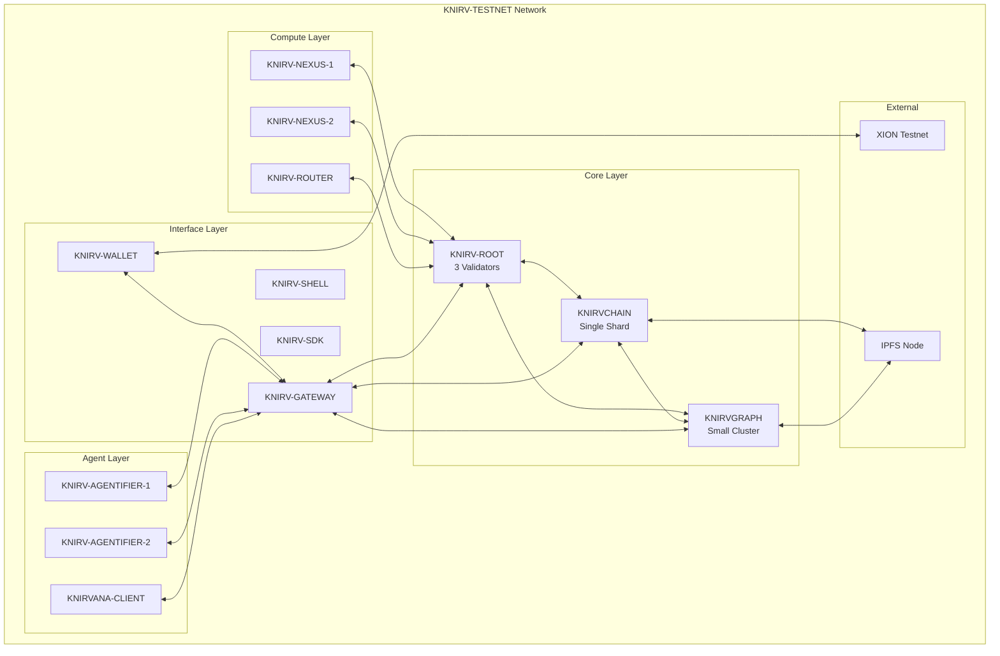

# KNIRV-TESTNET: Complete Implementation Plan
## From Scratch Build Guide for the KNIRV Decentralized Trusted Execution Network

**Version:** 1.0  
**Date:** August 6, 2025  
**Status:** IMPLEMENTATION READY

---

## Executive Summary

This document provides a comprehensive, step-by-step implementation plan for building the KNIRV-TESTNET from scratch. Based on analysis of the existing codebase, whitepapers, and the Build.md specifications, this plan details the complete construction of a minimal-viable representation of the full KNIRV D-TEN that maintains high-fidelity simulation while being resource-efficient and cost-effective.

The KNIRV-TESTNET implements all 12 sovereign layers of the D-TEN in simplified but functionally complete forms, enabling comprehensive testing of the network's core capabilities including the NRN economic loop, AI agent self-improvement cycles, and cross-chain interoperability.

---

## 1. Architecture Overview

### 1.1 TESTNET Components

The KNIRV-TESTNET consists of simplified versions of all D-TEN layers:

1. **KNIRV-ROOT** - Minimalist NRN blockchain with 3-5 validators
2. **KNIRV-ROUTER** - Single router node for connectivity testing
3. **KNIRVGRAPH** - Small-scale graphchain with pre-populated data
4. **KNIRVCHAIN** - Single-shard blockchain with CodeT5 base
5. **KNIRV-NEXUS** - 2-3 DVE nodes with TEE simulation
6. **KNIRV-AGENTIFIER** - Simplified agents with basic SEAL loop
7. **KNIRV-WALLET** - Full functionality with XION integration
8. **KNIRV-GATEWAY** - Complete API gateway implementation
9. **KNIRV-SHELL** - Full CLI with limited network scope
10. **KNIRV-SDK** - Complete multi-language SDK
11. **KNIRV-TESTNET** - This implementation itself
12. **KNIRVANA** - Simplified game client for testing

### 1.2 Network Topology



---

## 2. Prerequisites and Environment Setup

### 2.1 System Requirements

**Minimum Hardware:**
- 4 CPU cores
- 16GB RAM
- 100GB SSD storage
- Stable internet connection

**Software Dependencies:**
- Docker & Docker Compose
- Go 1.23+
- Rust 1.70+
- Node.js 18+
- Python 3.9+

### 2.2 Development Environment Setup

```bash
# Clone the repository
git clone https://github.com/guiperry/KNIRV_NETWORK.git
cd KNIRV_NETWORK

# Install system dependencies
sudo apt update && sudo apt install -y \
    build-essential \
    pkg-config \
    libssl-dev \
    docker.io \
    docker-compose

# Install language runtimes
curl --proto '=https' --tlsv1.2 -sSf https://sh.rustup.rs | sh
source ~/.cargo/env

# Install Go
wget https://go.dev/dl/go1.23.3.linux-amd64.tar.gz
sudo tar -C /usr/local -xzf go1.23.3.linux-amd64.tar.gz
export PATH=$PATH:/usr/local/go/bin

# Install Node.js
curl -fsSL https://deb.nodesource.com/setup_18.x | sudo -E bash -
sudo apt-get install -y nodejs

# Verify installations
go version
rustc --version
node --version
docker --version
```

### 2.3 Network Configuration

Create the testnet configuration directory:

```bash
mkdir -p KNIRVTESTNET/config
mkdir -p KNIRVTESTNET/data
mkdir -p KNIRVTESTNET/logs
mkdir -p KNIRVTESTNET/scripts
```

---

## 3. Layer-by-Layer Implementation

### 3.1 KNIRV-ROOT Implementation

**Objective:** Deploy a minimal 3-validator PoA blockchain for NRN token management.

#### 3.1.1 Configuration Setup

Create `KNIRVTESTNET/config/knirvroot-config.yaml`:

```yaml
# KNIRV-ROOT Testnet Configuration
network:
  chain_id: "knirv-testnet-1"
  consensus: "poa-bft"
  validators: 3
  block_time: "5s"
  
validators:
  - name: "validator-1"
    address: "knirv1validator1..."
    voting_power: 100
  - name: "validator-2" 
    address: "knirv1validator2..."
    voting_power: 100
  - name: "validator-3"
    address: "knirv1validator3..."
    voting_power: 100

nrn_token:
  initial_supply: 1000000
  mint_rate: 100  # per connectivity proof
  burn_enabled: true

faucet:
  enabled: true
  usdc_reserve: 10000
  exchange_rate: 1.0  # 1 USDC = 1 NRN

p2p:
  listen_addr: "0.0.0.0:26656"
  external_addr: "localhost:26656"
  seeds: []
  persistent_peers: []

rpc:
  listen_addr: "0.0.0.0:26657"
  cors_allowed_origins: ["*"]

api:
  enable: true
  address: "0.0.0.0:1317"
  enabled_unsafe_cors: true

ibc:
  enabled: true
  channels:
    - chain_id: "knirvchain-testnet-1"
      port: "transfer"
    - chain_id: "knirvgraph-testnet-1" 
      port: "oracle"
    - chain_id: "xion-testnet-1"
      port: "faucet"
```

#### 3.1.2 Build Script

Create `KNIRVTESTNET/scripts/build-knirvroot.sh`:

```bash
#!/bin/bash
set -e

echo "Building KNIRV-ROOT for testnet..."

cd KNIRVROOT

# Build the binary
echo "Compiling KNIRV-ROOT..."
go build -o ../KNIRVTESTNET/bin/knirvroot ./main.go

# Initialize chain data
echo "Initializing chain data..."
../KNIRVTESTNET/bin/knirvroot init testnet-node \
    --chain-id knirv-testnet-1 \
    --home ../KNIRVTESTNET/data/knirvroot

# Generate validator keys
for i in {1..3}; do
    echo "Generating validator-$i keys..."
    ../KNIRVTESTNET/bin/knirvroot keys add validator-$i \
        --home ../KNIRVTESTNET/data/knirvroot \
        --keyring-backend test
done

# Create genesis file
echo "Creating genesis file..."
../KNIRVTESTNET/bin/knirvroot genesis add-genesis-account \
    $(../KNIRVTESTNET/bin/knirvroot keys show validator-1 -a --keyring-backend test --home ../KNIRVTESTNET/data/knirvroot) \
    1000000000000unrn \
    --home ../KNIRVTESTNET/data/knirvroot

# Generate genesis transaction
../KNIRVTESTNET/bin/knirvroot genesis gentx validator-1 \
    1000000unrn \
    --chain-id knirv-testnet-1 \
    --keyring-backend test \
    --home ../KNIRVTESTNET/data/knirvroot

# Collect genesis transactions
../KNIRVTESTNET/bin/knirvroot genesis collect-gentxs \
    --home ../KNIRVTESTNET/data/knirvroot

echo "KNIRV-ROOT build completed successfully!"
```

#### 3.1.3 Startup Script

Create `KNIRVTESTNET/scripts/start-knirvroot.sh`:

```bash
#!/bin/bash
set -e

echo "Starting KNIRV-ROOT testnet node..."

# Start the node
./bin/knirvroot start \
    --home ./data/knirvroot \
    --rpc.laddr tcp://0.0.0.0:26657 \
    --p2p.laddr tcp://0.0.0.0:26656 \
    --api.enable \
    --api.address tcp://0.0.0.0:1317 \
    --log_level info \
    > ./logs/knirvroot.log 2>&1 &

echo $! > ./data/knirvroot.pid
echo "KNIRV-ROOT started with PID $(cat ./data/knirvroot.pid)"
echo "RPC endpoint: http://localhost:26657"
echo "API endpoint: http://localhost:1317"
```

### 3.2 KNIRVCHAIN Implementation

**Objective:** Deploy a single-shard Rust blockchain with CodeT5 base LLM registry.

#### 3.2.1 Configuration Setup

Create `KNIRVTESTNET/config/knirvchain-config.toml`:

```toml
# KNIRVCHAIN Testnet Configuration
[blockchain]
mode = "native"
chain_id = "knirvchain-testnet-1"
enable_cross_chain = true

[consensus]
algorithm = "tendermint"
block_time = "3s"
validators = 1

[base_llm]
model = "CodeT5"
version = "1.0.0"
ipfs_hash = "QmCodeT5BaseModel..."
update_threshold = 1  # Single validator for testnet

[skill_registry]
enabled = true
validation_required = true
nrn_cost = 10

[api]
host = "0.0.0.0"
port = 8080
cors_enabled = true

[storage]
database_path = "./data/knirvchain/db"
ipfs_node = "http://localhost:5001"

[ibc]
enabled = true
port = "transfer"
channels = [
    { chain_id = "knirv-testnet-1", port = "nrn" },
    { chain_id = "knirvgraph-testnet-1", port = "skills" }
]
```

#### 3.2.2 Build Script

Create `KNIRVTESTNET/scripts/build-knirvchain.sh`:

```bash
#!/bin/bash
set -e

echo "Building KNIRVCHAIN for testnet..."

cd KNIRVCHAIN

# Build the Rust binary
echo "Compiling KNIRVCHAIN..."
cargo build --release

# Copy binary to testnet directory
cp target/release/knirvchain ../KNIRVTESTNET/bin/

# Initialize database
echo "Initializing KNIRVCHAIN database..."
mkdir -p ../KNIRVTESTNET/data/knirvchain

# Copy configuration
cp ../KNIRVTESTNET/config/knirvchain-config.toml ../KNIRVTESTNET/data/knirvchain/config.toml

echo "KNIRVCHAIN build completed successfully!"
```

#### 3.2.3 Startup Script

Create `KNIRVTESTNET/scripts/start-knirvchain.sh`:

```bash
#!/bin/bash
set -e

echo "Starting KNIRVCHAIN testnet node..."

# Start the node
./bin/knirvchain \
    --config ./data/knirvchain/config.toml \
    > ./logs/knirvchain.log 2>&1 &

echo $! > ./data/knirvchain.pid
echo "KNIRVCHAIN started with PID $(cat ./data/knirvchain.pid)"
echo "API endpoint: http://localhost:8080"
```

### 3.3 KNIRVGRAPH Implementation

**Objective:** Deploy a small-scale graphchain with pre-populated ErrorNodes and SkillNodes.

#### 3.3.1 Configuration Setup

Create `KNIRVTESTNET/config/knirvgraph-config.yaml`:

```yaml
# KNIRVGRAPH Testnet Configuration
network:
  chain_id: "knirvgraph-testnet-1"
  consensus: "tendermint"
  validators: 1
  block_time: "2s"

graph:
  max_nodes: 10000
  max_edges: 50000
  pre_populate: true
  sample_data: true

dht:
  enabled: true
  bootstrap_nodes: []
  port: 4001
  protocol: "/knirv/kad/1.0.0"

storage:
  backend: "bluntdb"
  path: "./data/knirvgraph/graph.db"
  cache_size: "100MB"

api:
  host: "0.0.0.0"
  port: 8081
  graphql_enabled: true
  rest_enabled: true

nrv:
  announcement_interval: "30s"
  discovery_timeout: "60s"
  max_concurrent: 100

skill_nodes:
  validation_required: true
  dvr_threshold: 1
  auto_mint: true

error_nodes:
  auto_create: true
  categorization: true
  similarity_threshold: 0.8
```

#### 3.3.2 Sample Data Generation

Create `KNIRVTESTNET/scripts/populate-knirvgraph.sh`:

```bash
#!/bin/bash
set -e

echo "Populating KNIRVGRAPH with sample data..."

# Sample ErrorNodes
curl -X POST http://localhost:8081/api/v1/error-nodes \
  -H "Content-Type: application/json" \
  -d '{
    "id": "error_001",
    "description": "Division by zero in calculation module",
    "category": "arithmetic_error",
    "severity": "high",
    "context": {
      "module": "calculator",
      "function": "divide",
      "input": {"a": 10, "b": 0}
    }
  }'

curl -X POST http://localhost:8081/api/v1/error-nodes \
  -H "Content-Type: application/json" \
  -d '{
    "id": "error_002",
    "description": "Memory allocation failure",
    "category": "memory_error",
    "severity": "critical",
    "context": {
      "module": "allocator",
      "requested_size": "1GB",
      "available_memory": "512MB"
    }
  }'

# Sample SkillNodes
curl -X POST http://localhost:8081/api/v1/skill-nodes \
  -H "Content-Type: application/json" \
  -d '{
    "id": "skill_001",
    "name": "Safe Division",
    "description": "Performs division with zero-check",
    "resolves": ["error_001"],
    "code_hash": "QmSafeDivisionSkill...",
    "validation_proof": "proof_001"
  }'

echo "Sample data populated successfully!"
```

### 3.4 KNIRV-NEXUS Implementation

**Objective:** Deploy 2-3 DVE nodes with simulated TEE capabilities.

#### 3.4.1 Configuration Setup

Create `KNIRVTESTNET/config/knirvnexus-config.yaml`:

```yaml
# KNIRV-NEXUS Testnet Configuration
cluster:
  name: "testnet-cluster"
  nodes: 2
  load_balancing: "round_robin"

node:
  id: "nexus-{NODE_ID}"
  host: "0.0.0.0"
  port: 808{NODE_ID}  # 8082, 8083

tee:
  simulation_mode: true  # No real TEE in testnet
  validation_timeout: "30s"
  max_concurrent_validations: 5

clean:
  cognitive_engine: "simple"
  adaptability_orchestrator: "basic"
  security_stack: "simulated"

validation:
  skill_validation: true
  llm_validation: true
  proof_generation: true
  zkTLS_enabled: false  # Simplified for testnet

storage:
  results_path: "./data/knirvnexus/validations"
  cache_size: "50MB"

staking:
  required_nrn: 1000
  reward_rate: 0.1
  slashing_rate: 0.05

api:
  endpoints:
    - "/validate/skill"
    - "/validate/llm"
    - "/status"
    - "/metrics"
```

#### 3.4.2 Build and Start Scripts

Create `KNIRVTESTNET/scripts/build-knirvnexus.sh`:

```bash
#!/bin/bash
set -e

echo "Building KNIRV-NEXUS for testnet..."

cd KNIRVNEXUS

# Build the Go binary
echo "Compiling KNIRV-NEXUS..."
go build -o ../KNIRVTESTNET/bin/knirvnexus ./main.go

# Create node directories
for i in {1..2}; do
    mkdir -p ../KNIRVTESTNET/data/knirvnexus/node-$i
    sed "s/{NODE_ID}/$i/g" ../KNIRVTESTNET/config/knirvnexus-config.yaml > \
        ../KNIRVTESTNET/data/knirvnexus/node-$i/config.yaml
done

echo "KNIRV-NEXUS build completed successfully!"
```

Create `KNIRVTESTNET/scripts/start-knirvnexus.sh`:

```bash
#!/bin/bash
set -e

echo "Starting KNIRV-NEXUS testnet nodes..."

# Start node 1
./bin/knirvnexus \
    --config ./data/knirvnexus/node-1/config.yaml \
    > ./logs/knirvnexus-1.log 2>&1 &
echo $! > ./data/knirvnexus-1.pid

# Start node 2
./bin/knirvnexus \
    --config ./data/knirvnexus/node-2/config.yaml \
    > ./logs/knirvnexus-2.log 2>&1 &
echo $! > ./data/knirvnexus-2.pid

echo "KNIRV-NEXUS nodes started:"
echo "Node 1 PID: $(cat ./data/knirvnexus-1.pid) - http://localhost:8082"
echo "Node 2 PID: $(cat ./data/knirvnexus-2.pid) - http://localhost:8083"
```

### 3.5 KNIRV-ROUTER Implementation

**Objective:** Deploy a single router node for network connectivity and NRN minting.

#### 3.5.1 Configuration Setup

Create `KNIRVTESTNET/config/knirvrouter-config.yaml`:

```yaml
# KNIRV-ROUTER Testnet Configuration
network:
  node_id: "router-testnet-1"
  listen_addr: "0.0.0.0:8086"
  external_addr: "localhost:8086"

connectivity:
  proof_interval: "60s"  # Generate connectivity proofs every minute
  target_paths: 10       # Test 10 different network paths
  timeout: "30s"

nrn_minting:
  enabled: true
  knirvroot_endpoint: "http://localhost:1317"
  mint_rate: 100  # NRN per successful proof

p2p:
  dht_enabled: true
  bootstrap_nodes: []
  protocols: ["/knirv/router/1.0.0"]

turn_server:
  enabled: true
  port: 3478
  realm: "knirv-testnet"

api:
  host: "0.0.0.0"
  port: 8086
  endpoints:
    - "/connectivity/proof"
    - "/nrn/mint"
    - "/status"
    - "/peers"

logging:
  level: "info"
  file: "./logs/knirvrouter.log"
```

#### 3.5.2 Build and Start Scripts

Create `KNIRVTESTNET/scripts/build-knirvrouter.sh`:

```bash
#!/bin/bash
set -e

echo "Building KNIRV-ROUTER for testnet..."

cd KNIRVROUTER

# Build the Go binary
echo "Compiling KNIRV-ROUTER..."
go build -o ../KNIRVTESTNET/bin/knirvrouter ./main.go

# Copy configuration
cp ../KNIRVTESTNET/config/knirvrouter-config.yaml ../KNIRVTESTNET/data/

echo "KNIRV-ROUTER build completed successfully!"
```

### 3.6 KNIRV-GATEWAY Implementation

**Objective:** Deploy the unified API gateway with full functionality.

#### 3.6.1 Configuration Setup

Create `KNIRVTESTNET/config/knirvgateway-config.json`:

```json
{
  "server": {
    "host": "0.0.0.0",
    "port": 8087,
    "cors": {
      "enabled": true,
      "origins": ["*"]
    }
  },
  "services": {
    "knirvroot": {
      "endpoint": "http://localhost:1317",
      "timeout": "30s"
    },
    "knirvchain": {
      "endpoint": "http://localhost:8080",
      "timeout": "30s"
    },
    "knirvgraph": {
      "endpoint": "http://localhost:8081",
      "timeout": "30s"
    },
    "knirvnexus": {
      "endpoints": [
        "http://localhost:8082",
        "http://localhost:8083"
      ],
      "load_balancer": "round_robin",
      "timeout": "60s"
    },
    "knirvrouter": {
      "endpoint": "http://localhost:8086",
      "timeout": "30s"
    }
  },
  "authentication": {
    "enabled": true,
    "jwt_secret": "testnet-secret-key",
    "token_expiry": "24h"
  },
  "rate_limiting": {
    "enabled": true,
    "requests_per_minute": 100
  },
  "monitoring": {
    "metrics_enabled": true,
    "health_checks": true,
    "prometheus_endpoint": "/metrics"
  }
}
```

#### 3.6.2 Build Script

Create `KNIRVTESTNET/scripts/build-knirvgateway.sh`:

```bash
#!/bin/bash
set -e

echo "Building KNIRV-GATEWAY for testnet..."

cd KNIRVGATEWAY

# Install dependencies
echo "Installing Node.js dependencies..."
npm install

# Build the application
echo "Building KNIRV-GATEWAY..."
npm run build

# Copy built files to testnet directory
cp -r dist/* ../KNIRVTESTNET/data/knirvgateway/
cp ../KNIRVTESTNET/config/knirvgateway-config.json ../KNIRVTESTNET/data/knirvgateway/

echo "KNIRV-GATEWAY build completed successfully!"
```

### 3.7 KNIRV-WALLET Implementation

**Objective:** Deploy wallet with XION integration for testnet.

#### 3.7.1 Configuration Setup

Create `KNIRVTESTNET/config/knirvwallet-config.json`:

```json
{
  "network": {
    "environment": "testnet",
    "chain_id": "knirv-testnet-1"
  },
  "xion": {
    "testnet_endpoint": "https://testnet-rpc.xion.burnt.com",
    "chain_id": "xion-testnet-1",
    "meta_accounts": {
      "enabled": true,
      "gasless_transactions": true
    }
  },
  "knirv_services": {
    "gateway": "http://localhost:8087",
    "root": "http://localhost:1317"
  },
  "wallet": {
    "default_derivation_path": "m/44'/118'/0'/0/0",
    "keyring_backend": "test",
    "auto_backup": true
  },
  "nrn_token": {
    "denom": "unrn",
    "decimals": 6,
    "faucet_enabled": true,
    "faucet_amount": 1000
  },
  "ui": {
    "theme": "knirv-testnet",
    "debug_mode": true
  }
}
```

### 3.8 Additional Components

#### 3.8.1 KNIRV-SDK Configuration

Create `KNIRVTESTNET/config/knirvsdk-config.yaml`:

```yaml
# KNIRV-SDK Testnet Configuration
gateway:
  endpoint: "http://localhost:8087"
  api_version: "v1"
  timeout: "30s"

languages:
  go:
    module: "github.com/knirv/sdk-go"
    version: "v0.1.0-testnet"
  typescript:
    package: "@knirv/sdk-ts"
    version: "0.1.0-testnet"
  python:
    package: "knirv-sdk"
    version: "0.1.0-testnet"

features:
  nrn_management: true
  skill_invocation: true
  agent_control: true
  graph_queries: true

testnet:
  mock_mode: false
  debug_logging: true
  rate_limiting: false
```

#### 3.8.2 IPFS Node Setup

Create `KNIRVTESTNET/scripts/setup-ipfs.sh`:

```bash
#!/bin/bash
set -e

echo "Setting up IPFS node for testnet..."

# Initialize IPFS
ipfs init

# Configure for testnet
ipfs config Addresses.API /ip4/0.0.0.0/tcp/5001
ipfs config Addresses.Gateway /ip4/0.0.0.0/tcp/8080
ipfs config --json API.HTTPHeaders.Access-Control-Allow-Origin '["*"]'
ipfs config --json API.HTTPHeaders.Access-Control-Allow-Methods '["PUT", "POST"]'

# Start IPFS daemon
ipfs daemon > ./logs/ipfs.log 2>&1 &
echo $! > ./data/ipfs.pid

echo "IPFS node started with PID $(cat ./data/ipfs.pid)"
echo "API endpoint: http://localhost:5001"
echo "Gateway endpoint: http://localhost:8080"
```

---

## 4. Master Build and Deployment Scripts

### 4.1 Master Build Script

Create `KNIRVTESTNET/scripts/build-all.sh`:

```bash
#!/bin/bash
set -e

echo "=========================================="
echo "KNIRV-TESTNET: Complete Build Process"
echo "=========================================="

# Create necessary directories
mkdir -p bin data logs

# Build all components
echo "Building all KNIRV components..."

./scripts/build-knirvroot.sh
./scripts/build-knirvchain.sh
./scripts/build-knirvgraph.sh
./scripts/build-knirvnexus.sh
./scripts/build-knirvrouter.sh
./scripts/build-knirvgateway.sh

echo "All components built successfully!"
echo "Binaries available in: ./bin/"
echo "Configuration files in: ./config/"
echo "Data directories in: ./data/"
```

### 4.2 Master Startup Script

Create `KNIRVTESTNET/scripts/start-testnet.sh`:

```bash
#!/bin/bash
set -e

echo "=========================================="
echo "KNIRV-TESTNET: Network Startup"
echo "=========================================="

# Function to check if service is ready
wait_for_service() {
    local url=$1
    local name=$2
    local max_attempts=30
    local attempt=1

    echo "Waiting for $name to be ready..."
    while [ $attempt -le $max_attempts ]; do
        if curl -s -f "$url" > /dev/null 2>&1; then
            echo "$name is ready!"
            return 0
        fi
        echo "Attempt $attempt/$max_attempts: $name not ready yet..."
        sleep 2
        attempt=$((attempt + 1))
    done

    echo "ERROR: $name failed to start within timeout"
    return 1
}

# Start IPFS first
echo "Starting IPFS node..."
./scripts/setup-ipfs.sh

# Start core blockchain layers
echo "Starting KNIRV-ROOT..."
./scripts/start-knirvroot.sh
wait_for_service "http://localhost:1317/status" "KNIRV-ROOT"

echo "Starting KNIRVCHAIN..."
./scripts/start-knirvchain.sh
wait_for_service "http://localhost:8080/health" "KNIRVCHAIN"

echo "Starting KNIRVGRAPH..."
./scripts/start-knirvgraph.sh
wait_for_service "http://localhost:8081/health" "KNIRVGRAPH"

# Start compute layer
echo "Starting KNIRV-NEXUS nodes..."
./scripts/start-knirvnexus.sh
wait_for_service "http://localhost:8082/status" "KNIRV-NEXUS-1"
wait_for_service "http://localhost:8083/status" "KNIRV-NEXUS-2"

echo "Starting KNIRV-ROUTER..."
./scripts/start-knirvrouter.sh
wait_for_service "http://localhost:8086/status" "KNIRV-ROUTER"

# Start interface layer
echo "Starting KNIRV-GATEWAY..."
./scripts/start-knirvgateway.sh
wait_for_service "http://localhost:8087/health" "KNIRV-GATEWAY"

# Populate sample data
echo "Populating sample data..."
sleep 5  # Allow services to fully initialize
./scripts/populate-knirvgraph.sh

echo "=========================================="
echo "KNIRV-TESTNET: Startup Complete!"
echo "=========================================="
echo ""
echo "Service Endpoints:"
echo "  KNIRV-ROOT:     http://localhost:1317"
echo "  KNIRVCHAIN:     http://localhost:8080"
echo "  KNIRVGRAPH:     http://localhost:8081"
echo "  KNIRV-NEXUS-1:  http://localhost:8082"
echo "  KNIRV-NEXUS-2:  http://localhost:8083"
echo "  KNIRV-ROUTER:   http://localhost:8086"
echo "  KNIRV-GATEWAY:  http://localhost:8087"
echo "  IPFS API:       http://localhost:5001"
echo ""
echo "Logs available in: ./logs/"
echo "Process IDs in: ./data/*.pid"
echo ""
echo "To stop the testnet: ./scripts/stop-testnet.sh"
```

### 4.3 Master Stop Script

Create `KNIRVTESTNET/scripts/stop-testnet.sh`:

```bash
#!/bin/bash
set -e

echo "=========================================="
echo "KNIRV-TESTNET: Network Shutdown"
echo "=========================================="

# Function to stop service by PID file
stop_service() {
    local pid_file=$1
    local name=$2

    if [ -f "$pid_file" ]; then
        local pid=$(cat "$pid_file")
        if kill -0 "$pid" 2>/dev/null; then
            echo "Stopping $name (PID: $pid)..."
            kill "$pid"
            sleep 2
            if kill -0 "$pid" 2>/dev/null; then
                echo "Force killing $name..."
                kill -9 "$pid"
            fi
        fi
        rm -f "$pid_file"
        echo "$name stopped."
    else
        echo "$name PID file not found."
    fi
}

# Stop all services
stop_service "./data/knirvgateway.pid" "KNIRV-GATEWAY"
stop_service "./data/knirvrouter.pid" "KNIRV-ROUTER"
stop_service "./data/knirvnexus-2.pid" "KNIRV-NEXUS-2"
stop_service "./data/knirvnexus-1.pid" "KNIRV-NEXUS-1"
stop_service "./data/knirvgraph.pid" "KNIRVGRAPH"
stop_service "./data/knirvchain.pid" "KNIRVCHAIN"
stop_service "./data/knirvroot.pid" "KNIRV-ROOT"
stop_service "./data/ipfs.pid" "IPFS"

echo "All services stopped."
echo "Logs preserved in: ./logs/"
```

---

## 5. Testing and Validation

### 5.1 Health Check Script

Create `KNIRVTESTNET/scripts/health-check.sh`:

```bash
#!/bin/bash
set -e

echo "=========================================="
echo "KNIRV-TESTNET: Health Check"
echo "=========================================="

# Function to check service health
check_service() {
    local url=$1
    local name=$2

    if curl -s -f "$url" > /dev/null 2>&1; then
        echo "✅ $name: HEALTHY"
        return 0
    else
        echo "❌ $name: UNHEALTHY"
        return 1
    fi
}

# Check all services
healthy=0
total=8

echo "Checking service health..."
echo ""

check_service "http://localhost:1317/status" "KNIRV-ROOT" && ((healthy++))
check_service "http://localhost:8080/health" "KNIRVCHAIN" && ((healthy++))
check_service "http://localhost:8081/health" "KNIRVGRAPH" && ((healthy++))
check_service "http://localhost:8082/status" "KNIRV-NEXUS-1" && ((healthy++))
check_service "http://localhost:8083/status" "KNIRV-NEXUS-2" && ((healthy++))
check_service "http://localhost:8086/status" "KNIRV-ROUTER" && ((healthy++))
check_service "http://localhost:8087/health" "KNIRV-GATEWAY" && ((healthy++))
check_service "http://localhost:5001/api/v0/version" "IPFS" && ((healthy++))

echo ""
echo "Health Summary: $healthy/$total services healthy"

if [ $healthy -eq $total ]; then
    echo "🎉 All services are healthy!"
    exit 0
else
    echo "⚠️  Some services are unhealthy. Check logs in ./logs/"
    exit 1
fi
```

### 5.2 Integration Test Suite

Create `KNIRVTESTNET/scripts/run-tests.sh`:

```bash
#!/bin/bash
set -e

echo "=========================================="
echo "KNIRV-TESTNET: Integration Tests"
echo "=========================================="

# Test NRN token flow
test_nrn_flow() {
    echo "Testing NRN token flow..."

    # Test minting via router
    curl -X POST http://localhost:8086/connectivity/proof \
        -H "Content-Type: application/json" \
        -d '{"paths": ["test-path-1", "test-path-2"]}'

    # Check NRN balance
    curl -s http://localhost:1317/bank/balances/knirv1test... | jq '.result'

    echo "✅ NRN flow test completed"
}

# Test skill invocation
test_skill_invocation() {
    echo "Testing skill invocation..."

    # Invoke a skill
    curl -X POST http://localhost:8080/v2/skill/invoke \
        -H "Content-Type: application/json" \
        -d '{
            "skill_id": "skill_001",
            "nrn_amount": 10,
            "parameters": {"input": "test"}
        }'

    echo "✅ Skill invocation test completed"
}

# Test DVE validation
test_dve_validation() {
    echo "Testing DVE validation..."

    # Submit validation request
    curl -X POST http://localhost:8082/validate/skill \
        -H "Content-Type: application/json" \
        -d '{
            "skill_code": "function test() { return true; }",
            "test_cases": [{"input": "test", "expected": true}]
        }'

    echo "✅ DVE validation test completed"
}

# Test graph operations
test_graph_operations() {
    echo "Testing graph operations..."

    # Query ErrorNodes
    curl -s http://localhost:8081/api/v1/error-nodes | jq '.data | length'

    # Query SkillNodes
    curl -s http://localhost:8081/api/v1/skill-nodes | jq '.data | length'

    echo "✅ Graph operations test completed"
}

# Test gateway proxy
test_gateway_proxy() {
    echo "Testing gateway proxy..."

    # Test proxy to all services
    curl -s http://localhost:8087/api/root/status
    curl -s http://localhost:8087/api/chain/health
    curl -s http://localhost:8087/api/graph/health
    curl -s http://localhost:8087/api/nexus/status

    echo "✅ Gateway proxy test completed"
}

# Run all tests
echo "Running integration tests..."
echo ""

test_nrn_flow
test_skill_invocation
test_dve_validation
test_graph_operations
test_gateway_proxy

echo ""
echo "🎉 All integration tests completed successfully!"
```

---

## 6. Usage and Operations

### 6.1 Quick Start Guide

```bash
# 1. Clone and setup
git clone https://github.com/guiperry/KNIRV_NETWORK.git
cd KNIRV_NETWORK/KNIRVTESTNET

# 2. Build all components
./scripts/build-all.sh

# 3. Start the testnet
./scripts/start-testnet.sh

# 4. Verify health
./scripts/health-check.sh

# 5. Run tests
./scripts/run-tests.sh

# 6. Stop when done
./scripts/stop-testnet.sh
```

### 6.2 Development Workflow

#### 6.2.1 Testing New Features

```bash
# Start testnet
./scripts/start-testnet.sh

# Make changes to components
# ... edit code ...

# Rebuild specific component
cd KNIRVCHAIN && cargo build --release
cp target/release/knirvchain ../KNIRVTESTNET/bin/

# Restart specific service
kill $(cat ./data/knirvchain.pid)
./scripts/start-knirvchain.sh

# Test changes
./scripts/run-tests.sh
```

#### 6.2.2 Adding New Skills

```bash
# Add new SkillNode via API
curl -X POST http://localhost:8081/api/v1/skill-nodes \
  -H "Content-Type: application/json" \
  -d '{
    "id": "skill_new",
    "name": "New Skill",
    "description": "Description of new skill",
    "code_hash": "QmNewSkillHash...",
    "validation_proof": "proof_new"
  }'

# Validate via DVE
curl -X POST http://localhost:8082/validate/skill \
  -H "Content-Type: application/json" \
  -d '{
    "skill_id": "skill_new",
    "skill_code": "/* skill implementation */",
    "test_cases": [...]
  }'

# Register on KNIRVCHAIN
curl -X POST http://localhost:8080/v2/skill/register \
  -H "Content-Type: application/json" \
  -d '{
    "skill_id": "skill_new",
    "validation_proof": "proof_new"
  }'
```

### 6.3 Monitoring and Debugging

#### 6.3.1 Log Monitoring

```bash
# Monitor all logs
tail -f logs/*.log

# Monitor specific service
tail -f logs/knirvchain.log

# Search for errors
grep -i error logs/*.log
```

#### 6.3.2 Service Metrics

```bash
# Check service status
curl http://localhost:8087/metrics

# Check individual service health
curl http://localhost:8080/health
curl http://localhost:8081/health
curl http://localhost:8082/status
```

---

## 7. Configuration Management

### 7.1 Environment Variables

Create `KNIRVTESTNET/.env`:

```bash
# KNIRV-TESTNET Environment Configuration
KNIRV_NETWORK=testnet
KNIRV_CHAIN_ID=knirv-testnet-1

# Service Ports
KNIRVROOT_PORT=1317
KNIRVCHAIN_PORT=8080
KNIRVGRAPH_PORT=8081
KNIRVNEXUS_PORT_1=8082
KNIRVNEXUS_PORT_2=8083
KNIRVROUTER_PORT=8086
KNIRVGATEWAY_PORT=8087

# External Services
IPFS_API_PORT=5001
IPFS_GATEWAY_PORT=8080
XION_TESTNET_RPC=https://testnet-rpc.xion.burnt.com

# Security
JWT_SECRET=testnet-secret-key
KEYRING_BACKEND=test

# Development
DEBUG_MODE=true
LOG_LEVEL=info
MOCK_TEE=true
```

### 7.2 Docker Compose Alternative

Create `KNIRVTESTNET/docker-compose.yml`:

```yaml
version: '3.8'

services:
  ipfs:
    image: ipfs/go-ipfs:latest
    ports:
      - "5001:5001"
      - "8080:8080"
    volumes:
      - ./data/ipfs:/data/ipfs

  knirvroot:
    build:
      context: ../KNIRVROOT
      dockerfile: Dockerfile
    ports:
      - "1317:1317"
      - "26657:26657"
    volumes:
      - ./data/knirvroot:/root/.knirvroot
      - ./config/knirvroot-config.yaml:/root/config.yaml
    depends_on:
      - ipfs

  knirvchain:
    build:
      context: ../KNIRVCHAIN
      dockerfile: Dockerfile
    ports:
      - "8080:8080"
    volumes:
      - ./data/knirvchain:/app/data
      - ./config/knirvchain-config.toml:/app/config.toml
    depends_on:
      - knirvroot
      - ipfs

  knirvgraph:
    build:
      context: ../KNIRVGRAPH
      dockerfile: Dockerfile
    ports:
      - "8081:8081"
    volumes:
      - ./data/knirvgraph:/app/data
      - ./config/knirvgraph-config.yaml:/app/config.yaml
    depends_on:
      - knirvroot
      - ipfs

  knirvnexus-1:
    build:
      context: ../KNIRVNEXUS
      dockerfile: Dockerfile
    ports:
      - "8082:8082"
    volumes:
      - ./data/knirvnexus/node-1:/app/data
      - ./config/knirvnexus-config.yaml:/app/config.yaml
    environment:
      - NODE_ID=1
    depends_on:
      - knirvroot

  knirvnexus-2:
    build:
      context: ../KNIRVNEXUS
      dockerfile: Dockerfile
    ports:
      - "8083:8083"
    volumes:
      - ./data/knirvnexus/node-2:/app/data
      - ./config/knirvnexus-config.yaml:/app/config.yaml
    environment:
      - NODE_ID=2
    depends_on:
      - knirvroot

  knirvrouter:
    build:
      context: ../KNIRVROUTER
      dockerfile: Dockerfile
    ports:
      - "8086:8086"
      - "3478:3478"
    volumes:
      - ./data/knirvrouter:/app/data
      - ./config/knirvrouter-config.yaml:/app/config.yaml
    depends_on:
      - knirvroot

  knirvgateway:
    build:
      context: ../KNIRVGATEWAY
      dockerfile: Dockerfile
    ports:
      - "8087:8087"
    volumes:
      - ./config/knirvgateway-config.json:/app/config.json
    depends_on:
      - knirvroot
      - knirvchain
      - knirvgraph
      - knirvnexus-1
      - knirvnexus-2
      - knirvrouter

networks:
  default:
    name: knirv-testnet
```

---

## 8. Advanced Features and Extensions

### 8.1 SEAL Loop Implementation

The testnet includes a simplified SEAL (Self-Adapting Language Models) loop for testing agent self-improvement:

#### 8.1.1 Agent Configuration

Create `KNIRVTESTNET/config/agent-config.yaml`:

```yaml
# KNIRV-AGENTIFIER Testnet Configuration
agent:
  id: "agent-testnet-{ID}"
  base_llm: "CodeT5"
  lora_adapters: "./data/agents/agent-{ID}/loras"

seal_loop:
  enabled: true
  failure_detection: true
  solution_proposal: true
  validation_threshold: 0.8
  improvement_interval: "5m"

network:
  gateway_endpoint: "http://localhost:8087"
  wallet_integration: true
  nrn_budget: 1000

learning:
  experience_buffer_size: 1000
  adaptation_rate: 0.01
  validation_samples: 10
```

#### 8.1.2 Agent Simulation Script

Create `KNIRVTESTNET/scripts/simulate-agents.sh`:

```bash
#!/bin/bash
set -e

echo "Starting agent simulation..."

# Simulate agent discovering an error
curl -X POST http://localhost:8087/api/graph/error-nodes \
  -H "Content-Type: application/json" \
  -d '{
    "id": "error_sim_001",
    "description": "Simulated parsing error in JSON handler",
    "category": "parsing_error",
    "severity": "medium",
    "context": {
      "module": "json_parser",
      "input": "{invalid_json}",
      "error": "unexpected token"
    }
  }'

# Simulate agent proposing a solution
curl -X POST http://localhost:8087/api/nexus/validate/skill \
  -H "Content-Type: application/json" \
  -d '{
    "skill_code": "function safeJsonParse(input) { try { return JSON.parse(input); } catch(e) { return null; } }",
    "test_cases": [
      {"input": "{\"valid\": true}", "expected": {"valid": true}},
      {"input": "{invalid}", "expected": null}
    ],
    "resolves": ["error_sim_001"]
  }'

echo "Agent simulation completed"
```

### 8.2 Economic Loop Testing

#### 8.2.1 NRN Flow Simulation

Create `KNIRVTESTNET/scripts/test-economics.sh`:

```bash
#!/bin/bash
set -e

echo "Testing NRN economic loop..."

# 1. Router generates connectivity proof and mints NRN
echo "Step 1: Minting NRN via connectivity proof..."
MINT_RESPONSE=$(curl -s -X POST http://localhost:8086/connectivity/proof \
  -H "Content-Type: application/json" \
  -d '{"paths": ["test-path-1", "test-path-2", "test-path-3"]}')
echo "Mint response: $MINT_RESPONSE"

# 2. Check NRN balance increase
echo "Step 2: Checking NRN balance..."
BALANCE=$(curl -s http://localhost:1317/bank/balances/knirv1test... | jq -r '.result[0].amount')
echo "Current NRN balance: $BALANCE"

# 3. Invoke skill to burn NRN
echo "Step 3: Invoking skill to burn NRN..."
INVOKE_RESPONSE=$(curl -s -X POST http://localhost:8080/v2/skill/invoke \
  -H "Content-Type: application/json" \
  -d '{
    "skill_id": "skill_001",
    "nrn_amount": 10,
    "parameters": {"input": "test_data"}
  }')
echo "Invoke response: $INVOKE_RESPONSE"

# 4. Verify NRN burn
echo "Step 4: Verifying NRN burn..."
NEW_BALANCE=$(curl -s http://localhost:1317/bank/balances/knirv1test... | jq -r '.result[0].amount')
echo "New NRN balance: $NEW_BALANCE"

BURNED=$((BALANCE - NEW_BALANCE))
echo "NRN burned: $BURNED"

if [ $BURNED -eq 10 ]; then
    echo "✅ Economic loop test PASSED"
else
    echo "❌ Economic loop test FAILED"
fi
```

### 8.3 Cross-Chain Integration Testing

#### 8.3.1 IBC Testing Script

Create `KNIRVTESTNET/scripts/test-ibc.sh`:

```bash
#!/bin/bash
set -e

echo "Testing IBC cross-chain communication..."

# Test KNIRV-ROOT to KNIRVCHAIN communication
echo "Testing ROOT -> CHAIN communication..."
curl -X POST http://localhost:1317/ibc/transfer \
  -H "Content-Type: application/json" \
  -d '{
    "source_port": "transfer",
    "source_channel": "channel-0",
    "token": {"denom": "unrn", "amount": "100"},
    "sender": "knirv1sender...",
    "receiver": "knirv1receiver...",
    "timeout_height": {"revision_number": "1", "revision_height": "1000"}
  }'

# Test KNIRVGRAPH to KNIRV-ROOT communication
echo "Testing GRAPH -> ROOT communication..."
curl -X POST http://localhost:8081/api/v1/ibc/skill-verification \
  -H "Content-Type: application/json" \
  -d '{
    "skill_id": "skill_001",
    "verification_proof": "proof_001",
    "target_chain": "knirv-testnet-1"
  }'

echo "IBC testing completed"
```

---

## 9. Troubleshooting and Maintenance

### 9.1 Common Issues and Solutions

#### 9.1.1 Service Startup Failures

```bash
# Check if ports are already in use
netstat -tulpn | grep :8080

# Kill processes using required ports
sudo fuser -k 8080/tcp

# Check service logs for errors
tail -f logs/knirvchain.log
```

#### 9.1.2 Database Corruption

```bash
# Reset KNIRVCHAIN database
rm -rf data/knirvchain/db
./scripts/start-knirvchain.sh

# Reset KNIRVGRAPH database
rm -rf data/knirvgraph/graph.db
./scripts/start-knirvgraph.sh
```

#### 9.1.3 Network Connectivity Issues

```bash
# Test internal connectivity
curl http://localhost:8087/api/root/status
curl http://localhost:8087/api/chain/health

# Check firewall settings
sudo ufw status

# Verify Docker network (if using Docker)
docker network ls
docker network inspect knirv-testnet
```

### 9.2 Performance Optimization

#### 9.2.1 Resource Monitoring

Create `KNIRVTESTNET/scripts/monitor-resources.sh`:

```bash
#!/bin/bash

echo "KNIRV-TESTNET Resource Monitor"
echo "=============================="

while true; do
    echo "$(date): CPU: $(top -bn1 | grep "Cpu(s)" | awk '{print $2}' | cut -d'%' -f1)% | RAM: $(free | grep Mem | awk '{printf "%.1f%%", $3/$2 * 100.0}') | Disk: $(df -h . | awk 'NR==2{print $5}')"

    # Check service memory usage
    for service in knirvroot knirvchain knirvgraph knirvnexus knirvrouter; do
        if pgrep $service > /dev/null; then
            MEM=$(ps -o pid,vsz,comm -C $service | tail -n +2 | awk '{sum+=$2} END {print sum/1024 "MB"}')
            echo "  $service: $MEM"
        fi
    done

    sleep 30
done
```

### 9.3 Backup and Recovery

#### 9.3.1 Data Backup Script

Create `KNIRVTESTNET/scripts/backup-data.sh`:

```bash
#!/bin/bash
set -e

BACKUP_DIR="./backups/$(date +%Y%m%d_%H%M%S)"
mkdir -p "$BACKUP_DIR"

echo "Creating backup in $BACKUP_DIR..."

# Backup blockchain data
cp -r data/knirvroot "$BACKUP_DIR/"
cp -r data/knirvchain "$BACKUP_DIR/"
cp -r data/knirvgraph "$BACKUP_DIR/"

# Backup configurations
cp -r config "$BACKUP_DIR/"

# Backup logs
cp -r logs "$BACKUP_DIR/"

# Create archive
tar -czf "$BACKUP_DIR.tar.gz" -C backups "$(basename $BACKUP_DIR)"
rm -rf "$BACKUP_DIR"

echo "Backup created: $BACKUP_DIR.tar.gz"
```

---

## 10. Conclusion and Next Steps

### 10.1 Implementation Summary

This comprehensive implementation plan provides:

1. **Complete Build System**: Scripts to build all 12 KNIRV D-TEN components
2. **Simplified Architecture**: Minimal but functional versions of each layer
3. **Economic Loop Testing**: Full NRN token flow validation
4. **Cross-Chain Integration**: IBC communication between sovereign chains
5. **Development Tools**: Health checks, monitoring, and debugging utilities
6. **Production Readiness**: Docker support and deployment automation

### 10.2 Validation Checklist

- [ ] All components build successfully
- [ ] Network starts without errors
- [ ] Health checks pass for all services
- [ ] NRN minting and burning works
- [ ] Skill registration and invocation functions
- [ ] DVE validation processes complete
- [ ] Graph operations (ErrorNodes/SkillNodes) work
- [ ] Gateway proxy routes correctly
- [ ] IBC communication established
- [ ] Agent simulation runs successfully

### 10.3 Production Migration Path

1. **Scale Validators**: Increase from 3 to production-level validator sets
2. **Real TEE Integration**: Replace simulated TEE with actual hardware
3. **Performance Optimization**: Tune for production workloads
4. **Security Hardening**: Implement production security measures
5. **Monitoring Integration**: Add Prometheus/Grafana monitoring
6. **Load Balancing**: Implement proper load balancing for DVE nodes
7. **Disaster Recovery**: Implement backup and recovery procedures

### 10.4 Development Workflow

The KNIRV-TESTNET provides a complete development environment for:

- Testing new Skills and ErrorNode resolution
- Validating economic incentive mechanisms
- Developing KNIRV-AGENTIFIER agents
- Testing cross-chain interoperability
- Validating SEAL loop functionality
- Performance testing and optimization

This implementation serves as the foundation for the full KNIRV D-TEN production network while maintaining the simplified, resource-efficient approach outlined in the original Build.md specification.
