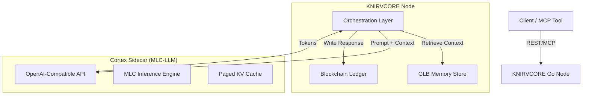

This implementation plan outlines the integration of **MLC-LLM** into **KNIRVCORE** to enable high-performance, local inference capabilities directly within the node architecture.

### **Executive Summary**

This integration transitions KNIRVCORE from a purely storage-focused blockchain to a fully autonomous "Thinking Node." We will adopt a **Sidecar Architecture** where the MLC-LLM engine runs as a dedicated high-performance inference server alongside the existing Go-based KNIRVCORE node, communicating via a high-speed local loopback (REST/gRPC).

This approach preserves the stability of the Go codebase while leveraging MLC-LLM's specialized compilation and hardware acceleration (Vulkan/CUDA/Metal).

---

### **1. Architectural Design: The "Cortex" Sidecar**

We will introduce a new component, `knirv-cortex`, which wraps the MLC-LLM engine.

#### **High-Level Diagram**



#### **Component Breakdown**

1. **KNIRVCORE Node (Go)**: Acts as the "Controller." It retrieves GLB memories, formats the prompt, and manages the user's NRN token balance.
2. **Cortex Sidecar (MLC-LLM)**: Acts as the "Engine." A containerized service running the MLC REST server. It is stateless regarding user data but stateful regarding the KV cache.
3. **Integration Interface**: The Go node will use a new internal package `pkg/cortex` to communicate with the sidecar using standard OpenAI-compatible schemas.

---

### **2. Implementation Roadmap**

#### **Phase 1: The Cortex Bridge (Go Integration)**

We need a structured way for the Go application to talk to the inference engine.

**Action Items:**

* **Create `internal/cortex` package**: This will handle the HTTP client logic, retries, and circuit breaking.
* **Define Interface**:
```go
type InferenceRequest struct {
    Model       string   `json:"model"`
    Messages    []Msg    `json:"messages"`
    Temperature float32  `json:"temperature"`
    Stream      bool     `json:"stream"`
}

type CortexClient interface {
    ChatCompletion(ctx context.Context, req InferenceRequest) (*Response, error)
    HealthCheck(ctx context.Context) bool
}

```


* **Configuration Update (`config.yaml`)**:
Add a section for the inference engine connection.
```yaml
cortex:
  enabled: true
  endpoint: "http://localhost:8000/v1"
  model_lib: "Llama-3-8B-q4f16_1"
  timeout_ms: 30000

```


#### **Phase 2: GLB-to-Context Injection**

KNIRVCORE's unique value is its GLB (Global Language Block) memory. We must efficiently parse these binary blocks into text implementation the LLM can understand.

**Action Items:**

* **Implement `GLBDeserializer**`: A utility in `pkg/glb` that converts retrieved memory blocks into a structured prompt context.
* **Context Window Management**: Create a `ContextAssembler` that:
1. Retrieves relevant GLB blocks via Semantic Search.
2. Ranks them by relevance score.
3. Truncates them to fit the MLC-LLM model's context window (e.g., 4096 tokens) while reserving space for the generation.
4. Formats them into a "System Prompt" injection.


#### **Phase 3: Docker & Deployment**

We need to bundle the MLC engine with the node for seamless deployment.

**Action Items:**

* **Update `docker-compose.yml**`:
```yaml
services:
  knirvbase-node:
    # ... existing config ...
    environment:
      - CORTEX_ENDPOINT=http://cortex:8000/v1
    depends_on:
      - cortex

  cortex:
    image: mlcai/mlc-llm:latest
    ports:
      - "8000:8000"
    command: ["mlc_llm", "serve", "Llama-3-8B-Instruct-q4f16_1", "--host", "0.0.0.0"]
    volumes:
      - ./models:/models
    deploy:
      resources:
        reservations:
          devices:
            - driver: nvidia
              count: 1
              capabilities: [gpu]

```


---

### **3. Specific Code Changes**

#### **A. New Package: `internal/cortex/client.go**`

This client will standardize communication with the sidecar.

```go
package cortex

import (
    "bytes"
    "context"
    "encoding/json"
    "net/http"
    "time"
)

type Client struct {
    endpoint string
    client   *http.Client
}

func NewClient(endpoint string) *Client {
    return &Client{
        endpoint: endpoint,
        client:   &http.Client{Timeout: 60 * time.Second},
    }
}

// Complete performs a chat completion request to the MLC sidecar
func (c *Client) Complete(ctx context.Context, prompt string, systemContext string) (string, error) {
    payload := map[string]interface{}{
        "model": "Llama-3-8B-Instruct-q4f16_1", // Default model
        "messages": []map[string]string{
            {"role": "system", "content": systemContext},
            {"role": "user", "content": prompt},
        },
        "stream": false,
    }
    
    // Standard HTTP Post implementation...
    // Return parsed response content
}

```

#### **B. Update: `internal/mcp/server.go**`

Expose a new tool endpoint that leverages the inference engine.

```go
// Register new MCP tool
mcpServer.RegisterTool("generate_insight", func(args map[string]interface{}) (string, error) {
    query := args["query"].(string)
    
    // 1. Retrieve relevant memories (RAG)
    memories, _ := searchIndex.Query(query, 5)
    
    // 2. Build Context
    contextStr := "User Memories:\n"
    for _, mem := range memories {
        contextStr += "- " + mem.Content + "\n"
    }
    
    // 3. Call Cortex
    response, err := cortexClient.Complete(ctx, query, contextStr)
    
    // 4. (Optional) Auto-save insight back to chain
    if err == nil {
        chain.AppendMemory(response, "INSIGHT")
    }
    
    return response, err
})

```

---

### **4. Performance Optimization Strategy**

To ensure KNIRVCORE remains "High-Performance," we will leverage specific MLC-LLM features:

1. **KV Cache Persistence**:
* Since KNIRVCORE represents "Long-Term Memory," the "System Prompt" (which defines the persona and core rules) rarely changes.
* We will configure MLC-LLM to **cache the system prompt prefix**. This drastically reduces latency for subsequent requests.


2. **Request Batching**:
* The Go node will implement a **request queue**. Instead of sending every request immediately, it can group 5-10 pending read operations and send them to MLC-LLM as a batch if the model supports concurrent decoding (check specific model config).


3. **Speculative Decoding**:
* Enable speculative decoding in the MLC config (e.g., `--speculative-mode small_draft`) to speed up token generation for routine tasks like classifying memories.


---

### **5. Next Steps for You**

1. **Select the Model**: Run `mlc_llm chat HF://mlc-ai/Llama-3-8B-Instruct-q4f16_1-MLC` locally to verify performance on your target hardware.
2. **Pull the Docker Image**: `docker pull mlcai/mlc-llm:latest`.
3. **Implement `pkg/cortex**`: Copy the client code structure provided above.

Here is a relevant video that breaks down how MLC-LLM achieves its universal deployment capabilities, which will be helpful for tuning your Docker configuration.

[MLC LLM: Enabling LLMs To Be Deployed Across Multiple Devices](https://www.youtube.com/watch?v=AwTLJf13esc)

This video is relevant because it explains the "compilation" aspect of MLC, which is crucial for understanding why we are using a pre-compiled model path in the configuration rather than raw weights.