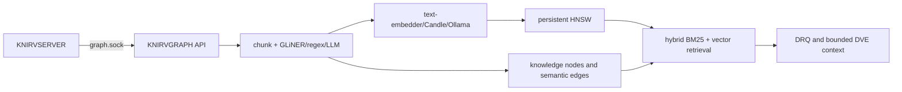

# GraphRAG migration

KNIRVGRAPH now owns document processing, entity extraction, embeddings,
hybrid retrieval, synthesis, and persistent vector search. KNIRVSERVER no
longer embeds or links `graphrag-rs`.

## Configuration migration

- Remove `KNIRV_ENABLE_LEGACY_GRAPHRAG`, `KNIRV_GRAPHRAG_SOCKET_PATH`, and
  `graphrag_socket_path`.
- Use the existing KNIRVGRAPH socket (`graph.socket_path` or
  `KNIRV_GRAPH_SOCKET_PATH`). The default is
  `/var/lib/knirvserver/sockets/graph.sock`.
- The primary embedding service is `text_embedder` at
  `http://localhost:8089`. `candle`, `ollama`, `deterministic`, and `stub`
  remain selectable providers; deterministic/stub are intended for tests.
- Vector metrics are `cosine`, `dot`, or `euclidean`.
- Set `processing.gliner_endpoint` to enable a local GLiNER `/predict`
  service. Failure is best-effort only when `gliner_fail_open` is true.

The legacy public knowledge-base “GraphRAG” mode remains accepted by the
backend as a compatibility label. It delegates to KNIRVGRAPH and does not use
FFI.

## API and data flow

Documents, job status, derived-artifact manifests, vector topology, knowledge
nodes, and semantic edges are stored in the KNIRVGRAPH Badger database.
Startup rehydrates BM25/chunks and converts interrupted indexing jobs to
failed so they can be safely retried with `overwrite: true`.

## Operations and recovery

Before upgrading, stop writers and back up the KNIRVGRAPH data directory.
The storage maintenance interface provides streaming Badger `BackupTo` and
`RestoreFrom`; restore into an empty/offline database, then restart so the
retrieval pipeline rehydrates. A background worker compacts Badger and
deterministically optimizes HNSW every 30 minutes. Treat a model/dimension or
metric change as a rebuild boundary.

Validate an upgrade by ingesting a document, polling
`GET /api/v1/index/{id}/status`, querying `POST /api/v1/query`, restarting,
querying again, and finally deleting the document. `/livez`, `/readyz`,
`/health`, and `/metrics` expose process, dependency, and RAG status.

Rollback requires stopping KNIRVGRAPH and restoring the pre-upgrade database
backup. Do not point an older embedded GraphRAG build at the migrated index;
the formats are intentionally independent.
